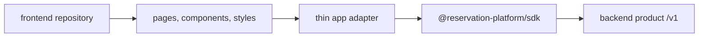

# Phase 26: Frontend Consumer Detachment

## Purpose

Make the current frontend behave like a normal consumer app that happens to use
the backend product, not like the owner of the backend.

This phase answers: can the frontend be deleted, replaced, or moved to another
repository without breaking the backend product?

## Inputs To Read

- `phase-22-frontend-repo-materialization.md`
- `phase-25-backend-product-repo-contract.md`
- `frontend-consumer-repo-inventory.json`
- `compatibility-route-inventory.json`
- `app/**`
- `components/**`
- frontend-owned `lib/**`
- `packages/sdk/**`
- frontend boundary verification scripts under `scripts/**`

## Write Scope

- frontend consumer inventory
- frontend-only bootstrap docs
- frontend boundary verifiers
- compatibility route blocker docs
- SDK requirement notes for Phase 27
- downstream proof docs
- `remaining-modularity-gaps.md`

## Non-Goals

- Do not move backend modules into the frontend repo.
- Do not require backend secrets, service-role keys, database migrations, or
  provider credentials for frontend install/build.
- Do not keep local `/api/v1` compatibility routes as the production path.
- Do not publish the SDK.

## Target Consumer Shape

The app adapter may translate UI state into SDK calls. It must not contain
database access, backend policies, LangChain/provider workflows, or route
handler logic.

## Implementation Steps

1. Expand the frontend inventory until it describes the runnable frontend app,
   not only a proof slice.
2. Classify every current frontend dependency as:
   - `frontend-owned`
   - `sdk-contract`
   - `backend-service-needed`
   - `compatibility-only`
   - `remove-or-replace`
3. Add or update a frontend boundary check that fails when included frontend
   source imports backend packages, `apps/api`, database migrations, storage
   adapters, service-role helpers, or provider workflow modules.
4. Replace frontend backend knowledge with SDK calls or documented SDK
   requirements for Phase 27.
5. Record every remaining current-app `/api` call as a compatibility blocker
   with its equivalent standalone `/v1` endpoint or missing backend capability.
6. Document clean frontend setup from a new directory:
   install dependencies, set `NEXT_PUBLIC_RESERVATION_PLATFORM_BASE_URL`, run
   build, run smoke checks.
7. Update Phase 28 with the exact frontend consumer proof commands.
8. Update Phase 29 with reviewer expectations for frontend detachment work.

## Deliverables

- Runnable frontend inventory.
- Frontend consumer bootstrap doc.
- Frontend boundary verifier.
- Compatibility blocker list.
- SDK requirement list for missing frontend use cases.

## Acceptance Criteria

- The frontend can be reasoned about as an app that consumes a backend URL and
  an SDK package.
- Frontend install/build does not require backend secrets or backend source.
- Remaining `/api` dependencies are explicitly compatibility-only and tracked
  to removal gates.
- Any backend behavior needed by the frontend is assigned to backend or SDK
  work, not duplicated inside frontend helpers.
- Phase 27 and Phase 28 are updated when new SDK or proof requirements appear.

## Subagent Handoff Notes

Give the worker this file plus Phase 22, Phase 25, the frontend inventory, and
the compatibility route inventory. The worker should treat the frontend as
replaceable. If a frontend feature still needs server behavior, it should open
a backend or SDK requirement instead of embedding backend code in the frontend.
