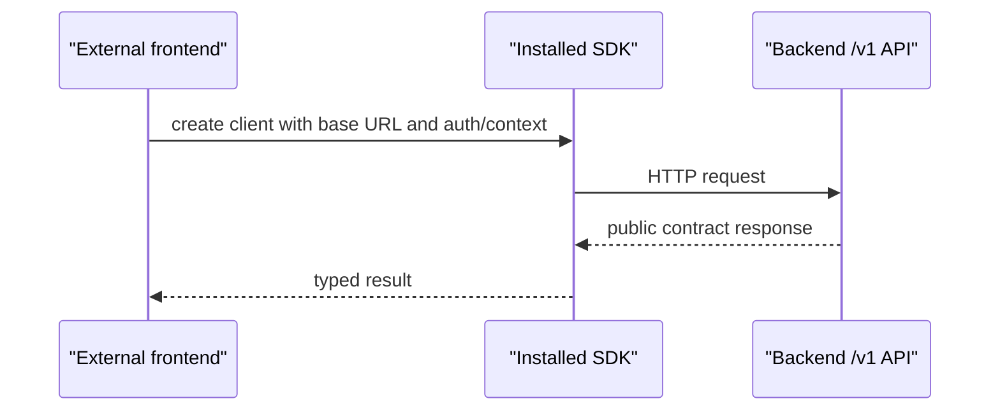

# Phase 27: SDK Public Release Surface

## Purpose

Turn the SDK into the only code package a frontend needs to integrate with the
backend product.

This phase answers: what does a fresh frontend install, import, configure, and
call when it has no access to this repository?

## Inputs To Read

- `phase-23-sdk-package-materialization.md`
- `phase-25-backend-product-repo-contract.md`
- `phase-26-frontend-consumer-detachment.md`
- `docs/package-refactor/backend-platform-extraction/contracts/**`
- `packages/sdk/**`
- `packages/contract-types/**`
- SDK release and registry proof scripts
- SDK/direct HTTP parity scripts

## Write Scope

- SDK package manifest and exports
- SDK public API docs
- SDK package artifact inspection scripts
- SDK install fixture docs/scripts
- SDK/direct HTTP parity proof docs/scripts
- version compatibility matrix
- `remaining-modularity-gaps.md`

## Non-Goals

- Do not publish to npm or a private registry without explicit approval.
- Do not put database clients, storage adapters, provider workflows, React UI,
  Next.js helpers, or backend runtime config in the SDK.
- Do not rely on workspace links as proof of installability.
- Do not make the SDK a hidden backend implementation package.

## SDK Role

The SDK is a typed HTTP client and convenience layer. The backend remains the
authority for validation, auth, tenant/venue enforcement, idempotency, and
workflow execution.

## Implementation Steps

1. Inventory SDK exports and classify them as stable public API, experimental,
   internal, or deprecated.
2. Define the minimal app setup:
   package install, client creation, base URL, auth token/context headers,
   idempotency keys, and error handling.
3. Add package artifact inspection that blocks:
   - backend source files
   - migrations
   - provider or LangChain workflow code
   - UI components
   - workspace-only references
   - backend-only runtime dependencies
4. Add clean install fixtures from packed tarballs or a configured registry.
5. Prove SDK calls and direct HTTP calls agree for covered `/v1` endpoints.
6. Document backend API version and SDK version compatibility.
7. Update Phase 26 if frontend detachment needs additional SDK features.
8. Update Phase 28 with the exact SDK install and parity proof commands.
9. Update Phase 29 with subagent review gates for SDK release work.

## Deliverables

- SDK public API map.
- Consumer quickstart for a new app with no repo source.
- Package artifact inspection guard.
- Clean install fixture.
- SDK/direct HTTP parity proof.
- Version compatibility matrix.

## Acceptance Criteria

- A clean app can install the SDK package artifact and compile imports without
  workspace links.
- SDK artifacts contain only public client code and contract types.
- SDK has no backend-only runtime dependencies.
- SDK/direct HTTP parity covers the supported public contract.
- Publishing remains a separate explicit release decision.

## Subagent Handoff Notes

Give the worker this file plus Phase 23, Phase 25, and Phase 26. The worker
must prove package behavior from artifacts, not from monorepo imports. If the
SDK needs a backend capability that does not exist yet, update Phase 25 and
Phase 28 rather than faking behavior in the SDK.
