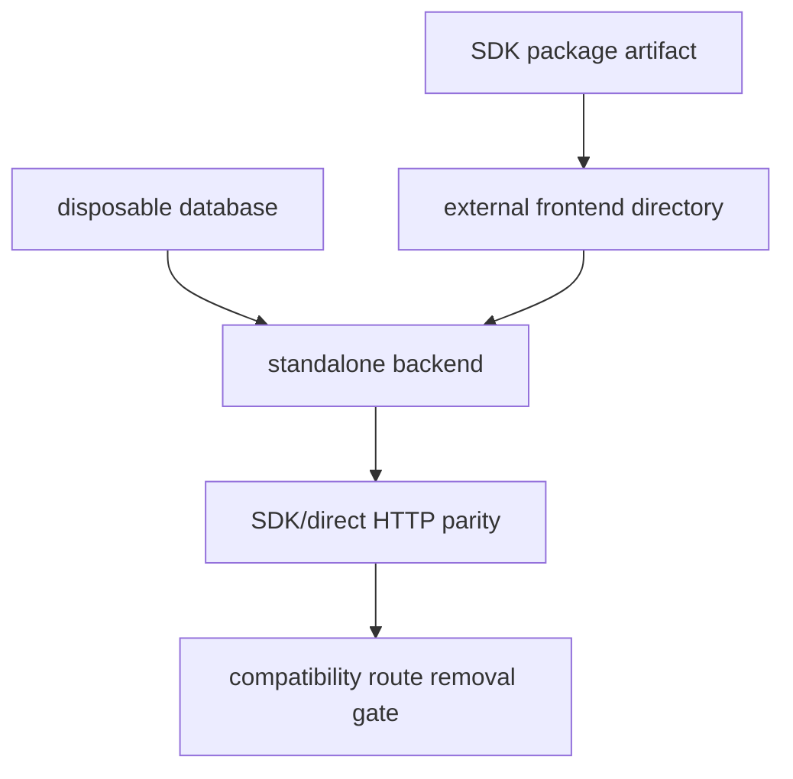

# Phase 28: Live Backend and External Consumer Proof

## Purpose

Prove the intended plug-and-play model with a real backend target and a clean
consumer app that starts outside this repository.

This phase answers: can another frontend directory install the SDK, point to a
backend service, and use reservations without this monorepo?

## Inputs To Read

- `phase-10-live-platform-proof.md`
- `phase-24-cross-repo-adoption-proof.md`
- `phase-25-backend-product-repo-contract.md`
- `phase-26-frontend-consumer-detachment.md`
- `phase-27-sdk-public-release-surface.md`
- database live proof scripts
- backend deployment/readiness scripts
- SDK registry/install proof scripts
- SDK/direct live parity scripts
- frontend smoke proof scripts

## Write Scope

- live proof runbook
- strict local/live proof orchestrator scripts
- external frontend fixture docs/scripts
- evidence templates
- compatibility route removal checklist
- rollback/support docs
- `remaining-modularity-gaps.md`

## Non-Goals

- Do not count skipped readiness checks as live proof.
- Do not use monorepo workspace links as external consumer proof.
- Do not deploy production infrastructure without explicit approval.
- Do not remove compatibility routes unless the removal gate passes.
- Do not commit secrets, real tokens, database URLs, or registry credentials.

## Proof Flow

## Implementation Steps

1. Define the strict proof environment and make every live requirement explicit:
   disposable database, backend base URL, auth/service token setup, SDK artifact
   source, mutation opt-in, and seeded test data.
2. Run or document database migration/RLS/idempotency proof against disposable
   infrastructure.
3. Start or deploy the standalone backend and prove health, metadata, catalog,
   availability, reservations, resource maintenance, auth/tenant behavior,
   durable idempotency, and optional chat status.
4. Pack or install SDK artifacts without workspace links.
5. Create an external frontend fixture in a separate directory that begins with
   its own frontend files and package metadata only.
6. Build and smoke test the external frontend against the standalone backend.
7. Run SDK/direct HTTP parity against the same live backend.
8. Run compatibility route removal gates and update removal decisions.
9. Record what was live proof, what was local readiness, and what remains
   blocked by missing credentials or infrastructure.
10. Update Phase 29 with subagent task sequencing and final reviewer checks.

## Deliverables

- Strict live proof runbook.
- External frontend fixture or generator.
- Live backend evidence template.
- SDK install and parity evidence.
- Compatibility removal decision update.
- Rollback/support notes for failed cutover.

## Acceptance Criteria

- Live proof uses a standalone backend target, not current frontend
  compatibility routes.
- External consumer proof starts outside this repository and installs SDK
  artifacts without workspace links.
- Database/RLS/tenant/idempotency behavior is proven against disposable live
  infrastructure or remains explicitly incomplete.
- SDK/direct parity runs against the same backend target used by the external
  frontend.
- Compatibility route removal decisions are updated from evidence, not
  assumption.

## Subagent Handoff Notes

Give the worker this file plus Phases 10, 24, 25, 26, and 27. The worker must
separate local readiness from live proof in its result. If credentials,
network, registry, or deployment access are unavailable, it should strengthen
strict readiness gates and leave live proof incomplete instead of overstating
the result.
