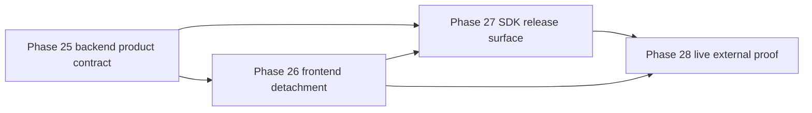

# Phase 29: Subagent Execution Matrix

## Purpose

Create the handoff matrix for subagents that will finish the backend product,
SDK, frontend detachment, and live proof work without losing the intended
architecture.

This phase answers: which subagent owns which outcome, what context should it
receive, and what must reviewers verify before the next phase starts?

## Inputs To Read

- `README.md`
- `remaining-modularity-gaps.md`
- `phase-25-backend-product-repo-contract.md`
- `phase-26-frontend-consumer-detachment.md`
- `phase-27-sdk-public-release-surface.md`
- `phase-28-live-backend-and-external-consumer-proof.md`
- relevant result docs from earlier completed phases

## Write Scope

- subagent execution matrix
- phase handoff notes
- review checklists
- remaining-gap status updates
- downstream phase docs when assumptions change

## Non-Goals

- Do not implement backend, frontend, SDK, or live proof code in this phase
  unless a subtask explicitly scopes it.
- Do not run live infrastructure checks without required env and approval.
- Do not mark the architecture complete from documentation alone.

## Execution Order

## Subagent Task Matrix

| Task | Primary phase | Worker focus | Required reviewers |
| --- | --- | --- | --- |
| Backend product boundary | Phase 25 | Public/private backend contract, extraction manifest, backend-only verifier | Spec reviewer, quality reviewer |
| Frontend consumer detachment | Phase 26 | Frontend inventory, import boundaries, compatibility blockers | Spec reviewer, quality reviewer |
| SDK install surface | Phase 27 | Public exports, package artifact inspection, clean install fixture | Spec reviewer, quality reviewer |
| Live external proof | Phase 28 | Disposable backend proof, SDK artifact install, external frontend smoke, parity evidence | Spec reviewer, quality reviewer |

## Shared Review Rules

Spec reviewers must reject work when:

- backend docs or manifests include frontend-owned source
- frontend work imports backend internals to make a build pass
- SDK work includes backend implementation, migrations, provider workflows, or
  UI
- live proof is claimed from skipped readiness checks
- compatibility route removal is claimed without parity/removal-gate evidence

Quality reviewers must reject work when:

- verifiers are brittle string-only checks where structured checks are
  practical
- generated temp workspaces can mutate tracked source or leak secrets
- docs overclaim what commands actually prove
- package metadata relies on workspace-only references for external proof
- downstream phases are not updated after a changed assumption

## Phase Update Rule

Whenever a worker changes a shared assumption, it must update later phase docs
before reporting done:

- Backend contract changes update Phases 26, 27, and 28.
- Frontend consumer requirements update Phases 27 and 28.
- SDK public surface changes update Phases 26 and 28.
- Live proof constraints update compatibility removal docs and
  `remaining-modularity-gaps.md`.

## Acceptance Criteria

- Each remaining separation outcome has a named phase, worker focus, and review
  gate.
- Subagents can execute one phase without relying on chat history.
- Reviewers know exactly what overclaims and boundary violations to reject.
- Later phases are kept synchronized when earlier phases change.
- The matrix preserves the intended product model: backend repo as product,
  SDK as install surface, frontend as consumer.

## Subagent Handoff Notes

Give this file to every worker and reviewer assigned to Phases 25 through 28.
The coordinator should dispatch one implementer at a time, then run spec review
and quality review before moving to the next task.
