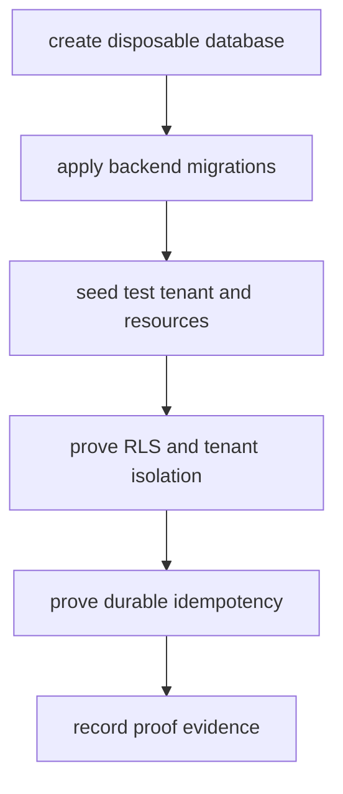

# Phase 31: Disposable Database Proof

## Purpose

Prove the backend platform against a disposable database that is not the
current app's assumed local development state.

This phase answers: can the standalone backend own migrations, row-level
security, tenant isolation, and idempotency using a database created for the
backend product?

## Inputs To Read

- `external-separation-proof-results.md`
- `phase-10-live-platform-proof.md`
- `phase-11-backend-repo-extraction.md`
- `phase-21-backend-repo-materialization.md`
- `phase-25-backend-product-repo-contract.md`
- database migration manifests and verification scripts
- Supabase/Postgres adapter packages

## Write Scope

- disposable database runbook
- migration/RLS/tenant proof evidence
- idempotency proof evidence
- backend environment example updates
- `remaining-modularity-gaps.md`
- downstream phase docs when database requirements change

## Non-Goals

- Do not use production data or production credentials.
- Do not commit database URLs, service-role keys, JWT secrets, or provider
  tokens.
- Do not mark database proof complete from static migration checks alone.
- Do not skip tenant isolation or idempotency behavior because migrations pass.

## Proof Flow

## Implementation Steps

1. Pick the disposable database target and document its lifecycle.
2. Apply backend-owned migrations from the extracted backend package surface.
3. Seed a test tenant, service, resource, availability window, and reservation
   scenario.
4. Prove tenant-scoped reads and writes cannot cross tenant boundaries.
5. Prove reservation idempotency survives retry and process restarts.
6. Prove rollback/cleanup can remove the disposable database or test schema.
7. Record the proof commands, environment variables, and redacted evidence in
   `external-separation-proof-results.md`.
8. Update Phases 32 through 35 if database setup changes backend deployment or
   SDK parity requirements.

## Acceptance Criteria

- The database proof uses disposable infrastructure or a disposable schema with
  explicit cleanup.
- Migrations run from backend-owned artifacts, not frontend app assumptions.
- Tenant isolation and RLS are proven with positive and negative cases.
- Idempotency behavior is proven against durable storage.
- The resulting environment contract is clear enough for a standalone backend
  deployment.

## 2026-06-27 Result

Status: passed for disposable PostgreSQL database behavior.

Evidence:

- `corepack pnpm run database:live-proof:strict` passed against the named
  disposable Docker Postgres container `reservation-proof-postgres-d8b0` with
  `RESERVATION_DATABASE_LIVE_DOCKER_CONTAINER` configured.
- The proof applied all 11 backend-owned package migrations from
  `packages/database/migrations/supabase`.
- The behavior proof verified booking RLS, public booking insert policy, anon
  catalog read, anon booking insert, non-admin authenticated booking
  invisibility, admin authenticated booking visibility, and durable idempotency
  claim/store/replay through the database RPCs.

This closes the disposable database migration/RLS/idempotency portion of the
external separation proof. It does not by itself prove the standalone backend
service, SDK/direct live parity, registry installation, or compatibility route
removal.

## Subagent Handoff Notes

Give the worker this file plus database scripts and backend adapter packages.
If live database access is unavailable, the worker should improve the runbook
and strict fail-closed checks, but must leave the live database proof marked
incomplete.
