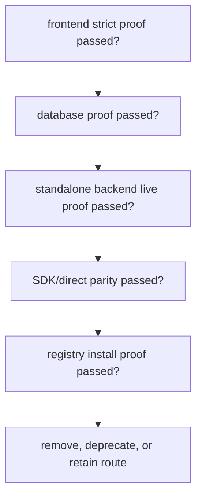

# Phase 35: Compatibility Cleanup and Release Decision

## Purpose

Use the completed external proof chain to decide which compatibility routes can
be removed, deprecated, or retained temporarily.

This phase answers: after the backend, SDK, database, and external frontend
proofs pass, what compatibility surface is still justified?

## Inputs To Read

- `external-separation-proof-results.md`
- `compatibility-route-inventory.json`
- `compatibility-route-removal-decision-log.md`
- `phase-9-compatibility-route-removal.md`
- `phase-15-operations-deprecation-release.md`
- `phase-30-package-source-and-frontend-proof.md`
- `phase-31-disposable-database-proof.md`
- `phase-32-standalone-backend-live-proof.md`
- `phase-33-sdk-direct-parity-proof.md`
- `phase-34-registry-release-proof.md`
- compatibility removal gate scripts

## Write Scope

- compatibility route removal/deprecation decisions
- route inventory updates
- deprecation notices and migration notes
- release checklist
- rollback instructions
- `remaining-modularity-gaps.md`

## Non-Goals

- Do not remove compatibility routes before all required proof gates pass.
- Do not keep compatibility routes indefinitely without an owner, deadline, and
  reason.
- Do not remove routes that are still used by the current frontend unless the
  frontend has proven SDK or standalone backend usage.
- Do not hide breaking changes from release notes.

## Decision Flow

## Implementation Steps

1. Re-run the compatibility route removal gate with current proof evidence.
2. For each route, classify it as remove now, deprecate with deadline, or
   retain with explicit blocker.
3. Remove routes only when the gate and direct usage search agree.
4. Add deprecation headers, docs, or warnings where routes must remain during
   transition.
5. Update route inventory and decision log with evidence links.
6. Run frontend, backend, SDK, and compatibility tests affected by route
   decisions.
7. Update release notes, rollback instructions, and support expectations.
8. Close or rewrite remaining phase docs so they do not claim incomplete work
   is finished.

## Acceptance Criteria

- Every compatibility route has an evidence-backed decision.
- Removed routes have replacement SDK or standalone backend paths proven.
- Deprecated routes have a target removal condition and migration guidance.
- Retained routes have a named blocker and owner.
- Release notes accurately describe the separation status and remaining risks.

## Subagent Handoff Notes

Give the worker this file plus all proof result docs. The worker must not
delete compatibility routes as cleanup theater; deletion is allowed only when
the proof chain shows the current frontend and external consumers no longer
need them.
