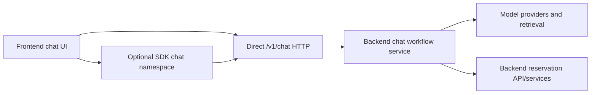

# Phase 5: AI Chat Workflow Split

## Purpose

Move AI chat workflow ownership to the backend platform while keeping chat UI in
the frontend and exposing only optional HTTP/SDK chat surfaces to consumers.

## Inputs To Read

- `docs/package-refactor/backend-platform-extraction/frontend-backend-sdk-separation/phase-0-current-coupling-audit-results.md`
- `app/api/chat/**`
- `components/chat/**`
- `lib/langchain/**`
- `lib/knowledge.ts`
- `packages/reservation-chat-core/**`
- `docs/package-refactor/ai-chat-boundary-inventory.md`
- `docs/package-refactor/backend-platform-extraction/phase-6-ai-chat-backend-service-contract.md`
- `docs/package-refactor/backend-platform-extraction/sdk-readiness/phase-6-optional-chat-sdk.md`

## Write Scope

- Chat split docs in this folder.
- Later implementation belongs in backend chat service modules, frontend chat
  client wrappers, and optional SDK chat namespace.

## Non-Goals

- Do not put LangChain, model providers, retrieval/vector store adapters, or
  prompt orchestration in the SDK.
- Do not put chat UI components in backend modules.
- Do not require every frontend to use chat.

## Target Split

## Phase 0 Findings To Carry Forward

Phase 5 owns these chat-specific couplings:

| Current coupling | Required split |
| --- | --- |
| `app/api/chat/route.ts` imports LangChain orchestration directly. | Backend `/v1/chat/**` owns session, message, stream, and confirm orchestration. |
| `lib/langchain/chat-agent.ts` imports Supabase admin and reservation adapters. | Backend chat service receives backend-owned repository/model/retriever dependencies. |
| `lib/langchain/prompts.ts` imports `app/api/chat/chat-config.ts`. | Prompt builders accept tenant/platform config; Project Play copy stays host-owned. |
| `components/chat/**` renders actions and messages. | UI remains frontend-owned and calls SDK/direct HTTP only. |
| Analytics/report LangChain code shares the folder. | Exclude non-booking analytics from reservation-platform chat unless Phase 6 scopes it separately. |

## Implementation Steps

1. Define backend `/v1/chat/**` endpoints for session, message, stream, and
   confirm flows.
2. Move provider keys, retrieval, LangChain/LangGraph orchestration, and tool
   execution behind backend service boundaries.
3. Keep frontend chat UI rendering action cards and message state.
4. Make SDK chat namespace optional and HTTP-only.
5. Preserve direct HTTP parity for JSON and streaming chat.
6. Add disabled-module behavior when chat is not enabled.

Current workspace status: private `@reservation-platform/ai-chat` now provides
the provider-neutral backend-side scaffold for model provider, retrieval,
checkpoint, audit, tenant config, errors, messages, and workflow injection. It
does not implement LangChain, AI SDK, Supabase, provider adapters, live route
wiring, reservation tools, or frontend UI changes. The root
`backend-platform:verify-chat-boundary` guard now scans both chat packages.

## Deliverables

- Chat ownership table.
- `/v1/chat` endpoint checklist.
- SDK chat namespace plan.
- Streaming parity test plan.
- Provider secret boundary plan.
- Project Play copy/config separation plan.
- Disabled-module and stream endpoint parity checklist.

## Acceptance Criteria

- Frontend can render any chat UI without importing backend workflow internals.
- SDK chat namespace imports no LangChain/provider/retrieval packages.
- Backend owns provider secrets and reservation-confirmation logic.
- Disabled chat returns a stable public error.
- Chat UI imports no LangChain/provider/retrieval packages.
- Provider-neutral backend chat interfaces exist without provider SDK,
  frontend, current-app, or runtime-secret imports.

## Downstream Update Notes

If chat endpoints, stream event shapes, or disabled-module behavior change,
update Phase 6, SDK readiness Phase 6, SDK readiness Phase 7, and contract docs.
