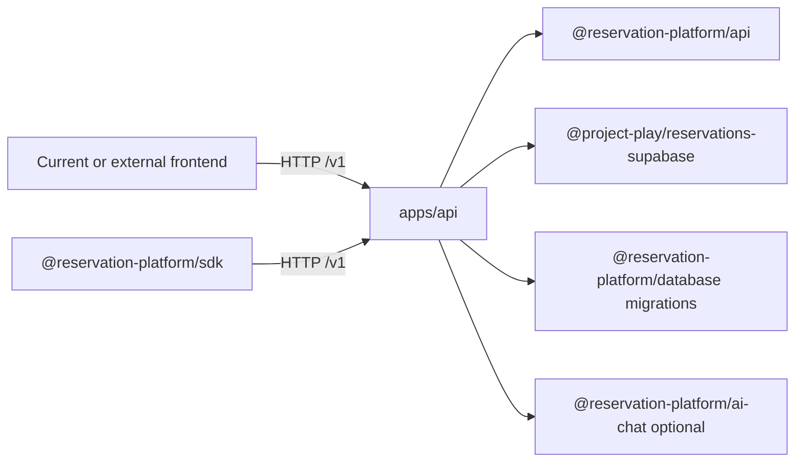

# Phase 7: Standalone Backend Cutover

## Purpose

Turn `apps/api` from a local skeleton proof into the backend surface that the
current frontend and external frontends can target through `/v1`.

This phase is about backend deployability and runtime ownership. It does not
make the current Next.js frontend the backend owner.

## Inputs To Read

- `docs/package-refactor/backend-platform-extraction/frontend-backend-sdk-separation/remaining-modularity-gaps.md`
- `docs/package-refactor/backend-platform-extraction/frontend-backend-sdk-separation/phase-1-backend-module-boundary-results.md`
- `docs/package-refactor/backend-platform-extraction/frontend-backend-sdk-separation/phase-4-auth-tenant-runtime-config-split-results.md`
- `docs/package-refactor/backend-platform-extraction/frontend-backend-sdk-separation/phase-6-external-frontend-proof-removal-gate-results.md`
- `docs/package-refactor/backend-platform-extraction/phase-9-release-deployment-operations.md`
- `apps/api/**`
- `packages/api/**`
- `packages/reservations-supabase/**`
- `packages/database/**`

## Write Scope

- `apps/api/**`
- backend package runtime wiring under `packages/**`
- backend deployment/config verification scripts
- this phase result doc, if created
- `remaining-modularity-gaps.md`

## Non-Goals

- Do not remove current `app/api/**` compatibility routes in this phase.
- Do not move frontend UI code into `apps/api`.
- Do not require a consumer frontend to import backend packages.
- Do not call deployment complete if the proof only runs against in-memory fake
  repositories.

## Target Boundary

## Implementation Steps

1. Confirm every `/v1` endpoint used by the current frontend has an equivalent
   handler in `apps/api`.
2. Add a deployment/runtime config verifier for required standalone backend
   environment variables.
3. Make health and metadata routes public and dependency-light.
4. Wire Supabase-backed repositories in standalone runtime without importing
   current-app helpers from `lib/**` or `app/**`.
5. Wire auth, tenant, venue, idempotency, and optional chat modules through
   backend-owned runtime config only.
6. Add tests that prove protected data routes fail closed when required backend
   config is malformed.
7. Add source-boundary checks that block `apps/api` from importing Next.js,
   React, browser Supabase helpers, frontend wrappers, or current app routes.
8. Update Phase 8 and Phase 9 docs if endpoint names, required headers, error
   bodies, or runtime env names change.

## Deliverables

- Standalone backend runtime config contract.
- Standalone backend deployment verification command.
- Backend-only repository wiring proof.
- Public health/readiness endpoint proof.
- Protected route auth/tenant/idempotency fail-closed tests.
- Boundary scan proving `apps/api` does not import frontend/current app code.

## Current Readiness Added

- `corepack pnpm run backend-platform:verify-standalone-deployment-config`
  now runs a CI-safe standalone backend deployment/runtime config verifier.
  It exports `readStandaloneApiDeploymentConfig()` for tests and downstream
  tooling, parses env only, performs no network calls or deploys, and skips
  successfully when unconfigured.
- `corepack pnpm run backend-platform:verify-standalone-deployment-config:strict`
  fails closed when required standalone deployment config is absent or
  malformed. Strict readiness requires complete backend-only Supabase config
  plus either `RESERVATION_PLATFORM_SERVICE_API_KEY` or complete
  JWT/JWKS auth config.
- The verifier checks the standalone backend env shape: optional positive
  `PORT`, complete-or-absent `RESERVATION_SUPABASE_URL`,
  `RESERVATION_SUPABASE_ANON_KEY`, and
  `RESERVATION_SUPABASE_SERVICE_ROLE_KEY`, nonblank service tokens when set,
  complete-or-absent `RESERVATION_PLATFORM_AUTH_*` JWT/JWKS config, valid auth
  numeric settings, backend-only AI/chat provider env when present, and rejects
  `NEXT_PUBLIC_*` backend secret-style names.
- The same verifier now includes a local runtime/deployment env-name drift
  guard against `apps/api/src/runtime.ts`. It proves the deployment verifier's
  backend runtime env-name set covers the runtime-owned Supabase env,
  `RESERVATION_PLATFORM_SERVICE_API_KEY`, and
  `RESERVATION_PLATFORM_AUTH_*` JWT/JWKS env names, and fails if either side
  adds a runtime-required name the other side does not recognize. AI/chat
  provider env names are encoded as deployment-readiness-only names because
  `apps/api/src/runtime.ts` does not read them yet.
- `corepack pnpm run backend-platform:verify-compatibility-route-removal-gate`
  now also proves that every reservation-platform or optional-module
  compatibility inventory entry with a non-null `/v1` standalone equivalent is
  represented by actual `handleStandaloneApiRequest` dispatch or an explicit
  route invocation in `apps/api/src/routes.test.ts`. The proof normalizes
  dynamic placeholders such as `{id}` and treats the legacy
  `/v1/chat/reservation-sessions/**` claim as a bounded chat session family
  proof that must cover session creation, messages, stream, and confirmation in
  `apps/api` source/tests.
- This is readiness only. It proves that deployment config can be checked in CI
  without live infrastructure, that strict environments fail closed on missing
  or malformed config, that runtime/deployment env names do not drift locally,
  and that the claimed standalone route paths are locally present in
  dispatcher/test coverage rather than only auth preflight helpers. It does not
  prove live route parity, a live deployment, live Supabase connectivity,
  database migrations, RLS/tenant isolation, provider chat configuration,
  durable idempotency, final standalone cutover, or seeded reservation parity.

## Acceptance Criteria

- `apps/api` can serve the required `/v1` reservation, catalog, availability,
  maintenance, metadata, health, and optional chat surfaces without Next.js.
- Runtime secrets live only in backend config.
- The backend can start without frontend code.
- Missing or malformed backend config fails closed for protected routes.
- Safe CI checks can run without live infrastructure and strict checks can fail
  when required live/deployment config is absent.

## Subagent Handoff Notes

Give the worker this file plus the Phase 1, Phase 4, and Phase 6 result docs.
The worker must update `remaining-modularity-gaps.md` and downstream phase docs
when it changes what the frontend, SDK, or external consumer must call.
