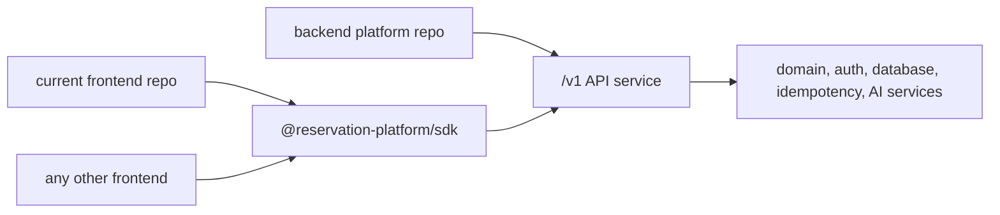

# Backend Platform, SDK, and Frontend Split Execution Plan

This folder is the focused phase plan for the intended product shape:

- The backend platform is the modular product infrastructure.
- The SDK is the installable contract that another app uses.
- The current frontend becomes one consumer app, not the owner of backend logic.

Use these files when assigning subagents. Each phase is intentionally bounded
so one worker can implement or verify it without silently changing the final
architecture.

## Target Shape

## Phase Files

- [Phase 0: Ownership Source of Truth](phase-0-ownership-source-of-truth.md)
- [Phase 1: Backend Product Repo Candidate](phase-1-backend-product-repo-candidate.md)
- [Phase 2: SDK Artifact and Contract](phase-2-sdk-artifact-and-contract.md)
- [Phase 3: Frontend Consumer Repo Candidate](phase-3-frontend-consumer-repo-candidate.md)
- [Phase 4: Cross-Repo Plug-And-Play Proof](phase-4-cross-repo-plug-and-play-proof.md)
- [Phase 5: Release, Deprecation, and Operations Gate](phase-5-release-deprecation-operations-gate.md)

## Subagent Rules

Every subagent must read this README, the assigned phase file, and
`../remaining-modularity-gaps.md` before editing.

If a phase changes a boundary, the subagent must update all later phase files
in this folder and `../remaining-modularity-gaps.md` in the same change.

Do not satisfy a frontend build by copying backend modules into the frontend.
Do not satisfy SDK installability by using workspace links. Do not treat a
skipped live check as completed proof.
