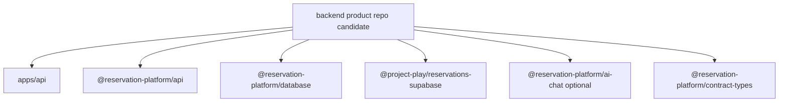

# Phase 1: Backend Product Repo Candidate

## Goal

Materialize a backend-only repository candidate from the current workspace so
the backend platform can stand alone as the product infrastructure.

## Inputs To Read

- `phase-0-ownership-source-of-truth.md`
- `../phase-7-standalone-backend-cutover.md`
- `../phase-11-backend-repo-extraction.md`
- `../phase-16-physical-backend-repo-split.md`
- `../../standalone-backend-extraction-manifest.json`
- `../../backend-repo-bootstrap.md`
- `../../backend-package-ownership.md`
- `apps/api/**`
- backend-owned `packages/**`
- backend verification scripts

## Write Scope

- backend extraction manifest
- backend materialization or dry-run scripts
- backend-only package/workspace metadata
- backend bootstrap docs
- backend CI command docs
- downstream phase files in this folder
- `../remaining-modularity-gaps.md`

## Non-Goals

- Do not copy `app/**`, `components/**`, current frontend route files, browser
  Supabase helpers, or compatibility routes into the backend product repo.
- Do not depend on `NEXT_PUBLIC_*` frontend env.
- Do not push to a new remote repository unless the user explicitly asks.
- Do not run live deploy or database mutation checks unless explicitly
  configured for that proof.

## Target Candidate

## Implementation Steps

1. Generate or dry-run an OS-temp backend repo candidate from the manifest.
2. Generate backend-only root package, workspace, TypeScript, and test metadata.
3. Prove the backend candidate does not import frontend, React UI, Next app
   route glue, browser helpers, or current-app compatibility routes.
4. Run backend-owned tests and boundary scans from the candidate when possible.
5. Document clean-clone bootstrap commands and label which commands are local
   safe checks versus live/deploy checks.
6. Update Phase 2 if package ownership affects SDK exports.
7. Update Phase 3 if frontend calls must change to target the backend service.

## Acceptance Criteria

- The backend candidate can be generated without mutating tracked source.
- Backend package metadata has no frontend runtime dependency.
- `apps/api` is the canonical `/v1` API service target.
- Database, auth, tenant, idempotency, and optional AI workflow code stay
  backend-owned.
- Any live proof that is skipped is clearly labeled as not completed.

## Subagent Handoff

Tell the worker that build failures caused by missing frontend files are not a
reason to copy frontend files into the backend. The worker must extract a real
backend dependency or record a blocker for the next phase.
