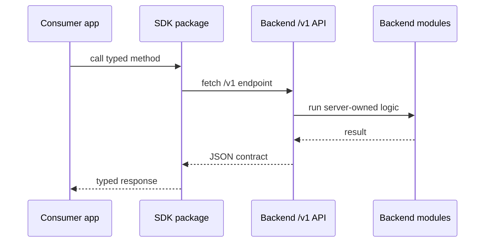

# Phase 2: SDK Artifact and Contract

## Goal

Make the SDK the installable plug-and-play contract for any frontend or server
consumer that wants to use the backend platform.

## Inputs To Read

- `phase-0-ownership-source-of-truth.md`
- `phase-1-backend-product-repo-candidate.md`
- `../phase-2-sdk-boundary-public-client.md`
- `../phase-14-sdk-release-consumer-contract.md`
- `../phase-18-sdk-distribution-and-contract.md`
- `packages/sdk/**`
- `packages/contract-types/**`
- SDK examples and smoke fixtures
- package artifact verification scripts

## Write Scope

- SDK package manifest and exports
- SDK public API docs
- SDK artifact inspection scripts
- clean install fixture tests
- SDK/direct HTTP parity proofs
- version compatibility docs
- downstream phase files in this folder
- `../remaining-modularity-gaps.md`

## Non-Goals

- Do not publish to npm or a private registry without explicit approval.
- Do not add database, storage adapter, LangChain, provider, UI, React, or
  backend runtime dependencies to the SDK.
- Do not rely on workspace links as installability proof.
- Do not make frontend wrappers the real public SDK contract.

## Contract Shape

## Implementation Steps

1. Inspect SDK exports and dependency graph for backend leakage.
2. Pack SDK and public contract packages into local tarballs.
3. Install those tarballs into clean external fixtures without workspace links.
4. Run TypeScript, Next.js, Vite/browser, server-to-server, and chat-disabled
   smoke checks as relevant.
5. Compare SDK calls with direct `/v1` HTTP calls for the supported contract.
6. Inspect package artifacts for unwanted source, private paths, workspace
   references, generated junk, and backend-only dependencies.
7. Document version compatibility between backend API and SDK versions.
8. Update Phase 3 if the frontend needs a new SDK method.
9. Update Phase 4 with the exact install and parity commands.

## Acceptance Criteria

- A clean app can install the SDK from a package artifact.
- SDK package artifacts contain only client-safe code and public types.
- SDK behavior matches direct `/v1` HTTP for covered endpoints.
- SDK configuration is based on backend base URL plus caller-provided auth or
  tenant context, not backend secrets.
- Publishing remains a separate approval step.

## Subagent Handoff

Tell the worker to prove the package artifact, not the workspace source tree.
If an external app needs behavior currently hidden in `lib/`, the worker should
move that behavior into SDK scope or document the missing contract.
