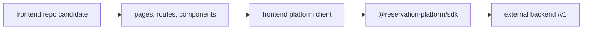

# Phase 3: Frontend Consumer Repo Candidate

## Goal

Materialize the current frontend as a separate consumer repository candidate
that uses the SDK and backend `/v1` API instead of owning backend modules.

## Inputs To Read

- `phase-0-ownership-source-of-truth.md`
- `phase-1-backend-product-repo-candidate.md`
- `phase-2-sdk-artifact-and-contract.md`
- `../phase-8-current-frontend-consumer-cutover.md`
- `../phase-9-compatibility-route-removal.md`
- `../phase-12-frontend-repo-consumer-proof.md`
- `../frontend-consumer-repo-inventory.json`
- frontend-owned `app/**`
- `components/**`
- frontend-owned `lib/**`
- SDK package exports

## Write Scope

- frontend consumer inventory
- frontend repo materialization scripts
- frontend-only package/workspace metadata
- frontend boundary verification scripts
- frontend bootstrap docs
- compatibility route blocker docs
- downstream phase files in this folder
- `../remaining-modularity-gaps.md`

## Non-Goals

- Do not copy backend packages into the frontend repo.
- Do not require service-role keys, database migrations, provider secrets, or
  backend runtime env in the frontend repo.
- Do not keep current-app `/api` reservation routes as the production data path.
- Do not publish the SDK from this phase.

## Target Candidate

## Implementation Steps

1. Expand the frontend inventory from proof slices to a runnable app candidate.
2. Mark each route, component, helper, and asset as include, exclude, or
   reference-only with a reason.
3. Generate an OS-temp frontend repo candidate from included files only.
4. Use SDK package artifacts or declared package versions, not workspace
   backend internals.
5. Run frontend lint/build/smoke checks with
   `NEXT_PUBLIC_RESERVATION_PLATFORM_BASE_URL` targeting an external backend.
6. Remove or isolate imports of backend services, database adapters, route
   handlers, LangChain/provider workflows, and service-role helpers.
7. Record remaining local `/api` usage as compatibility blockers with the
   needed SDK method or backend route.
8. Update Phase 4 with clean frontend bootstrap and smoke commands.

## Acceptance Criteria

- The frontend candidate can be generated without backend source.
- Frontend runtime uses SDK or `/v1` HTTP through browser-safe config.
- Frontend imports only UI, frontend helpers, public contract types, and SDK.
- No frontend command needs backend secrets or database migration files.
- Any remaining compatibility route use is documented as a blocker, not normal
  architecture.

## Subagent Handoff

Tell the worker to keep the frontend honest as a consumer. If a frontend build
requires backend behavior, the worker should open a backend or SDK requirement
instead of moving backend code into the frontend candidate.
