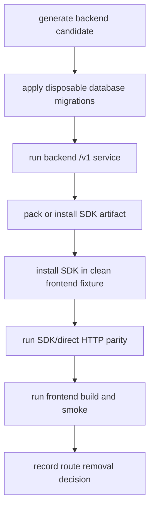

# Phase 4: Cross-Repo Plug-And-Play Proof

## Goal

Prove the actual plug-and-play flow from outside the monorepo: backend platform
candidate runs as a service, SDK installs as a package, and a frontend consumer
uses it without copying backend source.

## Inputs To Read

- `phase-1-backend-product-repo-candidate.md`
- `phase-2-sdk-artifact-and-contract.md`
- `phase-3-frontend-consumer-repo-candidate.md`
- `../phase-10-live-platform-proof.md`
- `../phase-19-cross-repo-release-proof.md`
- `../phase-24-cross-repo-adoption-proof.md`
- backend live proof scripts
- SDK install/parity scripts
- frontend smoke fixtures

## Write Scope

- cross-repo proof scripts
- fixture apps outside workspace package links
- live proof readiness docs
- SDK/direct parity proof docs
- frontend smoke proof docs
- compatibility route removal decision log
- `../remaining-modularity-gaps.md`

## Non-Goals

- Do not treat local workspace links as plug-and-play proof.
- Do not run live mutations unless explicit disposable infrastructure env and
  mutation opt-in are configured.
- Do not delete compatibility routes until this phase proves the replacement
  path.
- Do not publish production packages without explicit approval.

## Proof Flow

## Implementation Steps

1. Generate backend, SDK, and frontend candidates from their phase outputs.
2. Use disposable database and backend runtime configuration for live proof.
3. Apply backend-owned migrations and verify tenant/RLS/idempotency behavior.
4. Run backend health, metadata, reservation, catalog, availability,
   resource-maintenance, and optional chat checks.
5. Install SDK artifact into a clean fixture app with no workspace links.
6. Run SDK/direct `/v1` parity checks.
7. Run frontend candidate build and smoke checks against the backend URL.
8. Produce a compatibility route removal decision log that says which current
   `app/api/**` routes can be deleted, deprecated, or kept temporarily.

## Acceptance Criteria

- Backend candidate proves its `/v1` contract against disposable infrastructure.
- SDK installs from artifact or registry package into a clean app.
- Frontend candidate builds and smokes against the external backend URL.
- No proof depends on current monorepo workspace links.
- Compatibility route removal decisions are evidence-backed.

## Subagent Handoff

Tell the worker to separate readiness from proof. A skipped live check can keep
the phase moving as readiness work, but it cannot close the plug-and-play gap.
