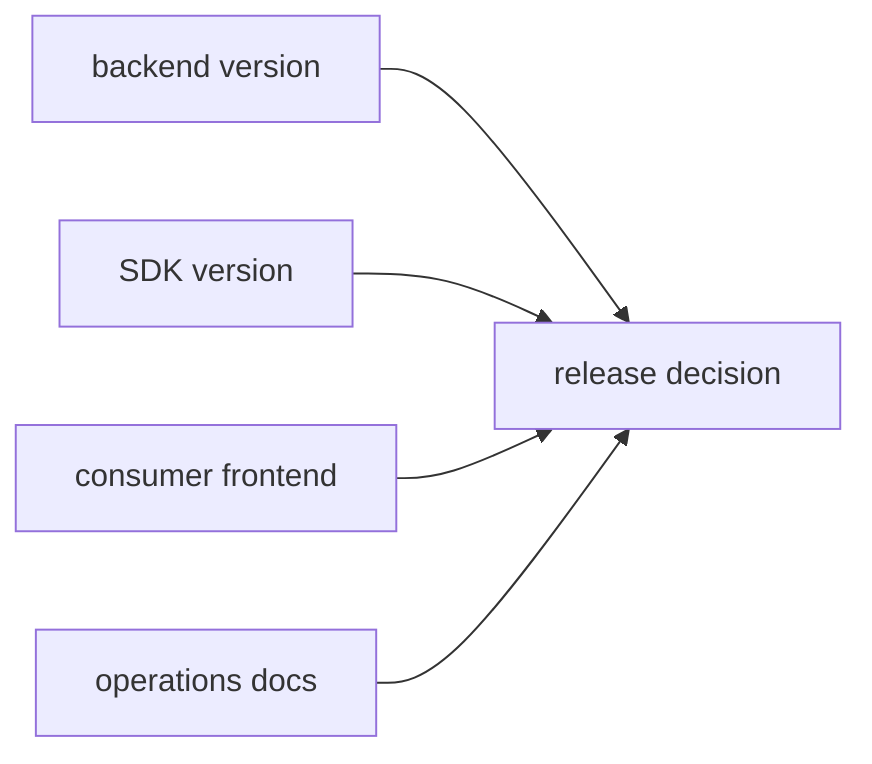

# Phase 5: Release, Deprecation, and Operations Gate

## Goal

Define the release, rollback, deprecation, and operations rules that make the
backend platform and SDK usable as a real product boundary.

## Inputs To Read

- `phase-4-cross-repo-plug-and-play-proof.md`
- `../phase-15-operations-deprecation-release.md`
- `../phase-19-cross-repo-release-proof.md`
- `../phase-24-cross-repo-adoption-proof.md`
- SDK release artifacts
- backend bootstrap and deployment docs
- compatibility route inventory
- live proof results

## Write Scope

- release checklist
- rollback runbook
- SDK/backend compatibility matrix
- compatibility route deprecation policy
- operational env and secret docs
- support matrix
- `../remaining-modularity-gaps.md`

## Non-Goals

- Do not publish, deploy, or delete routes without explicit approval.
- Do not claim production readiness from local-only checks.
- Do not leave frontend consumers dependent on undocumented backend env.

## Release Gate

## Implementation Steps

1. Write the backend release checklist: build, tests, migration proof, deploy
   proof, health checks, auth/tenant checks, idempotency checks, and rollback.
2. Write the SDK release checklist: pack inspection, clean install, parity,
   version compatibility, changelog, and publish approval.
3. Write the frontend adoption checklist for any app starting from another
   directory with no repo code installed.
4. Define compatibility route deprecation states: active fallback, deprecated,
   removable, removed.
5. Document operational env names, secret ownership, rotation expectations,
   observability, and support boundaries.
6. Update remaining gaps with exact release blockers.

## Acceptance Criteria

- Release docs distinguish backend, SDK, and frontend responsibilities.
- Rollback steps exist for backend deploy, SDK version, database migration, and
  frontend cutover.
- Compatibility route removal has explicit gates and evidence requirements.
- A new frontend team can follow documented steps without reading this repo's
  source internals.
- All unresolved work is listed as a blocker, not hidden in optimistic wording.

## Subagent Handoff

Tell the worker to be strict about language. "Ready to test" is not the same as
"released"; "local proof" is not the same as "live proof"; and "packed" is not
the same as "published."
