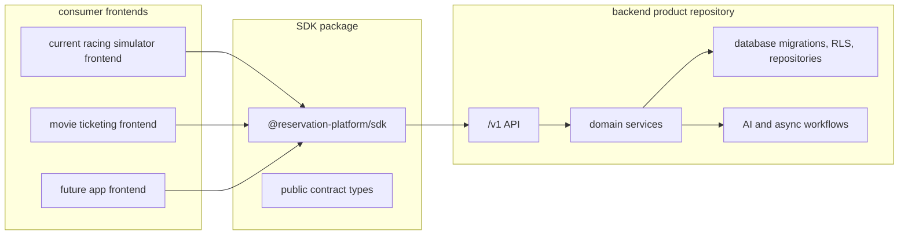

# Repo Product Split Plan

This folder is the phase plan for the intended modular product shape:

- the backend platform lives as its own product repository and deployable
  service;
- the SDK is the only package a frontend installs to talk to that backend;
- the current racing simulator frontend becomes one replaceable consumer;
- future frontends, such as movie ticketing, install the SDK and point it at
  the backend platform API.

Use this plan when assigning subagents. Each phase file is self-contained
enough for a worker, spec reviewer, and quality reviewer to run without relying
on chat history.

## Target Architecture

## Phase Files

- [Phase 0: Product Boundary Source of Truth](phase-0-product-boundary-source-of-truth.md)
- [Phase 1: Backend Product Repository Contract](phase-1-backend-product-repository-contract.md)
- [Phase 2: Backend Repository Materialization](phase-2-backend-repository-materialization.md)
- [Phase 3: SDK Install Contract](phase-3-sdk-install-contract.md)
- [Phase 4: Frontend Consumer Detachment](phase-4-frontend-consumer-detachment.md)
- [Phase 5: External App Adoption Proof](phase-5-external-app-adoption-proof.md)
- [Phase 6: Release, Operations, and Compatibility Cleanup](phase-6-release-operations-compatibility-cleanup.md)
- [Subagent Handoff Matrix](subagent-handoff-matrix.md)

## Non-Negotiable Separation Rules

- Frontends must not import backend services, database repositories, Supabase
  server helpers, migrations, route handlers, LangChain/provider workflows, or
  service-role secrets.
- The SDK must stay HTTP-only and frontend-safe. It can contain public types,
  request builders, response parsing, and auth/header plumbing, but not backend
  implementation logic.
- The backend product repository owns persistence, auth/tenant enforcement,
  idempotency, API behavior, migrations, RLS, provider integrations, and
  operations.
- Compatibility routes in the current Next.js app are temporary migration
  adapters. They are not the product API.
- A skipped readiness check is not proof. Live proof requires configured
  disposable infrastructure and explicit passing evidence.

## Downstream Update Rule

If a phase changes a shared boundary, that worker must update every later phase
that depends on it before reporting done.

| Changed assumption | Also update |
| --- | --- |
| Backend API shape, auth, database ownership, idempotency, or workflow boundary | Phases 2, 3, 4, 5, and 6 |
| Backend repo package list or extraction manifest | Phases 2, 5, and 6 |
| SDK exports, dependency rules, install method, or versioning | Phases 4, 5, and 6 |
| Frontend consumer requirements or remaining `/api` dependencies | Phases 5 and 6 |
| Live proof constraints, disposable data requirements, or compatibility route gates | Phase 6 and `../remaining-modularity-gaps.md` |

## Subagent Execution Rule

For each phase:

1. Give the worker this README, the assigned phase file,
   `subagent-handoff-matrix.md`, and `../remaining-modularity-gaps.md`.
2. The worker implements or updates only the assigned phase scope.
3. A spec reviewer checks the phase acceptance criteria and rejects overclaims.
4. A quality reviewer checks maintainability, safety, testability, and boundary
   hygiene.
5. If either reviewer finds issues, the worker fixes them and the same review
   gate runs again.

The coordinator should execute phases in order unless the current phase file
explicitly marks a task as independent.
