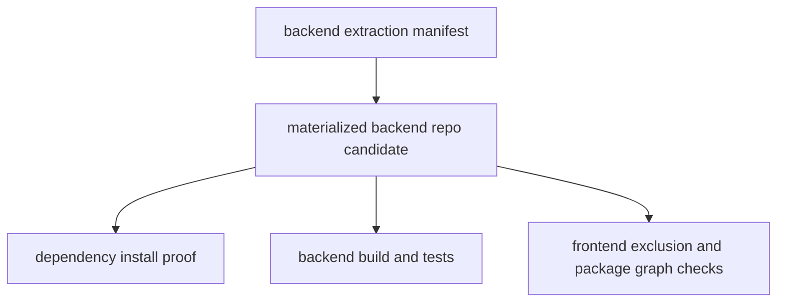

# Phase 2: Backend Repository Materialization

## Purpose

Turn the backend product contract into a materialized backend repository
candidate that can install, build, and test without frontend app files.

## Inputs To Read

- `phase-0-product-boundary-source-of-truth.md`
- `phase-1-backend-product-repository-contract.md`
- `../phase-16-physical-backend-repository-split.md`
- `../phase-21-backend-repo-materialization.md`
- `../standalone-backend-extraction-manifest.json`
- `scripts/verify-extraction-dry-run.mjs`
- `scripts/verify-extracted-workspace-readiness.mjs`
- `scripts/verify-package-graph-boundary.mjs`

## Write Scope

- backend repo materialization scripts or manifests
- generated candidate metadata rules
- backend-only build/test/readiness commands
- docs that describe clean clone bootstrap
- downstream updates to Phases 3, 5, and 6

## Non-Goals

- Do not manually copy frontend files into the backend candidate.
- Do not use workspace links as proof that the backend repo works externally.
- Do not treat an OS-temp dry run as the final GitHub repository.
- Do not run live infrastructure checks unless configured and explicitly
  approved.

## Required Proof Shape

## Subagent Tasks

1. Make the extraction manifest match Phase 1 backend ownership.
2. Materialize a backend candidate tree from that manifest.
3. Generate backend-only root metadata, workspace metadata, and TypeScript
   config when needed.
4. Prove excluded frontend/current-app files are absent.
5. Prove backend manifests do not contain frontend-only dependencies.
6. Run or document the exact safe commands for install/build/test/readiness.
7. Update Phase 5 if materialization changes external adoption steps.
8. Update Phase 6 if release or operations gates change.

## Review Gates

Spec reviewer must reject the phase when:

- the candidate contains frontend pages, UI, browser-only helpers, or
  compatibility route files as backend source;
- the candidate cannot be understood as a standalone repo;
- current monorepo workspace links are required for the proof.

Quality reviewer must reject the phase when:

- temp directory generation can mutate tracked source;
- generated metadata hides missing dependencies;
- failure messages do not tell the next subagent what to fix.

## Acceptance Criteria

- A backend repo candidate can be produced from documented inputs.
- The candidate has backend-only package metadata.
- Local checks prove frontend source is excluded.
- Remaining live, database, and deployment proofs are clearly deferred to
  Phase 5 or Phase 6.
