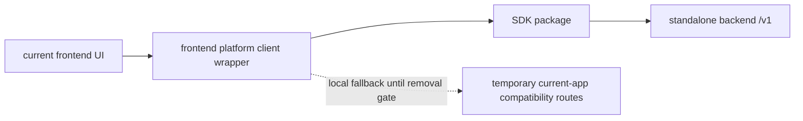

# Phase 4: Frontend Consumer Detachment

## Purpose

Detach the current frontend from backend ownership. The current app should
behave like a normal consumer that can be replaced by another frontend without
moving backend logic.

## Inputs To Read

- `phase-0-product-boundary-source-of-truth.md`
- `phase-3-sdk-install-contract.md`
- `../phase-12-frontend-repo-consumer-proof.md`
- `../phase-17-physical-frontend-repo-split.md`
- `../phase-22-frontend-repo-materialization.md`
- `../phase-26-frontend-consumer-detachment.md`
- `../frontend-consumer-repo-inventory.json`
- `lib/reservation-platform-client.ts`
- current frontend components/pages that call reservation platform behavior

## Write Scope

- frontend consumer inventory
- frontend-only boundary scans
- platform base URL configuration docs
- migration notes for remaining `/api` dependencies
- downstream updates to Phases 5 and 6

## Non-Goals

- Do not copy backend services into frontend source.
- Do not delete compatibility routes before Phase 5 and Phase 6 prove external
  adoption and removal gates.
- Do not make frontend builds depend on service-role secrets.
- Do not treat the current app as the only valid consumer.

## Detachment Model

## Subagent Tasks

1. Expand the frontend inventory until the current app can be understood as a
   consumer repo candidate.
2. Block frontend imports of backend packages, route handlers, database
   helpers, provider workflows, and service-role code.
3. Route reservation platform calls through the SDK/client wrapper when a
   standalone backend URL is configured.
4. Record every remaining direct `/api` assumption as compatibility-only or
   app-owned.
5. Define environment variables needed by frontend consumers.
6. Update Phase 5 if external app adoption needs additional SDK behavior.
7. Update Phase 6 if compatibility cleanup blockers change.

## Review Gates

Spec reviewer must reject the phase when:

- frontend source imports backend internals;
- frontend requires backend env secrets;
- compatibility routes are treated as permanent product API;
- non-racing frontend use cases are blocked by racing-specific contracts.

Quality reviewer must reject the phase when:

- boundary scans are too broad and create noisy false positives;
- fallback behavior silently masks failed standalone backend configuration;
- frontend package metadata pulls backend-only dependencies.

## Acceptance Criteria

- The current frontend is documented and checked as a backend consumer.
- Backend logic stays outside frontend source.
- Remaining compatibility dependencies are explicit blockers, not hidden
  assumptions.
- Another frontend can follow the same SDK/base URL model.
