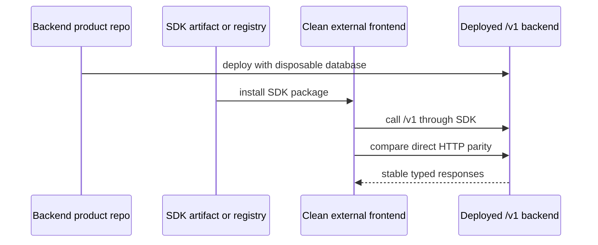

# Phase 5: External App Adoption Proof

## Purpose

Prove the product shape from outside this repository: a clean app with its own
frontend installs the SDK and talks to the backend platform without importing
this monorepo.

## Inputs To Read

- `phase-1-backend-product-repository-contract.md`
- `phase-2-backend-repository-materialization.md`
- `phase-3-sdk-install-contract.md`
- `phase-4-frontend-consumer-detachment.md`
- `../phase-19-cross-repo-release-proof.md`
- `../phase-24-cross-repo-adoption-proof.md`
- `../phase-28-live-backend-and-external-consumer-proof.md`
- existing live proof, registry install proof, and frontend consumer readiness
  scripts

## Write Scope

- external fixture app or fixture plan
- SDK install proof commands
- backend live proof readiness or strict proof commands
- SDK/direct HTTP parity evidence
- docs for movie-ticketing-style consumer adaptation
- downstream updates to Phase 6

## Non-Goals

- Do not claim proof from a skipped readiness command.
- Do not publish or mutate production infrastructure without explicit approval.
- Do not require the external app to import backend source.
- Do not use current frontend compatibility routes as the backend target.

## Proof Flow

## Subagent Tasks

1. Define the clean external frontend fixture location and setup.
2. Install the SDK from a packed artifact or configured registry without
   workspace links.
3. Configure the external app with backend base URL, tenant, venue, auth, and
   idempotency inputs.
4. Run direct HTTP and SDK calls against the same backend target.
5. Include at least one non-racing consumer scenario in docs, such as movie
   showtime reservations using generic resources and availability.
6. Record which checks are readiness-only and which checks are live proof.
7. Update Phase 6 with evidence needed before compatibility cleanup.

## Review Gates

Spec reviewer must reject the phase when:

- the backend target is the current frontend's `/api` compatibility layer;
- SDK install proof depends on workspace links;
- live proof is claimed without configured backend, database, and mutation
  evidence;
- the external app cannot represent a non-racing reservation use case.

Quality reviewer must reject the phase when:

- fixtures are difficult to run in a clean directory;
- secrets can be logged;
- parity checks are partial but documented as complete;
- cleanup steps can delete user files outside temp or fixture paths.

## Acceptance Criteria

- A clean external frontend adoption flow exists.
- SDK install and backend base URL setup are documented with exact commands.
- Live proof requirements are separated from local readiness checks.
- Evidence from this phase can drive compatibility route removal decisions.
