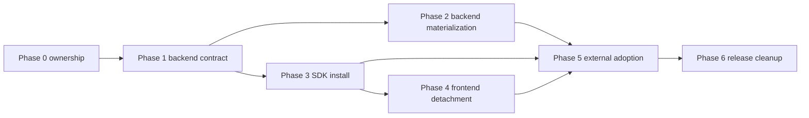

# Subagent Handoff Matrix

## Purpose

Give coordinators a concise assignment map for executing this plan with
subagents while preserving the product boundary.

## Execution Order



## Task Matrix

| Phase | Worker focus | Spec review focus | Quality review focus |
| --- | --- | --- | --- |
| Phase 0 | Classify source ownership and update downstream assumptions | Every path has one owner; compatibility routes are not product API | Inventory is maintainable and script-friendly |
| Phase 1 | Define backend product repo contract | Backend repo stands alone without frontend source | Contract can become verifiable scripts and CI gates |
| Phase 2 | Materialize backend repo candidate | Candidate excludes frontend/current-app compatibility source | Temp generation is safe and failures are actionable |
| Phase 3 | Make SDK install surface explicit | SDK is HTTP-only, frontend-safe, and maps to `/v1` | Exports and package artifacts are narrow and inspectable |
| Phase 4 | Detach current frontend as consumer | Frontend imports SDK/client wrapper, not backend internals | Config and fallback behavior are explicit and testable |
| Phase 5 | Prove clean external app adoption | External app installs SDK and hits standalone backend | Fixtures are clean, safe, and do not leak secrets |
| Phase 6 | Release and cleanup gates | Cleanup follows completed proof, not plans | Runbooks and compatibility matrix are actionable |

## Shared Rejection Rules

Reviewers should reject any phase that:

- treats current Next.js compatibility routes as the final backend product API;
- uses workspace links as the only proof that an external app can install the
  SDK;
- imports backend implementation code into frontend source;
- puts migrations, provider workflows, database repositories, or service-role
  behavior into the SDK;
- claims live proof from skipped readiness checks;
- changes a shared boundary without updating later phase files.

## Worker Prompt Skeleton

Give each worker:

```text
You are implementing Phase N from repo-product-split-plan.
Read README.md, phase-N.md, subagent-handoff-matrix.md, and
../remaining-modularity-gaps.md.

Stay within the phase write scope. If you change a shared assumption, update
all later phases listed by the Downstream Update Rule before reporting done.

Report:
- files changed
- commands run and what they prove
- readiness-only checks versus live proof
- remaining blockers
```

## Reviewer Prompt Skeleton

Give each reviewer:

```text
Review Phase N against repo-product-split-plan/phase-N.md and README.md.
Do not rely on chat history.

Spec review: verify the work satisfies the phase purpose, write scope,
non-goals, review gates, and acceptance criteria.

Quality review: verify maintainability, safety, boundary hygiene, tests,
failure messages, and downstream updates.

Return APPROVED only when there are no required fixes.
```
