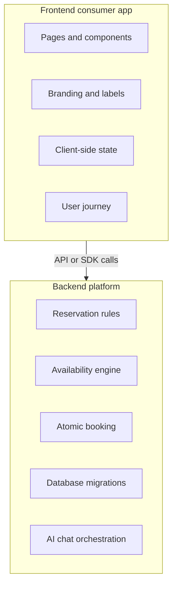

# Phase 0: Intent Reset and Boundary Map

## Purpose

Reset the plan around the real goal: the reusable product is the backend platform, while this Next.js app becomes one frontend consumer.

## Subagent Mission

Create an accurate boundary map of what belongs in the future backend platform and what stays in frontend apps.

## Read First

- `docs/package-refactor/backend-platform-extraction/README.md`
- `docs/package-refactor/package-boundary-inventory.md`
- `docs/package-refactor/ai-chat-boundary-inventory.md`
- `app/api`
- `lib`
- `packages`

## Allowed Write Scope

- `docs/package-refactor/backend-platform-extraction/phase-0-intent-reset-boundary-map.md`
- New or updated inventory docs under `docs/package-refactor/backend-platform-extraction/`

Do not edit application code in this phase.

## Work Items

1. Inventory frontend-owned behavior: pages, forms, visual flows, user-facing labels, layout, marketing, dashboard screens. See [Backend Platform Boundary Inventory](backend-platform-boundary-inventory.md#frontend-owned-behavior).
2. Inventory backend-owned behavior: availability, booking, cancellation, reservation validation, persistence, business rules, AI tool orchestration. See [Backend Platform Boundary Inventory](backend-platform-boundary-inventory.md#backend-platform-owned-behavior).
3. Identify shared contracts: resource, slot, reservation, customer, tenant, payment intent, chat session. See [Shared Contracts](backend-platform-boundary-inventory.md#shared-contracts).
4. Mark racing-specific names that must become configurable domain labels. See [Racing-Specific Concepts Needing Generic Names Or Configuration](backend-platform-boundary-inventory.md#racing-specific-concepts-needing-generic-names-or-configuration).
5. Produce a boundary diagram. See [Boundary Diagram](backend-platform-boundary-inventory.md#boundary-diagram).

## Suggested Diagram

## Deliverables

- Boundary inventory doc: `backend-platform-boundary-inventory.md`.
- List of current files that are backend candidates: `backend-platform-boundary-inventory.md#current-backend-candidate-files`.
- List of current files that must stay frontend-owned: `backend-platform-boundary-inventory.md#current-frontend-owned-files`.
- List of racing-specific concepts that need generic names or configuration: `backend-platform-boundary-inventory.md#racing-specific-concepts-needing-generic-names-or-configuration`.

## Acceptance Criteria

- A subagent can explain what moves to the backend repo and what does not using `backend-platform-boundary-inventory.md#what-moves-versus-what-does-not`.
- No implementation is required.
- Later phases can use the inventory without reading chat history.

## Downstream Updates Required

No downstream phase assumptions changed in Phase 0. The inventory keeps the
existing generic meanings of reservation, resource, slot, customer, tenant,
payment intent, and chat session, and records racing-specific wording as
compatibility/configuration work rather than a new contract.

Phase 5 must reconcile backend-owned SQL/schema assets from both
`packages/reservations-supabase/sql/**` and reservation/platform-relevant root
`supabase/*.sql` files into one backend platform migration set, including
reservation schema, RLS/security, atomic RPC, and optional AI knowledge
retrieval assets where they remain in platform scope.
