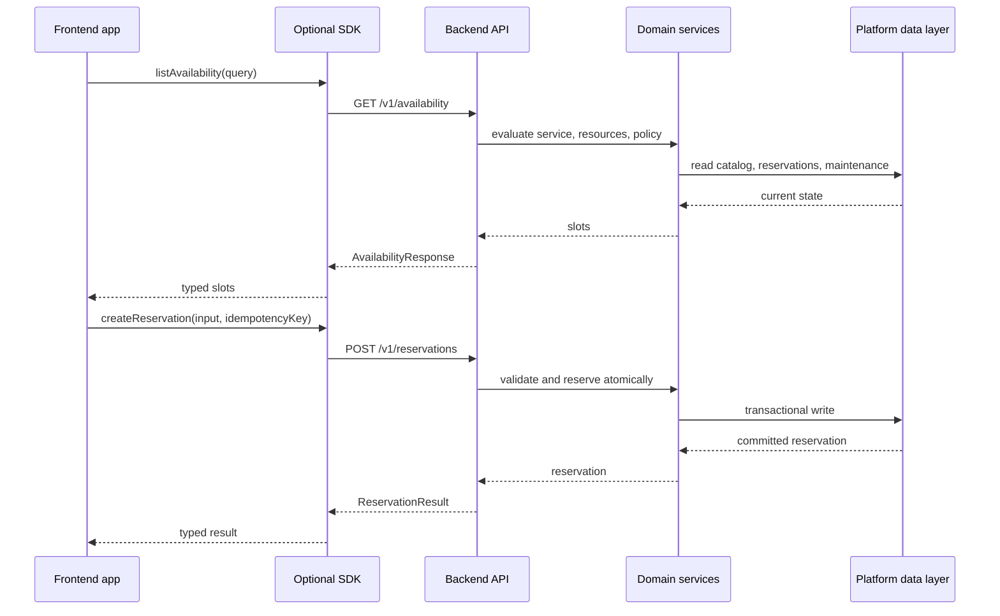

# Phase 1: Backend Platform Contract

## Purpose

Define the backend platform as a product with stable contracts instead of
app-specific helper functions. External frontends should be able to consume the
platform through HTTP APIs, an optional TypeScript SDK, or server-to-server
integration without copying booking logic, database queries, Supabase RPC
details, or optional AI workflow internals.

This phase is documentation-only. It establishes the first version of the
contract that later phases must implement, refine, and test.

## Platform Scope

The core product is a reusable reservation backend platform. Core scope includes
tenant and venue context, resource catalog contracts, availability, atomic
reservation creation, reservation lifecycle operations, backend validation,
storage adapters, database migrations, API contracts, SDK contracts, tenant
isolation, domain errors, and idempotency.

Optional modules can be added beside core only when explicitly scoped: AI chat,
structured knowledge retrieval, payment orchestration, analytics/report APIs,
content/CMS APIs, and notification workflows. Optional modules must depend on
core contracts rather than requiring frontends to copy backend behavior.

The contract uses generic reservation vocabulary. Domain-specific labels such as
movie seats, simulator rigs, rooms, appointment providers, equipment, event
tickets, or tables are configured as resources and display labels, not encoded
as platform defaults.

## Contract Documents

- [API Resource List](contracts/api-resource-list.md)
- [SDK Method List](contracts/sdk-method-list.md)
- [Error Conventions](contracts/error-conventions.md)
- [Idempotency Conventions](contracts/idempotency-conventions.md)

## Platform Primitives

| Primitive | Core meaning | Example uses |
| --- | --- | --- |
| Tenant | Customer, operator, or account boundary that owns configuration and data. | Cinema chain, coworking operator, activity venue. |
| Venue | Physical or virtual location under a tenant with timezone, operating windows, and policies. | Theater branch, clinic location, event venue. |
| Service | Bookable offer or activity that defines duration, capacity policy, and resource needs. | Movie showing, room booking, appointment type, event session. |
| Resource | Reservable unit, capacity bucket, person, room, seat, rig, table, or equipment item. | Movie seat A1, simulator rig RS1, meeting room, stylist chair. |
| Resource layout | Optional metadata for grouping or displaying resources. | Theater rows, room zones, equipment banks. |
| Slot | Candidate reservation window for a service at a venue. | 10:00-11:00 room slot, 20:00 movie showing, appointment time. |
| Reservation | Durable hold or booking for customer intent, selected service, time, quantity, and resources. | Confirmed appointment, cancelled ticket booking. |
| Reservation item | Resource or capacity allocation within a reservation. | Seats A1/A2, room 3, two event tickets. |
| Customer | Person or external account attached to a reservation. | Guest, registered user, organizer contact. |
| Payment reference | Optional payment-provider identifier and status linked to a reservation. | Payment intent id, checkout session id, paid/refunded status. |
| Chat session | Optional AI-assisted booking context that calls core reservation tools. | Guided booking assistant session. |

## Integration Modes

| Mode | Description | Best fit |
| --- | --- | --- |
| HTTP API only | Frontend calls versioned platform endpoints directly and owns its own API client. | Any framework, non-TypeScript clients, generated clients. |
| TypeScript SDK | Frontend imports a package that wraps the HTTP API and exports typed inputs, outputs, errors, and helpers. | TypeScript web apps that want a stable client surface. |
| Server-to-server | A backend, edge function, or middleware calls the platform with service credentials and forwards sanitized results to its UI. | Native apps, custom auth brokers, marketplaces, enterprise integrations. |

The HTTP API is the source of truth. The SDK must mirror the API instead of
introducing behavior that cannot be reproduced by direct API calls.

## Backend Guarantees

The backend platform guarantees:

- Atomic reservation creation for one request: either all requested allocations
  are persisted together or no reservation is created.
- Availability consistency at booking time: create/update operations re-check
  conflicts, capacity, operating windows, maintenance, status, and tenant/venue
  policy before committing.
- Stable machine-readable errors using the Phase 1 error shape.
- Idempotent handling for mutation endpoints that accept idempotency keys,
  especially reservation creation and payment-linked workflows.
- Tenant and venue isolation for all reads and writes.
- Server-side validation for customer input, resource selections, quantity,
  slot windows, status transitions, and optional module payloads.
- Canonical reservation, slot, resource, and customer identifiers independent
  of frontend component names or route structure.
- Backend-owned persistence contracts, migrations, repository adapters, and
  compatibility adapters where legacy names need migration.

The backend platform does not guarantee:

- Frontend layout, visual pickers, user journey, copy, localization, or SEO.
- Payment provider UI completion unless the optional payment module is scoped.
- AI chat behavior unless the optional chat module is scoped.
- Analytics/reporting, content/CMS, or notification workflows unless those
  optional modules are scoped.

## Frontend Responsibilities

Consumer frontends must provide:

- Auth/session context required by the selected integration mode.
- Tenant and venue selection or configuration when the backend cannot infer it.
- Customer input, consent UX, and user-facing validation hints.
- Display labels, icons, maps, calendars, locale formatting, and error copy.
- Resource selection UX for seats, rooms, rigs, appointment providers, event
  tickets, or other configured resource kinds.
- Payment provider handoff and customer payment UI when payments are enabled.
- Retry behavior that respects idempotency conventions.
- Safe handling of returned reservation identifiers and customer data.

Frontends may pre-validate inputs for usability, but backend validation remains
authoritative.

## Core Flow

## Resource Model Expectations

The platform must support at least these use cases without changing contract
names:

- Movie seats: individual resources with layout rows, labels, and per-showing
  availability.
- Simulator rigs: individual equipment resources configured by tenant/service.
- Rooms: exclusive resources with duration and capacity metadata.
- Appointments: provider, chair, room, or capacity resources tied to service
  duration.
- Events: quantity-based capacity, optional assigned resources, or ticket
  allocation by section.

Resource kind and display label are configuration. Contract names stay
`resource`, `slot`, `reservation`, `quantity`, and `reservation_item`.

## Subagent Mission

Write the first version of the platform contract that external frontends will
depend on.

## Upstream Dependencies

- Phase 0 boundary inventory.

## Allowed Write Scope

- `docs/package-refactor/backend-platform-extraction/phase-1-backend-platform-contract.md`
- New contract docs under `docs/package-refactor/backend-platform-extraction/contracts/`

Do not edit application code in this phase.

## Deliverables

- Platform contract document: this file.
- First draft API resource list: `contracts/api-resource-list.md`.
- First draft SDK method list: `contracts/sdk-method-list.md`.
- Error conventions: `contracts/error-conventions.md`.
- Idempotency conventions: `contracts/idempotency-conventions.md`.

## Acceptance Criteria

- Contract avoids racing simulator terminology except as an example.
- Contract can support movie seats, simulator rigs, rooms, appointments, and events.
- Contract clearly separates backend guarantees from frontend responsibilities.

## Downstream Updates Required

Phase 4 must treat the Phase 1 API and SDK lists as the starting contract and
may refine names only by updating this file and the contract docs first.

Phase 5 must keep reservation, resource, slot, customer, tenant, venue,
payment reference, and optional chat session as platform-owned contracts while
classifying content/CMS, analytics/reporting, notification, and non-scoped AI
storage outside core migrations.

Phases 6 through 9 must preserve the core-vs-optional distinction: AI chat,
structured knowledge retrieval, payments, analytics/report APIs, content/CMS
APIs, and notification workflows are optional modules unless explicitly scoped.
