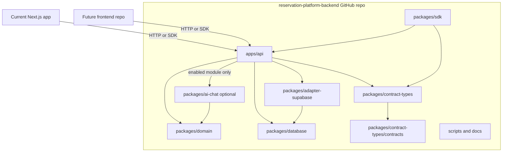
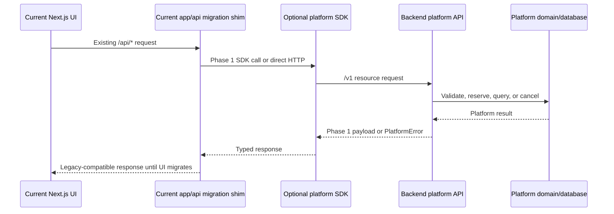

# Phase 2: Standalone Backend Repo Shape

## Purpose

Design the repository structure for the backend platform before code is moved.
The reusable product is a GitHub-hosted backend platform that any frontend can
consume through the Phase 1 HTTP API and optional TypeScript SDK contracts.

This phase is documentation-only. Do not move files, rename packages, or edit
application code in this phase.

## Subagent Mission

Propose a standalone backend repository layout that can live on GitHub and be
consumed by multiple frontend repositories.

## Upstream Dependencies

- Phase 0 boundary inventory.
- Phase 1 backend platform contract.
- Contract docs:
  - `contracts/api-resource-list.md`
  - `contracts/sdk-method-list.md`
  - `contracts/error-conventions.md`
  - `contracts/idempotency-conventions.md`

## Allowed Write Scope

- `docs/package-refactor/backend-platform-extraction/phase-2-standalone-backend-repo-shape.md`
- New repo-shape docs under `docs/package-refactor/backend-platform-extraction/`

Do not move files in this phase.

## Decision

Use a backend platform monorepo, not a single-service repo.

The current branch also includes a machine-readable extraction manifest at
`docs/package-refactor/backend-platform-extraction/standalone-backend-extraction-manifest.json`.
It is checked by `corepack pnpm run backend-platform:verify-extraction-manifest`
and `corepack pnpm run backend-platform:verify-extraction-dry-run`, both wired
into `sdk:release-gate`.

The manifest classifies current repo paths as:

- `move-candidate` for backend platform source such as domain, adapters,
  contracts, SDK, and optional chat foundations;
- `copy-candidate` for contract docs, external fixtures, SQL assets, and
  release/verification scripts that need further backend-owned pruning;
- `compatibility-shim` for current Next.js-hosted `/api/v1` route glue; and
- `exclude` for frontend UI, current app pages, analytics/reporting,
  content/blog, browser Supabase helpers, and frontend-only platform clients.

Current branch implementation note: `packages/reservation-platform-api` is the
first partial API extraction package. It owns framework-neutral `/v1` metadata,
catalog read service/result mapping, reservation update policy mapping, error
payload mapping, and compatibility DTO adapters that previously lived under `app/api/v1`. The current Next.js
routes still host the HTTP runtime, Supabase client construction, and legacy
route delegation, so `app/api/v1` remains a compatibility shim until the
standalone backend `apps/api` exists.

The manifest verifier is intentionally conservative: it fails if a move/copy
candidate uses known frontend/current-app source paths, if backend targets
recreate current frontend layout areas, if current-source paths are missing, or
if exclusions lack rationale. The dry-run verifier then enumerates current
move/copy candidate files into deterministic target paths, excludes
generated/install/cache artifacts, treats compatibility shims as
reimplementation references only, and fails on ambiguous target mappings,
target collisions, invalid paths, frontend targets, or generated artifact
inclusion. These checks do not move files or create the standalone repository;
they make the extraction set auditable for future subagents.

Recommended repository name:

```text
reservation-platform-backend
```

The backend is not a frontend package workspace. It is a platform repository
with one deployable API app, core domain packages, storage adapters, database
migrations, optional modules, SDK packages, examples, and operations docs.

The monorepo shape is the better fit because the product contains several
separate but version-aligned surfaces:

- A deployable API that is the source of truth for external consumers.
- Core reservation domain services shared by API, tests, adapters, and optional
  modules.
- Database migrations and storage adapters owned by the backend platform.
- A TypeScript SDK package that mirrors the HTTP API. The package is part of
  the backend repo deliverable so consumers have a typed integration path, but
  using it is optional because direct HTTP remains the source-of-truth
  contract.
- Optional backend modules, especially AI chat and structured retrieval, that
  must depend on core contracts without becoming required platform behavior.
- Examples and compatibility shims for the current Next.js app while extraction
  is in progress.

A single-service repo would hide important ownership boundaries inside one API
app and make it harder for later subagents to know where to implement domain
rules, storage changes, SDK changes, chat changes, migrations, or migration
glue.

## Recommended Repository Layout

```text
reservation-platform-backend/
  README.md
  package.json
  pnpm-workspace.yaml
  turbo.json
  tsconfig.base.json
  .github/
    workflows/
      ci.yml
      release.yml

  apps/
    api/
      package.json
      src/
        server.ts
        routes/
          metadata.ts
          tenants.ts
          venues.ts
          services.ts
          resources.ts
          resource-layouts.ts
          availability.ts
          reservations.ts
          reservation-lifecycle.ts
          resource-maintenance.ts
        modules/
          chat/
            routes.ts
          payments/
            routes.ts
        middleware/
          auth-context.ts
          tenant-context.ts
          idempotency.ts
          errors.ts
        adapters/
          supabase.ts
        openapi/
          v1.ts
      tests/

  packages/
    domain/
      package.json
      src/
        availability.ts
        capacity.ts
        conflicts.ts
        create-reservation.ts
        policies.ts
        repository.ts
        types.ts
        errors.ts
        idempotency.ts
      fixtures/
      examples/
      tests/

    database/
      package.json
      src/
        repository.ts
        migrations.ts
        types.ts
      migrations/
        README.md
        supabase/
      seeds/
      tests/

    adapter-supabase/
      package.json
      src/
        client.ts
        repository.ts
        row-adapters.ts
        rpc.ts
        compatibility.ts
      tests/

    sdk/
      package.json
      src/
        client.ts
        errors.ts
        idempotency.ts
        types.ts
        resources/
          metadata.ts
          tenants.ts
          venues.ts
          services.ts
          resources.ts
          resource-layouts.ts
          availability.ts
          reservations.ts
          resource-maintenance.ts
      tests/

    contract-types/
      package.json
      src/
        api.ts
        customer.ts
        reservation.ts
        resource.ts
        slot.ts
        tenant.ts
        venue.ts
        errors.ts
        idempotency.ts
      contracts/
        openapi.json
        json-schema/
          *.schema.json

    ai-chat/
      package.json
      src/
        actions.ts
        domain-guard.ts
        messages.ts
        prepared-booking.ts
        prompts.ts
        tool-schemas.ts
        tools.ts
        providers/
          langchain.ts
        retrieval/
          interface.ts
          supabase-vector-store.ts
      tests/

  docs/
    api.md
    sdk.md
    database.md
    modules.md
    migration-from-project-play.md
    operations.md

  examples/
    nextjs-consumer/
    plain-react-consumer/
    server-to-server/

  scripts/
    migrate.ts
    smoke-api.ts
    smoke-database.ts
```

## Repository Diagram



## Ownership Model

| Area | Future repo target | Owns | Does not own |
| --- | --- | --- | --- |
| API | `apps/api` | Versioned `/v1` HTTP routes from Phase 1, auth/tenant context, idempotency middleware, error serialization, OpenAPI publication, API-level compatibility adapters. | Current Next.js route files verbatim, React UI behavior, Project Play page routing. |
| Domain | `packages/domain` | Reservation, resource, slot, customer, tenant, venue, policy, availability, capacity, conflicts, atomic reservation validation, domain errors. | Supabase client construction, HTTP request parsing, frontend labels, visual resource maps. |
| Contract types | `packages/contract-types` | Shared TypeScript types that mirror API payloads: `Tenant`, `Venue`, `Service`, `Resource`, `ResourceLayout`, `Slot`, `Reservation`, `ReservationItem`, `CustomerSnapshot`, `PlatformError`, idempotency metadata, and the generated artifacts at `packages/contract-types/contracts/openapi.json` and `packages/contract-types/contracts/json-schema/*.schema.json`. | Booking rules, database access, or a parallel top-level generated contract artifact tree. |
| Database | `packages/database` | Migration organization, repository contracts for persistence, migration runner hooks, database-owned test fixtures. | Frontend Supabase helpers, content/blog/reporting schemas outside platform scope. |
| Supabase adapter | `packages/adapter-supabase` | Supabase repository implementation, row adapters, RPC calls, compatibility mapping from legacy reservation schema names to generic platform contracts. | Generic domain policy decisions, API route ownership, frontend auth UX. |
| SDK | `packages/sdk` | Backend-repo TypeScript client for the Phase 1 API, request context helpers, idempotency options, `PlatformError` handling, optional module namespaces. Consumers may use direct HTTP instead. | Backend-only business logic that would make SDK behavior differ from direct HTTP. |
| AI chat | `packages/ai-chat` | Optional reservation chat contracts, serializable messages/actions, tool schemas, prepared booking, domain guard helpers, tool factories, provider-neutral orchestration interfaces. | Core platform requirement, chat UI, Project Play knowledge copy, hard-coded model provider credentials. |
| API contract artifacts | `packages/contract-types/contracts/` | Package-owned OpenAPI and JSON Schema artifacts generated from `packages/contract-types/src/**`; the API consumes/publishes these artifacts rather than owning a separate source tree. | Hand-authored frontend form types that drift from API contracts, or a separate top-level generated contract artifact tree. |
| Operations | `scripts/`, `.github/`, `docs/operations.md` | Backend CI, migrations, smoke tests, release/deploy docs, environment requirements. | This frontend repo's PR helper or app-only smoke scripts. |

## Core Platform Versus Optional Modules

Core platform packages:

- `apps/api`
- `packages/domain`
- `packages/contract-types`
- `packages/database`
- `packages/adapter-supabase` while Supabase remains the first storage adapter
- `packages/sdk`
- `packages/contract-types/contracts/openapi.json`
- `packages/contract-types/contracts/json-schema/*.schema.json`
- backend operations scripts and tests

Optional modules:

- `packages/ai-chat`
- `packages/payments` if payment orchestration is scoped later
- `packages/notifications` if notification workflows are scoped later
- `packages/reports` if analytics/report APIs are scoped later
- `packages/content` only if content/CMS APIs are explicitly made a platform
  module

Optional modules must depend on core platform contracts. Core domain code must
not import optional modules. The API may mount optional routes only when the
module is enabled and must return stable Phase 1 error codes such as
`chat_module_disabled` or `payment_module_disabled` when unavailable.

## API Shape In The Backend Repo

`apps/api` should implement the Phase 1 resource vocabulary:

| Phase 1 resource | Future route target |
| --- | --- |
| Platform metadata | `apps/api/src/routes/metadata.ts` |
| Tenants | `apps/api/src/routes/tenants.ts` |
| Venues | `apps/api/src/routes/venues.ts` |
| Services | `apps/api/src/routes/services.ts` |
| Resources | `apps/api/src/routes/resources.ts` |
| Resource layouts | `apps/api/src/routes/resource-layouts.ts` |
| Availability | `apps/api/src/routes/availability.ts` |
| Reservations | `apps/api/src/routes/reservations.ts` |
| Reservation lifecycle | `apps/api/src/routes/reservation-lifecycle.ts` |
| Resource maintenance | `apps/api/src/routes/resource-maintenance.ts` |
| Optional AI chat | `apps/api/src/modules/chat/routes.ts` |
| Optional payments | `apps/api/src/modules/payments/routes.ts` |

Current Next.js API routes are migration glue. They can inform behavior,
compatibility response fields, tests, and adapter requirements, but they should
not be copied verbatim into `apps/api`. Later phases should reimplement the API
as backend platform routes that call `packages/domain`, `packages/database`,
`packages/adapter-supabase`, and optional modules.

## Mapping From Current Repository To Future Backend Areas

| Current file or folder | Future backend repo area | Move stance |
| --- | --- | --- |
| `packages/reservations-core/src/**` | `packages/domain/src/**` | Move as the starting point for core domain services, preserving Phase 1 vocabulary. |
| `packages/reservations-core/fixtures/**` | `packages/domain/fixtures/**` | Move as cross-domain fixtures. Rename racing-specific assumptions into configurable examples where needed. |
| `packages/reservations-core/examples/**` | `packages/domain/examples/**` or `examples/server-to-server/**` | Move as consumer examples after generic vocabulary cleanup. |
| `packages/reservations-core/README.md` | `packages/domain/README.md` | Move and rewrite around the backend platform contract. |
| `packages/reservations-core/dist/**` | Do not move as source | Rebuild generated artifacts in the backend repo instead of copying compiled output. |
| `packages/reservations-supabase/src/**` | `packages/adapter-supabase/src/**` | Move as first storage adapter, then align names with `resource`, `slot`, `reservation`, `customer`, `tenant`, and `venue`. |
| `packages/reservations-supabase/sql/**` | `packages/database/migrations/supabase/**` | Move after Phase 5 reconciliation into canonical backend-owned migrations. |
| `packages/reservations-supabase/examples/**` | `packages/adapter-supabase/tests/fixtures/**` | Move as adapter fixtures. |
| `packages/reservations-supabase/README.md` | `packages/adapter-supabase/README.md` | Move and rewrite for platform storage adapter usage. |
| `packages/reservations-supabase/dist/**` | Do not move as source | Rebuild generated artifacts in the backend repo. |
| `packages/reservation-chat-core/src/**` | `packages/ai-chat/src/**` | Migration/reference input only. Translate and reimplement the provider-neutral backend chat package from this source set; do not copy it verbatim. |
| `packages/reservation-chat-core/README.md` | `packages/ai-chat/README.md` | Migration/reference input only. Rewrite the backend chat README from the translated provider-neutral package; do not move the legacy README verbatim. |
| `packages/reservation-chat-core/dist/**` | Do not move as source | Rebuild generated artifacts in the backend repo. |
| `packages/reservation-platform-api/src/**` | `packages/api/src/**` or `apps/api/src/application/**` | Move as framework-neutral API compatibility services, catalog repository ports, and DTO/error adapters. Current Next.js `NextResponse` wrappers and Supabase client factories stay app shims. |
| `lib/reservations/**` | `packages/domain` or `packages/adapter-supabase` only after dedupe | Translate any behavior not already in packages; do not preserve duplicate ownership. |
| `lib/availability.ts` | `apps/api` compatibility adapter or `packages/domain` helper | Translate generic behavior or retire once the current app calls platform availability. |
| `lib/reservation-capacity.ts` | `packages/domain/src/capacity.ts` | Translate any missing generic capacity behavior; retire frontend bridge. |
| `lib/seat-maintenance.ts` | `packages/domain` and `apps/api` compatibility adapter | Split generic resource maintenance from racing-specific `RS` compatibility. |
| `lib/reservations/api-adapters.ts` | `apps/api` compatibility adapter or `packages/adapter-supabase` row adapter | Translate response compatibility, especially legacy seat aliases, without making legacy names canonical. |
| `app/api/availability/route.ts` | `apps/api/src/routes/availability.ts` | Reimplement from contract. Current file remains migration glue and should not move verbatim. |
| `app/api/bookings/route.ts` | `apps/api/src/routes/reservations.ts` | Reimplement create/list reservations with Phase 1 errors and idempotency. Current admin search glue stays app-specific unless generalized. |
| `app/api/bookings/[id]/route.ts` | `apps/api/src/routes/reservation-lifecycle.ts` | Reimplement read/update/cancel/reschedule semantics under backend auth and tenant rules. |
| `app/api/services/**` | `apps/api/src/routes/services.ts` | Reimplement generic service catalog API. |
| `app/api/venues/**` | `apps/api/src/routes/venues.ts` | Reimplement only tenant/venue configuration needed by backend contracts; Project Play copy stays host config. |
| `app/api/seat-maintenance/route.ts` | `apps/api/src/routes/resource-maintenance.ts` | Reimplement generically as resource maintenance. The seat-specific route name stays only as current app glue during migration. |
| `app/api/chat/route.ts` | `apps/api/src/modules/chat/routes.ts` | Reimplement as optional AI chat API. Current route stays as migration shim. |
| `app/api/chat/tool-loop.ts` | `packages/ai-chat/src/providers/**` if provider-neutral enough | Translate into optional chat provider adapter; avoid binding core chat to one host route. |
| `app/api/chat/chat-config.ts` | Split between `packages/ai-chat` interfaces and tenant/frontend config | Move only generic date/prompt configuration interfaces. Keep Project Play copy and timezone values as tenant config. |
| `lib/langchain/chat-agent.ts` | `packages/ai-chat/src/providers/langchain.ts` | Translate into injected provider adapter with model, repository, retriever, clock, and venue copy dependencies. |
| `lib/langchain/prompts.ts` | `packages/ai-chat/src/prompts.ts` plus tenant config | Move generic prompt sections only. Keep venue-specific copy outside the platform source. |
| `lib/langchain/vector-store.ts` | `packages/ai-chat/src/retrieval/supabase-vector-store.ts` | Move only if structured retrieval remains scoped; table and RPC names must be configurable. |
| `lib/knowledge.ts` | Optional structured retrieval module or tenant config boundary | Split backend retrieval facade from Project Play editorial knowledge. |
| `supabase/base-schema.sql` | `packages/database/migrations/supabase/**` | Reconcile in Phase 5 and keep reservation/platform tables only. |
| `supabase/reservations-rls.sql` | `packages/database/migrations/supabase/**` | Reconcile into platform-owned auth/tenant policies. |
| `supabase/create-reservation-atomic.sql` | `packages/database/migrations/supabase/**` | Reconcile with package SQL so one canonical atomic create workflow exists. |
| `supabase/security-hardening.sql` | `packages/database/migrations/supabase/**` | Move applicable backend security hardening after scope review. |
| `supabase/knowledge.sql`, `supabase/langchain.sql` | `packages/database/migrations/supabase/**` for optional retrieval only | Move only scoped structured retrieval assets; not Project Play content. |
| `scripts/start-local-supabase.ps1`, `scripts/stop-local-supabase.ps1` | `scripts/` | Move only if the backend repo standardizes local Supabase operations. |

## Files That Should Not Move

| Current file or folder | Reason |
| --- | --- |
| `app/page.tsx`, `app/layout.tsx`, `app/globals.css`, `app/favicon.ico` | Frontend app shell, styling, and site entry. |
| `app/form-booking/page.tsx`, `components/form/**` | Booking UI flow, visual resource picker, form state, and user-facing validation copy. |
| `app/chat-booking/page.tsx`, `components/chat/**` | Chat UI rendering and frontend interaction state. Backend may own chat APIs, not React chat components. |
| `components/landing/**`, `components/shared/**`, `components/ui/**` | Project Play branding, UI primitives, layout, and visual presentation. |
| `app/admin/**`, `components/admin/**` | Admin frontend experience. Backend may expose admin-capable APIs, not this admin UI. |
| `components/analytics/**`, `app/admin/analytics/page.tsx` | Analytics dashboard UI. Reports are optional module scope only if approved later. |
| `app/api/analytics-chat/**`, `app/api/analytics-reports/**` | Admin analytics/reporting app area, not reservation platform core. |
| `lib/langchain/analytics-agent.ts`, `lib/langchain/sales-report-pipeline.ts`, `lib/sales-reports.ts`, `lib/sales-report-extraction.ts` | Analytics/reporting behavior outside core platform unless a reports module is scoped later. |
| `app/blog/**`, `app/updates/**`, `components/content/**` | Public content and presentation. |
| `app/api/blogs/**`, `app/api/updates/**`, `app/api/content-posts.ts`, `lib/blogs.ts`, `lib/content-posts.ts` | Project Play content/CMS support. |
| `data/knowledge.md` | Tenant/venue editorial knowledge. Platform can accept configured knowledge, but should not own this content file. |
| `supabase/blogs.sql` | Blog/content schema outside platform core. |
| `supabase/sales-reports.sql` | Reporting/analytics schema outside platform core unless reports are scoped later. |
| `types/index.ts` | Current frontend compatibility type bridge. Future frontends should consume generated/API SDK types. |
| `lib/supabase.ts`, `lib/supabase-admin.ts`, `lib/supabase-browser.ts`, `lib/supabase-server.ts` | Current app Supabase client construction and frontend/admin auth helpers. The backend repo needs its own environment-specific clients. |
| `scripts/seed-knowledge.ts` | Project Play knowledge seeding. Backend platform may have tenant knowledge import tooling later, but not this app-specific script. |

## Current App Consumption During Migration

The current Next.js app can remain in this repository while the backend platform
is extracted. Migration should happen in layers.

### Stage 1: In-Repo Compatibility

- Keep existing `app/api/**` routes serving the current UI.
- Route files continue to call current package code and compatibility helpers.
- Add tests around current behavior before moving implementation in later
  phases.
- Do not change frontend pages or component fetch URLs unless a later migration
  phase scopes that work.

### Stage 2: Backend Repo Publishes API And SDK

- Stand up `reservation-platform-backend/apps/api` with `/v1` endpoints.
- Publish or locally link the optional SDK package from
  `reservation-platform-backend/packages/sdk`.
- Keep current app routes as proxy/shim endpoints when the UI still calls
  legacy paths such as `/api/availability`, `/api/bookings`, or
  `/api/seat-maintenance`.
- Translate legacy response aliases in the shim when needed:
  `resource_labels` to legacy seat label fields, `available_quantity` to
  legacy availability fields, and `resource-maintenance` to the current
  seat-maintenance route.

### Stage 3: Frontend Calls Platform Contracts

- Gradually update current frontend data access to call the SDK or backend API
  directly.
- Prefer the Phase 1 methods from `contracts/sdk-method-list.md`, such as
  `listAvailability`, `createReservation`, `getReservation`,
  `listResourceMaintenance`, and optional `chat.sendMessage`.
- Keep idempotency behavior aligned with
  `contracts/idempotency-conventions.md` for create/cancel/reschedule/chat
  confirmation flows.
- Map `PlatformError` codes from `contracts/error-conventions.md` to UI copy in
  the frontend app.

### Stage 4: Remove Migration Glue

- Remove or retire current Next.js API shims only after the UI no longer depends
  on legacy routes.
- Keep frontend-owned pages, components, admin UI, analytics UI, content UI, and
  Project Play copy in this repository.
- Treat the backend platform repo as the owner of reservation rules,
  persistence, and API/SDK contracts.

## Migration Dependency Direction



## Subagent Write Targets For Later Phases

| Later work | Primary target in backend repo | Notes |
| --- | --- | --- |
| Extract domain services | `packages/domain/src/**` | Phase 3 should move core reservation behavior here first. |
| Implement HTTP API | `apps/api/src/routes/**` | Phase 4 should use Phase 1 API resources and error/idempotency conventions. |
| Generate or publish SDK | `packages/sdk/src/**`, `packages/contract-types/src/**`, and `packages/contract-types/contracts/**` | Phase 4 should keep SDK behavior equivalent to HTTP and keep generated OpenAPI/JSON Schema artifacts package-owned. |
| Reconcile migrations | `packages/database/migrations/supabase/**` | Phase 5 should combine package SQL and root reservation SQL into one migration set. |
| Build storage adapter | `packages/adapter-supabase/src/**` | Phase 5 should keep storage details out of frontend apps. |
| Extract AI chat | `packages/ai-chat/src/**` and `apps/api/src/modules/chat/**` | Phase 6 should keep chat optional and inject model/retrieval/tenant config. |
| Migrate current frontend | Current repo `app/api/**` shims and frontend fetch clients | Phase 7 should keep the app working while moving from legacy routes to SDK/API. |
| Prove external consumers | `examples/nextjs-consumer/**`, `examples/plain-react-consumer/**`, `examples/server-to-server/**` | Phase 8 should verify the backend repo works without this app. |
| Release and operations | `.github/workflows/**`, `scripts/**`, `docs/operations.md` | Phase 9 should define deploy, migrations, smoke tests, versioning, and releases. |

## Work Items

1. Decide whether the backend repo is a monorepo or single-service repo.
   - Decision: backend platform monorepo.
2. Define ownership for API, domain, database, SDK, and AI chat packages.
   - Done in [Ownership Model](#ownership-model).
3. Define how current `packages/reservations-core`,
   `packages/reservations-supabase`, `packages/ai-chat`, and reference-only
   `packages/reservation-chat-core` context map into the future repo.
   - Done in [Mapping From Current Repository To Future Backend Areas](#mapping-from-current-repository-to-future-backend-areas).
4. Define how this current app will consume the backend during migration.
   - Done in [Current App Consumption During Migration](#current-app-consumption-during-migration).
5. List files that should not move, such as UI pages and visual components.
   - Done in [Files That Should Not Move](#files-that-should-not-move).

## Deliverables

- Recommended repository layout.
- Mapping from current repository files to future backend repo areas.
- Migration notes for keeping this app working during extraction.

## Acceptance Criteria

- The plan supports a backend repo hosted independently on GitHub.
- The current app can remain in this repo during migration.
- The repo shape gives subagents clear write targets for later implementation
  phases.

## Downstream Updates Required

Phases 3 through 9 should use `reservation-platform-backend` as the working
repository shape unless a later phase deliberately updates this file first.

Downstream implementation assumptions:

- Phase 3 should target `packages/domain`.
- Phase 4 should target `apps/api`, `packages/sdk`, `packages/contract-types`,
  and `packages/contract-types/contracts/openapi.json`.
- Phase 5 should target `packages/database` and `packages/adapter-supabase`.
- Phase 6 should target optional `packages/ai-chat` and
  `apps/api/src/modules/chat`.
- Phase 7 should keep this app's `app/api/**` files as migration shims until
  the UI consumes the platform API or SDK directly.
- Phase 8 should create external consumer examples under `examples/`.
- Phase 9 should own backend CI, release, deploy, migration, and smoke-test
  operations under `.github/`, `scripts/`, and `docs/operations.md`.

Current Next.js API route files are migration glue throughout the extraction.
They are not files to move verbatim into the standalone backend repository.

## Current Extraction Boundary Gate

The current app now has deterministic source-level and manifest-level gates for
the backend platform candidate surfaces:

```text
corepack pnpm run backend-platform:verify-extraction-boundary
corepack pnpm run backend-platform:verify-extraction-manifest
corepack pnpm run backend-platform:verify-extraction-dry-run
```

The source boundary gate scans `app/api/v1`, `packages/reservations-core/src`,
`packages/reservations-supabase/src`, `packages/ai-chat/src`,
`packages/reservation-chat-core/src`, `packages/contract-types/src`, and
`packages/reservation-platform-api/src`,
excluding tests and generated/non-source areas. It fails when those candidate sources import or reference frontend
pages/components, admin UI, React/client-only modules, browser globals, browser
Supabase helpers, or the current frontend platform client wrapper.

The manifest gate validates
`standalone-backend-extraction-manifest.json`, which classifies current paths as
move/copy candidates, compatibility shims, or explicit exclusions. It checks
required fields, allowed classifications/statuses/categories, current path
existence unless marked `future-only`, backend target prefixes, and frontend or
current-app source prefixes that must not be marked as move/copy candidates.
The dry-run gate reads the same manifest and enumerates only move/copy
candidates into target backend paths. It filters generated/install/cache
outputs, reports compatibility shims as reimplementation references rather than
copy sources, verifies excluded paths do not appear in the planned file set, and
fails on target collisions, frontend/current-app targets, invalid absolute or
traversal paths, generated artifact inclusion, or ambiguous multi-target
entries that should be split in the manifest.

These gates support the standalone repo shape by preventing current backend
candidates from drifting further into frontend-only code while extraction is in
progress and by keeping the extraction map machine-readable. They do not prove
live seeded backend parity, complete database migration ownership, enabled chat
parity, private/public registry verification, or actual separate repository
extraction, and they do not create or populate a standalone backend repo.
