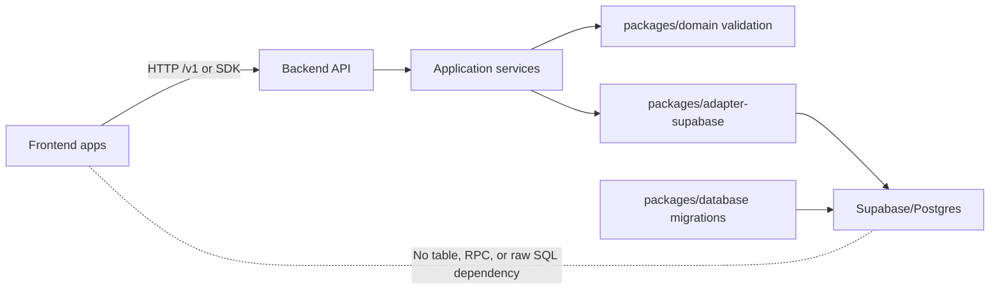

# Phase 5: Database Ownership and Migration Strategy

## Purpose

Make the standalone backend platform the owner of reservation database schema,
migrations, table/RPC names, row mapping, security policies, migration tests,
and atomic persistence behavior.

The future frontend integration contract is the Phase 1 `/v1` API and optional
SDK. Frontend repositories must not copy Supabase SQL, query reservation tables
directly, call Supabase RPCs directly, or understand backend table internals.

## Subagent Mission

Implement a backend-owned database package and Supabase adapter for:

```text
reservation-platform-backend/packages/database
reservation-platform-backend/packages/adapter-supabase
reservation-platform-backend/packages/database/migrations/supabase
```

This phase started as a planning and decomposition pass for future database
implementation subagents. The current workspace now includes a private
`packages/database` scaffold that owns the migration bundle target files without
editing current application code or current SQL files.

## Upstream Dependencies

- Phase 0 boundary inventory.
- Phase 1 platform contract.
- `contracts/api-resource-list.md`
- Phase 2 backend repo shape.
- Phase 3 domain service extraction.
- Phase 4 API layer and SDK contract.

## Allowed Write Scope

Future implementation pass:

- `reservation-platform-backend/packages/database/**`
- `reservation-platform-backend/packages/adapter-supabase/**`
- `reservation-platform-backend/packages/database/migrations/supabase/**`
- Database and adapter tests.
- Backend database setup, bootstrap, migration, and verification docs.

Current planning-only pass:

- `docs/package-refactor/backend-platform-extraction/phase-5-database-ownership-migration-strategy.md`
- New database/migration planning docs under
  `docs/package-refactor/backend-platform-extraction/`

Do not require frontend apps to copy raw SQL manually as the long-term
integration model.

## Boundary Rules

- `packages/domain` remains storage-free. It owns validation, availability,
  lifecycle rules, and domain errors, but it must not import SQL files,
  Supabase clients, table names, RPC names, row types, migration helpers, or RLS
  policy names.
- `packages/database` owns migration organization, schema version metadata,
  migration runner hooks, database test fixtures, repository port definitions
  that are persistence-facing, and database bootstrap documentation.
- `packages/adapter-supabase` owns Supabase clients, table constants, RPC
  constants, row-to-domain and row-to-contract mapping, transaction/RPC calls,
  idempotency persistence, RLS-aware access patterns, and Supabase-specific
  errors.
- `apps/api` calls application services and storage adapters. It exposes
  `/v1` routes and stable API errors, not table/RPC internals.
- Frontend apps call the API or SDK only. They never call
  `public.create_reservation_atomic`, select from `public.bookings`, or insert
  `public.reservation_items`.

## Database Ownership Diagram



## Target Repository Files

```text
reservation-platform-backend/
  packages/
    database/
      package.json
      src/
        index.ts
        migrations.ts
        schema-version.ts
        repository-ports.ts
      migrations/
        README.md
        supabase/
          000001_extensions.sql
          000002_platform_tenant_auth.sql
          000003_reservation_catalog.sql
          000004_reservation_resources.sql
          000005_reservation_bookings.sql
          000006_resource_maintenance.sql
          000007_availability_rules.sql
          000008_atomic_reservation_rpc.sql
          000009_core_rls_policies.sql
          000010_core_security_hardening.sql
          000011_platform_idempotency.sql
          migration-index.json
          optional/
            ai-retrieval/
              000001_knowledge_chunks.sql
              000002_langchain_checkpoints.sql
              000003_match_knowledge_security.sql
      seeds/
        README.md
        development/
          project-play-compat.sql
      tests/
        migration-order.test.ts
        schema-shape.test.ts
        schema-version.test.ts
        rls-policy.test.ts
        atomic-reservation-rpc.test.ts
        bootstrap.test.ts

    adapter-supabase/
      package.json
      src/
        client.ts
        tables.ts
        rpc.ts
        rows.ts
        row-adapters.ts
        repository.ts
        idempotency-store.ts
        tenant-context.ts
        errors.ts
        compatibility.ts
      tests/
        row-adapters.test.ts
        repository.test.ts
        rpc-create-reservation.test.ts
        tenant-isolation.test.ts
        idempotency-store.test.ts
```

File names are target names. Implementation subagents may split migrations more
finely, but the final order must preserve dependency order and keep core,
optional AI retrieval, CMS/content, and analytics/reporting scopes separate.

## Canonical Migration Set

The backend repo should convert the current SQL assets into one canonical
Supabase migration set. Do not preserve duplicated "base", "hardening", and
"package SQL" files as separate runnable sources in the backend repo.

Core migrations should install:

- Extensions required by reservation core, currently `pgcrypto` and `pg_trgm`
  where customer/admin search remains a backend API feature.
- Tenant/auth support, admin role helpers, and schema version metadata.
- Reservation catalog tables: tenant, venue, service, equipment/resource
  catalog if still needed by the platform contract.
- Resource tables: layouts, reservable resources, reservation items, capacity
  policies, and availability rules.
- Booking/reservation tables and indexes.
- Resource maintenance tables and helper functions, renamed or compatibility
  wrapped away from seat-only vocabulary.
- Atomic create reservation RPC.
- Core RLS policies and grants.
- Security hardening for functions, grants, policies, and search paths.

Optional migrations should install only modules explicitly enabled:

- AI retrieval/vector schemas from `knowledge.sql` and `langchain.sql` only if
  Phase 6 keeps structured retrieval as a backend module.
- Payment, notification, reports, or content migrations only if later phases
  explicitly scope those modules.

## Reconciled SQL Inventory

The machine-readable companion inventory lives at
`docs/package-refactor/backend-platform-extraction/database-sql-ownership-inventory.json`.
It is checked by `corepack pnpm run database:verify-sql-ownership`, which fails
when current SQL files under `supabase/` or
`packages/reservations-supabase/sql/` drift from the inventory, when inventory
entries point at missing SQL files, when content/reporting SQL is classified as
core platform, or when the known duplicate atomic RPC pair is no longer
classified as one canonical core asset plus one duplicate core mirror. This is
a source/inventory guardrail only. It does not install migrations, execute SQL,
prove tenant isolation/RLS, prove live seeded backend parity, or complete the
standalone database package extraction.

The companion migration bundle manifest lives at
`docs/package-refactor/backend-platform-extraction/database-migration-bundle-manifest.json`.
It maps those inventoried SQL assets and sections into backend-owned bundle
entries now scaffolded under `packages/database`: ordered core migrations
`000001_extensions.sql` through `000011_platform_idempotency.sql`, optional AI retrieval migrations,
`packages/database/seeds/development/project-play-compat.sql`,
duplicate-only atomic RPC mirror evidence, and explicit exclusions for
non-platform content/reporting SQL. It is checked by
`corepack pnpm run database:verify-migration-bundle`. The package-owned
`packages/database/migrations/supabase/migration-index.json` is generated from
this manifest and the package files. It records the exact core apply order,
optional AI retrieval entries, development seed entries, sha256 checksums, and
byte sizes as a future runner input. The verifier now checks that index for
stale paths, ordering, classification, checksums, and byte sizes, then confirms
the runnable target files exist in this repository while preserving
duplicate-only and excluded accounting rules. This proves package ownership,
manifest-to-file coverage, and deterministic apply-plan integrity only; it does
not execute SQL, create a database, prove RLS or tenant isolation, prove live
seeded backend parity, prove durable idempotency, or complete standalone
database package extraction.

The standalone backend extraction manifest now also includes an explicit direct
move-candidate entry for `packages/database -> packages/database` with database
ownership and partial-extraction status. That entry represents the package
scaffold itself for future repo extraction, while the current root/package SQL
asset entries remain reconciliation/reference inputs mapped by
`database-sql-ownership-inventory.json` and
`database-migration-bundle-manifest.json`. The extraction dry run therefore
plans the package-owned `packages/database` scaffold directly and does not copy
legacy SQL files into additional package paths. This still does not claim
migration execution, live SQL parity, RLS proof, durable idempotency proof, or
an actual separate backend repository population step.

`packages/database` now also exports a package-local TypeScript API for reading
and validating `migrations/supabase/migration-index.json`, selecting
deterministic core, optional AI retrieval, and development seed plans, and
typing a DB-client-neutral `MigrationExecutor` contract that receives ordered
SQL text from a future runner. This completes the local migration runner
interface/readiness portion of Slice 5.1 only. It still does not connect to a
database, apply SQL, record schema versions in a live table, prove RLS, prove
tenant isolation, or prove live seeded backend parity.

| Current asset | Current contents | Backend migration destination | Classification |
| --- | --- | --- | --- |
| `supabase/base-schema.sql` schema sections | `pgcrypto`; `admin_users`; `is_admin`; `services`; `venues`; `equipment`; `bookings`; `service_seat_maintenance`; `resource_layouts`; `reservable_resources`; `reservation_items`; `service_availability_rules`; indexes; `set_updated_at`; `replace_service_seat_maintenance`; update triggers | Split into `000001_extensions.sql`, `000002_platform_tenant_auth.sql`, `000003_reservation_catalog.sql`, `000004_reservation_resources.sql`, `000005_reservation_bookings.sql`, `000006_resource_maintenance.sql`, `000007_availability_rules.sql` | Core platform, after generic tenant/resource naming cleanup |
| `supabase/base-schema.sql` Project Play seed/backfill sections | Project Play venue, Racing Simulator service/resource config, Playstation 5 service/resource config, resource layout rows, resource rows, availability rules, and backfilled `reservation_items` | `seeds/development/project-play-compat.sql` or external fixture data for current app migration smoke tests | Tenant/example data only; do not install as core platform schema |
| `supabase/reservations-rls.sql` | RLS enablement and public/admin policies for services, venues, equipment, bookings, seat maintenance, resource layouts, resources, reservation items, and availability rules | `000009_core_rls_policies.sql` | Core platform, but replace broad public policies with tenant-scoped API/server access where possible |
| `supabase/create-reservation-atomic.sql` | `public.create_reservation_atomic(payload jsonb)` RPC; locks target service row and matching confirmed bookings, validates capacity, resource labels, maintenance, conflicts, then inserts `bookings` and `reservation_items`; grants execute to `service_role` only | `000008_atomic_reservation_rpc.sql` | Core platform; canonical source for atomic booking behavior |
| `packages/reservations-supabase/sql/create-reservation-atomic.sql` | Byte-identical mirror of `supabase/create-reservation-atomic.sql` | No separate migration; use as evidence that package and root RPC converge into `000008_atomic_reservation_rpc.sql` | Duplicate core asset to dedupe |
| `packages/reservations-supabase/sql/README.md` | Documents required reservation tables, RLS assets, RPC payload, stable error codes, service-role-only RPC execution, and locking behavior | Convert into `packages/database/migrations/README.md`, `packages/database/docs/atomic-reservation-rpc.md`, and adapter tests | Core platform documentation source |
| `supabase/security-hardening.sql` reservation/security sections | Repeats admin helper, adds/updates reservation schema pieces, enables RLS, hardens reservation functions/search paths, adds policies, and includes reservation-related grants | Split applicable reservation/security statements into `000010_core_security_hardening.sql`; move Project Play backfills into `seeds/development/project-play-compat.sql`; classify content/reporting/checkpoint/storage policy sections outside core | Mixed: core hardening plus non-core policy/backfill sections |
| `supabase/security-hardening.sql` optional AI hardening | Hardens `public.match_knowledge(...)` search path/security behavior | `optional/ai-retrieval/000003_match_knowledge_security.sql` only when structured AI retrieval is enabled | Optional AI retrieval hardening, not core |
| `supabase/knowledge.sql` | `vector` and `pgcrypto` extensions; `knowledge_chunks`; vector index; `match_knowledge`; public read policy | `optional/ai-retrieval/000001_knowledge_chunks.sql` only when structured AI retrieval is enabled | Optional AI retrieval module, not core |
| `supabase/langchain.sql` | LangChain checkpoint tables and authenticated manage policies | `optional/ai-retrieval/000002_langchain_checkpoints.sql` only when AI chat persistence/checkpointing is enabled | Optional AI chat/retrieval module, not core |
| `supabase/blogs.sql` | `content_posts`, indexes, update trigger, content policies, blog asset storage policies | No core destination; keep with frontend/CMS or a separately scoped `packages/content` module | Non-platform CMS/content |
| `supabase/sales-reports.sql` | `sales_report_documents`, `daily_sales_reports`, indexes, RLS, storage policy for report documents | No core destination; keep with analytics/reporting product or optional reports module if separately scoped | Non-platform analytics/reporting |

## Core Table And Function Direction

The first Supabase migration set may keep legacy table names while the API and
adapter expose generic contracts. However, implementation subagents should
decide early whether to rename tables before the standalone backend is released
or keep legacy names behind adapter constants.

Recommended conservative path:

- Keep existing physical names for first extraction where renaming would add
  risk: `services`, `venues`, `bookings`, `reservable_resources`,
  `resource_layouts`, `reservation_items`, and `service_availability_rules`.
- Treat `service_seat_maintenance` and `seat_label` as legacy physical names
  behind `packages/adapter-supabase/src/tables.ts` and
  `packages/adapter-supabase/src/row-adapters.ts`; expose only
  `resource_maintenance` and `resource_label` through API/SDK.
- Add tenant and venue columns before the backend platform release if they are
  missing from current physical tables. Tenant isolation must not depend on
  service names or frontend-selected display labels.
- Preserve current legacy fields such as `total_seats`, `seats_booked`, and
  `seat_labels` only as compatibility fields until a safe table migration to
  `total_quantity`, `quantity`, and `resource_labels` is implemented.
- Keep `public.create_reservation_atomic(payload jsonb)` as a compatibility RPC
  name only until API and adapter tests are green. A future migration may add a
  generic `public.create_platform_reservation_atomic(payload jsonb)` wrapper,
  but frontends must not depend on either RPC name.

## Atomic Booking/RPC Strategy

Current atomic behavior must be preserved. The canonical backend migration must
install one RPC that:

- Executes inside one database operation.
- Validates payload shape and required customer, service, slot, quantity, and
  source fields.
- Requires tenant and venue context in the RPC payload or adapter call context.
  Because service-role calls can bypass RLS, the RPC and adapter must hard-
  validate that service, venue, resources, maintenance rows, existing
  reservations, reservation items, and idempotency records belong to the same
  tenant before writing.
- Locks the target tenant/service row with `for update`.
- Locks matching confirmed bookings for the requested service and overlapping
  slot interval before conflict checks. The first compatibility migration may
  preserve current exact `booking_date`/`start_time` behavior behind the
  adapter, but the backend platform contract should move toward
  `start_at`/`end_at` interval overlap checks for configurable durations,
  reschedules, rooms, appointments, and events.
- Validates requested resource labels or reservation items against active
  resources.
- Rejects missing resource labels for assigned-resource policies.
- Rejects resources under maintenance through maintenance rows or resource
  status.
- Rejects resource conflicts by checking existing reservation items and legacy
  booking `seat_labels`.
- Calculates capacity from policy, resource capacity, booked quantity, and
  maintenance quantity.
- Returns stable machine-readable error codes that the API maps to Phase 1
  errors.
- Inserts the reservation row and all reservation item rows together or inserts
  nothing.
- Grants execute only to backend service credentials such as `service_role`;
  anon/authenticated frontend clients do not execute it directly.

Future implementation should add idempotency before or around atomic create:

- Store idempotency records in backend-owned tables keyed by tenant, caller,
  route/operation, normalized request hash, and idempotency key.
- `POST /v1/reservations` must require `Idempotency-Key` and replay identical
  successful creates.
- Changed payloads with the same key must return a Phase 1 idempotency error.
- The Supabase adapter should call the RPC only from server-side API code after
  API auth, tenant context, request validation, and domain validation have run.
- Atomic RPC tests must include cross-tenant attempts where service, resource,
  maintenance, reservation, or idempotency inputs belong to another tenant and
  must fail before inserts or updates.

## Tenant Isolation Strategy

Tenant isolation is a core database requirement, not a frontend convention.

Target model:

- Add a durable `tenants` table and `tenant_id` foreign keys to platform-owned
  tables before external frontend proofs:
  `venues`, `services`, `equipment` or resources, `resource_layouts`,
  `reservable_resources`, `bookings`, `reservation_items`,
  `service_availability_rules`, resource maintenance, idempotency records, and
  optional module tables when enabled.
- Use `venue_id` where location-specific scoping matters. `venue_id` should
  always belong to the same `tenant_id`.
- Add composite indexes for common isolation filters, for example
  `(tenant_id, venue_id, service_id)`, `(tenant_id, service_id, booking_date,
  start_time, status)`, and `(tenant_id, id)` for lookup-heavy tables.
- Require tenant context at the API boundary through auth claims, server-to-
  server credentials, headers, or route configuration. The adapter must not
  accept unscoped read/write calls.
- Production upgrade/backfill migrations may create tenant IDs or transform
  existing production rows only for an existing installation that already has
  those rows.
- Development/example seeds may install Project Play compatibility data under
  `seeds/development/project-play-compat.sql` for smoke tests and migration
  demos.
- A clean core platform install must not create Project Play, Racing Simulator,
  Playstation 5, venue copy, or example resources by default.

RLS/security policy direction:

- Prefer service-role backend writes through the API for mutation paths.
- RLS should still be enabled on platform tables to protect accidental direct
  Supabase access and future server-to-server scoped clients.
- Public read policies from current SQL must be narrowed. Public catalog reads
  should be mediated by API routes or tenant-scoped policies, not global
  `using (true)` policies by default.
- Admin policies should use backend-defined role claims or a backend-owned
  admin membership table scoped by tenant, replacing global `public.is_admin()`
  semantics where multi-tenant admin isolation matters.
- Reservation customer reads should be scoped by tenant, caller role, customer
  identity, or service credentials. The database should not expose all
  bookings to authenticated users.
- Optional module tables inherit the same tenant isolation. AI retrieval
  chunks, chat checkpoints, report rows, and content rows must not be globally
  visible unless that module explicitly documents public access.

## Schema Versioning

`packages/database` should own schema version metadata independent of frontend
deployments.

Implementation requirements:

- Add a backend-owned `schema_migrations` or `platform_schema_versions` table
  if the selected migration runner does not provide one.
- Record migration id, checksum, package version, applied timestamp, executor,
  and optional module name.
- Keep migration filenames monotonically ordered and immutable after release.
- Require migration checksum validation in CI and during deployment.
- Publish compatibility notes when a migration changes physical names, RPC
  payloads, RLS semantics, or adapter row mapping.
- Keep API/SDK semantic versions separate from schema migration ids, but record
  the minimum compatible schema version in `GET /v1/metadata`.

## Migration Release Process

1. Add or update domain/API contracts first when behavior changes.
2. Add database migrations in `packages/database/migrations/supabase`.
3. Update `packages/adapter-supabase` table/RPC constants and row adapters.
4. Add migration tests and adapter tests before release.
5. Run migrations against an empty local Supabase/Postgres database.
6. Run migrations against a copy or fixture of current Project Play data to
   verify upgrade behavior.
7. Run API smoke tests that create, read, cancel, and list reservations through
   `/v1`, never through raw SQL.
8. Publish a backend release with migration notes and minimum schema version.
9. Deploy migrations before or alongside API code according to backward
   compatibility:
   - additive migrations can run before API deploy;
   - breaking physical changes require expand/contract migrations, adapter
     compatibility, and explicit deprecation windows.

Do not edit downstream phase files unless a table/RPC/tenant assumption changes.
This Phase 5 plan preserves the Phase 1 `/v1` API and Phase 4 SDK assumptions.

## Local And Development Bootstrap

The backend repo must be able to bootstrap its own schema without this frontend
repository.

Target developer flow:

- `pnpm db:start` or equivalent starts local Supabase/Postgres if the backend
  repo standardizes local Supabase.
- `pnpm db:migrate` applies all core migrations.
- `pnpm db:seed:dev` loads optional development fixtures, including a
  single-tenant Project Play compatibility seed if needed.
- `pnpm db:test` runs migration, RLS, adapter, and atomic RPC tests.
- `pnpm smoke:api` verifies API/SDK flows against the migrated database.

Bootstrap acceptance:

- Empty database installs core schema from backend repo migrations alone.
- Current Project Play-like fixture data can be loaded without frontend SQL
  copy/paste.
- Optional AI retrieval migrations are skipped unless enabled.
- CMS/content and sales/reporting SQL are not installed by default.

## Verification Strategy

Current source-level and package-scaffold guardrails:

- `database-sql-ownership-inventory.json` records every current `.sql` asset
  under `supabase/` and `packages/reservations-supabase/sql/`, with a
  classification, intended backend destination, or exclusion reason.
- `corepack pnpm run database:verify-sql-ownership` checks that inventory
  against the current files and the known duplicate atomic RPC pair. The check
  is deterministic, dependency-free, read-only, and wired into
  `sdk:release-gate` before packing and external fixture smokes.
- This check does not replace the future database tests below. It only prevents
  source inventory drift and accidental promotion of content/reporting SQL into
  core platform ownership.
- `packages/database` is a private workspace package containing the migration
  target scaffold, optional AI retrieval scaffold, development seed scaffold,
  DB-client-neutral migration index/plan helpers plus runner contract types,
  and README ownership notes for backend repository extraction.
- `packages/ai-chat` is a private workspace package containing provider-neutral
  retrieval and checkpoint ports for the optional AI chat module. The chat
  boundary verifier now includes this package, but no retrieval/checkpoint SQL
  adapter has been implemented or executed.
- `database-migration-bundle-manifest.json` records the backend-owned
  migration bundle shape and is checked by
  `corepack pnpm run database:verify-migration-bundle`. The verifier ensures
  every inventoried SQL asset is accounted for, core migration names are unique
  and ordered as `000001` through `000011`, runnable target files exist under
  `packages/database`, optional AI retrieval and development seed targets stay
  in their dedicated folders, non-platform blogs/sales-report SQL stays
  excluded, and the package atomic RPC mirror is duplicate-only evidence for
  the canonical RPC migration. The same command now also checks the generated
  `packages/database/migrations/supabase/migration-index.json` apply-plan
  artifact for path, order, classification, sha256 checksum, and byte-size
  drift. These bundle/inventory manifests and the package-owned index are
  reconciliation/reference inputs for the extraction plan; they do not cause
  the dry run to copy legacy SQL sources into extra `packages/database` files.
  The verifier does not execute SQL or run database tests.

Database tests under `packages/database/tests`:

- Migration order installs cleanly on an empty database.
- Re-running idempotent bootstrap commands is safe where intended.
- Required tables, functions, indexes, triggers, grants, and RLS policies exist.
- Schema version metadata records applied migrations and checksums.
- Tenant columns and indexes exist on all core tables.
- RLS policies reject cross-tenant reads and writes.
- Public/anon clients cannot create reservations or call atomic RPC directly.
- Service-role adapter can call atomic RPC through backend code.
- Current atomic conflict cases return stable error codes:
  `invalid_service`, `invalid_reservation`, `invalid_resource_labels`,
  `missing_resource_labels`, `maintenance_conflict`, `resource_conflict`, and
  `not_enough_capacity` or its canonical API-mapped equivalent
  `insufficient_capacity`.

Supabase adapter tests under `packages/adapter-supabase/tests`:

- Row adapters map legacy physical columns to generic contract/domain fields.
- Table and RPC names are centralized in adapter constants.
- Repository calls always include tenant context.
- `createReservation` calls the atomic RPC server-side and maps success to
  `ReservationResult`.
- RPC error payloads map to Phase 1 `PlatformError` codes.
- Idempotency store replays identical create/cancel/reschedule requests and
  rejects changed payloads with the same key.
- Resource maintenance adapter exposes generic resource maintenance even if
  physical names remain `service_seat_maintenance` temporarily.

API/SDK integration tests:

- External frontend examples create reservations through `/v1/reservations` or
  SDK `createReservation`, not Supabase.
- Availability reflects reservation items and maintenance after atomic create.
- Cancel/reschedule/patch flows preserve tenant isolation and idempotency.
- Optional AI chat confirmation calls the same reservation API/application
  service path as normal frontend booking.

## Implementation Slices For Future Subagents

### Slice 5.1: Database Package Scaffold

Scope:

- Create `packages/database` target structure.
- Add migration README, schema version helper, and migration test harness.
- Define the migration runner interface used by scripts and CI.

Acceptance:

- Completed for scaffold ownership in this workspace: `packages/database`
  exists as a private workspace package with ordered Supabase target files,
  optional AI retrieval target files, development seed target, and README
  ownership notes.
- Completed for package-local runner readiness in this workspace: the package
  exports typed helpers for validating the generated migration index, building
  deterministic core/optional/development seed plans, and defining a
  DB-client-neutral executor contract, with package-local tests against the
  actual index.
- Still pending for executable database implementation: live schema version
  table/helper behavior, live migration application, and live application
  against a database.

### Slice 5.2: Reconcile Core Schema Migrations

Scope:

- Split `supabase/base-schema.sql` into ordered core migrations.
- Pull applicable core hardening statements from `supabase/security-hardening.sql`.
- Exclude content, reporting, checkpoint, and storage policy sections from core.
- Add tenant and venue isolation columns/indexes before external consumer
  release.

Acceptance:

- Empty database installs reservation catalog, resources, bookings,
  reservation items, maintenance, and availability rules from backend migrations.
- CMS/content and analytics/reporting tables are absent from core bootstrap.

### Slice 5.3: Canonical Atomic RPC Migration

Scope:

- Deduplicate root and package `create-reservation-atomic.sql`.
- Install one canonical atomic reservation RPC migration.
- Add tests for locking behavior, capacity, resource conflicts, maintenance
  conflicts, invalid resources, and rollback/no partial writes.

Acceptance:

- Current atomic behavior is preserved.
- Frontend clients cannot execute the RPC directly.
- API/adapter tests call the RPC only through backend service credentials.

### Slice 5.4: Core RLS And Security Policies

Scope:

- Convert `reservations-rls.sql` and applicable `security-hardening.sql`
  sections into tenant-scoped policies.
- Replace global public read assumptions with tenant/API-mediated access.
- Scope admin management to tenant-aware backend auth.

Acceptance:

- Cross-tenant reads/writes fail.
- Admin access is tenant-scoped.
- Catalog visibility is explicit and test-covered.

### Slice 5.5: Supabase Adapter Extraction

Scope:

- Create `packages/adapter-supabase`.
- Centralize table/RPC names.
- Implement row adapters from physical legacy columns to generic platform
  contracts.
- Implement repository methods for catalog, availability inputs,
  reservations, lifecycle, maintenance, and idempotency.

Acceptance:

- Domain package remains storage-free.
- API/application services can use adapter methods without knowing table names.
- Legacy physical names do not leak into API/SDK payloads except documented
  compatibility aliases.

### Slice 5.6: Tenant Bootstrap And Project Play Compatibility Seed

Scope:

- Add a single-tenant Project Play compatibility seed or data migration for
  existing services, RS resources, PS5 capacity bucket, availability rules, and
  legacy reservation items.
- Keep this distinct from core schema migrations when it is environment data.

Acceptance:

- Current data can be upgraded into tenant-scoped rows.
- Racing Simulator and Playstation 5 behavior remain examples/configuration,
  not platform defaults.

### Slice 5.7: Optional AI Retrieval Migrations

Scope:

- Move `knowledge.sql` and `langchain.sql` only into an optional AI retrieval
  migration folder if Phase 6 scopes structured retrieval.
- Add tenant scoping to knowledge chunks and checkpoint state.
- Keep Project Play `data/knowledge.md` and editorial content outside core.

Acceptance:

- Core bootstrap skips AI retrieval by default.
- AI retrieval migrations can be enabled independently and remain tenant-scoped.

### Slice 5.8: End-To-End Database Verification

Scope:

- Add local bootstrap, migration, seed, and smoke scripts.
- Run API/SDK reservation flows against the migrated database.
- Verify empty install and fixture upgrade paths.

Acceptance:

- Backend repo can bootstrap or migrate its own schema.
- External frontend examples work without raw Supabase access.
- Atomic booking behavior, tenant isolation, and RLS tests pass.

## Deliverables

- Database ownership and implementation plan: this Phase 5 file.
- Migration strategy: canonical migration set, release process, bootstrap, and
  verification sections in this file.
- Reconciled inventory of root Supabase SQL and
  `packages/reservations-supabase/sql/**` assets with backend destination or
  non-platform classification, now also captured in
  `database-sql-ownership-inventory.json` and checked by
  `database:verify-sql-ownership`.
- Machine-readable migration bundle manifest,
  `database-migration-bundle-manifest.json`, checked by
  `database:verify-migration-bundle`, covering the ordered core migration plan,
  optional AI retrieval, development seed/compat target, duplicate-only atomic
  RPC mirror, excluded non-platform SQL, and existence of runnable target files
  without executing migrations.
- Package-owned generated migration apply index,
  `packages/database/migrations/supabase/migration-index.json`, checked by
  `database:verify-migration-bundle`, covering stable repo-relative paths,
  exact core order, optional AI and development seed classification, sha256
  checksums, and byte sizes.
- Private `packages/database` scaffold containing package-owned migration
  bundle artifacts for the ordered core migrations, optional AI retrieval
  migrations, and development seed target.
- Private `packages/ai-chat` scaffold containing provider-neutral optional AI
  chat retrieval/checkpoint interfaces that can be wired to the optional AI
  retrieval migrations in a later implementation slice.
- Supabase adapter ownership notes for `packages/adapter-supabase`.
- Atomic booking/RPC strategy.
- Tenant isolation notes.

## Acceptance Criteria

- External frontends do not need to understand Supabase table internals.
- Backend repo can bootstrap or migrate its own schema.
- Backend migration plan accounts for reservation/platform-relevant root
  Supabase SQL assets and `packages/reservations-supabase/sql/**` assets as one
  canonical migration set, with current source inventory drift guarded by
  `database:verify-sql-ownership` and bundle-shape drift guarded by
  `database:verify-migration-bundle`, including the package-owned migration
  index checksum/order check.
- CMS/content, analytics/reporting, and optional AI retrieval schemas are
  classified separately instead of being pulled into core reservation
  migrations by default.
- Current atomic booking behavior is preserved.
- Domain package storage-free boundary is preserved.
- Database and adapter packages own SQL, table/RPC names, row mapping, and
  migration tests.
- Tenant isolation, RLS/security policy approach, schema versioning, migration
  release process, local/dev bootstrap, and verification strategy are defined.

## Downstream Updates Required

No downstream phase updates are required from this planning pass because it
preserves:

- the Phase 1 `/v1` API and SDK integration model;
- Phase 3's storage-free domain boundary;
- Phase 4's API/application-service/storage-adapter persistence direction;
- Phase 6's optional AI chat and structured retrieval module boundary.

If future implementation renames physical table names, changes
`create_reservation_atomic`, changes tenant context requirements, or makes AI
retrieval a required core module, update Phases 6 through 9 plus the API/SDK
contract docs before release.
