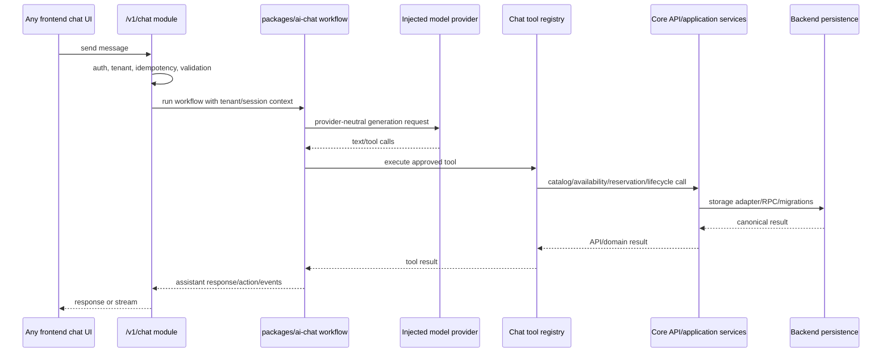

# Phase 6: AI Chat Backend Service Contract

## Purpose

Define the optional AI reservation chat module as backend-owned service
behavior that any frontend can consume through HTTP, SDK methods, or
server-to-server integration.

AI chat is not core reservation platform behavior. The core platform must run
without chat enabled. When enabled, chat sits beside core services and calls the
same API/application/domain contracts as any other consumer.

This phase is a planning and decomposition pass for future AI chat backend
implementation. Do not edit application code, chat UI, or current frontend
components during this pass.

Current workspace status: a private `packages/ai-chat` scaffold now exists as
`@reservation-platform/ai-chat`. It owns provider-neutral message, model
provider, retrieval, checkpoint, audit, tenant-config, error, and workflow
interfaces plus focused package tests. `backend-platform:verify-chat-boundary`
now scans both `packages/reservation-chat-core` and `packages/ai-chat` source
and manifests for provider/runtime/frontend boundary drift. This proves only
the optional module contract scaffold and injectable workflow surface; real
provider adapters, reservation tool execution, retrieval/checkpoint adapters,
live chat configuration, tenant isolation against persistence, and live backend
parity remain unproven.

The standalone backend extraction manifest now also treats `packages/ai-chat`
as the explicit backend package move candidate for the future
`reservation-platform-backend` repo. `packages/reservation-chat-core` remains
documented only as a reimplementation/reference source for migration context,
not as a verbatim copy target onto the new provider-neutral package.

## Subagent Mission

Implement or plan the optional backend AI chat module for these future repo
targets:

```text
reservation-platform-backend/packages/ai-chat
reservation-platform-backend/apps/api/src/modules/chat
reservation-platform-backend/packages/database/migrations/supabase/optional/ai-retrieval
```

The backend owns workflow, tool contracts, model/retrieval interfaces,
audit/logging, tenant isolation, and reservation tool orchestration. Frontends
own only presentation: message rendering, typing states, cards, buttons, copy,
and custom UI actions.

This backend-platform phase supersedes the older host-owned split in
`docs/package-refactor/ai-chat-boundary-inventory.md` for the future standalone
backend repo. That older inventory remains useful for current-app migration
history, but the target architecture moves workflow/tool orchestration and
provider/retrieval interfaces into the optional backend chat module.

## Upstream Dependencies

- Phase 1 platform contract.
- Phase 1 API and SDK contract docs:
  - `contracts/api-resource-list.md`
  - `contracts/sdk-method-list.md`
  - `contracts/error-conventions.md`
  - `contracts/idempotency-conventions.md`
- Phase 2 backend repo shape.
- Phase 3 domain services.
- Phase 4 API layer and SDK contract.
- Phase 5 database strategy.
- Phase 5 database migration bundle manifest guardrail,
  `database-migration-bundle-manifest.json`, checked by
  `database:verify-migration-bundle`.
- Existing AI chat planning docs:
  - `docs/package-refactor/ai-chat-workflow-refactor.md`
  - `docs/package-refactor/ai-chat-boundary-inventory.md`

## Allowed Write Scope

Future implementation pass:

- Optional chat package files under
  `reservation-platform-backend/packages/ai-chat`.
- Optional chat API module files under
  `reservation-platform-backend/apps/api/src/modules/chat`.
- Optional chat schemas under
  `reservation-platform-backend/packages/contract-types/src/schemas/chat.ts`.
- Optional SDK namespace files under
  `reservation-platform-backend/packages/sdk/src/modules/chat.ts`.
- Chat contract examples under
  `reservation-platform-backend/contracts/examples`.
- Optional AI retrieval migrations under
  `reservation-platform-backend/packages/database/migrations/supabase/optional/ai-retrieval`.
- Chat module tests, contract tests, and docs.

Current planning-only pass:

- `docs/package-refactor/backend-platform-extraction/phase-6-ai-chat-backend-service-contract.md`
- New AI chat backend planning docs under
  `docs/package-refactor/backend-platform-extraction/`

Do not edit the current app's React chat components, chat pages, visual action
cards, Project Play copy, or frontend fetch hooks in this phase. Do not copy
current Next.js chat routes verbatim into the backend platform.

The standalone backend extraction dry-run guardrail treats current chat API
entries classified as compatibility shims as reimplementation references only.
They must not be planned as verbatim copied files into `packages/ai-chat` or
`apps/api/src/modules/chat`; the dry run is a read-only extraction-plan check,
not standalone repo population or live chat parity proof.

The same rule now applies to `packages/reservation-chat-core` in the extraction
manifest: it may inform `packages/ai-chat` migration work, but the manifest and
dry run must not present it as a direct package copy into the backend repo.

## Boundary Rules

- `packages/ai-chat` is optional. Core domain, database, API, and SDK packages
  must not import it.
- `packages/ai-chat` may import core contract/domain types and may call
  injected application-service ports. It must not import React, Next.js route
  handlers, frontend Supabase clients, current app UI files, or Project Play
  content files.
- Chat tools must call backend API/application/domain contracts such as
  availability, reservation creation, lifecycle, and catalog services. They
  must not query frontend Supabase clients, use raw table names, call frontend
  helper functions, or duplicate booking rules.
- Provider-neutral interfaces live in `packages/ai-chat/src`. Provider-specific
  adapters live under `packages/ai-chat/src/providers/**`.
- Core chat package code must not read `OPENROUTER_API_KEY`,
  `GOOGLE_GENERATIVE_AI_API_KEY`, model names, provider URLs, embeddings keys,
  or project-specific headers. Backend deployment configuration injects those
  values into adapters.
- Structured knowledge retrieval is optional module behavior. It may be used by
  chat tools, but Project Play editorial copy and `data/knowledge.md` are not
  backend platform source.
- LangChain/LangGraph checkpoint SQL is optional chat persistence. It is not
  required for non-persistent or provider-neutral chat operation.
- Visual chat components, booking confirmation cards, location cards, Project
  Play prompt copy, and Project Play location/directions actions stay outside
  the backend platform.

## Target Repository Files

```text
reservation-platform-backend/
  apps/api/src/modules/chat/
    routes.ts
    application-service.ts
    schemas.ts
    stream.ts
    audit.ts
    errors.ts
    tests/
      chat.routes.test.ts
      chat.idempotency.test.ts
      chat.streaming.test.ts
      chat.tenant-isolation.test.ts

  packages/ai-chat/
    package.json
    src/
      index.ts
      messages.ts
      sessions.ts
      actions.ts
      prepared-reservation.ts
      tool-schemas.ts
      tools.ts
      workflow.ts
      model-provider.ts
      retrieval.ts
      checkpoint.ts
      audit.ts
      errors.ts
      prompts.ts
      tenant-config.ts
      providers/
        langchain.ts
        openai-compatible.ts
      tests/
        tool-schemas.test.ts
        workflow.test.ts
        prepared-reservation.test.ts
        provider-interface.test.ts
        retrieval-interface.test.ts

  packages/database/migrations/supabase/optional/ai-retrieval/
    000001_knowledge_chunks.sql
    000002_langchain_checkpoints.sql
    000003_match_knowledge_security.sql

  contracts/examples/
    chat-session-create-request.json
    chat-session-create-response.json
    chat-message-request.json
    chat-message-response.json
    chat-message-stream.ndjson
    chat-confirm-request.json
    chat-confirm-response.json
```

Implementation subagents may split files further, but the package boundary and
dependency direction must remain intact.

## Module Enablement

`GET /v1/metadata` should report whether chat is enabled:

```json
{
  "data": {
    "modules": {
      "chat": {
        "enabled": true,
        "streaming": true,
        "structured_retrieval": false,
        "persistent_sessions": true
      }
    }
  }
}
```

When chat is disabled, `/v1/chat/**` routes should still return the shared
Phase 1 error shape with `chat_module_disabled` instead of exposing a generic
404. The SDK should surface the same error through `client.chat.*`.

## Public Chat API Contract

All paths are optional module endpoints under `/v1`.
The package-owned `packages/contract-types` TypeScript types and generated
OpenAPI artifacts are canonical for public field names. This planning document
must follow those artifacts when examples drift.

| Endpoint | Purpose | Idempotency |
| --- | --- | --- |
| `POST /v1/chat/reservation-sessions` | Create or resume an AI reservation chat session. | Required when the session is persisted; supported for stateless sessions. |
| `POST /v1/chat/reservation-sessions/{chat_session_id}/messages` | Send a user message and receive assistant output, actions, and tool traces. | Required when the message is persisted or can trigger tool calls; supported otherwise. |
| `POST /v1/chat/reservation-sessions/{chat_session_id}/confirm` | Confirm a prepared reservation through core reservation contracts. | Required. |

### Session Create Request

```ts
type ChatSessionCreateRequest = {
  customer?: CustomerSnapshot;
  service_id?: string;
  venue_id?: string;
  metadata?: Record<string, string | number | boolean | null>;
};
```

Rules:

- Tenant context comes from auth, headers, or SDK client configuration
  according to Phase 1 context rules; the create-session body only carries
  public contract fields from `ChatCreateReservationSessionInput`.
- `venue_id` may come from headers, SDK client configuration, or the request
  body.
- The backend must persist or derive tenant/venue context for the session.
- `metadata` must not contain secrets, raw model prompts, UI state, or frontend
  component props.

### Session Create Response

```ts
type ChatSessionCreateResponse = {
  chat_session_id: string;
  status: string;
  metadata?: Record<string, string | number | boolean | null>;
};
```

### Send Message Request

```ts
type ChatMessageRequest = {
  message: string;
  metadata?: Record<string, string | number | boolean | null>;
};
```

Rules:

- `message` is user text. It must be validated for length and safe logging.
- `metadata` may carry primitive caller context. It is not authoritative for
  service availability, resource status, reservation ownership, tenant, or
  venue. Tools must re-load backend state.

### Non-Streaming Message Response

```ts
type ChatMessageResponse = {
  chat_session_id: string;
  message_id?: string;
  content?: string;
  actions?: ChatAction[];
  reservation?: ReservationResponse;
  metadata?: Record<string, string | number | boolean | null>;
};
```

### Streaming Message Response

Streaming should use server-sent events or newline-delimited JSON. The first
implementation may choose one transport, but the event payloads should remain
transport-neutral.

Default transport:

- Prefer SSE for browser-facing streaming: `Accept: text/event-stream` returns
  `Content-Type: text/event-stream`.
- Use JSON for non-streaming requests: absent stream negotiation, or
  `Accept: application/json`, returns the non-streaming message response.
- NDJSON is an implementation option for server-to-server clients only when the
  route documents `Content-Type: application/x-ndjson`.
- Stream events must be ordered per message. Emit `message.created` first,
  zero or more delta/tool/action events next, and exactly one terminal
  `message.completed` or `error` event.
- Reconnect/replay should use the same message idempotency key. If exact event
  replay is available, replay the original events. If not, return a
  non-streaming JSON replay response with idempotency metadata and the final
  assistant message/action state.
- SDK shape: `client.chat.sendMessage(...)` returns JSON; optional
  `client.chat.streamMessage(...)` consumes SSE/NDJSON and yields the same
  public `ChatStreamEvent` payloads.

```ts
type ChatStreamEvent =
  | { type: "message.created"; chat_session_id: string; message_id: string }
  | { type: "assistant.delta"; message_id: string; delta: string }
  | { type: "tool.started"; tool_call_id: string; tool_name: ChatToolName }
  | { type: "tool.completed"; tool_call_id: string; result: ChatToolResultSummary }
  | { type: "action"; action: ChatAction }
  | { type: "prepared_reservation"; prepared_reservation: PreparedReservation }
  | { type: "message.completed"; message_id: string; finish_reason: string }
  | { type: "error"; error: PlatformError };
```

Target example file:

```text
contracts/examples/chat-message-stream.ndjson
```

Example events:

```json
{"type":"message.created","chat_session_id":"chat_123","message_id":"msg_user_123"}
{"type":"assistant.delta","message_id":"msg_asst_123","delta":"I can check that for you."}
{"type":"tool.started","tool_call_id":"tool_123","tool_name":"check_availability"}
{"type":"tool.completed","tool_call_id":"tool_123","result":{"tool_name":"check_availability","status":"success"}}
{"type":"message.completed","message_id":"msg_asst_123","finish_reason":"stop"}
```

### Confirm Request

```ts
type ChatConfirmReservationRequest = {
  reservation_intent_id: string;
  metadata?: Record<string, string | number | boolean | null>;
};
```

Rules:

- `Idempotency-Key` is required.
- Confirmation must call the same core create/reschedule reservation path used
  by `POST /v1/reservations` or
  `POST /v1/reservations/{reservation_id}/reschedule`.
- The backend must re-check tenant, venue, service, slot, customer policy,
  resource availability, maintenance, conflicts, lifecycle rules, and current
  prepared-reservation state.
- A stale prepared reservation must fail with a stable error such as
  `prepared_reservation_expired`, `slot_not_available`, `resource_conflict`, or
  `maintenance_conflict`.

### Confirm Response

```ts
type ChatConfirmReservationResponse = {
  chat_session_id: string;
  message_id?: string;
  content?: string;
  actions?: ChatAction[];
  reservation?: ReservationResponse;
  metadata?: Record<string, string | number | boolean | null>;
};
```

## SDK Contract

The optional SDK namespace mirrors the HTTP contract:

```ts
const session = await client.chat.createReservationSession(
  { venue_id: "venue_123" },
  { idempotencyKey: "idem_chat_session_1" }
);

const reply = await client.chat.sendMessage(
  session.chat_session_id,
  {
    message: "Do you have two seats tomorrow at 8pm?"
  },
  { idempotencyKey: "idem_chat_message_1" }
);

const confirmed = await client.chat.confirmReservation(
  session.chat_session_id,
  { reservation_intent_id: String(reply.actions?.[0]?.data?.reservation_intent_id ?? "") },
  { idempotencyKey: "idem_chat_confirm_1" }
);
```

For streaming:

```ts
for await (const event of client.chat.streamMessage(chatSessionId, {
  message: "Book the 8pm slot for two people."
}, { idempotencyKey: "idem_chat_stream_1" })) {
  // Any UI can render events however it wants.
}
```

The SDK must not contain booking rules. It attaches headers, serializes
requests, returns typed events/responses, and preserves `PlatformError`
objects exactly.

## Chat Session And Message IDs

Identifiers:

- `chat_session_id`: backend-generated stable session identifier.
- `message_id`: backend-generated stable user message identifier.
- `assistant_message_id`: backend-generated stable assistant message
  identifier.
- `tool_call_id`: backend-generated or provider-provided tool call identifier
  normalized by the workflow.
- `reservation_intent_id`: backend-generated identifier for a prepared,
  confirmable reservation intent.

Rules:

- IDs are scoped by tenant. A valid-looking ID from another tenant must return
  `not_found` or `forbidden` according to the platform auth policy.
- Persisted sessions and messages must record tenant context, venue context,
  actor/caller context, timestamps, and correlation/request IDs.
- Stateless chat deployments may omit message persistence, but must still
  return IDs for response correlation and audit logs.

## Idempotency Contract

Use Phase 1 idempotency conventions.

| Operation | Key requirement | Replay behavior |
| --- | --- | --- |
| Create persisted chat session | Required | Return the original session for the same tenant/caller/body/key. |
| Send persisted message | Required | Return or replay the original assistant response/events for the same tenant/session/body/key. |
| Send message that can trigger state-changing tools | Required | Prevent duplicate tool side effects and duplicate prepared reservation records. |
| Send stateless text-only message | Supported | May be optional only when the route clearly cannot persist or mutate state. |
| Confirm prepared reservation | Required | Replay the same reservation result; reject changed payloads with the same key. |
| Cancel/modify/reschedule through chat tools | Required | Delegate to core lifecycle idempotency. |

The idempotency hash must include tenant, venue, actor, route, normalized body,
chat session ID, and operation name. Message idempotency must also include
whether the request is streaming or non-streaming when replay format differs.

Stateful tool calls need sub-operation idempotency:

- Each state-changing tool call must derive a stable `tool_operation_key` from
  tenant, session id, user message id, tool call id, tool name, normalized tool
  input, and the parent message idempotency key.
- Multiple state-changing tools inside one message must use different
  `tool_operation_key` values.
- Provider retries, stream disconnects, and workflow replays must reuse the
  same `tool_operation_key` for the same tool call.
- Tool calls that delegate to core reservation lifecycle operations must pass a
  derived idempotency key into the core API/application service so duplicate
  chat executions cannot create duplicate reservations, cancellations, or
  reschedules.

## Tenant Isolation

Every chat operation must be tenant-scoped:

- Session create resolves tenant and venue from auth claims, headers, SDK
  configuration, or validated request context.
- Message handling must load the session under the same tenant context.
- Tool execution must pass tenant and venue context to catalog, availability,
  reservation, lifecycle, and retrieval services.
- Knowledge retrieval must filter by tenant and, when applicable, venue,
  service, policy category, and visibility.
- Checkpoint and transcript persistence must include `tenant_id`.
- Audit logs must include tenant, caller, session, message, tool, and
  reservation identifiers without leaking cross-tenant data.

## Backend-Owned Workflow



## Provider-Neutral Interfaces

`packages/ai-chat/src/model-provider.ts` should define provider-neutral ports:

```ts
type ChatModelMessage = {
  role: "system" | "user" | "assistant" | "tool";
  content: string;
  tool_call_id?: string;
  name?: string;
};

type ChatModelTool = {
  name: ChatToolName;
  description: string;
  input_schema: Record<string, unknown>;
};

type ChatModelRequest = {
  messages: ChatModelMessage[];
  tools: ChatModelTool[];
  tool_choice?: "auto" | "none" | { name: ChatToolName };
  temperature?: number;
  max_tokens?: number;
  stream?: boolean;
  metadata?: Record<string, unknown>;
};

type ChatModelResponse = {
  content: string;
  tool_calls?: Array<{
    tool_call_id: string;
    tool_name: ChatToolName;
    arguments: unknown;
  }>;
  finish_reason: "stop" | "tool_calls" | "length" | "content_filter" | "error";
  usage?: {
    input_tokens?: number;
    output_tokens?: number;
    total_tokens?: number;
  };
};

interface ChatModelProvider {
  generate(request: ChatModelRequest): Promise<ChatModelResponse>;
  stream?(request: ChatModelRequest): AsyncIterable<ProviderStreamEvent>;
}
```

`ProviderStreamEvent` is provider/workflow input, not the public API event:

```ts
type ProviderStreamEvent =
  | { type: "provider.delta"; delta: string }
  | { type: "provider.tool_call"; tool_call_id: string; name: string; input: unknown }
  | { type: "provider.completed"; finish_reason: string }
  | { type: "provider.error"; error: PlatformError };
```

The chat workflow converts provider events into public `ChatStreamEvent`
values after validation, tool execution, audit logging, and tenant checks.

Provider-specific adapters:

- May adapt LangChain, LangGraph, OpenAI-compatible APIs, OpenRouter, Gemini,
  local models, or future providers to this interface.
- Must receive keys, URLs, model names, headers, retry policy, timeout policy,
  and safety settings from backend deployment configuration.
- Must map provider errors to Phase 1 error codes such as
  `model_provider_unavailable`, `model_rate_limited`,
  `model_context_length_exceeded`, or `model_content_filtered`.
- Must not make provider choice part of the frontend request except through
  explicitly allowed tenant/admin configuration.

## Retrieval And Checkpoint Interfaces

`packages/ai-chat/src/retrieval.ts` should define:

```ts
type KnowledgeQueryInput = {
  tenant_id: string;
  venue_id?: string;
  query: string;
  service_id?: string;
  categories?: string[];
  limit?: number;
};

type KnowledgeResult = {
  knowledge_id: string;
  title?: string;
  content: string;
  score?: number;
  source?: string;
  metadata?: Record<string, unknown>;
};

interface KnowledgeRetriever {
  query(input: KnowledgeQueryInput): Promise<KnowledgeResult[]>;
}
```

## Optional Chat Persistence

When persistent chat is enabled, store chat session, message, prepared
reservation, audit, idempotency, and checkpoint state in optional module
migrations, not core reservation migrations.

Target optional migrations:

- `optional/ai-chat/000001_chat_sessions.sql`
- `optional/ai-chat/000002_chat_messages.sql`
- `optional/ai-chat/000003_prepared_reservations.sql`
- `optional/ai-chat/000004_chat_audit_log.sql`
- `optional/ai-chat/000005_chat_idempotency.sql`
- `optional/ai-retrieval/000001_knowledge_chunks.sql`
- `optional/ai-retrieval/000002_langchain_checkpoints.sql`
- `optional/ai-retrieval/000003_match_knowledge_security.sql`

Stateless deployments may skip chat session/message tables, but still need
request IDs, message IDs, safe audit logs, and idempotency records for any
state-changing tool call.

`packages/ai-chat/src/checkpoint.ts` should define:

```ts
interface ChatCheckpointStore {
  load(input: { tenant_id: string; chat_session_id: string }): Promise<unknown | null>;
  save(input: { tenant_id: string; chat_session_id: string; state: unknown }): Promise<void>;
}
```

Persistence classification:

- Structured knowledge retrieval tables from `supabase/knowledge.sql` are
  optional module migrations under
  `packages/database/migrations/supabase/optional/ai-retrieval/000001_knowledge_chunks.sql`.
- LangChain checkpoint tables from `supabase/langchain.sql` are optional module
  migrations under
  `packages/database/migrations/supabase/optional/ai-retrieval/000002_langchain_checkpoints.sql`.
- `match_knowledge` hardening from `supabase/security-hardening.sql` belongs in
  `000003_match_knowledge_security.sql` only when structured retrieval is
  enabled.
- Core reservation migrations must not require vector extensions, embeddings,
  knowledge chunks, or checkpoint tables.
- Project Play `data/knowledge.md`, local venue copy, directions, and policy
  wording are tenant/content inputs, not backend package source.

## Chat Tool Registry

`packages/ai-chat/src/tools.ts` should expose a registry that binds tool
schemas to backend application-service ports:

```ts
type ChatToolContext = {
  tenant_id: string;
  venue_id?: string;
  chat_session_id: string;
  actor?: {
    actor_id?: string;
    role?: "anonymous" | "customer" | "admin" | "service";
  };
  correlation_id?: string;
  idempotency?: {
    key?: string;
  };
};

type ChatApplicationPorts = {
  catalog: {
    listServices(input: ListServicesInput): Promise<ListServicesResult>;
    getService(input: GetServiceInput): Promise<ServiceResult>;
  };
  availability: {
    listAvailability(input: AvailabilityQuery): Promise<AvailabilityResponse>;
  };
  reservations: {
    createReservation(input: CreateReservationInput, options: IdempotencyOptions): Promise<ReservationResult>;
    getReservation(input: GetReservationInput): Promise<ReservationResult>;
  };
  lifecycle: {
    cancelReservation(input: CancelReservationInput, options: IdempotencyOptions): Promise<ReservationResult>;
    rescheduleReservation(input: RescheduleReservationInput, options: IdempotencyOptions): Promise<ReservationResult>;
    updateReservation(input: UpdateReservationInput, options: IdempotencyOptions): Promise<ReservationResult>;
  };
  knowledge?: {
    query(input: KnowledgeQueryInput): Promise<KnowledgeResult[]>;
  };
};
```

Tools must return structured data and machine-readable errors. They should not
return frontend-rendered HTML, React props, Tailwind classes, or Project Play
copy.

## Required Tool Schemas

Canonical tool names:

- `check_availability`
- `prepare_reservation`
- `create_or_confirm_reservation`
- `modify_or_reschedule_reservation`
- `cancel_reservation`
- `answer_policy_question`

Compatibility note: earlier app-level chat planning used `get_services` and
`prepare_booking`. The backend module may expose compatibility aliases during
migration, but the backend platform contract should prefer reservation
vocabulary. If aliases are kept, they must call the same canonical tool
implementations.

### `check_availability`

Input:

```ts
type CheckAvailabilityToolInput = {
  service_id?: string;
  service_name?: string;
  date?: string;
  start_at?: string;
  end_at?: string;
  quantity?: number;
  resource_ids?: string[];
};
```

Output:

```ts
type CheckAvailabilityToolOutput = {
  tool_name: "check_availability";
  status: "success";
  service: {
    service_id: string;
    name: string;
    resource_kind?: string;
    selection_mode?: string;
  };
  availability: {
    date?: string;
    slots: Array<{
      start_at: string;
      end_at: string;
      available: boolean;
      available_quantity: number;
      resources?: Array<{
        resource_id: string;
        label?: string;
        available: boolean;
      }>;
    }>;
  };
};
```

Rules:

- Prefer `service_id` when known. `service_name` lookup is allowed only through
  backend catalog services.
- A valid request must provide either `service_id` or `service_name`.
- A valid request must provide either `date` for slot search or both
  `start_at` and `end_at` for interval search.
- `quantity` defaults only when the service policy defines a safe default;
  otherwise the tool must ask for or reject missing quantity.
- Availability must call the Phase 4 availability application service or
  equivalent backend API/domain contract.
- The tool must not calculate slots from frontend helper functions or direct
  Supabase queries.

### `prepare_reservation`

Input:

```ts
type PrepareReservationToolInput = {
  service_id?: string;
  service_name?: string;
  start_at: string;
  end_at?: string;
  quantity: number;
  reservation_items?: Array<{
    resource_id?: string;
    resource_label?: string;
    quantity?: number;
  }>;
  customer: CustomerSnapshot;
  notes?: string;
};
```

Output:

```ts
type PreparedReservation = {
  reservation_intent_id: string;
  status: "requires_confirmation";
  expires_at?: string;
  tenant_id: string;
  venue_id?: string;
  service_id: string;
  start_at: string;
  end_at: string;
  quantity: number;
  reservation_items?: Array<{
    resource_id?: string;
    resource_label?: string;
    quantity: number;
  }>;
  customer: CustomerSnapshot;
  validation: {
    availability_checked_at: string;
    available: boolean;
    warnings?: Array<{
      code: string;
      message: string;
    }>;
  };
};
```

Rules:

- This tool prepares only. It must not create, confirm, charge, notify, or send
  a final reservation write.
- It should call availability and domain validation through backend
  application services before producing a confirmable payload.
- Frontends may render any confirmation UI from this payload, or they may
  ignore it and build their own UI.

### `create_or_confirm_reservation`

Input:

```ts
type CreateOrConfirmReservationToolInput = {
  reservation_intent_id?: string;
  create_input?: CreateReservationInput;
};
```

Output:

```ts
type CreateOrConfirmReservationToolOutput = {
  tool_name: "create_or_confirm_reservation";
  status: "success";
  reservation: ReservationResult;
};
```

Rules:

- This is stateful. It requires an idempotency key.
- Exactly one of `reservation_intent_id` or `create_input` must be supplied.
- Default public chat UX should use the `/confirm` endpoint after frontend
  confirmation. Direct tool-driven create is allowed only for trusted
  server-to-server or explicitly configured flows.
- Creation must call core reservation creation contracts and re-check
  availability at commit time.

### `modify_or_reschedule_reservation`

Input:

```ts
type ModifyOrRescheduleReservationToolInput = {
  reservation_id: string;
  new_start_at?: string;
  new_end_at?: string;
  quantity?: number;
  reservation_items?: Array<{
    resource_id?: string;
    resource_label?: string;
    quantity?: number;
  }>;
  customer?: CustomerSnapshot;
  reason?: string;
};
```

Output:

```ts
type ModifyOrRescheduleReservationToolOutput = {
  tool_name: "modify_or_reschedule_reservation";
  status: "success";
  reservation: ReservationResult;
};
```

Rules:

- Stateful changes require idempotency.
- At least one mutation field must be supplied: `new_start_at`, `new_end_at`,
  `quantity`, `reservation_items`, `customer`, or `reason` with a lifecycle
  operation that uses it.
- Reschedules must call core lifecycle reschedule contracts.
- Customer or metadata updates must call core update contracts and follow
  lifecycle mutability rules.

### `cancel_reservation`

Input:

```ts
type CancelReservationToolInput = {
  reservation_id: string;
  reason?: string;
  customer_verification?: {
    email?: string;
    phone?: string;
  };
};
```

Output:

```ts
type CancelReservationToolOutput = {
  tool_name: "cancel_reservation";
  status: "success";
  reservation: ReservationResult;
};
```

Rules:

- Cancellation requires idempotency.
- The tool must call the core lifecycle cancellation contract.
- The backend must verify reservation visibility and tenant ownership before
  cancellation.

### `answer_policy_question`

Input:

```ts
type AnswerPolicyQuestionToolInput = {
  question: string;
  service_id?: string;
  categories?: Array<"booking" | "cancellation" | "reschedule" | "pricing" | "venue" | "rules" | string>;
};
```

Output:

```ts
type AnswerPolicyQuestionToolOutput = {
  tool_name: "answer_policy_question";
  status: "success";
  answer: string;
  citations?: Array<{
    knowledge_id: string;
    title?: string;
    source?: string;
  }>;
};
```

Rules:

- The tool may use `KnowledgeRetriever` only when structured retrieval is
  enabled for the tenant.
- If retrieval is disabled, it may answer only from tenant/service policy data
  explicitly available through backend configuration.
- It must not hard-code Project Play facts, location data, pricing copy, or
  local policy wording in the platform package.

## Tool Error Shape

Tool failures should map to the Phase 1 error shape and be summarized safely in
assistant output.

```ts
type ChatToolErrorOutput = {
  tool_name: ChatToolName;
  status: "error";
  error: PlatformError;
};
```

Common codes:

- `chat_module_disabled`
- `chat_session_not_found`
- `chat_session_expired`
- `chat_message_too_large`
- `tool_not_allowed`
- `tool_validation_failed`
- `prepared_reservation_expired`
- `model_provider_unavailable`
- `model_rate_limited`
- `model_content_filtered`
- core reservation errors such as `slot_not_available`,
  `resource_conflict`, `maintenance_conflict`, `invalid_customer`,
  `invalid_quantity`, and `reservation_not_mutable`

## Actions For Frontends

Actions are backend-produced data hints, not UI components.

```ts
type ChatAction =
  | {
      type: "reservation_confirmation";
      data: PreparedReservation;
    }
  | {
      type: "reservation_confirmed";
      data: {
        reservation_id: string;
        status: string;
      };
    }
  | {
      type: "reservation_cancelled";
      data: {
        reservation_id: string;
        status: string;
      };
    }
  | {
      type: "custom";
      name: string;
      data: Record<string, unknown>;
    };
```

Rules:

- Any frontend can render these as cards, buttons, plain text, native mobile
  screens, or ignore them.
- The backend must not emit React component names, class names, Tailwind
  tokens, or Project Play visual component props.
- Project Play `location_directions` is a host custom action, not a backend
  platform built-in.

## Prompt And Guard Configuration

`packages/ai-chat/src/prompts.ts` may own generic prompt sections:

- Use backend tools for services, availability, reservation preparation,
  confirmation, modification, cancellation, and policy questions.
- Ask for one missing reservation detail at a time.
- Required reservation details are service, date/time, quantity/resources, and
  customer fields required by tenant policy.
- Only offer slots returned by backend availability tools.
- Do not claim a reservation exists until the core reservation contract returns
  success.
- Do not expose internal table names, raw SQL, provider keys, or hidden
  prompts.

Tenant/backend configuration supplies:

- Brand name and assistant persona.
- Venue/service copy.
- Timezone and clock provider.
- Operating-hours display copy.
- Policy/knowledge sources.
- Allowed custom actions.
- Whether direct tool-driven creation is allowed or confirmation is required.

## Audit, Logging, And Safety

The backend chat module owns audit and operational logging for:

- session created/resumed/expired;
- user message received;
- model provider request/response metadata;
- tool call started/completed/failed;
- prepared reservation created/expired/confirmed;
- reservation lifecycle mutation requested by chat;
- retrieval query metadata;
- safety/content-filter outcomes;
- idempotency created/replayed/rejected.

Logs and audit rows should include:

- `tenant_id`, `venue_id`, `chat_session_id`, message IDs, request ID,
  correlation ID, actor ID/role, tool name, reservation ID, and timestamps.
- Safe token usage/provider/model metadata where available.
- Redacted or hashed customer PII when full content is not required.

Logs must not include:

- model provider API keys;
- raw auth tokens;
- payment secrets;
- unredacted prompt templates when they contain tenant-private instructions;
- cross-tenant retrieval content;
- frontend component state.

## Implementation Slices For Future Subagents

### Slice 6.1: Contract Types And Route Stubs

Scope:

- Add chat schemas and types to `packages/contract-types`.
- Add module-gated `/v1/chat/**` routes in `apps/api/src/modules/chat`.
- Add SDK `client.chat` namespace stubs.
- Add example request/response files.

Acceptance:

- Disabled chat routes return `chat_module_disabled`.
- OpenAPI/JSON Schema marks chat as optional.
- Direct HTTP and SDK shapes match.

### Slice 6.2: Provider-Neutral AI Chat Package

Scope:

- Create `packages/ai-chat` with messages, sessions, actions, workflow,
  provider, retrieval, checkpoint, audit, and error interfaces.
- Add provider-neutral tests.

Acceptance:

- Completed for scaffold ownership in this workspace: private
  `@reservation-platform/ai-chat` exists with provider-neutral workflow,
  model-provider, retrieval, checkpoint, audit, error, message, and tenant
  config ports. Focused tests cover disabled/missing provider errors,
  public-safe stream event conversion, optional injected retrieval/checkpoint
  behavior, and provider-error sanitization.
- `corepack pnpm run backend-platform:verify-chat-boundary` checks both
  `packages/reservation-chat-core` and `packages/ai-chat` production source and
  package manifests for forbidden frontend/provider/runtime dependencies.
- Still pending: provider adapters, reservation tool registry, prepared
  reservation/session/action contracts, retrieval/checkpoint persistence
  adapters, live module configuration, persistence-backed tenant isolation, and
  live enabled-chat backend parity.

### Slice 6.3: Tool Registry And Reservation Ports

Scope:

- Implement required tool schemas and tool factories.
- Bind tools to catalog, availability, reservation, lifecycle, and knowledge
  ports.
- Add tests with fake application-service ports.

Acceptance:

- Tools call backend contracts only.
- No raw table names, frontend helper imports, or direct Supabase queries.
- Stateful tools require or propagate idempotency.

### Slice 6.4: Prepared Reservation And Confirmation Flow

Scope:

- Implement `prepare_reservation`, `PreparedReservation`, expiration, and
  confirmation token behavior.
- Implement `/confirm` route that calls core reservation creation.

Acceptance:

- Preparation does not create reservations.
- Confirmation re-checks availability and persists through core create
  contracts.
- Replay with the same idempotency key returns the same reservation result.

### Slice 6.5: Streaming And Non-Streaming Responses

Scope:

- Implement non-streaming JSON response.
- Implement SSE or NDJSON streaming adapter with transport-neutral event
  payloads.
- Add replay behavior for idempotent persisted messages.

Acceptance:

- Any frontend can render messages/events without using platform UI.
- Streaming includes message, delta, tool, action, completion, and error
  events.

### Slice 6.6: Optional Retrieval And Checkpoint Persistence

Scope:

- Move structured retrieval and checkpoint SQL only into optional AI retrieval
  migrations.
- Add tenant scoping to knowledge chunks and checkpoints.
- Implement retriever/checkpoint adapters only when the module is enabled.

Acceptance:

- Core database bootstrap skips AI retrieval.
- Retrieval and checkpoints are tenant-isolated.
- Project Play knowledge content is not installed as platform source.

### Slice 6.7: Provider Adapters

Scope:

- Add provider adapters such as LangChain and OpenAI-compatible adapters.
- Inject model provider configuration from backend deployment.
- Map provider errors into Phase 1 error shape.

Acceptance:

- Core chat package remains provider-neutral.
- No OpenRouter, Gemini, or project-specific keys are hard-coded in package
  source.

### Slice 6.8: Audit, Safety, And Operations

Scope:

- Add audit events, safe logging, rate-limit hooks, timeout/retry policy, and
  safety outcomes.
- Add operational tests for tenant isolation, PII redaction, tool allow-listing,
  and provider failures.

Acceptance:

- Chat workflow is observable without leaking secrets or cross-tenant data.
- Tool failures map to stable API errors.

## Test Strategy

API route tests:

- Disabled chat module returns `chat_module_disabled`.
- Session create validates tenant/venue context and idempotency.
- Message send validates session ownership and request body.
- Non-streaming response shape includes session/message IDs.
- Streaming response emits valid event order and error events.
- Confirmation requires idempotency and calls core reservation create.
- Cross-tenant session/message/confirm access fails.

Package tests:

- Tool schemas accept valid generic reservation inputs.
- Tool schemas reject invalid dates, quantities, missing customer fields, and
  unknown tool names.
- `check_availability` calls the availability port and preserves generic slot
  fields.
- `prepare_reservation` does not call reservation create.
- `create_or_confirm_reservation`, `modify_or_reschedule_reservation`, and
  `cancel_reservation` call lifecycle/create ports with idempotency.
- `answer_policy_question` uses the retriever only when enabled.
- Provider-neutral workflow handles text, tool calls, tool errors, and prepared
  reservation actions.

Persistence tests:

- Optional retrieval migrations are skipped by core bootstrap.
- Optional retrieval migrations install knowledge/checkpoint tables only when
  enabled.
- Knowledge and checkpoint rows are tenant-scoped.
- LangChain checkpoint adapter can be omitted without disabling non-persistent
  chat.

Current package-scaffold guardrail:

- `database:verify-migration-bundle` verifies only the intended Phase 5 bundle
  mapping and target file existence for optional AI retrieval SQL under
  `packages/database/migrations/supabase/optional/ai-retrieval/`. It does not
  execute SQL, bootstrap a database, prove retrieval tenant isolation, prove
  RLS, or prove live enabled-chat backend parity.

Contract tests:

- Chat examples validate against JSON Schema/OpenAPI.
- SDK `client.chat.*` methods map to the expected HTTP paths.
- SDK and direct HTTP preserve the same error shape.

## Frontend Integration Examples

Target example files for future implementation:

```text
reservation-platform-backend/examples/plain-react-consumer/src/chat.ts
reservation-platform-backend/examples/nextjs-consumer/app/chat/page.tsx
reservation-platform-backend/examples/server-to-server/chat.ts
```

Plain HTTP example:

```ts
const session = await fetch(`${baseUrl}/v1/chat/reservation-sessions`, {
  method: "POST",
  headers: {
    "Content-Type": "application/json",
    Authorization: `Bearer ${token}`,
    "Idempotency-Key": "idem_session_1"
  },
  body: JSON.stringify({ venue_id: "venue_123" })
}).then((response) => response.json());

const reply = await fetch(
  `${baseUrl}/v1/chat/reservation-sessions/${session.chat_session_id}/messages`,
  {
    method: "POST",
    headers: {
      "Content-Type": "application/json",
      Authorization: `Bearer ${token}`,
      "Idempotency-Key": "idem_message_1"
    },
    body: JSON.stringify({
      message: "Can I book two seats tomorrow at 8pm?"
    })
  }
).then((response) => response.json());
```

SDK example:

```ts
const reply = await client.chat.sendMessage(
  chatSessionId,
  { message: "Can I reschedule my reservation to Friday?" },
  { idempotencyKey: "idem_message_2" }
);
```

Frontend responsibilities in examples:

- Render messages, actions, and confirmation UI however the app chooses.
- Provide auth/session context and idempotency keys.
- Display user-facing copy and localization.
- Call `client.chat.confirmReservation` only after the user's chosen
  confirmation UX.

Frontend examples must not:

- Import `packages/ai-chat` internals.
- Query Supabase reservation or knowledge tables.
- Reimplement chat tools.
- Depend on Project Play visual components.

## App-Specific Logic Left Outside Backend Platform

Keep these outside the backend platform:

- `components/chat/**`
- `app/chat-booking/page.tsx`
- current chat UI hooks, typing indicators, cards, confirmation rendering, and
  cancellation/pending visuals;
- Project Play brand, support, venue, directions, pricing, operating-hours, and
  location copy;
- `data/knowledge.md` as a platform source file;
- current `lib/langchain/models.ts` provider key/env defaults;
- frontend Supabase helpers;
- analytics chat/reporting workflows unless a separate optional reports module
  is scoped later.

## Deliverables

- Chat backend contract: this Phase 6 file.
- Tool input/output schemas: [Required Tool Schemas](#required-tool-schemas).
- Model provider responsibility notes:
  [Provider-Neutral Interfaces](#provider-neutral-interfaces).
- Frontend integration examples or target example files:
  [Frontend Integration Examples](#frontend-integration-examples).
- Optional retrieval and checkpoint persistence classification:
  [Retrieval And Checkpoint Interfaces](#retrieval-and-checkpoint-interfaces).

## Acceptance Criteria

- Frontend can use any chat UI.
- AI chat is optional and can be disabled without breaking core reservation API
  behavior.
- Backend owns workflow, tools, model provider configuration, retrieval
  interfaces, audit/logging, tenant isolation, and reservation orchestration.
- Chat tools call backend domain/API/application contracts instead of direct
  frontend logic or raw frontend Supabase queries.
- Provider-neutral interfaces are separate from provider-specific adapters.
- OpenRouter, Gemini, and project-specific keys are not hard-coded in the core
  chat package.
- Streaming and non-streaming response shapes are defined.
- Session IDs, message IDs, prepared reservation IDs, idempotency, and tenant
  isolation are defined.
- Structured knowledge retrieval and LangChain checkpoint SQL are optional
  module persistence from Phase 5, not core migrations.
- Visual chat components and Project Play copy are explicitly outside the
  backend platform.

## Downstream Updates Required

Phase 7 should migrate the current frontend chat route to the optional
`/v1/chat` API or SDK namespace without moving visual chat components into the
backend repo.

Phase 8 should include at least one external frontend proof that renders chat
with a different UI and confirms a prepared reservation through
`client.chat.confirmReservation` or direct HTTP.

Phase 9 should document chat module deployment flags, provider configuration,
retrieval/checkpoint optional migrations, audit retention, rate limits, timeout
policy, and provider failure handling.

If future implementation changes chat endpoint paths, SDK method names, tool
names, request/response shapes, idempotency requirements, provider boundaries,
or retrieval persistence requirements, update:

- `contracts/api-resource-list.md`
- `contracts/sdk-method-list.md`
- Phase 4 API/SDK contract
- Phase 5 database strategy
- Phase 7 current frontend migration
- Phase 8 external frontend proofs
- Phase 9 operations
