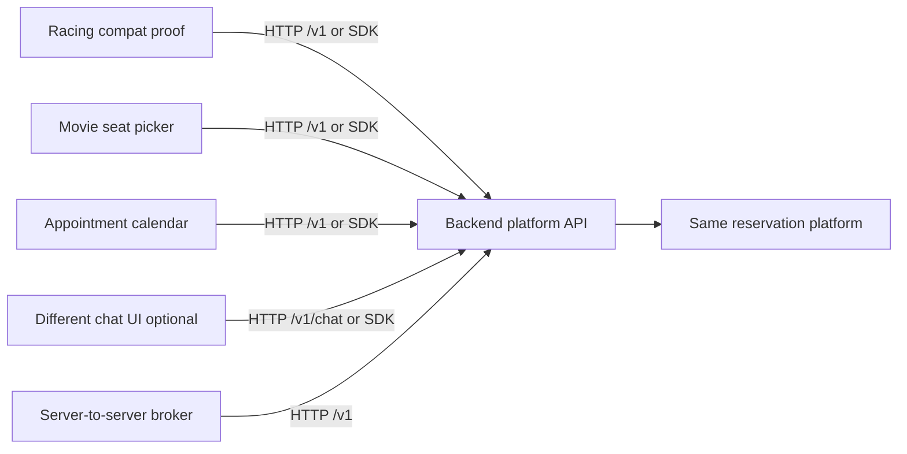

# Phase 8: External Frontend Proofs

## Purpose

Prove that the standalone backend platform can support unrelated frontend
products through the Phase 1/4 `/v1` HTTP API and optional TypeScript SDK
without importing this Next.js app's pages, components, route handlers,
Supabase helpers, or booking internals.

This phase is a planning and decomposition pass. Do not create the example apps
in the current repository during this pass. Future implementation subagents
should create the examples in the standalone backend repository shape from
Phase 2.

## Subagent Mission

Create small, clean external consumer proofs that demonstrate the backend
platform is the reusable product. Each proof must show that a different domain
can configure services, resources, slots, quantities, reservations, and
customers without changing backend core code.

## Upstream Dependencies

- Phase 1 backend platform contract.
- Phase 1 contract docs:
  - [API Resource List](contracts/api-resource-list.md)
  - [SDK Method List](contracts/sdk-method-list.md)
  - [Error Conventions](contracts/error-conventions.md)
  - [Idempotency Conventions](contracts/idempotency-conventions.md)
- Phase 2 backend repo shape.
- Phase 4 API layer and SDK contract.
- Phase 5 database ownership and migration strategy.
- Phase 6 AI chat backend service contract, only when chat is enabled.
- Phase 7 current frontend migration.

## Allowed Write Scope

Future implementation pass in `reservation-platform-backend`:

- Example apps or fixtures under:
  - `examples/racing-current-frontend-compat`
  - `examples/movie-ticketing-consumer`
  - `examples/appointment-booking-consumer`
  - `examples/chat-ui-consumer`, only if Phase 6 chat is enabled
  - `examples/server-to-server`
- External consumer smoke tests.
- Example-specific README files and fixture notes.
- Contract example payloads under `contracts/examples` when new payload
  examples are needed.

Current planning-only pass:

- `docs/package-refactor/backend-platform-extraction/phase-8-external-frontend-proofs.md`
- New external proof planning docs under
  `docs/package-refactor/backend-platform-extraction/`

Do not import current app pages, components, route handlers, `lib/supabase*`,
`lib/reservations/**`, current frontend adapters, or Supabase table/RPC helpers
into examples.

Do not edit application code in this pass. Do not create actual example apps in
this current repository.

## Boundary Rules

- Proofs consume only `/v1` HTTP or `packages/sdk` public methods.
- Direct HTTP is the source of truth. SDK examples are parity proofs, not a
  replacement contract.
- Proofs must not read or write raw Supabase tables, call Supabase RPCs, import
  storage adapters, or depend on current Next.js `app/api/**` routes.
- Proofs may use generated contract types, OpenAPI/JSON Schema, or SDK public
  types from the backend repo.
- Domain-specific words such as seat, rig, provider, room, section, ticket, or
  patient are frontend labels and fixture metadata. Backend payloads use
  `service`, `resource`, `slot`, `quantity`, `reservation`,
  `reservation_items`, and `customer`.
- Example credentials and tenant IDs must be loaded from environment or fixture
  config. No secrets should be committed.
- Mutation proofs must use an explicit `Idempotency-Key` or SDK
  `idempotencyKey` per user intent.
- If a frontend needs a backend field, endpoint, lifecycle action, auth mode, or
  idempotency behavior not already in Phases 1/4/5/6, record it as a platform
  gap instead of reimplementing backend behavior in the example.

## Example Frontends

### Required Proof Consumers

| Consumer | Target folder | Primary mode | Purpose |
| --- | --- | --- | --- |
| Racing simulator current frontend consumer or compatibility proof | `examples/racing-current-frontend-compat` | SDK or direct HTTP through a tiny compatibility adapter | Prove the current Project Play domain can consume the generic backend contract without current app internals. |
| Movie ticketing frontend proof | `examples/movie-ticketing-consumer` | Direct HTTP and optional SDK parity | Prove assigned resources and resource layouts can model seats for a showing. |
| Appointment booking frontend proof | `examples/appointment-booking-consumer` | SDK-first | Prove providers, rooms, or capacity resources can model appointment slots. |
| Optional different chat UI proof | `examples/chat-ui-consumer` | `/v1/chat/**` or `client.chat.*` | Prove Phase 6 chat actions can be rendered by a UI that is not Project Play chat. |
| Server-to-server proof | `examples/server-to-server` | Direct HTTP from a backend script/service | Prove a non-browser backend can broker reservations with service credentials. |

## Target Backend Repo Layout

Future implementation subagents should create:

```text
reservation-platform-backend/
  examples/
    racing-current-frontend-compat/
      README.md
      package.json
      .env.example
      fixtures/
        project-play-compat.json
      src/
        platform-client.ts
        compatibility-adapter.ts
        smoke.ts
      tests/
        racing-compat.smoke.test.ts
        no-internal-imports.test.ts

    movie-ticketing-consumer/
      README.md
      package.json
      .env.example
      fixtures/
        cinema-tenant.json
      src/
        api-client.ts
        seat-map-adapter.ts
        smoke.ts
      tests/
        movie-ticketing.smoke.test.ts
        idempotency.smoke.test.ts
        no-internal-imports.test.ts

    appointment-booking-consumer/
      README.md
      package.json
      .env.example
      fixtures/
        appointment-tenant.json
      src/
        sdk-client.ts
        appointment-adapter.ts
        smoke.ts
      tests/
        appointment-booking.smoke.test.ts
        no-internal-imports.test.ts

    chat-ui-consumer/
      README.md
      package.json
      .env.example
      src/
        chat-client.ts
        action-renderer.ts
        smoke.ts
      tests/
        chat-ui.smoke.test.ts
        no-internal-imports.test.ts

    server-to-server/
      README.md
      package.json
      .env.example
      src/
        broker.ts
        smoke.ts
      tests/
        server-to-server.smoke.test.ts
        no-internal-imports.test.ts
```

These examples are intentionally small. They should prove integration contracts,
not provide production UI shells.

## Shared Example Configuration

Each proof should load these values from `.env.example` and runtime
environment:

| Variable | Required | Purpose |
| --- | --- | --- |
| `RESERVATION_PLATFORM_BASE_URL` | Yes | Backend API base URL, for example `http://localhost:4001`. |
| `RESERVATION_PLATFORM_API_VERSION` | Optional | Defaults to `v1`. |
| `RESERVATION_PLATFORM_TENANT_ID` | Yes unless inferred by auth | Tenant context for catalog, availability, and reservations. |
| `RESERVATION_PLATFORM_VENUE_ID` | Required for venue-scoped fixtures | Venue context for the proof domain. |
| `RESERVATION_PLATFORM_ACCESS_TOKEN` | Browser/user examples | Caller token used by direct HTTP or SDK examples. |
| `RESERVATION_PLATFORM_SERVICE_API_KEY` | Server-to-server only | Service credential for trusted backend broker calls. |
| `RESERVATION_PLATFORM_CHAT_ENABLED` | Chat proof only | Enables or skips the optional chat proof. |
| `PROOF_FIXTURE_PROFILE` | Optional | Selects `racing`, `movie`, `appointment`, or `server` fixture data. |

Configuration notes each README must capture:

- Which tenant/venue fixture was used.
- Whether the example used direct HTTP, SDK, or both.
- Which auth mode was used: user token, service API key, or local test token.
- Whether chat was enabled or skipped because `/v1/metadata` reported
  `modules.chat.enabled=false`.
- Which idempotency keys were generated or reused during retry tests.

## Fixture Requirements

Fixtures are tenant data, not backend core defaults. They should be loaded by
backend repo seed tooling from Phase 5 or by a documented test fixture command.

| Fixture | Service examples | Resource examples | Layout examples | Reservation policy |
| --- | --- | --- | --- | --- |
| Racing simulator | `svc_racing_simulator` | `RS1` through `RS16` as individual resources | Optional simulator grid/island layout | Assigned resources or hybrid resource selection; quantity equals selected rigs unless policy allows quantity-only. |
| Movie ticketing | `svc_movie_showing_8pm` | Seat resources such as `A1`, `A2`, `B1`; optional section capacity buckets | Theater rows, sections, accessible seats | Assigned seats for reserved seating; quantity equals selected seats. |
| Appointment booking | `svc_consultation_30m`, `svc_haircut_45m`, or similar | Provider, room, chair, or capacity resources | Optional provider/room grouping | Slot duration comes from service; resource may be selected by user or assigned by backend policy. |
| Chat UI | Any core fixture above | Same as selected domain fixture | Same as selected domain fixture | Prepared reservation must require explicit confirmation before create. |
| Server-to-server | `svc_partner_booking` or any core fixture | Capacity bucket, room, seat, or equipment resources | Optional | Trusted broker calls API with service credential and still passes tenant, venue, customer, quantity, and idempotency. |

Minimum fixture fields per service/resource:

- `tenant_id`
- `venue_id`
- `service_id`
- service name and public metadata
- duration or slot policy
- resource strategy: assigned-resource, quantity-only, hybrid, provider, room,
  or capacity
- resources with stable `resource_id`, display `label`, capacity, status, and
  optional layout id
- operating windows or availability rules
- at least one available slot and one slot that becomes unavailable after a
  reservation

## Domain Mapping Matrix

| Domain concept | Backend primitive | Racing simulator | Movie ticketing | Appointment booking | Server-to-server |
| --- | --- | --- | --- | --- | --- |
| Product being booked | `service` | Racing Simulator session | Movie showing | Appointment type | Partner-offered booking service |
| Physical or logical unit | `resource` | Simulator rig `RS1` | Seat `A1` | Provider, room, chair, or capacity bucket | Broker-selected resource or capacity bucket |
| Visual arrangement | `resource_layout` | Simulator island/grid | Theater row map | Provider/room grouping | Usually none |
| Candidate time | `slot` | Session start/end | Showing start/end | Appointment start/end | Broker-selected interval |
| Count | `quantity` | Number of rigs/players | Number of tickets/seats | Party size or one appointment | Requested units |
| Allocation | `reservation_items` | Selected rig resources | Selected seat resources | Selected/assigned provider or room | Resource or capacity allocation |
| Booker | `customer` | Player contact | Ticket buyer | Patient/client/customer | External customer snapshot |
| Frontend labels | Metadata only | "Rig", "RS seat" | "Seat", "screen" | "Provider", "room" | Partner-specific label |

The pass condition is that every proof uses the same backend payload vocabulary
while presenting domain-specific labels locally.

## Expected API Calls

All proofs should start with platform discovery:

1. `GET /v1/metadata`
2. `GET /v1/tenants/current`
3. `GET /v1/venues` or `GET /v1/venues/{venue_id}`
4. `GET /v1/services`
5. `GET /v1/resources`
6. `GET /v1/resource-layouts/{layout_id}` when the domain renders a layout
7. `GET /v1/availability`
8. `POST /v1/reservations`
9. `GET /v1/reservations/{reservation_id}`

Lifecycle-capable proofs should also call:

- `POST /v1/reservations/{reservation_id}/cancel`
- `POST /v1/reservations/{reservation_id}/reschedule`, only if the fixture
  includes an alternate valid slot
- `GET /v1/reservations`, for admin or server-to-server list verification

Maintenance-sensitive proofs may call:

- `GET /v1/resource-maintenance`

The examples should not call `/api/bookings`, `/api/availability`,
`/api/services`, `/api/seat-maintenance`, `/api/chat`, Supabase RPCs, or
Supabase tables.

## Consumer Proof Plans

### Proof 8.1: Racing Current Frontend Compatibility

Target:

```text
reservation-platform-backend/examples/racing-current-frontend-compat
```

Goal:

- Prove the current Project Play Racing Simulator domain can be represented by
  backend platform contracts without importing Project Play UI or route files.
- Exercise compatibility mapping that Phase 7 can later use in this app's
  shims or adapters.

Required implementation:

- A minimal TypeScript script or tiny static UI that loads services, resources,
  layout, availability, and creates a reservation.
- A local compatibility adapter that maps generic platform fields into legacy
  display concepts such as service card data, time slots, and selected
  `RS1`-style labels.
- No imports from this current app. The adapter should be written from the
  public API/SDK response shapes only.

Expected calls:

- `GET /v1/metadata`
- `GET /v1/tenants/current`
- `GET /v1/venues` or `GET /v1/venues/{venue_id}`
- `GET /v1/services?venue_id=...`
- `GET /v1/resources?service_id=svc_racing_simulator`
- `GET /v1/resource-layouts/{layout_id}` when the fixture has layout metadata
- `GET /v1/availability?venue_id=...&service_id=...&start_at=...&end_at=...&quantity=2`
- `POST /v1/reservations` with two `reservation_items`
- Replay the same `POST /v1/reservations` with the same idempotency key.
- `GET /v1/reservations/{reservation_id}`

Pass criteria:

- Reservation creates successfully with selected simulator resources.
- Availability after create marks those resources unavailable or reduces
  `available_quantity`.
- Replaying with the same idempotency key returns the same reservation and
  `idempotency.status="replayed"` when metadata is returned.
- Reusing the key with changed resources or quantity returns
  `idempotency_key_reused_with_different_request`.
- No code imports current Next.js app folders or Supabase helpers.

### Proof 8.2: Movie Ticketing Consumer

Target:

```text
reservation-platform-backend/examples/movie-ticketing-consumer
```

Goal:

- Prove a frontend with a seat-picker domain can use generic resources and
  resource layouts without backend core changes.

Required implementation:

- A small consumer that renders or simulates a seat map from
  `GET /v1/resources` and `GET /v1/resource-layouts/{layout_id}`.
- Direct HTTP calls are required. SDK parity is optional but recommended.
- Fixture data for one movie showing with a theater row layout and at least
  three seat resources.

Expected calls:

- `GET /v1/metadata`
- `GET /v1/tenants/current`
- `GET /v1/venues` or `GET /v1/venues/{venue_id}`
- `GET /v1/services` filtered to movie showing services
- `GET /v1/resources?service_id=svc_movie_showing_8pm`
- `GET /v1/resource-layouts/{layout_id}`
- `GET /v1/availability` with `quantity=2` and selected `resource_ids`
- `POST /v1/reservations` with `reservation_items` for seats `A1` and `A2`
- `GET /v1/reservations/{reservation_id}`
- Conflict probe: attempt the same seats with a new idempotency key and expect
  `resource_conflict` or `slot_not_available`.

Pass criteria:

- The example can reserve selected seats through `/v1/reservations`.
- The seat map uses layout/resource metadata only; it does not require
  seat-specific backend route names.
- Conflict response includes stable error code and enough details for the
  frontend to refresh seat availability.
- Changing display labels from seats to another resource kind would not require
  backend code changes.

### Proof 8.3: Appointment Booking Consumer

Target:

```text
reservation-platform-backend/examples/appointment-booking-consumer
```

Goal:

- Prove duration-based appointment services work with provider, room, chair, or
  capacity resources through the same service/resource/slot/reservation
  contract.

Required implementation:

- SDK-first consumer using `createReservationPlatformClient`.
- Appointment adapter that maps platform slots into calendar options.
- Fixture data for at least one appointment service and one resource strategy:
  provider-selected, room-selected, or backend-assigned capacity.

Expected SDK calls:

- `client.getMetadata()`
- `client.getCurrentTenant()`
- `client.listVenues()` or `client.getVenue(venueId)`
- `client.listServices({ venue_id })`
- `client.listResources({ service_id })`
- `client.listAvailability({ venue_id, service_id, start_at, end_at, quantity })`
- `client.createReservation(input, { idempotencyKey })`
- `client.getReservation(reservationId)`
- Optional: `client.rescheduleReservation(reservationId, input, { idempotencyKey })`
- Optional: `client.cancelReservation(reservationId, input, { idempotencyKey })`

Pass criteria:

- The example creates an appointment reservation without a seat map.
- Service duration and returned `slot.start_at`/`slot.end_at` drive the calendar
  display.
- Provider/room labels remain frontend metadata, not API route names.
- SDK errors preserve the same `PlatformError` object that direct HTTP returns.

### Proof 8.4: Optional Different Chat UI Consumer

Target:

```text
reservation-platform-backend/examples/chat-ui-consumer
```

Run only when `GET /v1/metadata` reports `modules.chat.enabled=true`.

Goal:

- Prove Phase 6 chat can be consumed by a different chat UI that renders
  messages, actions, and prepared reservation confirmation without Project Play
  chat components.

Required implementation:

- A minimal chat client or script that creates a chat session, sends a message,
  renders/prints returned actions, and confirms a prepared reservation.
- It may use direct HTTP or `client.chat.*`.
- It must render actions from data shapes such as
  `reservation_confirmation`; it must not import backend chat workflow internals
  or current frontend chat cards.

Expected calls:

- `GET /v1/metadata`
- `GET /v1/tenants/current`
- `GET /v1/venues` or `GET /v1/venues/{venue_id}`
- `POST /v1/chat/reservation-sessions`
- `POST /v1/chat/reservation-sessions/{chat_session_id}/messages`
- `POST /v1/chat/reservation-sessions/{chat_session_id}/confirm`
- `GET /v1/reservations/{reservation_id}` to verify confirmation

Pass criteria:

- If chat is disabled, the proof skips with a recorded
  `chat_module_disabled` result, not a failure.
- If chat is enabled, the proof receives a prepared reservation action and
  confirms it with an explicit idempotency key.
- Confirmation creates or mutates the reservation through core contracts.
- The UI rendering layer depends only on public chat response/action shapes.

### Proof 8.5: Server-To-Server Consumer

Target:

```text
reservation-platform-backend/examples/server-to-server
```

Goal:

- Prove a separate backend service can broker reservations for a frontend,
  native app, marketplace, or partner system without exposing platform secrets
  to a browser.

Required implementation:

- A small Node service or script with a `createBrokeredReservation` function.
- Direct HTTP calls using a server credential from
  `RESERVATION_PLATFORM_SERVICE_API_KEY`.
- A sanitized response shape for downstream UIs that excludes platform secrets
  and internal error details.

Expected calls:

- `GET /v1/metadata`
- `GET /v1/tenants/current`
- `GET /v1/venues` or `GET /v1/venues/{venue_id}`
- `GET /v1/services`
- `GET /v1/resources`
- `GET /v1/availability`
- `POST /v1/reservations`
- Replay `POST /v1/reservations` with the same idempotency key.
- `GET /v1/reservations/{reservation_id}`
- Optional admin-capable `GET /v1/reservations` when the service credential is
  authorized.

Pass criteria:

- Broker can create a reservation with service credentials and tenant/venue
  context.
- Browser-facing output contains only reservation result fields safe for the
  partner UI.
- Idempotency replay and changed-payload rejection both work.
- The proof never exposes `RESERVATION_PLATFORM_SERVICE_API_KEY` in client
  code, logs, or fixture files.

## Smoke Test Plan

Future subagents should add a root smoke command in the backend repo, for
example:

```text
pnpm smoke:external-proofs
```

The command should orchestrate the example-level smoke scripts after the API,
database migrations, and fixtures are ready.

### Install And Config Flow

1. Install backend repo dependencies.
2. Start or point to a backend platform API.
3. Apply core database migrations from `packages/database`.
4. Seed proof fixture data for racing, movie, appointment, and server-to-server
   profiles.
5. Copy each example `.env.example` to a local `.env` or provide equivalent
   environment variables.
6. Run example smoke scripts.
7. Collect pass/fail output and gap notes.

### Smoke Assertions

Every example smoke test must assert:

- `GET /v1/metadata` succeeds and reports compatible API version.
- Required tenant and venue context is accepted.
- Catalog calls return at least one configured service/resource for the proof.
- Availability returns at least one available slot.
- `POST /v1/reservations` creates or simulates a reservation through the
  backend contract.
- `GET /v1/reservations/{reservation_id}` returns the created reservation.
- Replaying the same mutation with the same idempotency key does not duplicate
  the reservation.
- Reusing the idempotency key with a changed payload returns the documented
  idempotency error.
- No forbidden imports exist.

### Forbidden Import Test

Each proof should include a static test that fails if source files import:

- `../../app/**`
- `../../components/**`
- `../../lib/supabase*`
- `../../lib/reservations/**`
- `../../lib/platform/**`
- `../../app/api/**`
- `@/app/**`
- `@/components/**`
- `@/lib/supabase*`
- `@/lib/reservations/**`
- `@/lib/platform/**`
- `@/app/api/**`
- raw Supabase clients or adapter packages unless the proof is explicitly a
  backend platform adapter test, which these examples are not

## Idempotency Behavior To Verify

| Operation | Proofs | Expected behavior |
| --- | --- | --- |
| Create reservation with new key | All core proofs | Creates one reservation and records idempotency metadata when supported. |
| Replay same create request with same key | All core proofs | Returns original reservation; does not allocate resources twice. |
| Reuse same key with changed payload | Racing, movie, server-to-server | Returns `idempotency_key_reused_with_different_request`. |
| Conflict with new key after reservation exists | Movie, racing | Returns `resource_conflict`, `slot_not_available`, or `insufficient_capacity` according to fixture policy. |
| Chat confirm replay | Chat proof | Returns same confirmed reservation and does not create duplicate booking. |
| Cancel/reschedule replay | Appointment proof when lifecycle enabled | Returns same lifecycle result and does not double-apply side effects. |

## Pass And Fail Criteria

Phase 8 is passing when:

- At least one required external proof creates or simulates a reservation
  through `/v1` HTTP or SDK.
- Racing, movie, appointment, and server-to-server proof plans have target
  folders, fixture needs, smoke tests, API calls, idempotency behavior, and
  pass/fail criteria.
- Optional chat proof is either implemented when chat is enabled or skipped with
  a clear `chat_module_disabled` record.
- Static tests prove examples do not import current app internals.
- Smoke output records what was configured and which fixture profile was used.
- Any missing backend capability is recorded in a gap log and assigned to the
  correct upstream phase.

Phase 8 is failing when:

- Any example imports current Next.js app pages, components, route handlers,
  Supabase helpers, or current app adapters.
- Any example calls legacy `/api/*` routes instead of `/v1`.
- A proof needs raw table names, Supabase RPC names, or database credentials in
  frontend code.
- A proof creates duplicate reservations on retry with the same idempotency key.
- A domain requires backend core code changes for labels such as seat, rig,
  provider, room, ticket, or patient.

## Proof Diagram



## Gap Recording Mechanism

Future implementation subagents should create one gap log per proof run:

```text
reservation-platform-backend/examples/_proof-results/
  YYYY-MM-DD-external-proof-gaps.md
```

Each gap should use this format:

```md
## GAP-8-001: Short title

- Proof: movie-ticketing-consumer
- Blocking: yes/no
- Observed behavior:
- Expected contract:
- Upstream phase owner: Phase 1 / 4 / 5 / 6 / 9
- Suggested contract update:
- Temporary workaround used: none / documented
```

If a proof finds no gaps, the result file should say so explicitly and list the
configured tenant, venue, fixture profile, API version, SDK version, and smoke
command that passed.

## Feedback To Upstream Phases

| Gap type | Update owner | Examples |
| --- | --- | --- |
| Missing primitive, payload field, endpoint, error code, or API vocabulary | Phase 1 | Resource layout lacks coordinates needed by all layout consumers; customer snapshot cannot carry required external identity. |
| SDK method mismatch, OpenAPI/schema mismatch, direct HTTP and SDK parity issue, missing idempotency option | Phase 4 | SDK cannot pass `resource_ids` for availability; SDK error helper drops `details.causes`; OpenAPI omits optional chat disabled response. |
| Fixture seed, tenant isolation, schema migration, idempotency persistence, or adapter row mapping gap | Phase 5 | Movie seats cannot be seeded as generic resources; idempotency table cannot replay reservation create; tenant context missing from resource layouts. |
| Chat session, message, action, streaming, prepared reservation, or confirmation gap | Phase 6 | Different chat UI cannot render confirmation from public action shape; `/confirm` does not call core reservation create; chat disabled returns 404 instead of `chat_module_disabled`. |
| Current frontend compatibility mismatch | Phase 7 | Racing compatibility adapter needs a field current UI assumes but platform catalog does not expose. |
| Deployment, environment, fixture bootstrap, CORS, auth, smoke script, or release note gap | Phase 9 | External examples need documented API keys, fixture seed command, CORS policy, rate limits, or `pnpm smoke:external-proofs` CI wiring. |

## Deliverables

- External proof implementation plan: this Phase 8 file.
- At least one future clean external frontend proof, with
  `movie-ticketing-consumer` recommended as the first implementation because it
  exercises assigned resources and layouts without current app compatibility
  assumptions.
- Smoke test plan showing install/config/call flow:
  [Smoke Test Plan](#smoke-test-plan).
- Notes on what had to be configured:
  [Shared Example Configuration](#shared-example-configuration) and each
  example README.
- Gaps found in API or SDK, or explicit no-gap records:
  [Gap Recording Mechanism](#gap-recording-mechanism).

## Acceptance Criteria

- Example does not depend on this Next.js app's internal folders.
- Example can create or simulate a reservation through the backend contract.
- Any frontend-specific assumptions found are reported upstream.
- Proofs consume `/v1` HTTP or SDK only.
- Target example folders, fixture/config needs, smoke tests, expected API calls,
  idempotency behavior, and pass/fail criteria are defined.
- Different domains map to service/resource/slot/quantity/reservation/customer
  without changing backend core.

## Downstream Updates Required

No downstream phase files were edited in this planning pass. If future external
proof implementation reveals missing platform contracts, update the relevant
upstream phase before accepting a workaround:

- Phase 1 for missing core primitives, error codes, or API vocabulary.
- Phase 4 for API/SDK/OpenAPI/schema/idempotency contract gaps.
- Phase 5 for migration, fixture, tenant isolation, idempotency storage, or
  adapter gaps.
- Phase 6 for optional chat endpoint, action, workflow, or confirmation gaps.
- Phase 7 for current frontend compatibility assumptions.
- Phase 9 for release, deployment, environment, smoke, auth, CORS, or
  operations gaps.
