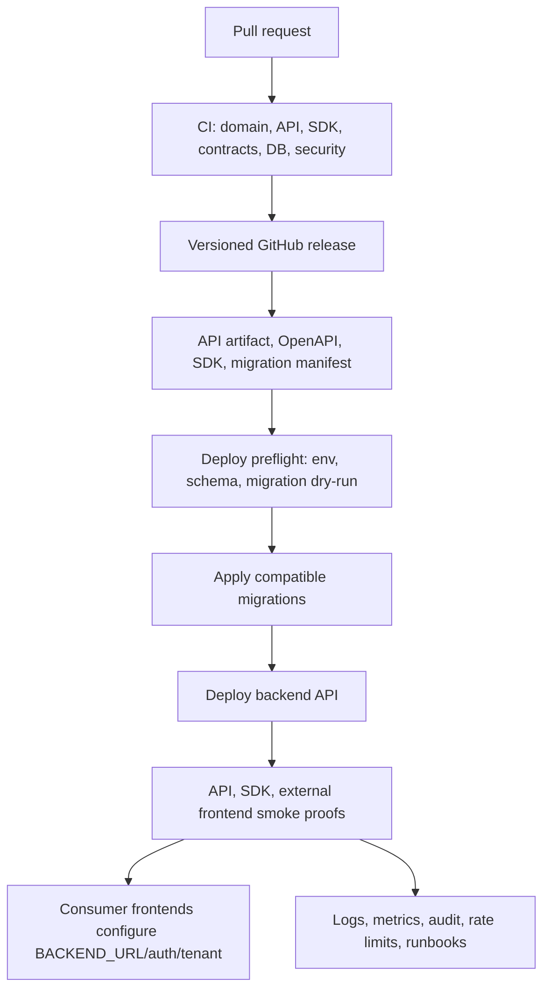

# Phase 9: Release, Deployment, and Operations

## Purpose

Make the standalone backend platform usable as an independently hosted GitHub
repository and deployable service that any frontend can consume through the
versioned `/v1` HTTP API or optional TypeScript SDK.

The reusable product is the backend platform: API app, domain services,
database migrations, storage adapters, SDK, optional modules, operational
tooling, and release process. Frontend repositories configure a backend URL,
tenant/venue context, auth or API credentials, and optional SDK package. They
do not edit backend internals, copy SQL, call Supabase RPCs directly, or depend
on current Next.js app routes.

## Subagent Mission

Define and later implement release, deployment, environment, migration,
observability, rollback, and operations workflows for:

```text
reservation-platform-backend
```

Future implementation subagents should create the files and workflows named in
this document inside the standalone backend repo. This current pass is
planning-only and does not edit application code.

## Upstream Dependencies

- Phase 2 backend repo shape.
- Phase 4 API and SDK contract.
- Phase 5 database ownership and migration strategy.
- Phase 6 optional AI chat backend service contract.
- Phase 8 external frontend proofs.
- Contract docs:
  - `contracts/api-resource-list.md`
  - `contracts/sdk-method-list.md`
  - `contracts/error-conventions.md`
  - `contracts/idempotency-conventions.md`

## Allowed Write Scope

- `docs/package-refactor/backend-platform-extraction/phase-9-release-deployment-operations.md`
- New release/deployment/operations planning docs under
  `docs/package-refactor/backend-platform-extraction/`

Do not edit application code. Do not push branches. Do not edit other phase
files unless this phase changes shared API, SDK, database, tenant, or optional
module assumptions.

## Operating Principles

- The backend repo must be independently hostable on GitHub.
- The API is the source of truth. SDK releases mirror API behavior and do not
  introduce divergent booking rules.
- Frontends configure `RESERVATION_PLATFORM_BASE_URL`, auth/API credentials,
  tenant/venue context, and optional SDK versions. Backend releases must not
  require frontend teams to edit backend source.
- Version API, SDK, migrations, and optional modules deliberately.
- Database migrations are backend-owned, testable, checksum-verified, and
  rollback-planned.
- Core deployment must work without AI chat, structured retrieval, payments,
  reports, content, or notifications enabled.
- AI provider keys are required only when optional AI chat or structured
  retrieval modules are enabled.
- Every production mutation path must preserve tenant isolation, idempotency,
  auditability, and stable Phase 1 error shapes.

## Deployment Mode Recommendation

Recommended first production mode:

```text
Hosted backend service from reservation-platform-backend/apps/api,
backed by managed Supabase/Postgres, with optional SDK published from the same
GitHub release.
```

This should be the default because it gives frontend teams a simple contract:

```text
BACKEND_URL=https://api.example.com
API_VERSION=v1
AUTH/API key/tenant config from environment
```

Frontend repositories then integrate by direct HTTP or SDK without editing
backend internals. Self-hosting and local development remain supported modes,
but the release process should optimize first for a managed backend service
that can be smoke-tested once and consumed by many frontends.

### Deployment Modes

| Mode | Target consumers | Backend repo requirements | Frontend configuration | Release stance |
| --- | --- | --- | --- | --- |
| Hosted backend service | Production frontends, partner frontends, current app migration | Deploy `apps/api`; run backend-owned migrations; publish OpenAPI and SDK; expose operational dashboards | `RESERVATION_PLATFORM_BASE_URL`, auth/API credentials, tenant/venue hints, optional SDK version | Recommended default |
| Self-hosted backend repo | Customers or teams that operate their own backend | Document infra prerequisites; provide Docker/image or platform deploy guide; provide migration and smoke scripts | Their own deployed `BACKEND_URL` and credentials | Supported after hosted path is stable |
| Local development backend | Backend contributors and frontend integration testing | `pnpm dev`, local Postgres/Supabase bootstrap, fixture seeds, smoke scripts | `http://localhost:<api-port>`, local tenant fixture, local token/API key | Required for development and CI |

### Hosted Service Shape

Target future files:

```text
reservation-platform-backend/
  apps/api/
    src/server.ts
    src/app.ts
    src/health.ts
    src/readiness.ts
  docs/
    operations/backend-deployment.md
    operations.md
    release-process.md
    rollback.md
    environment.md
    frontend-integration.md
  scripts/
    deploy-check.ts
    smoke-api.ts
    smoke-external-proofs.ts
    check-env.ts
    check-schema-version.ts
    run-migrations.ts
    rollback-api.ts
  .github/workflows/
    ci.yml
    release.yml
    deploy-hosted.yml
```

Hosted deployment requirements:

- `GET /healthz` returns process liveness without database writes.
- `GET /readyz` verifies database connectivity, applied schema version,
  required core env vars, and optional module readiness only when those modules
  are enabled.
- `GET /v1/metadata` returns API version, SDK compatibility range, minimum
  schema version, current schema version where safe, enabled modules,
  compatibility notices, and deprecation notices.
- CORS allows configured frontend origins only. Server-to-server consumers are
  not required to use browser CORS.
- Deployment produces immutable build artifacts or container images tied to a
  GitHub release/tag.

### Self-Hosted Shape

Target future files:

```text
reservation-platform-backend/
  Dockerfile
  docker-compose.example.yml
  docs/self-hosting.md
  docs/database-bootstrap.md
  docs/security-hardening.md
  .env.example
```

Self-hosted requirements:

- Document supported Node version, package manager, database, Supabase/Postgres
  requirements, and optional module dependencies.
- Provide `.env.example` with no secrets.
- Provide a migration command that installs core schema without Project Play
  seed data by default.
- Provide fixture seed commands for examples and smoke tests.
- Provide a clear upgrade path: pull release, run preflight, run migrations,
  deploy API, run smoke tests.

### Local Development Shape

Target future files:

```text
reservation-platform-backend/
  docs/local-development.md
  scripts/bootstrap-local.ts
  scripts/seed-fixtures.ts
  examples/_proof-results/.gitkeep
```

Local requirements:

- `pnpm install`
- `pnpm db:start` or documented external Postgres/Supabase setup.
- `pnpm db:migrate`
- `pnpm db:seed:dev`
- `pnpm dev`
- `pnpm smoke:api`
- `pnpm smoke:external-proofs`

The backend repo must not require this frontend repository to bootstrap schema,
seed tenant fixtures, or run API smoke tests.

## Frontend Connection Contract

New frontend teams should connect to the deployed backend by choosing direct
HTTP or the optional SDK.

### Direct HTTP

Minimum configuration:

```text
RESERVATION_PLATFORM_BASE_URL=https://api.example.com
RESERVATION_PLATFORM_API_VERSION=v1
RESERVATION_PLATFORM_TENANT_ID=tenant_123
RESERVATION_PLATFORM_VENUE_ID=venue_123
RESERVATION_PLATFORM_ACCESS_TOKEN=<user token>
```

Minimum flow:

1. `GET /v1/metadata`
2. `GET /v1/tenants/current`
3. `GET /v1/venues` or `GET /v1/venues/{venue_id}`
4. `GET /v1/services`
5. `GET /v1/resources`
6. `GET /v1/availability`
7. `POST /v1/reservations` with `Idempotency-Key`
8. `GET /v1/reservations/{reservation_id}`

Mutation calls must include one idempotency key per user intent. Frontends own
UI wording and localization. They should use stable `PlatformError.code`,
`status`, `details`, `causes`, and `retryable` fields rather than parsing
developer-facing error messages.

### Optional SDK

Target frontend installation:

```text
pnpm add @reservation-platform/sdk
```

Target SDK construction:

```ts
const client = createReservationPlatformClient({
  baseUrl: process.env.RESERVATION_PLATFORM_BASE_URL!,
  apiVersion: process.env.RESERVATION_PLATFORM_API_VERSION ?? "v1",
  tenantId: process.env.RESERVATION_PLATFORM_TENANT_ID,
  venueId: process.env.RESERVATION_PLATFORM_VENUE_ID,
  getAccessToken: async () => accessToken
});
```

SDK consumers must be able to upgrade SDK patch/minor versions without editing
backend internals. Breaking SDK changes require a major SDK version and a
documented API compatibility note.

## Target Operations Files For Future Subagents

Create these files in `reservation-platform-backend` during Phase 9
implementation:

```text
reservation-platform-backend/
  .github/
    workflows/
      ci.yml
      release.yml
      deploy-hosted.yml
      smoke-external-proofs.yml
      migration-dry-run.yml
      security.yml

  docs/
    operations.md
    operations/backend-deployment.md
    release-process.md
    rollback.md
    environment.md
    frontend-integration.md
    observability.md
    rate-limits.md
    audit-log.md
    tenant-isolation-operations.md
    idempotency-operations.md
    ai-operations.md
    runbooks/
      api-deploy-failed.md
      migration-failed.md
      rollback-api.md
      rollback-migration.md
      idempotency-replay-incident.md
      tenant-isolation-incident.md
      ai-provider-outage.md

  scripts/
    check-env.ts
    check-contracts.ts
    check-schema-version.ts
    check-tenant-isolation.ts
    deploy-check.ts
    run-migrations.ts
    migration-dry-run.ts
    migration-status.ts
    seed-fixtures.ts
    smoke-api.ts
    smoke-sdk.ts
    smoke-external-proofs.ts
    smoke-ai.ts
    publish-openapi.ts
    publish-sdk.ts
    release-notes.ts

  contracts/
    openapi/
      v1.yaml
      v1.json

  examples/
    _proof-results/
```

Future subagents may split scripts by package, but these responsibilities must
exist under clear names.

## Versioning Strategy

Version the platform in four related but separate tracks.

| Surface | Version format | Owned by | Compatibility rule |
| --- | --- | --- | --- |
| API | Path version such as `/v1`; metadata `api_version` and deprecation notices | `apps/api` and package-owned `packages/contract-types/contracts/openapi.json` | Stable error shape and payload semantics within `/v1`; additive changes allowed; breaking changes require `/v2` or explicit compatibility bridge |
| SDK | SemVer package version such as `1.4.2` | `packages/sdk` | SDK major must match supported API major by default; SDK minor may expose additive API features; patch fixes must not change public behavior |
| Migrations | Immutable ordered ids such as `000012_add_idempotency_records.sql` plus checksum | `packages/database` | Released migrations are append-only; breaking physical changes require expand/contract and compatibility adapter window |
| Optional modules | Module package SemVer plus module capability flags in metadata | `packages/ai-chat`, future modules | Module can be disabled without breaking core API; enabled module publishes capability and config requirements |

### API Versioning

Requirements:

- Keep core endpoints under `/v1`.
- Add fields additively when possible.
- Do not remove or rename fields in `/v1` without a deprecation window and
  metadata warning.
- Preserve Phase 1 `PlatformError` shape within `/v1`.
- `GET /v1/metadata` should include:
  - `api_version`
  - `release_version`
  - `minimum_schema_version`
  - `sdk_compatibility`
  - `enabled_modules`
  - `deprecated_fields`
  - `compatibility_notices`

Target file:

```text
reservation-platform-backend/apps/api/src/routes/metadata.ts
```

### SDK Versioning

Requirements:

- Publish SDK from backend repo release workflow.
- Generate SDK types from `packages/contract-types` and schemas.
- Run direct HTTP parity tests before publishing.
- Document compatible API major/minor range.
- SDK must preserve API error objects exactly.

Target files:

```text
reservation-platform-backend/packages/sdk/package.json
reservation-platform-backend/packages/sdk/CHANGELOG.md
reservation-platform-backend/docs/sdk.md
reservation-platform-backend/.github/workflows/release.yml
```

### Migration Versioning

Requirements:

- Migration filenames are immutable after release.
- Store migration id, checksum, package version, module name, executor, and
  applied timestamp in schema metadata.
- CI validates checksums against released migration manifest.
- `GET /v1/metadata` reports minimum compatible schema version.
- API startup refuses or enters maintenance/read-only mode when schema is below
  minimum required version.

Target files:

```text
reservation-platform-backend/packages/database/src/schema-version.ts
reservation-platform-backend/packages/database/migrations/manifest.json
reservation-platform-backend/scripts/check-schema-version.ts
```

### Optional Module Versioning

Requirements:

- Optional modules expose capability flags through metadata.
- Optional module migrations live under module-specific folders and run only
  when enabled.
- Optional module env vars are validated only when the module is enabled.
- Disabled optional routes return module-disabled `PlatformError` codes instead
  of generic 404 responses.

Target metadata example:

```json
{
  "data": {
    "modules": {
      "chat": {
        "enabled": true,
        "version": "1.0.0",
        "streaming": true,
        "structured_retrieval": false,
        "persistent_sessions": true
      }
    }
  }
}
```

## Environment Variable Reference

Future subagents should create:

```text
reservation-platform-backend/.env.example
reservation-platform-backend/docs/environment.md
reservation-platform-backend/scripts/check-env.ts
```

Classification:

- Required core: API cannot boot in production without it.
- Optional core: API can boot with defaults or disabled feature.
- Deployment-specific: required only for a selected hosting/provider mode.
- Module-gated: required only when the named optional module is enabled.
- Secret: must never be exposed to browser JavaScript, examples, logs, or
  committed files.

### Core Runtime

| Variable | Classification | Secret | Purpose |
| --- | --- | --- | --- |
| `NODE_ENV` | Required core | No | `development`, `test`, or `production`. |
| `PORT` | Required core | No | API server port. Hosting platform may inject it. |
| `RESERVATION_PLATFORM_PUBLIC_URL` | Required core in hosted/self-hosted production | No | Canonical public backend URL used in metadata, docs links, callbacks, and smoke tests. |
| `RESERVATION_PLATFORM_API_VERSION` | Optional core | No | Default `v1`; used by metadata and SDK examples. |
| `RESERVATION_PLATFORM_RELEASE_VERSION` | Required in release builds | No | Git tag or package release version exposed in metadata. |
| `RESERVATION_PLATFORM_ENVIRONMENT` | Required core | No | Logical env such as `local`, `preview`, `staging`, or `production`. |
| `RESERVATION_PLATFORM_REGION` | Optional core | No | Deployment region for logs and diagnostics. |
| `RESERVATION_PLATFORM_CORS_ORIGINS` | Required for browser consumers | No | Comma-separated allowed frontend origins. Use explicit origins in production. |
| `RESERVATION_PLATFORM_REQUEST_TIMEOUT_MS` | Optional core | No | Default API request timeout. |
| `RESERVATION_PLATFORM_BODY_LIMIT` | Optional core | No | Max request body size. |

### Database And Storage Adapter

| Variable | Classification | Secret | Purpose |
| --- | --- | --- | --- |
| `DATABASE_URL` | Required core | Yes | Server-side Postgres connection for migrations/tests when direct Postgres is used. |
| `SUPABASE_URL` | Required when Supabase adapter is used | No | Supabase project URL for server-side adapter. |
| `SUPABASE_SERVICE_ROLE_KEY` | Required when Supabase adapter is used | Yes | Server-only credential for backend API and migration operations. Never expose to frontends. |
| `SUPABASE_ANON_KEY` | Optional/deployment-specific | No | Used only for scoped read/client tests if explicitly documented; not required for backend service writes. |
| `DATABASE_SSL_MODE` | Optional/deployment-specific | No | Database TLS behavior for self-hosting or managed providers. |
| `PLATFORM_SCHEMA_MIN_VERSION` | Required core in production | No | Minimum migration id the API release requires. |
| `PLATFORM_MIGRATIONS_ENABLED` | Deployment-specific | No | Whether this process may run migrations. Production should usually run migrations as a separate job. |
| `PLATFORM_MIGRATION_LOCK_TIMEOUT_MS` | Optional core | No | Lock timeout for migration runner. |

### Auth, Tenant, And API Access

| Variable | Classification | Secret | Purpose |
| --- | --- | --- | --- |
| `PLATFORM_AUTH_MODE` | Required core | No | `jwt`, `api-key`, `server-to-server`, or documented local mode. |
| `PLATFORM_JWT_ISSUER` | Required when `PLATFORM_AUTH_MODE=jwt` | No | Expected token issuer. |
| `PLATFORM_JWT_AUDIENCE` | Required when `PLATFORM_AUTH_MODE=jwt` | No | Expected token audience. |
| `PLATFORM_JWT_JWKS_URL` | Required when `PLATFORM_AUTH_MODE=jwt` | No | JWKS URL for token validation. |
| `PLATFORM_API_KEY_HASHES` | Required when API key auth is enabled | Yes | Hashed service API keys or key references. Do not store raw keys. |
| `PLATFORM_DEFAULT_TENANT_ID` | Optional core/local only | No | Local/dev fallback tenant. Avoid relying on this in multi-tenant production. |
| `PLATFORM_DEFAULT_VENUE_ID` | Optional core/local only | No | Local/dev fallback venue. |
| `PLATFORM_ADMIN_ROLE_CLAIMS` | Optional core | No | Claim names/values that map to tenant admin role. |

### Idempotency And Rate Limiting

| Variable | Classification | Secret | Purpose |
| --- | --- | --- | --- |
| `IDEMPOTENCY_RETENTION_HOURS` | Required core | No | Default retention for mutation replay records. Minimum 24 hours for reservation creates. |
| `IDEMPOTENCY_STORE` | Required core | No | Store implementation such as `database`; future `redis` only if implemented. |
| `IDEMPOTENCY_REPLAY_BODY_MAX_BYTES` | Optional core | No | Max stored replay response size. |
| `RATE_LIMIT_ENABLED` | Required core | No | Enables API rate limiting in hosted/prod mode. |
| `RATE_LIMIT_STORE` | Required when rate limits enabled | No | `database`, `redis`, or provider implementation. |
| `RATE_LIMIT_REDIS_URL` | Required when `RATE_LIMIT_STORE=redis` | Yes | Redis URL for distributed rate limits. |
| `RATE_LIMIT_PUBLIC_READS_PER_MINUTE` | Optional core | No | Catalog/availability read limit per tenant/IP/caller. |
| `RATE_LIMIT_MUTATIONS_PER_MINUTE` | Optional core | No | Reservation/lifecycle mutation limit. |
| `RATE_LIMIT_ADMIN_PER_MINUTE` | Optional core | No | Admin/API key operation limit. |

### Observability And Audit

| Variable | Classification | Secret | Purpose |
| --- | --- | --- | --- |
| `LOG_LEVEL` | Required core | No | `debug`, `info`, `warn`, or `error`. |
| `LOG_FORMAT` | Optional core | No | `json` for production; `pretty` for local. |
| `OBSERVABILITY_ENABLED` | Optional core | No | Enables metrics/tracing exporters. |
| `OTEL_EXPORTER_OTLP_ENDPOINT` | Optional/deployment-specific | Usually no | OpenTelemetry collector endpoint. |
| `OTEL_EXPORTER_OTLP_HEADERS` | Optional/deployment-specific | Yes if contains tokens | Collector auth headers. |
| `SENTRY_DSN` | Optional/deployment-specific | Yes | Error reporting DSN if selected. |
| `AUDIT_LOG_ENABLED` | Required core | No | Enables audit event writes for mutations/admin/security events. |
| `AUDIT_LOG_RETENTION_DAYS` | Required core | No | Retention period for audit logs. |
| `PII_LOGGING_MODE` | Required core | No | `redacted`, `hashed`, or `disabled`; production should use `redacted` or `hashed`. |

### Optional AI Chat And Retrieval

| Variable | Classification | Secret | Purpose |
| --- | --- | --- | --- |
| `AI_CHAT_ENABLED` | Module-gated flag | No | Enables `/v1/chat/**` routes and SDK chat namespace behavior. |
| `AI_CHAT_PROVIDER` | Required when `AI_CHAT_ENABLED=true` | No | Provider adapter, for example `openai-compatible`, `langchain`, or another implemented provider. |
| `AI_CHAT_MODEL` | Required when `AI_CHAT_ENABLED=true` | No | Model name used by provider adapter. |
| `AI_CHAT_API_KEY` | Required when `AI_CHAT_ENABLED=true` and provider needs an API key | Yes | Provider API key. Generic name preferred; provider-specific aliases may be supported by adapter only. |
| `AI_CHAT_BASE_URL` | Required for OpenAI-compatible/custom providers | No | Provider API base URL. |
| `AI_CHAT_TIMEOUT_MS` | Optional when chat enabled | No | Model/tool timeout. |
| `AI_CHAT_MAX_INPUT_TOKENS` | Optional when chat enabled | No | Input guardrail. |
| `AI_CHAT_MAX_OUTPUT_TOKENS` | Optional when chat enabled | No | Output guardrail. |
| `AI_CHAT_STREAMING_ENABLED` | Optional when chat enabled | No | Enables SSE/streaming responses. |
| `AI_CHAT_PERSISTENT_SESSIONS_ENABLED` | Optional when chat enabled | No | Enables session/message persistence and required idempotency for stored messages. |
| `AI_RETRIEVAL_ENABLED` | Module-gated flag | No | Enables structured knowledge retrieval migrations and runtime. |
| `AI_RETRIEVAL_EMBEDDING_MODEL` | Required when retrieval enabled | No | Embedding model name. |
| `AI_RETRIEVAL_API_KEY` | Required when retrieval provider needs a key | Yes | Embedding/retrieval provider key. |
| `AI_RETRIEVAL_VECTOR_STORE` | Required when retrieval enabled | No | Vector store implementation such as `supabase`. |
| `AI_RETRIEVAL_TOP_K` | Optional when retrieval enabled | No | Default number of chunks returned. |

Provider-specific names such as `OPENROUTER_API_KEY` or
`GOOGLE_GENERATIVE_AI_API_KEY` may be supported by provider adapters, but core
platform docs should prefer provider-neutral variables and mark provider keys
as module-gated secrets. The core API must boot without these keys when chat
and retrieval are disabled.

### Frontend Consumer Variables

These belong in frontend repos and example `.env.example` files, not backend
runtime secrets:

| Variable | Required when | Secret | Purpose |
| --- | --- | --- | --- |
| `RESERVATION_PLATFORM_BASE_URL` | Always | No | Deployed backend API URL. |
| `RESERVATION_PLATFORM_API_VERSION` | Optional | No | Defaults to `v1`. |
| `RESERVATION_PLATFORM_TENANT_ID` | When not inferred by auth | No | Tenant context. |
| `RESERVATION_PLATFORM_VENUE_ID` | Venue-scoped frontends | No | Venue context. |
| `RESERVATION_PLATFORM_ACCESS_TOKEN` | User/browser examples | Yes | User token. Store according to frontend auth rules. |
| `RESERVATION_PLATFORM_SERVICE_API_KEY` | Server-to-server examples only | Yes | Service credential. Must never ship to browser bundles. |
| `RESERVATION_PLATFORM_CHAT_ENABLED` | Optional chat UI | No | UI feature flag driven by metadata. |

Do not create `NEXT_PUBLIC_` API key variables. Browser-visible config may
include backend URL, API version, tenant/venue hints, and feature flags only.

## CI/CD Checks

Future implementation should create these workflows:

```text
reservation-platform-backend/.github/workflows/ci.yml
reservation-platform-backend/.github/workflows/release.yml
reservation-platform-backend/.github/workflows/deploy-hosted.yml
reservation-platform-backend/.github/workflows/smoke-external-proofs.yml
reservation-platform-backend/.github/workflows/migration-dry-run.yml
reservation-platform-backend/.github/workflows/security.yml
```

### Pull Request CI

Required checks:

- Install with `pnpm`.
- Typecheck all packages.
- Lint all packages.
- Unit tests:
  - `packages/domain`
  - `packages/contract-types`
  - `packages/sdk`
  - `packages/database`
  - `packages/adapter-supabase`
  - optional modules when changed or enabled in matrix.
- API contract tests:
  - route registration matches OpenAPI;
  - examples validate against JSON Schema;
  - error shape tests pass;
  - idempotency behavior tests pass.
- Migration tests:
  - empty database install;
  - checksum validation;
  - schema version metadata;
  - tenant isolation/RLS;
  - atomic reservation RPC behavior.
- SDK parity tests:
  - SDK methods map to exact HTTP methods/paths;
  - SDK preserves API errors;
  - direct HTTP and SDK examples produce equivalent results.
- Static forbidden import tests for examples.
- Security checks:
  - dependency audit according to project policy;
  - secret scanning;
  - no raw provider keys or service role keys in examples/docs.

### Release Workflow

Release workflow should run only after PR CI is green and release approval is
given.

Target steps:

1. Validate release version and changelog.
2. Validate API/OpenAPI artifacts are current.
3. Validate migration manifest and checksums.
4. Run full test matrix.
5. Build API artifact or container.
6. Publish OpenAPI artifacts.
7. Publish SDK package if SDK changed.
8. Generate release notes with:
   - API changes;
   - SDK changes;
   - migration changes;
   - optional module changes;
   - minimum schema version;
   - frontend action required, if any.
9. Tag GitHub release.

### Deployment Workflow

Hosted deployment workflow should be environment-gated:

1. Run `scripts/check-env.ts`.
2. Run migration dry-run against target or target-like database.
3. Check current schema version and compatibility.
4. Apply additive/compatible migrations if approved.
5. Deploy API artifact.
6. Wait for health and readiness.
7. Run `scripts/smoke-api.ts`.
8. Run `scripts/smoke-sdk.ts`.
9. Run `scripts/smoke-external-proofs.ts` against configured fixtures.
10. Run optional `scripts/smoke-ai.ts` only when chat/retrieval is enabled.
11. Record deployment metadata and proof results.

Deployments should fail closed when schema version, required env vars,
tenant-isolation checks, or smoke tests fail.

## Release Checklist

Future subagents should add this checklist to:

```text
reservation-platform-backend/docs/release-process.md
reservation-platform-backend/.github/PULL_REQUEST_TEMPLATE.md
```

### Pre-Release

- [ ] API changes are additive within `/v1` or documented as a new API version.
- [ ] SDK changes mirror API behavior and direct HTTP parity tests pass.
- [ ] OpenAPI, JSON Schema, and `contracts/examples/**` are regenerated and
  validated.
- [ ] Error codes and idempotency behavior remain aligned with Phase 1
  conventions.
- [ ] Migrations are append-only, ordered, checksum-recorded, and tested on an
  empty database.
- [ ] Upgrade migrations are tested against a Project Play-like compatibility
  fixture when relevant.
- [ ] Tenant isolation/RLS tests pass.
- [ ] Idempotency storage tests pass for create, cancel, reschedule,
  side-effecting patch, maintenance create/end, and optional chat/payment
  side effects.
- [ ] Audit log tests cover reservation mutations, admin actions, tenant
  security events, idempotency replays/rejections, and optional chat tool
  actions.
- [ ] Rate-limit tests cover reads, mutations, admin/API key operations, and
  optional AI routes.
- [ ] Observability smoke verifies request IDs, correlation IDs, structured
  logs, metrics/traces if enabled, and safe PII redaction.
- [ ] Required external frontend proofs pass. Informational gaps may be
  recorded under `examples/_proof-results/` only when they do not violate
  Phase 8 pass/fail criteria, do not require frontend access to backend
  internals, and do not block direct `/v1` or SDK reservation creation.
- [ ] Optional AI chat/retrieval tests run only when module flags are enabled;
  disabled routes return stable module-disabled errors.
- [ ] Release notes state minimum schema version, API version, SDK version,
  optional module versions, deployment steps, rollback notes, and frontend
  action required.

### Go/No-Go Criteria

Go only when all are true:

- Core API health and readiness pass in the target environment.
- Target database schema version is compatible with the API release.
- Migration dry-run passes.
- Domain, API contract, SDK parity, migration, idempotency, tenant isolation,
  and external smoke checks pass.
- Frontend connection instructions are current and require only backend URL,
  auth/API key, tenant/venue context, and optional SDK version.
- No required AI provider keys are enforced when AI modules are disabled.
- Rollback plan is documented for both API deploy and database migration.
- Observability dashboards or log queries can identify request failures by
  `request_id`, `correlation_id`, `tenant_id`, route, status, and release.

No-go when any are true:

- A release requires frontend teams to copy SQL, import backend internals, or
  edit backend source.
- `/v1` introduces an undocumented breaking contract change.
- SDK behavior diverges from direct HTTP behavior.
- Migration checksum validation fails.
- Migration cannot be safely rolled forward or compensated.
- Tenant isolation checks fail.
- Idempotency replay or changed-payload rejection fails.
- External frontend smoke creates duplicate reservations on retry.
- Optional AI module fails closed in a way that breaks core API startup.
- Secrets appear in logs, examples, docs, or generated artifacts.

## Migration Release Process

Database migrations are released intentionally and separately from frontend
deployments.

Target files:

```text
reservation-platform-backend/docs/database.md
reservation-platform-backend/docs/release-process.md
reservation-platform-backend/docs/rollback.md
reservation-platform-backend/scripts/migration-dry-run.ts
reservation-platform-backend/scripts/run-migrations.ts
reservation-platform-backend/scripts/migration-status.ts
```

Process:

1. Contract changes first: update API/SDK/OpenAPI/schema when behavior changes.
2. Add append-only migrations under `packages/database/migrations/supabase`.
3. Update adapter table/RPC constants and row adapters.
4. Add migration, adapter, idempotency, RLS, and tenant isolation tests.
5. Run migrations against an empty database.
6. Run migrations against a fixture/copy of existing Project Play-like data
   when upgrade behavior is relevant.
7. Run API/SDK smoke tests through `/v1`; never through raw SQL or RPC calls.
8. Publish release notes with migration id, checksum, and minimum API/SDK
   compatibility.
9. Deploy according to migration type:
   - additive migrations may run before API deploy;
   - API-compatible index/policy additions may run before or during deploy;
   - breaking physical changes require expand/contract releases.

### Expand/Contract Rule

Breaking database changes must use at least three releases:

1. Expand: add new tables/columns/functions/policies while old API still works.
2. Dual-read/write or adapter compatibility: API can handle old and new shapes.
3. Contract: remove old physical shape only after all deployed API versions and
   adapters no longer need it.

Do not rename physical tables, columns, RPC payloads, or RLS assumptions in one
release when production data exists.

## Safe Rollback Strategy

Rollback strategy separates API deploy rollback from database migration
rollback.

### API Deploy Rollback

Preferred API rollback:

1. Keep previous API artifact/container available.
2. Confirm previous API supports current database schema.
3. Repoint traffic to previous artifact or redeploy previous release.
4. Keep the database at the newer compatible schema when migrations were
   additive.
5. Run `smoke-api`, `smoke-sdk`, and at least one external proof.
6. Add incident notes and block the failed release until root cause is fixed.

API rollback is safe when:

- Migrations were additive/backward-compatible.
- Previous API version accepts current schema version.
- No irreversible data transformations were required by the failed API.

### Database Migration Rollback

Preferred database rollback is roll-forward compensation, not destructive
down-migration.

Rules:

- Released migrations should not be edited.
- Data-dropping migrations are prohibited unless a prior release has proven the
  old data is no longer used and backups exist.
- Every non-additive migration needs a documented rollback or compensation
  plan before release.
- Before running production migrations, take or verify a restore point/backups
  according to hosting provider capabilities.
- If migration fails before commit, fix and rerun only after inspecting
  migration status and locks.
- If migration partially applies despite transaction boundaries, create a
  corrective migration and incident runbook entry.

Rollback options by migration type:

| Migration type | Safe rollback |
| --- | --- |
| Add table/column/index/policy | Leave in place and roll API back. Remove only in later cleanup release. |
| Add optional module tables | Disable module flag, leave tables in place, roll API back if needed. |
| Add nullable column with dual-write | Disable dual-write or roll API back; leave column. |
| Backfill data | Roll forward with corrective migration; avoid destructive reversal unless backup restore is approved. |
| Rename/drop/change type | Use expand/contract instead. If already failed, stop deploy and restore from backup only with explicit operations approval. |
| RLS/security policy change | Roll forward with corrected policy migration; verify tenant isolation before reopening writes. |

### Read-Only Or Maintenance Mode

Target future flag:

```text
PLATFORM_MAINTENANCE_MODE=read-only
```

When enabled:

- Catalog, metadata, and reservation reads may continue.
- Reservation create, cancel, reschedule, side-effecting patch, maintenance
  mutations, payment side effects, and chat confirmations return stable
  `service_unavailable` or `configuration_error` style platform errors with
  `retryable=true` where appropriate.
- Idempotency records for rejected mutations should not pretend side effects
  occurred.

Use read-only mode during high-risk migration recovery or tenant isolation
incidents.

## External Frontend Smoke Proofs

Phase 9 deployment acceptance depends on Phase 8-style smoke proofs.

Target command:

```text
pnpm smoke:external-proofs
```

Target script:

```text
reservation-platform-backend/scripts/smoke-external-proofs.ts
```

The command should:

- Read backend URL, API version, tenant/venue fixture config, and credentials
  from environment.
- Run at least one direct HTTP proof and one SDK proof.
- Run racing compatibility, movie ticketing, appointment, and server-to-server
  proof scripts when fixtures are available.
- Run chat proof only when `/v1/metadata` reports `modules.chat.enabled=true`.
- Assert idempotency replay and changed-payload rejection.
- Assert no example imports current app internals or raw Supabase helpers.
- Write results to:

```text
reservation-platform-backend/examples/_proof-results/YYYY-MM-DD-release-smoke.md
```

Deployment is not go if external proofs fail because a frontend must edit
backend internals, call legacy `/api/*`, call raw Supabase, or duplicate
reservation logic.

## Observability

Target future files:

```text
reservation-platform-backend/docs/observability.md
reservation-platform-backend/apps/api/src/middleware/correlation-id.ts
reservation-platform-backend/apps/api/src/middleware/request-logging.ts
reservation-platform-backend/apps/api/src/observability/
```

Requirements:

- Every request has a `request_id`.
- Incoming `X-Correlation-Id` is accepted or generated and returned.
- Logs are structured JSON in production.
- Logs include:
  - timestamp;
  - release version;
  - environment;
  - request id;
  - correlation id;
  - tenant id when resolved;
  - actor id/role when safe;
  - route/method/status;
  - latency;
  - idempotency status when relevant;
  - module name when optional route is used.
- Logs must not include:
  - raw auth tokens;
  - service role keys;
  - AI provider keys;
  - payment secrets;
  - unredacted customer PII;
  - hidden prompts or tenant-private knowledge content;
  - cross-tenant data.
- Metrics should track:
  - request count and latency by route/status/tenant tier;
  - reservation create success/conflict/error rates;
  - idempotency created/replayed/rejected counts;
  - rate-limit rejections;
  - migration status;
  - database latency/errors;
  - optional AI provider latency/errors/token usage when enabled.
- Traces should connect API middleware, application service, storage adapter,
  idempotency store, and optional AI tool/provider calls.

## Logs

Target future docs:

```text
reservation-platform-backend/docs/operations.md
reservation-platform-backend/docs/audit-log.md
```

Operational log categories:

- Request logs: every API call.
- Security logs: auth failures, tenant access denied, admin access, API key
  usage, CORS rejection.
- Mutation logs: reservation create/cancel/reschedule/patch, resource
  maintenance create/end, optional payment/chat side effects.
- Idempotency logs: created, replayed, changed-payload rejection, replay
  unavailable.
- Migration logs: started, applied migration id/checksum, failed, lock timeout.
- Optional AI logs: session/message/tool/provider/retrieval events with safe
  metadata only.

Production log retention and PII policy must be documented by environment.

## Rate Limiting

Target future files:

```text
reservation-platform-backend/docs/rate-limits.md
reservation-platform-backend/apps/api/src/middleware/rate-limit.ts
reservation-platform-backend/apps/api/src/tests/rate-limit.test.ts
```

Requirements:

- Rate limits should be tenant-aware and caller-aware.
- Apply separate buckets for:
  - public catalog/availability reads;
  - reservation mutations;
  - admin operations;
  - server-to-server API key operations;
  - optional chat message routes;
  - optional AI retrieval routes.
- Return Phase 1 `rate_limited` error with status `429`, retry metadata, and
  `retryable=true`.
- Rate limiting must not break idempotent retries. Replayed idempotency lookup
  should be cheap and safe; state-changing retries with the same key should not
  create duplicate side effects.
- Chat/AI limits should include token/provider cost guardrails when enabled.

## Idempotency Storage Operations

Target future files:

```text
reservation-platform-backend/docs/idempotency-operations.md
reservation-platform-backend/packages/adapter-supabase/src/idempotency-store.ts
reservation-platform-backend/packages/adapter-supabase/tests/idempotency-store.test.ts
```

Requirements:

- Store idempotency records by tenant, caller, route/operation, normalized
  request hash, idempotency key, status, response metadata, created timestamp,
  expiration timestamp, and original request id.
- Required retention: at least 24 hours for reservation creation.
- Payment/provider workflows may require longer retention if the optional
  payment module is enabled later.
- Chat message and confirmation records follow Phase 6 rules when chat is
  enabled.
- Changed payload with same key returns
  `idempotency_key_reused_with_different_request`.
- Expired or unavailable replay returns `idempotency_replay_unavailable` and
  tells frontend consumers to fetch current reservation/payment state before a
  new mutation.
- Add cleanup job or documented scheduled command for expired records.
- Monitor replay rejection spikes as possible frontend retry/id generation
  bugs.

## Audit Trail

Target future files:

```text
reservation-platform-backend/docs/audit-log.md
reservation-platform-backend/packages/database/migrations/supabase/0000xx_audit_log.sql
reservation-platform-backend/apps/api/src/audit/
```

Audit trail should record:

- tenant and venue context;
- actor id, role, auth mode, and API key id when applicable;
- request id and correlation id;
- operation name;
- resource identifiers such as reservation id, service id, resource id,
  maintenance id, chat session id, message id, and optional module ids;
- before/after summaries for mutations where safe;
- idempotency key hash/status;
- timestamp and release version.

Audit trail must cover:

- reservation create/read by admin/list if policy requires;
- reservation cancel/reschedule/side-effecting patch;
- resource maintenance create/end;
- tenant/admin configuration changes when scoped;
- auth failures and tenant access denied events;
- idempotency replay/rejection;
- optional chat tool calls and confirmations;
- optional retrieval access metadata when retrieval is enabled.

Audit logs must redact or hash customer PII unless a regulated operational
policy requires controlled access to full values.

## Tenant Isolation Operations

Target future files:

```text
reservation-platform-backend/docs/tenant-isolation-operations.md
reservation-platform-backend/scripts/check-tenant-isolation.ts
reservation-platform-backend/packages/adapter-supabase/tests/tenant-isolation.test.ts
```

Operational requirements:

- Every API request resolves tenant context from auth claims, server API key,
  headers, or validated route/body context.
- Storage adapter methods require tenant context and reject unscoped calls.
- Database tables include `tenant_id` and relevant `venue_id` indexes.
- RLS/security policies reject cross-tenant access.
- API error behavior for cross-tenant IDs should avoid leaking resource
  existence; use `not_found` or `forbidden` according to auth policy.
- External proofs must run with fixture tenant ids and should include at least
  one cross-tenant denial test.
- Incident runbook should support:
  - switching to read-only mode;
  - revoking affected API keys;
  - querying audit logs by tenant/request;
  - verifying RLS and adapter filters;
  - issuing corrected migration or policy patch.

## Optional AI Chat And Retrieval Operations

Target future files:

```text
reservation-platform-backend/docs/ai-operations.md
reservation-platform-backend/scripts/smoke-ai.ts
reservation-platform-backend/apps/api/src/modules/chat/audit.ts
reservation-platform-backend/apps/api/src/modules/chat/tests/
```

AI chat/retrieval is optional and must not block core API boot when disabled.

### Enablement

Required only when enabled:

- `AI_CHAT_ENABLED=true`
- provider config such as `AI_CHAT_PROVIDER`, `AI_CHAT_MODEL`, and
  `AI_CHAT_API_KEY` when the provider needs a key;
- `AI_RETRIEVAL_ENABLED=true` plus retrieval provider/vector store settings
  when structured retrieval is enabled;
- optional AI retrieval migrations applied when retrieval/checkpointing is
  enabled.

### Operations Requirements

- Disabled `/v1/chat/**` routes return `chat_module_disabled`.
- Disabled `/v1/knowledge/query` returns `knowledge_module_disabled` if that
  endpoint is mounted.
- Provider keys are injected through deployment secrets only.
- Provider failures map to stable platform errors such as
  `model_provider_unavailable`, `model_rate_limited`, or
  `model_content_filtered`.
- Chat routes have stricter request body, token, timeout, and rate limits than
  core catalog reads.
- Stateful chat messages and confirmations use idempotency.
- Tool calls that mutate reservations derive sub-operation idempotency keys and
  call core reservation/lifecycle services.
- Logs/audit include safe provider/model/token metadata but not keys, raw
  hidden prompts, or tenant-private retrieval content.
- Retrieval queries filter by tenant and optional venue/service visibility.
- If provider outage occurs, core reservation API remains available.

### AI Smoke

`scripts/smoke-ai.ts` should:

- read `/v1/metadata`;
- skip with a clear record when chat is disabled;
- create a chat session when enabled;
- send a non-streaming message;
- optionally test streaming when enabled;
- confirm a prepared reservation only against a fixture designed for safe
  smoke testing;
- verify no duplicate reservation on idempotent replay.

## Security And Secrets

Security requirements:

- Never commit real `.env` files.
- `.env.example` contains placeholders only.
- Service role keys and provider keys are server-only.
- Frontend examples must not expose `RESERVATION_PLATFORM_SERVICE_API_KEY`.
- API keys should be stored hashed or as provider-managed secret references.
- Release artifacts should be scanned for secrets.
- CORS allowlist must be explicit in production.
- Admin and server-to-server auth must be tenant-scoped.
- Database service-role usage must remain inside backend API/adapter code.

## Operational Risk List

| Risk | Impact | Mitigation | Owner target |
| --- | --- | --- | --- |
| API contract drift between OpenAPI, SDK, and routes | Frontends break or SDK diverges from direct HTTP | Contract generation, schema validation, SDK parity tests, release gates | Phase 4/9 |
| Migration applies but API release rolls back incompatibly | API outage or data access errors | Additive migrations, schema compatibility metadata, previous artifact compatibility check | Phase 5/9 |
| Destructive migration loses data | Irrecoverable reservation/customer data loss | Expand/contract, backups, no data drops without explicit release approval | Phase 5/9 |
| Tenant isolation bug | Cross-tenant data exposure | Adapter requires tenant context, RLS tests, cross-tenant smoke, audit/runbook | Phase 5/9 |
| Idempotency store failure | Duplicate reservations or poor retry behavior | Required idempotency tests, DB-backed store, monitoring, replay runbook | Phase 4/5/9 |
| Rate limit too strict for legitimate frontend retries | Failed bookings or bad UX | Separate read/mutation buckets, idempotency-aware retry handling, per-tenant tuning | Phase 9 |
| Rate limit too loose | Abuse, cost spikes, provider exhaustion | Tenant/caller/IP limits, AI token limits, alerts | Phase 9 |
| Optional AI provider outage affects core | Core booking outage if coupled | Module isolation, disabled/failure errors, provider timeout, core smoke independent of AI | Phase 6/9 |
| Provider keys required when chat disabled | Core deploy blocked unnecessarily | Module-gated env validation | Phase 9 |
| Logs leak PII/secrets | Security incident | Redaction policy, structured logging, secret scanning, audit controls | Phase 9 |
| Frontend needs backend source edit to connect | Platform product boundary failure | Frontend integration docs, external proofs, stable env/API/SDK contract | Phase 8/9 |
| External proof fixtures drift from migrations | Smoke tests become unreliable | Fixture seed scripts owned by backend repo and run in CI | Phase 5/8/9 |
| Current app fallback hides missing backend behavior | Extraction incomplete | Fallback flags excluded from acceptance, deployment smoke checks `/v1` directly | Phase 7/9 |
| Rollback plan absent for RLS/security policy changes | Extended outage or unsafe access | Pre-release rollback/compensation plan and tenant isolation checks | Phase 5/9 |

## Implementation Slices For Future Subagents

### Slice 9.1: Operations Documentation Scaffold

Write targets:

- `reservation-platform-backend/docs/operations.md`
- `reservation-platform-backend/docs/operations/backend-deployment.md`
- `reservation-platform-backend/docs/environment.md`
- `reservation-platform-backend/docs/frontend-integration.md`
- `reservation-platform-backend/docs/release-process.md`
- `reservation-platform-backend/docs/rollback.md`

Acceptance:

- Docs explain hosted, self-hosted, and local modes.
- New frontend teams can connect using backend URL, API version, auth/API
  credentials, tenant/venue context, and optional SDK.
- AI provider keys are documented as module-gated only.

### Slice 9.2: Environment Validation

Write targets:

- `reservation-platform-backend/.env.example`
- `reservation-platform-backend/scripts/check-env.ts`
- `reservation-platform-backend/apps/api/src/config.ts`
- `reservation-platform-backend/apps/api/src/config.test.ts`

Acceptance:

- Production boot validates required core env vars.
- Optional chat/retrieval env vars are required only when enabled.
- No server secrets are exposed to browser examples.

### Slice 9.3: CI And Release Workflows

Write targets:

- `.github/workflows/ci.yml`
- `.github/workflows/release.yml`
- `.github/workflows/security.yml`
- `.github/PULL_REQUEST_TEMPLATE.md`

Acceptance:

- CI runs domain, API, SDK, contract, database, migration, tenant isolation,
  idempotency, and optional module tests.
- Release workflow publishes versioned OpenAPI/SDK artifacts and release notes.

### Slice 9.4: Deployment And Smoke Workflows

Write targets:

- `.github/workflows/deploy-hosted.yml`
- `.github/workflows/smoke-external-proofs.yml`
- `scripts/deploy-check.ts`
- `scripts/smoke-api.ts`
- `scripts/smoke-sdk.ts`
- `scripts/smoke-external-proofs.ts`

Acceptance:

- Deployment checks env, schema version, readiness, API smoke, SDK smoke, and
  external frontend proofs.
- Chat smoke is skipped cleanly when disabled.

### Slice 9.5: Migration Operations

Write targets:

- `.github/workflows/migration-dry-run.yml`
- `scripts/migration-dry-run.ts`
- `scripts/run-migrations.ts`
- `scripts/migration-status.ts`
- `scripts/check-schema-version.ts`
- `docs/database.md`
- `docs/rollback.md`

Acceptance:

- Migrations are checksum-validated, dry-run tested, and tied to release notes.
- Rollback/roll-forward strategy exists for each migration type.

### Slice 9.6: Observability, Audit, Rate Limits, And Runbooks

Write targets:

- `docs/observability.md`
- `docs/rate-limits.md`
- `docs/audit-log.md`
- `docs/idempotency-operations.md`
- `docs/tenant-isolation-operations.md`
- `docs/runbooks/*.md`
- middleware/tests for logging, correlation, rate limits, and audit events.

Acceptance:

- Operators can trace requests by request/correlation id.
- Logs redact secrets/PII.
- Audit events cover reservation, maintenance, admin, idempotency, tenant
  security, and optional chat side effects.
- Rate limits return stable `rate_limited` errors.

### Slice 9.7: Optional AI Operations

Write targets:

- `docs/ai-operations.md`
- `scripts/smoke-ai.ts`
- chat module operational tests.

Acceptance:

- Core API deploys without AI keys when chat/retrieval are disabled.
- Enabled chat validates provider config, timeout/rate-limit policy, audit
  events, idempotency, tenant isolation, and provider failure mapping.

## Operations Diagram



## Deliverables

- Deployment mode recommendation: hosted backend service first, with
  self-hosted and local development modes documented.
- Environment variable reference with required, optional, deployment-specific,
  and module-gated classifications.
- Release checklist and go/no-go criteria.
- Versioning strategy for API, SDK, migrations, and optional modules.
- Operational risk list.
- Safe rollback strategy for API deploys and database migrations.
- Target docs/files/workflows future subagents should create in
  `reservation-platform-backend`.

## Acceptance Criteria

- A new frontend team can understand how to connect to the deployed backend.
- Backend releases do not require editing frontend internals.
- Database migrations and API versions are handled intentionally.
- Frontends configure backend URL/API key/auth/tenant context and do not copy
  SQL, Supabase RPC names, or backend package internals.
- API, SDK, migrations, and optional modules are versioned intentionally.
- AI provider keys are required only when optional AI chat/retrieval modules
  are enabled.
- Release checklist, go/no-go criteria, and rollback strategy are documented.

## Downstream Updates Required

No downstream phase files were edited in this planning pass. This phase
preserves the Phase 1 `/v1` API contract, Phase 2 backend repo shape, Phase 4
SDK/API parity assumptions, Phase 5 database ownership and migration process,
Phase 6 optional AI module boundary, Phase 7 frontend-as-consumer model, and
Phase 8 external proof expectations.

If future implementation changes endpoint paths, SDK package names, migration
ownership, tenant context requirements, optional module enablement, auth modes,
or frontend environment variables, update the relevant contract docs and phases
before releasing.
