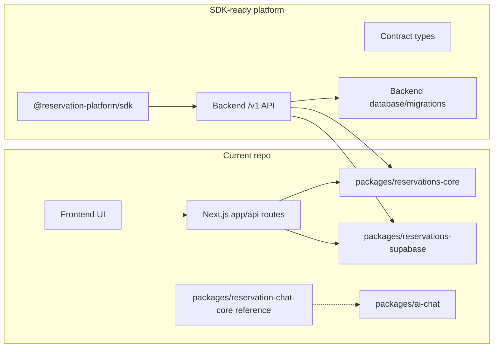

# SDK Readiness Plan

This folder explains what is still missing before this project can honestly be called a plug-and-play SDK.

The current repository already has reusable backend package foundations, but an SDK is different. The SDK should be a client package that external frontends install and use to call a standalone backend API. It should not contain booking rules, Supabase queries, or frontend UI.

## Current Versus Target



## What The SDK Should Be

The SDK should let another app do this:

```ts
const client = createReservationPlatformClient({
  baseUrl: "https://api.example.com",
  tenantId: "tenant_123",
  venueId: "venue_123",
  getAccessToken: async () => token,
});

await client.createReservation(input, {
  idempotencyKey: crypto.randomUUID(),
});
```

The SDK calls the backend. The backend owns reservation rules and persistence.

Current database migration status: Phase 5 has three read-only guardrails,
`database:verify-sql-ownership` for current SQL ownership inventory and
`database:verify-migration-bundle` for the planned backend migration bundle
shape plus the generated
`packages/database/migrations/supabase/migration-index.json` checksum/apply
index. They do not execute SQL, create a database, prove RLS or tenant
isolation, or prove live seeded backend parity.

Release gate status: `sdk:release-gate` is the local/planning gate and may skip
live backend parity when no live backend environment is configured. A publish
or pilot release candidate must use `sdk:release-gate:strict`, which re-runs the
normal gate and then requires `sdk:live-parity:strict` against a disposable
seeded `/v1` backend with mutation proof enabled. If strict live parity cannot
run, the SDK is still a local package candidate, not a completed plug-and-play
backend product.

## Phase Files

- [Phase 0: SDK Boundary Reset](phase-0-sdk-boundary-reset.md)
- [Phase 1: Backend API Prerequisite](phase-1-backend-api-prerequisite.md)
- [Phase 2: Contract Types Package](phase-2-contract-types-package.md)
- [Phase 3: SDK Package Scaffold](phase-3-sdk-package-scaffold.md)
- [Phase 4: Core SDK Methods](phase-4-core-sdk-methods.md)
- [Phase 5: Auth, Tenant, and Idempotency](phase-5-auth-tenant-idempotency.md)
- [Phase 6: Optional Chat SDK Namespace](phase-6-optional-chat-sdk.md)
- [Phase 7: External Consumer Smoke Tests](phase-7-external-consumer-smoke-tests.md)
- [Phase 8: Packaging, Versioning, and Release](phase-8-packaging-versioning-release.md)

## Non-Goals

- Do not put booking rules in the SDK.
- Do not let the SDK call Supabase directly.
- Do not move UI components into the SDK.
- Do not require external frontends to use Next.js.
- Do not publish before external consumer smoke tests pass.

## Change Propagation Rule

If any phase changes SDK method names, API endpoints, request/response types, auth headers, idempotency behavior, or package names, update all later phases before implementation continues.
