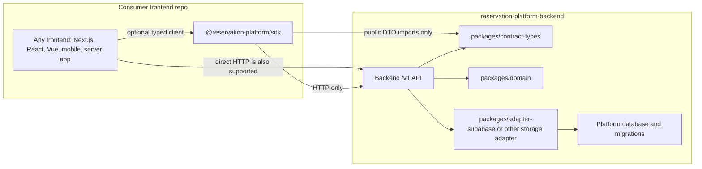
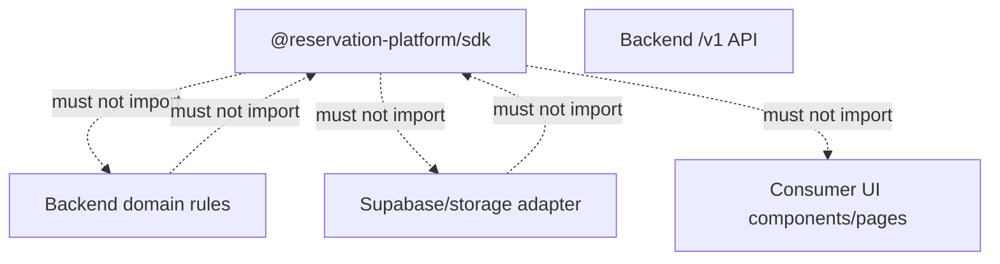

# Phase 0: SDK Boundary Reset

## Purpose

Reset the SDK plan before implementation work starts.

This repository does not yet contain a drop-into-any-frontend SDK. It contains
reusable backend foundations and planning docs. The target SDK is a client
package that external frontends install to call the backend platform `/v1` API.
It wraps HTTP, types, headers, idempotency options, and API error handling. It
does not own reservation rules, database access, migrations, Supabase adapters,
AI workflow internals, or UI.

Phase 0 is complete only when later subagents can tell which package owns each
responsibility and what assumptions they must preserve while implementing the
API, contract types, SDK package, examples, tests, and release docs.

## Current State Is Not An SDK

Current reusable foundations:

- `packages/reservations-core`: headless backend reservation domain logic.
- `packages/reservations-supabase`: Supabase storage adapter and SQL/RPC
  support.
- `packages/ai-chat`: backend-owned optional AI chat scaffold with
  provider-neutral workflow ports and public-safe events/errors.
- `packages/reservation-chat-core`: legacy headless chat contracts and tool
  helpers retained as compatibility/reference migration context.
- Current Next.js `app/api/**` routes: host-app route glue during migration.
- Current frontend pages/components: the first consumer frontend, not the
  reusable product.

These are not yet a frontend-facing SDK because they do not provide a stable,
installable client for a deployed backend API. A frontend should not need to
import these packages, copy these routes, know Supabase table/RPC names, or
reuse this app's Next.js structure to create reservations.

## Target Boundary

The backend platform is the product. The SDK is an optional client for that
platform. Consumer frontends may use either the SDK or direct HTTP, and direct
HTTP remains the source of truth.

Forbidden dependency direction:

## Package Boundary Definitions

| Boundary | Target package/app | Owns | Must not own |
| --- | --- | --- | --- |
| Backend platform API | `reservation-platform-backend/apps/api` | `/v1` HTTP routes, auth/tenant context, idempotency middleware, validation, OpenAPI publication, error serialization, application service orchestration. | React/Next.js UI, current `app/api/**` files copied verbatim, frontend routing assumptions. |
| Contract types | `reservation-platform-backend/packages/contract-types` | Public request/response DTOs, runtime schemas, error shapes, idempotency metadata, OpenAPI/JSON Schema inputs. | Booking rules, persistence, generated UI components, host-app display state. |
| Domain package | `reservation-platform-backend/packages/domain` | Reservation, availability, capacity, lifecycle, maintenance, policy, and conflict rules as backend logic. | HTTP parsing, SDK request helpers, Supabase clients, table/RPC names, React/Next.js code. |
| Storage adapter | `reservation-platform-backend/packages/adapter-supabase` initially | Supabase/Postgres row mapping, repository implementation, atomic persistence, adapter fixtures, compatibility mapping from legacy schema names. | API route ownership, frontend auth UX, SDK public methods, domain policy decisions. |
| Database package/assets | `reservation-platform-backend/packages/database` or backend-owned migrations path | Platform migrations, schema ownership, seed/test fixtures, migration runner hooks. | Consumer frontend data access or SDK-published database helpers. |
| SDK package | `reservation-platform-backend/packages/sdk`, published as `@reservation-platform/sdk` | Typed HTTP client, method-to-endpoint mapping, auth/tenant/venue/correlation/idempotency headers, API error preservation, optional module namespaces. | Reservation rules, availability calculations, lifecycle decisions, resource substitution, database queries, Supabase RPC calls, UI components. |
| Consumer frontend | Any external app, including this current Next.js app after migration | User experience, rendering, forms, labels, navigation, analytics UI, auth UX, calling `/v1` through HTTP or SDK. | Canonical reservation rules, backend persistence, database migrations, direct storage adapter calls. |

## Package Naming Proposal

Use the following names unless a later decision explicitly changes them and
updates all downstream docs:

- Backend repository: `reservation-platform-backend`.
- API app: `apps/api`.
- SDK source package: `packages/sdk`.
- Published SDK package: `@reservation-platform/sdk`.
- Contract types package: `@reservation-platform/contract-types` from
  `packages/contract-types`.
- Domain package: `@reservation-platform/domain` from `packages/domain`.
- Supabase adapter package: `@reservation-platform/adapter-supabase` from
  `packages/adapter-supabase`.

Rationale:

- The `@reservation-platform/*` scope matches the generic platform goal.
- `sdk` stays short for consumers while the source path remains clear.
- Contract types are separate so API, SDK, examples, and tests can share DTOs
  without importing backend rules.

## Forbidden SDK Dependencies

The SDK package must not depend on, import from, or require configuration for:

- `@supabase/supabase-js`, Supabase admin clients, browser/server Supabase
  helpers, raw table names, raw RPC names, SQL files, migrations, or service
  role keys.
- Backend storage adapters, including `packages/reservations-supabase`,
  `packages/adapter-supabase`, repository implementations, row adapters, and
  database fixtures.
- Backend domain packages, including `packages/reservations-core` or future
  `packages/domain`.
- Current app internals such as `app/**`, `components/**`, `lib/**`,
  `types/**` bridge files, `data/**`, route handlers, page components, or
  dashboard/admin/form/chat UI.
- React, React DOM, Next.js, server actions, `next/*`, route handler types,
  cookies/headers helpers, or UI component libraries.
- LangChain, vector-store adapters, AI provider SDKs, chat workflow services,
  or tool orchestration packages unless an optional SDK namespace is explicitly
  scoped to call a backend API endpoint without owning those internals.
- Payment provider SDKs unless the SDK method only passes typed payment
  reference payloads to backend `/v1` endpoints.
- Node-only APIs that would prevent use in browsers, unless isolated behind a
  documented optional server-only entrypoint.

Allowed SDK dependencies should be boring and consumer-safe:

- `packages/contract-types` public DTOs and schemas.
- Standard `fetch` or caller-provided `fetch`.
- Small runtime helpers for URL/query serialization, if needed.
- SDK-local error classes/predicates that preserve the API error object exactly.

## Required Decisions Before Implementation

Phase 0 records the default decisions, but implementation must confirm them
before code is created:

- Whether `@reservation-platform/sdk` is the final npm scope/name.
- Whether `@reservation-platform/contract-types` is published separately or
  bundled as a dependency of the SDK while still remaining its own source
  package.
- Whether the SDK is implemented first inside `reservation-platform-backend` or
  temporarily scaffolded in this repository during migration. Default:
  implement in `reservation-platform-backend/packages/sdk`.
- Whether SDK mutation methods reject missing idempotency keys client-side or
  always let the API return `missing_idempotency_key`. Default: preserve API
  behavior and add explicit helper validation only where documented.
- Whether optional namespaces such as `chat` and `payments` ship in the base SDK
  package, separate entrypoints, or companion packages.
- Whether SDK errors are thrown by default or returned through an opt-in result
  mode. Default: throw `PlatformError` while preserving the API error object.
- Which package owns OpenAPI generation. Current repository implementation:
  `packages/contract-types` owns generated
  `packages/contract-types/contracts/openapi.json` and
  `packages/contract-types/contracts/json-schema/*.schema.json`, with
  `contracts:check` enforcing drift; final backend publication can still move
  through the standalone API/contract package release workflow.
- Which environments the SDK must support. Default: modern browser and Node
  runtimes with caller-provided `fetch` fallback.

## Work Items For Later Subagents

1. Keep the SDK as an HTTP client over `/v1`; do not move backend rules into
   SDK files.
2. Create or update forbidden import checks in Phase 3 and Phase 7 so the SDK
   and external smoke examples cannot import backend/domain/adapter/UI code.
3. Keep method names aligned with `contracts/sdk-method-list.md`.
4. Keep endpoints aligned with `contracts/api-resource-list.md`.
5. Keep package paths aligned with
   `phase-4-api-layer-and-sdk-contract.md` and Phase 2 backend repo shape.
6. Treat direct HTTP parity tests as mandatory proof that the SDK does not
   change platform behavior.

## Deliverables

- This boundary reset document.
- Target package boundary table.
- SDK package naming proposal.
- Forbidden SDK dependency list.
- Required decision list for implementation subagents.
- Downstream update rules.

## Acceptance Criteria

- A later subagent can explain why the current repo foundations are not yet an
  SDK.
- A frontend developer understands that the SDK calls `/v1` only and can choose
  direct HTTP instead.
- The target dependency direction is documented with Mermaid diagrams.
- Backend platform, SDK package, contract types, storage adapter, database, and
  consumer frontend ownership are distinct.
- The package naming proposal is explicit enough for SDK readiness Phase 3,
  Phase 4, and Phase 8 to use.
- Forbidden SDK dependencies are listed concretely enough to become static
  import/dependency checks.
- Required implementation decisions are listed before code scaffolding starts.
- No SDK plan requires external frontends to import Supabase, Next.js, React UI,
  current app internals, backend domain rules, or storage adapters.
- Later phase docs know which files must be updated if Phase 0 assumptions
  change.

## Downstream Updates Required

This Phase 0 pass preserves the existing default assumptions already used by
the SDK readiness README, SDK readiness Phases 1 through 8, and the backend
extraction Phase 4 plan: `@reservation-platform/sdk`,
`reservation-platform-backend/packages/sdk`, `packages/contract-types`, direct
HTTP parity, `/v1` as source of truth, and no Supabase/React/Next.js imports in
the SDK.

If Phase 0 changes later, update these documents before implementation
continues:

- `docs/package-refactor/backend-platform-extraction/sdk-readiness/README.md`
- `docs/package-refactor/backend-platform-extraction/sdk-readiness/phase-1-backend-api-prerequisite.md`
- `docs/package-refactor/backend-platform-extraction/sdk-readiness/phase-2-contract-types-package.md`
- `docs/package-refactor/backend-platform-extraction/sdk-readiness/phase-3-sdk-package-scaffold.md`
- `docs/package-refactor/backend-platform-extraction/sdk-readiness/phase-4-core-sdk-methods.md`
- `docs/package-refactor/backend-platform-extraction/sdk-readiness/phase-5-auth-tenant-idempotency.md`
- `docs/package-refactor/backend-platform-extraction/sdk-readiness/phase-6-optional-chat-sdk.md`
- `docs/package-refactor/backend-platform-extraction/sdk-readiness/phase-7-external-consumer-smoke-tests.md`
- `docs/package-refactor/backend-platform-extraction/sdk-readiness/phase-8-packaging-versioning-release.md`
- `docs/package-refactor/backend-platform-extraction/phase-2-standalone-backend-repo-shape.md`
- `docs/package-refactor/backend-platform-extraction/phase-4-api-layer-and-sdk-contract.md`
- `docs/package-refactor/backend-platform-extraction/phase-8-external-frontend-proofs.md`
- `docs/package-refactor/backend-platform-extraction/phase-9-release-deployment-operations.md`
- `docs/package-refactor/backend-platform-extraction/contracts/sdk-method-list.md`
- `docs/package-refactor/backend-platform-extraction/contracts/api-resource-list.md`

At minimum, propagate changes to:

- SDK package name, npm scope, source path, and public export names.
- Contract types package name or publishing strategy.
- API endpoint names, `/v1` versioning, or direct HTTP parity requirements.
- Auth, tenant, venue, correlation, and idempotency behavior.
- Forbidden dependencies or allowed SDK runtime environments.
- Optional namespace packaging for chat, payments, or future modules.
