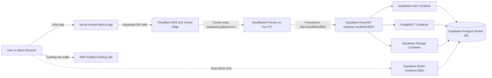
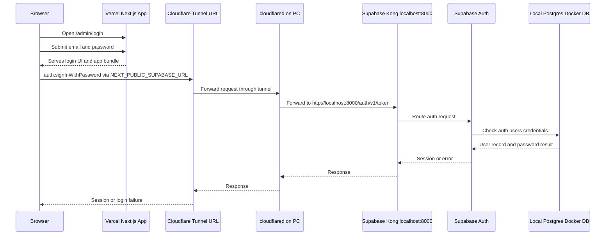
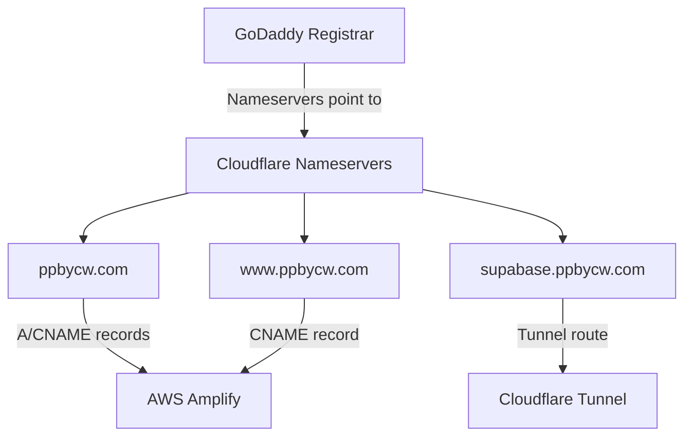
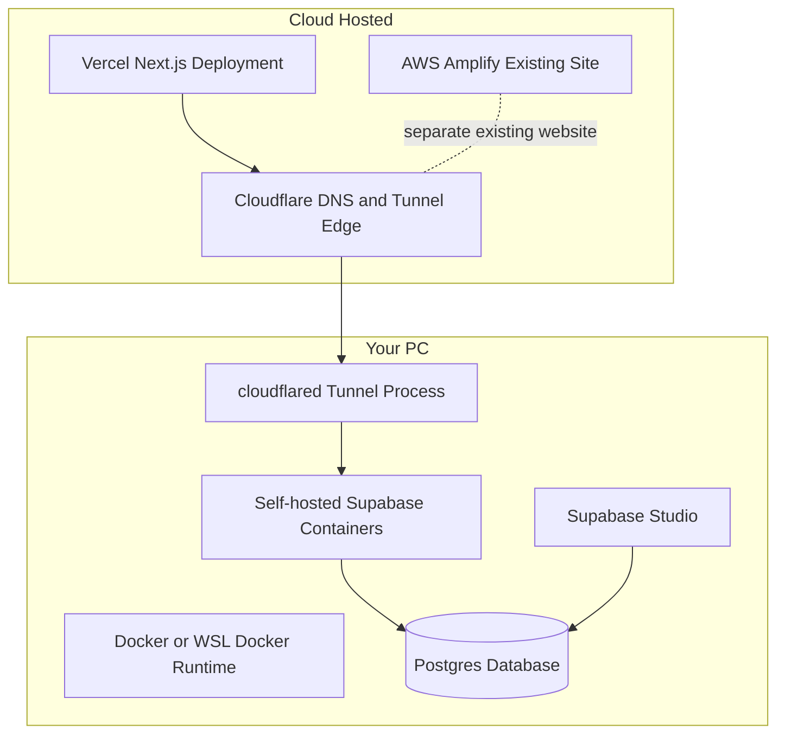
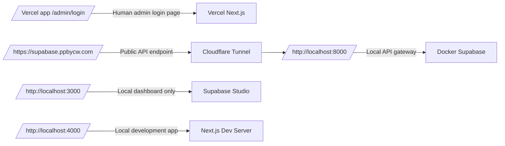
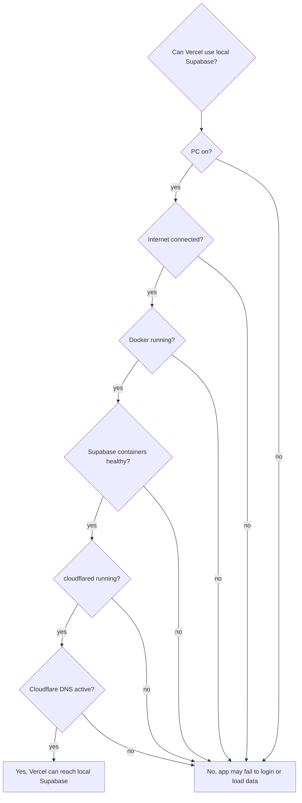

# Local Supabase Architecture

This document contains Mermaid diagrams for the current local Docker Supabase testing setup.

## High-Level Architecture

## Request Flow From Vercel To Local Supabase

## DNS Ownership

## What Is Local Versus Cloud Hosted

## URL Map

## Availability Dependency

