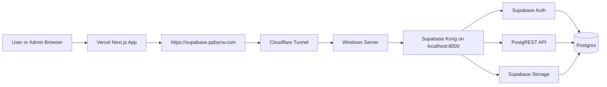

# Server Supabase Hosting Guide

This guide explains how to host your self-hosted Supabase setup on your own Windows server instead of your daily-use PC.

Use this when you want this flow:

```text
Vercel app -> https://supabase.ppbycw.com -> Cloudflare Tunnel -> your Windows server -> Supabase Docker containers
```

The server replaces your current PC as the machine running Supabase.

## Important Summary

Self-hosting Supabase on your server avoids Supabase Cloud hosting charges, but you become responsible for uptime, backups, security, and maintenance.

Your server must stay on for the deployed app to work.

## Recommended Server Setup

Your server hardware is suitable:

```text
CPU: i5-12400
RAM: 16 GB
Storage: 500 GB
OS: Windows Server or Windows with WSL2
```

This is enough for your reservation app, admin dashboard, chat booking, blog CMS, storage, auth, and vector search for the current scale.

## What Will Run On The Server

The server will run:

- Docker Desktop or Docker Engine through WSL2
- Ubuntu WSL
- Supabase Docker containers
- Postgres database
- Supabase Auth
- Supabase Storage
- Supabase REST API
- Supabase Realtime
- Supabase Studio, preferably local/admin-only
- Cloudflare Tunnel

Vercel will continue to host the Next.js app.

## URLs

| URL | Purpose | Hosted Where |
| --- | --- | --- |
| `https://supabase.ppbycw.com` | Public Supabase API URL | Cloudflare Tunnel to your server |
| `http://localhost:8000` | Supabase API from inside the server | Server Docker |
| `http://localhost:3000` | Supabase Studio, if exposed | Server Docker |
| `https://your-vercel-app.vercel.app` | Reservation app frontend/API routes | Vercel |

Do not set Vercel to `http://localhost:8000`. On Vercel, `localhost` means Vercel itself, not your server.

## Step 1: Prepare Windows Server

Install Windows updates first.

Then enable WSL2.

Open PowerShell as Administrator:

```powershell
wsl --install -d Ubuntu
```

Restart the server if Windows asks.

Open Ubuntu and create your Linux user account.

Update Ubuntu:

```bash
sudo apt update
sudo apt upgrade -y
```

## Step 2: Install Docker

For a Windows server, the easiest route is Docker Desktop if the server has GUI access.

Install Docker Desktop:

```powershell
winget install Docker.DockerDesktop
```

Open Docker Desktop and make sure WSL integration is enabled for Ubuntu.

If you prefer a more server-like setup, install Docker Engine inside Ubuntu WSL instead. Docker Desktop is simpler for your current workflow.

## Step 3: Clone Supabase Docker Files

In Ubuntu WSL on the server:

```bash
mkdir -p ~/self-hosted
cd ~/self-hosted
git clone --depth 1 https://github.com/supabase/supabase.git
cd supabase/docker
cp .env.example .env
```

Open `.env` for editing:

```bash
nano .env
```

Set strong values for:

```env
POSTGRES_PASSWORD=<strong database password>
JWT_SECRET=<long random jwt secret>
SITE_URL=https://your-vercel-app.vercel.app
API_EXTERNAL_URL=https://supabase.ppbycw.com
```

Generate local anon and service role keys from the same `JWT_SECRET`, then set:

```env
ANON_KEY=<generated anon key>
SERVICE_ROLE_KEY=<generated service role key>
```

Never commit these values to git.

## Step 4: Start Supabase On The Server

From the Supabase Docker folder:

```bash
cd ~/self-hosted/supabase/docker
docker compose up -d
```

Check containers:

```bash
docker ps
```

You should see containers like:

```text
supabase-kong
supabase-auth
supabase-db
supabase-rest
supabase-storage
supabase-studio
supabase-pooler
```

Test the local API from the server:

```bash
curl -i http://localhost:8000
```

A `401` or API response is okay. It means Kong is responding.

## Step 5: Apply Project Database SQL

Your app needs its own tables and policies.

Run SQL in this order:

1. `supabase/base-schema.sql` for extensions, base tables, indexes, triggers, and default services.
2. `supabase/create-reservation-atomic.sql` for the transaction-safe booking RPC used by `POST /api/bookings`.
3. `supabase/reservations-rls.sql` for RLS enablement and reservation policies.
4. `supabase/knowledge.sql`.
5. `supabase/sales-reports.sql`.
6. `supabase/langchain.sql`.
7. `supabase/blogs.sql`.

You can use `psql` from the server:

```bash
docker exec -it supabase-db psql -U postgres -d postgres
```

Then paste or run the SQL files.

Do not run `supabase/create-reservation-atomic.sql` or `supabase/reservations-rls.sql` before `supabase/base-schema.sql` succeeds. If you already ran other feature SQL files first, run `base-schema.sql` now, then rerun `create-reservation-atomic.sql` and `reservations-rls.sql`.

## Step 6: Seed Knowledge Data

On your development PC, point `.env` to the server public URL after the tunnel is ready:

```env
NEXT_PUBLIC_SUPABASE_URL=https://supabase.ppbycw.com
NEXT_PUBLIC_SUPABASE_ANON_KEY=<server anon key>
GOOGLE_GENERATIVE_AI_API_KEY=<your existing key>
```

Then run from the app project folder:

```powershell
pnpm seed:knowledge
```

This seeds `data/knowledge.md` into the self-hosted Supabase vector table.

## Step 7: Install Cloudflared On The Server

On the Windows server, install `cloudflared`:

```powershell
winget install Cloudflare.cloudflared
```

Close and reopen PowerShell, then check:

```powershell
cloudflared --version
```

Log in:

```powershell
cloudflared tunnel login
```

Create the tunnel if it does not already exist:

```powershell
cloudflared tunnel create local-supabase
```

Route the DNS name:

```powershell
cloudflared tunnel route dns local-supabase supabase.ppbycw.com
```

## Step 8: Run Cloudflare Tunnel As A Service

For server hosting, do not leave a manual terminal window open. Install the tunnel as a Windows service.

Run PowerShell as Administrator:

```powershell
cloudflared service install
```

Then create or edit the Cloudflare config file.

Common Windows location:

```text
C:\Windows\System32\config\systemprofile\.cloudflared\config.yml
```

Example config:

```yaml
tunnel: local-supabase
credentials-file: C:\Windows\System32\config\systemprofile\.cloudflared\<tunnel-id>.json

ingress:
  - hostname: supabase.ppbycw.com
    service: http://localhost:8000
  - service: http_status:404
```

Restart the service:

```powershell
Restart-Service cloudflared
```

Check status:

```powershell
Get-Service cloudflared
```

Test public URL:

```powershell
Invoke-WebRequest -Uri "https://supabase.ppbycw.com/auth/v1/health" -UseBasicParsing
```

If you get a response, the tunnel is reachable.

## Step 9: Update Vercel Environment Variables

In Vercel project settings, set:

```env
NEXT_PUBLIC_SUPABASE_URL=https://supabase.ppbycw.com
NEXT_PUBLIC_SUPABASE_ANON_KEY=<server anon key>
SUPABASE_SERVICE_ROLE_KEY=<server service role key>
```

Keep these unchanged unless you rotate them:

```env
OPENROUTER_API_KEY=<existing key>
GOOGLE_GENERATIVE_AI_API_KEY=<existing key>
```

Redeploy the Vercel app after changing environment variables.

Never put the service role key in a `NEXT_PUBLIC_` variable.

## Step 10: Create Auth Users

The admin login uses Supabase Auth users from the server database.

Existing Supabase Cloud users do not automatically exist on your server unless you migrate them.

Create or reset users in self-hosted Supabase Auth.

You can use Supabase Studio if available, or the Admin API with the service role key.

Your app login page is still:

```text
https://your-vercel-app.vercel.app/admin/login
```

Do not use `https://supabase.ppbycw.com` as the login page. That is the backend API URL.

## Step 11: Backup Plan

Backups are mandatory for self-hosting.

Create a backups folder on the server:

```powershell
mkdir C:\supabase-backups
```

Manual database backup from PowerShell:

```powershell
docker exec supabase-db pg_dump -U postgres -d postgres > C:\supabase-backups\supabase-%DATE%.sql
```

Manual storage backup depends on the Docker volume or storage path used by your Supabase Docker setup.

At minimum, back up:

- Postgres dump
- Supabase storage volume
- Supabase Docker `.env`
- Cloudflare tunnel credentials
- SQL migration files from this repo

Recommended schedule:

- Daily database backup
- Weekly full server/storage backup
- Monthly restore test

Do not keep the only backup on the same disk as the server.

## Step 12: Server Restart Checklist

After rebooting the server, check:

```powershell
Get-Service cloudflared
```

Then in WSL:

```bash
cd ~/self-hosted/supabase/docker
docker ps
```

If Supabase is not running:

```bash
docker compose up -d
```

Test:

```powershell
Invoke-WebRequest -Uri "https://supabase.ppbycw.com/auth/v1/health" -UseBasicParsing
```

Then test the Vercel app login page.

## Security Checklist

Do these before treating the server as production-like:

- Use strong `POSTGRES_PASSWORD` and `JWT_SECRET`.
- Keep `SERVICE_ROLE_KEY` private.
- Do not expose Supabase Studio publicly.
- Keep Windows, Docker, WSL, and Ubuntu packages updated.
- Enable Windows Firewall.
- Do not open Postgres directly to the public internet.
- Use Cloudflare Tunnel for HTTPS access to Kong/API only.
- Store backups outside the server.
- Test restore before relying on backups.
- Monitor disk usage.

## Maintenance Commands

Check containers:

```bash
docker ps
```

View container logs:

```bash
docker logs supabase-kong --tail 100
docker logs supabase-auth --tail 100
docker logs supabase-db --tail 100
```

Restart Supabase containers:

```bash
cd ~/self-hosted/supabase/docker
docker compose restart
```

Stop Supabase safely:

```bash
docker compose stop
```

Do not run this unless you intentionally want to remove local database/storage volumes:

```bash
docker compose down -v
```

The `-v` flag can delete your local Supabase data.

## Troubleshooting

### Vercel Cannot Login Or Load Data

Check in order:

1. Is the server powered on?
2. Is Docker running?
3. Are Supabase containers running?
4. Is the `cloudflared` service running?
5. Does `https://supabase.ppbycw.com/auth/v1/health` respond?
6. Did Vercel get redeployed after env var changes?
7. Does the Auth user exist in the server Supabase database?

### `supabase.ppbycw.com` Does Not Respond

Check Cloudflare Tunnel:

```powershell
Get-Service cloudflared
```

Restart it:

```powershell
Restart-Service cloudflared
```

Check local API on the server:

```powershell
Invoke-WebRequest -Uri "http://localhost:8000" -UseBasicParsing
```

### Invalid Login Credentials

Use a Supabase Auth user from the server database.

Do not use these as login passwords:

- `ANON_KEY`
- `SERVICE_ROLE_KEY`
- `POSTGRES_PASSWORD`
- `JWT_SECRET`

### Database Tables Missing

Apply SQL in the correct order:

```text
base-schema.sql -> create-reservation-atomic.sql -> reservations-rls.sql -> knowledge.sql -> sales-reports.sql -> langchain.sql -> blogs.sql
```

If a policy says `public.services`, `public.venues`, or `public.bookings` does not exist, run `supabase/base-schema.sql` first, then rerun `supabase/create-reservation-atomic.sql` and `supabase/reservations-rls.sql`.

## Final Architecture



## When This Setup Is Good Enough

This setup is good for:

- Private/internal admin usage
- Early production testing
- Avoiding Supabase Cloud costs
- Learning self-hosted deployment
- Small traffic workloads

Before using it for serious public production, add:

- Automated backups
- Restore testing
- Monitoring
- Server UPS or reliable hosting
- Security hardening
- Clear update procedure
