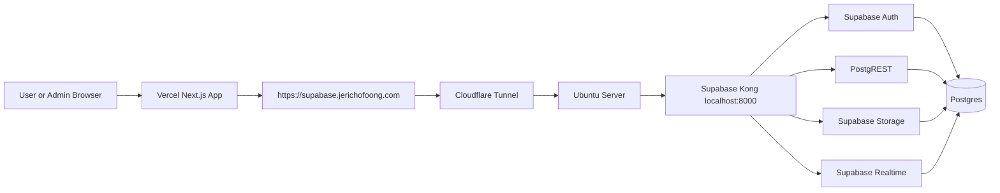

# Ubuntu Server Supabase Hosting Guide

This guide explains how to host your self-hosted Supabase on an Ubuntu server and expose it to your Vercel app through Cloudflare Tunnel.

Use this setup:

```text
Vercel app -> https://supabase.jerichofoong.com -> Cloudflare Tunnel -> Ubuntu server -> Supabase Docker
```

## What This Replaces

Your current testing setup runs Supabase on your PC. This guide moves Supabase to your Ubuntu server so the app does not depend on your daily computer being on.

You still need the server to stay online.

## What You Need

- Ubuntu installed on the server.
- SSH access to the server.
- A Cloudflare account with `jerichofoong.com` active.
- `supabase.jerichofoong.com` reserved for Supabase API traffic.
- Your local Supabase `.env` values or new production-like values.
- Your app repo available on your development PC.

## Final URL Plan

| URL | Purpose |
| --- | --- |
| `https://supabase.jerichofoong.com` | Public Supabase API for Vercel and browser clients |
| `http://localhost:8000` | Supabase API inside the Ubuntu server |
| `http://localhost:3000` | Supabase Studio on the Ubuntu server, if exposed locally |
| `https://your-vercel-app.vercel.app` | Your deployed Next.js app |

Do not use `http://localhost:8000` in Vercel. On Vercel, `localhost` means Vercel itself.

## Step 1: SSH Into The Server

From your Windows PC, open PowerShell:

```powershell
ssh your-user@your-server-ip
```

Replace:

- `your-user` with your Ubuntu username.
- `your-server-ip` with your server IP address.

Once connected, you should see an Ubuntu shell prompt.

## Step 2: Update Ubuntu

Run:

```bash
sudo apt update
sudo apt upgrade -y
sudo apt install -y ca-certificates curl gnupg git nano ufw
```

Reboot if Ubuntu asks:

```bash
sudo reboot
```

Then SSH back in.

## Step 3: Install Docker Engine

Install Docker's official apt repository:

```bash
sudo install -m 0755 -d /etc/apt/keyrings
curl -fsSL https://download.docker.com/linux/ubuntu/gpg | sudo gpg --dearmor -o /etc/apt/keyrings/docker.gpg
sudo chmod a+r /etc/apt/keyrings/docker.gpg
```

Add the Docker repository:

```bash
echo \
  "deb [arch=$(dpkg --print-architecture) signed-by=/etc/apt/keyrings/docker.gpg] https://download.docker.com/linux/ubuntu \
  $(. /etc/os-release && echo "$VERSION_CODENAME") stable" | \
  sudo tee /etc/apt/sources.list.d/docker.list > /dev/null
```

Install Docker:

```bash
sudo apt update
sudo apt install -y docker-ce docker-ce-cli containerd.io docker-buildx-plugin docker-compose-plugin
```

Enable Docker on boot:

```bash
sudo systemctl enable docker
sudo systemctl start docker
```

Allow your user to run Docker without `sudo`:

```bash
    sudo usermod -aG docker $USER
```

Log out and SSH back in so the Docker group applies:

```bash
exit
```

Reconnect, then test:

```bash
docker --version
docker compose version
docker run hello-world
```

## Step 4: Download Supabase Docker

Create a self-hosted folder:

```bash
mkdir -p ~/self-hosted
cd ~/self-hosted
```

Clone Supabase:

```bash
git clone --depth 1 https://github.com/supabase/supabase.git
cd supabase/docker
cp .env.example .env
```

Confirm files exist:

```bash
ls
```

You should see:

```text
docker-compose.yml
.env
```

## Step 5: Configure Supabase Environment

Open `.env`:

```bash
nano .env
```

Set strong values:

```env
POSTGRES_PASSWORD=<strong database password>
JWT_SECRET=<long random jwt secret>
SITE_URL=https://your-vercel-app.vercel.app
API_EXTERNAL_URL=https://supabase.jerichofoong.com
```

Set your generated Supabase keys:

```env
ANON_KEY=<generated anon key>
SERVICE_ROLE_KEY=<generated service role key>
```

Important:

- `JWT_SECRET`, `ANON_KEY`, and `SERVICE_ROLE_KEY` must match each other.
- If you change `JWT_SECRET`, regenerate both keys.
- Never commit these values to git.
- Never put `SERVICE_ROLE_KEY` in a `NEXT_PUBLIC_` variable.

Save in nano:

```text
Ctrl + O
Enter
Ctrl + X
```

## Step 6: Start Supabase

From the Supabase Docker folder:

```bash
cd ~/self-hosted/supabase/docker
docker compose up -d
```

Check containers:

```bash
docker ps
```

You should see containers like:

```text
supabase-kong
supabase-auth
supabase-db
supabase-rest
supabase-storage
supabase-realtime
supabase-studio
supabase-pooler
```

Test the local API:

```bash
curl -i http://localhost:8000
```

A `401 Unauthorized`, `404`, or JSON response is acceptable. The important part is that the service responds.

## Step 7: Apply Project SQL

Your app needs its database tables, functions, policies, and extensions.

Apply SQL in this order:

1. `supabase/base-schema.sql` for extensions, base tables, indexes, triggers, and default services.
2. `supabase/reservations-rls.sql` for RLS enablement and booking/service policies.
3. `supabase/knowledge.sql`.
4. `supabase/sales-reports.sql`.
5. `supabase/langchain.sql`.
6. `supabase/blogs.sql`.

Open Postgres inside the Supabase DB container:

```bash
docker exec -it supabase-db psql -U postgres -d postgres
```

Then paste SQL or run files from a mounted/copied location.

Do not run `supabase/reservations-rls.sql` before `supabase/base-schema.sql` succeeds.

If you see this error:

```text
relation "public.services" does not exist
```

It means the base tables were not created yet.

### Step 7.1: Create Base Tables First

Before running the RLS policy script, run this repo file:

```text
supabase/base-schema.sql
```

This creates the tables that the RLS script depends on:

```text
public.services
public.venues
public.equipment
public.bookings
```

It also inserts the default catalogue rows for:

```text
Racing Simulator
Playstation 5
Project Play by CW venue
```

If you are inside `psql`, paste the contents of `supabase/base-schema.sql` first. If the file is available on the server, you can run it with:

```sql
\i /path/to/reservation-app/supabase/base-schema.sql
```

Successful output should include lines like:

```text
CREATE TABLE
CREATE INDEX
CREATE TRIGGER
INSERT 0 1
```

If you already ran some feature SQL files first, that is okay. Run `base-schema.sql` now, then rerun `reservations-rls.sql`.

### Step 7.2: Run Reservation RLS Policies

After the base tables exist, run this file from the repo:

```text
supabase/reservations-rls.sql
```

The SQL is:

```sql
-- Reservation app RLS hardening template.
-- Review in the Supabase SQL editor before running.
--
-- Security intent:
-- - Services, venues, and equipment are public catalogue data.
-- - Public customers can create bookings through the app.
-- - Only authenticated admins can list, inspect, update, or cancel bookings.
--
-- Important compatibility note:
-- This template intentionally does not grant anon SELECT on public.bookings
-- because that would expose customer names and emails to anyone with the anon key.
-- Apply it only after SUPABASE_SERVICE_ROLE_KEY is configured for the app so
-- server API routes can perform private availability and booking checks.

alter table public.services enable row level security;
alter table public.venues enable row level security;
alter table public.bookings enable row level security;

do $$
begin
  if to_regclass('public.equipment') is not null then
    execute 'alter table public.equipment enable row level security';
  end if;
end $$;

drop policy if exists "Public can read services" on public.services;
create policy "Public can read services"
on public.services
for select
to anon, authenticated
using (true);

drop policy if exists "Authenticated admins can manage services" on public.services;
create policy "Authenticated admins can manage services"
on public.services
for all
to authenticated
using (true)
with check (true);

drop policy if exists "Public can read venues" on public.venues;
create policy "Public can read venues"
on public.venues
for select
to anon, authenticated
using (true);

drop policy if exists "Authenticated admins can manage venues" on public.venues;
create policy "Authenticated admins can manage venues"
on public.venues
for all
to authenticated
using (true)
with check (true);

do $$
begin
  if to_regclass('public.equipment') is not null then
    execute 'drop policy if exists "Public can read equipment" on public.equipment';
    execute 'create policy "Public can read equipment" on public.equipment for select to anon, authenticated using (true)';
    execute 'drop policy if exists "Authenticated admins can manage equipment" on public.equipment';
    execute 'create policy "Authenticated admins can manage equipment" on public.equipment for all to authenticated using (true) with check (true)';
  end if;
end $$;

drop policy if exists "Public can create bookings" on public.bookings;
create policy "Public can create bookings"
on public.bookings
for insert
to anon, authenticated
with check (
  status = 'confirmed'
  and interface_type in ('form', 'chat')
);

drop policy if exists "Authenticated admins can manage bookings" on public.bookings;
create policy "Authenticated admins can manage bookings"
on public.bookings
for all
to authenticated
using (true)
with check (true);
```

Successful output should include lines like:

```text
ALTER TABLE
CREATE POLICY
DROP POLICY
```

`DROP POLICY` notices are okay if the policies did not exist yet.

### Step 7.3: Run Remaining SQL Files

After the reservation RLS script succeeds, run:

```text
supabase/knowledge.sql
supabase/sales-reports.sql
supabase/langchain.sql
supabase/blogs.sql
```

The `knowledge.sql` notice about `ivfflat index created with little data` is okay during first setup. It only means the `knowledge_chunks` table is still empty before seeding.

## Step 8: Seed Knowledge Embeddings

Run this from your app project folder on your development PC, not from the Ubuntu server, unless the app repo is also cloned there.

Set your app `.env` to point to the server Supabase URL:

```env
NEXT_PUBLIC_SUPABASE_URL=https://supabase.jerichofoong.com
NEXT_PUBLIC_SUPABASE_ANON_KEY=<server anon key>
GOOGLE_GENERATIVE_AI_API_KEY=<your Gemini key>
```

Then run:

```powershell
pnpm seed:knowledge
```

This fills the `knowledge_chunks` table used by chat/RAG.

## Step 9: Install Cloudflared On Ubuntu

Install Cloudflare Tunnel:

```bash
curl -L --output cloudflared.deb https://github.com/cloudflare/cloudflared/releases/latest/download/cloudflared-linux-amd64.deb
sudo dpkg -i cloudflared.deb
cloudflared --version
```

Log in to Cloudflare:

```bash
cloudflared tunnel login
```

This prints a URL. Open it in your browser, choose your Cloudflare domain, and authorize the tunnel.

Create the tunnel:

```bash
cloudflared tunnel create local-supabase
```

Route DNS:

```bash
cloudflared tunnel route dns local-supabase supabase.jerichofoong.com
```

## Step 10: Configure Cloudflare Tunnel

Create the config folder:

```bash
mkdir -p ~/.cloudflared
```

Find your tunnel ID:

```bash
cloudflared tunnel list
```

Create the config:

```bash
nano ~/.cloudflared/config.yml
```

Use this template:

```yaml
tunnel: <your-tunnel-id>
credentials-file: /home/<your-user>/.cloudflared/<your-tunnel-id>.json

ingress:
  - hostname: supabase.jerichofoong.com
    service: http://localhost:8000
  - service: http_status:404
```

Replace:

- `<your-tunnel-id>` with the real tunnel ID.
- `<your-user>` with your Ubuntu username.

Test the tunnel manually:

```bash
cloudflared tunnel run local-supabase
```

Leave it running, then from another terminal or your PC test:

```bash
curl -i https://supabase.jerichofoong.com/auth/v1/health
```

If it responds, press `Ctrl + C` in the tunnel terminal and continue to service setup.

## Step 11: Run Tunnel As A Service

Install the tunnel as a system service:

```bash
sudo cloudflared service install
```

Copy your config and credentials for the service if needed:

```bash
sudo mkdir -p /etc/cloudflared
sudo cp ~/.cloudflared/config.yml /etc/cloudflared/config.yml
sudo cp ~/.cloudflared/*.json /etc/cloudflared/
```

If your `config.yml` uses `/home/<your-user>/.cloudflared/...`, either keep that path readable or update it to `/etc/cloudflared/<your-tunnel-id>.json`.

Recommended service config path:

```yaml
tunnel: <your-tunnel-id>
credentials-file: /etc/cloudflared/<your-tunnel-id>.json

ingress:
  - hostname: supabase.jerichofoong.com
    service: http://localhost:8000
  - service: http_status:404
```

Restart and enable the service:

```bash
sudo systemctl enable cloudflared
sudo systemctl restart cloudflared
sudo systemctl status cloudflared
```

Test public API:

```bash
curl -i https://supabase.jerichofoong.com/auth/v1/health
```

## Step 12: Configure Firewall

Cloudflare Tunnel means you do not need to expose Supabase ports publicly.

Allow SSH:

```bash
sudo ufw allow OpenSSH
```

Enable firewall:

```bash
sudo ufw enable
sudo ufw status
```

Do not publicly open Postgres `5432` unless you know exactly why.

Do not publicly expose Supabase Studio unless protected.

## Step 13: Update Vercel Environment Variables

In Vercel project settings, set:

```env
NEXT_PUBLIC_SUPABASE_URL=https://supabase.jerichofoong.com
NEXT_PUBLIC_SUPABASE_ANON_KEY=<server anon key>
SUPABASE_SERVICE_ROLE_KEY=<server service role key>
```

Keep existing AI keys:

```env
OPENROUTER_API_KEY=<existing key>
GOOGLE_GENERATIVE_AI_API_KEY=<existing key>
```

Then redeploy the Vercel app.

## Step 14: Create Or Migrate Auth Users

Your app login uses Supabase Auth users on this Ubuntu server.

Users from Supabase Cloud or your PC setup do not automatically exist here unless migrated.

You can create users through:

- Supabase Studio, if accessible locally.
- Supabase Auth Admin API with service role key.
- SQL/manual migration if you know the Auth schema requirements.

Your app login page is the Vercel app:

```text
https://your-vercel-app.vercel.app/admin/login
```

Not this:

```text
https://supabase.jerichofoong.com
```

The Supabase URL is an API endpoint, not the app login page.

## Step 15: Backups

Create a backups folder:

```bash
sudo mkdir -p /srv/supabase-backups
sudo chown $USER:$USER /srv/supabase-backups
```

Manual database backup:

```bash
docker exec supabase-db pg_dump -U postgres -d postgres > /srv/supabase-backups/supabase-$(date +%F-%H%M).sql
```

Check backup file:

```bash
ls -lh /srv/supabase-backups
```

Minimum things to back up:

- Postgres database dump.
- Supabase Storage volume/data.
- `~/self-hosted/supabase/docker/.env`.
- Cloudflare tunnel credentials.
- Your project SQL files.

Do not keep the only backup on the same server disk.

Copy backups to another machine or cloud storage.

## Step 16: Restore Test

At least once, test that a backup can restore into a separate test database/server.

Backup that has never been restored is only a guess.

## Daily Operation Commands

SSH into server:

```powershell
ssh your-user@your-server-ip
```

Check Supabase containers:

```bash
docker ps
```

Start Supabase:

```bash
cd ~/self-hosted/supabase/docker
docker compose up -d
```

Stop Supabase safely:

```bash
docker compose stop
```

Restart Supabase:

```bash
docker compose restart
```

Check Cloudflare Tunnel service:

```bash
sudo systemctl status cloudflared
```

Restart tunnel:

```bash
sudo systemctl restart cloudflared
```

View tunnel logs:

```bash
sudo journalctl -u cloudflared -n 100 --no-pager
```

View Supabase logs:

```bash
docker logs supabase-kong --tail 100
docker logs supabase-auth --tail 100
docker logs supabase-db --tail 100
```

## Server Restart Checklist

After reboot:

```bash
docker ps
sudo systemctl status cloudflared
curl -i http://localhost:8000
curl -i https://supabase.jerichofoong.com/auth/v1/health
```

Then test your Vercel app login page.

## Troubleshooting

### `docker: permission denied`

Add your user to the Docker group:

```bash
sudo usermod -aG docker $USER
exit
```

SSH back in and try again.

### `supabase.jerichofoong.com` Does Not Respond

Check local Supabase first:

```bash
curl -i http://localhost:8000
```

If local works, check tunnel:

```bash
sudo systemctl status cloudflared
sudo journalctl -u cloudflared -n 100 --no-pager
```

Restart tunnel:

```bash
sudo systemctl restart cloudflared
```

### Vercel Cannot Login

Check:

1. Vercel env `NEXT_PUBLIC_SUPABASE_URL` is `https://supabase.jerichofoong.com`.
2. Vercel anon key matches this server's `ANON_KEY`.
3. Vercel service role key matches this server's `SERVICE_ROLE_KEY`.
4. Vercel was redeployed after env changes.
5. Auth user exists on this server Supabase.
6. Tunnel and Supabase containers are running.

### Tables Are Missing

Apply SQL in this order:

```text
base-schema.sql -> reservations-rls.sql -> knowledge.sql -> sales-reports.sql -> langchain.sql -> blogs.sql
```

If a script complains that `public.services`, `public.venues`, or `public.bookings` does not exist, run `supabase/base-schema.sql` first, then rerun `supabase/reservations-rls.sql`.

### Studio Does Not Open

Studio may not be exposed to the host.

The API can still work through port `8000` even if Studio is unavailable.

Keep Studio private. Do not route it through `supabase.jerichofoong.com` unless you add proper access protection.

## Security Checklist

- Use strong passwords and secrets.
- Keep `SERVICE_ROLE_KEY` private.
- Do not open Postgres publicly.
- Do not expose Studio publicly.
- Keep Ubuntu updated.
- Keep Docker images updated intentionally.
- Enable firewall with SSH allowed.
- Back up database and storage.
- Test restore.
- Monitor disk usage.

## Architecture Diagram



## Recommended Next Steps

1. Finish Docker and Supabase setup on the Ubuntu server.
2. Confirm `http://localhost:8000` works on the server.
3. Configure Cloudflare Tunnel as a service.
4. Confirm `https://supabase.jerichofoong.com/auth/v1/health` responds.
5. Update Vercel env vars.
6. Redeploy Vercel.
7. Create or migrate Auth users.
8. Test admin login and bookings.
9. Set up backups before relying on it.
