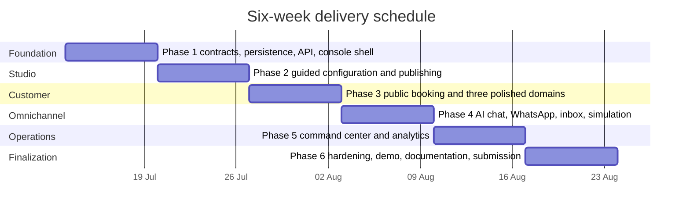
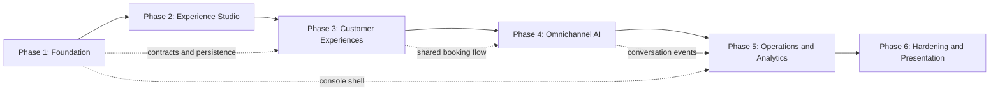
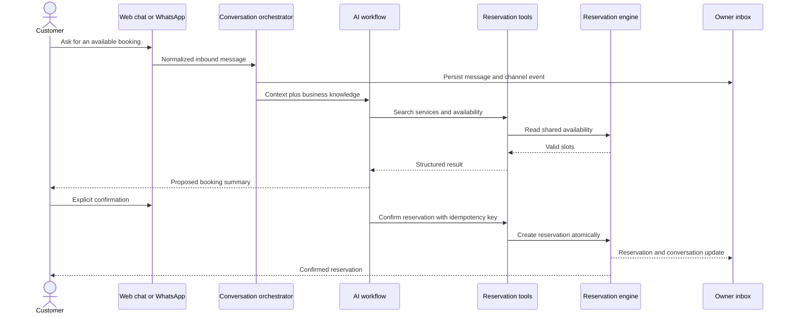
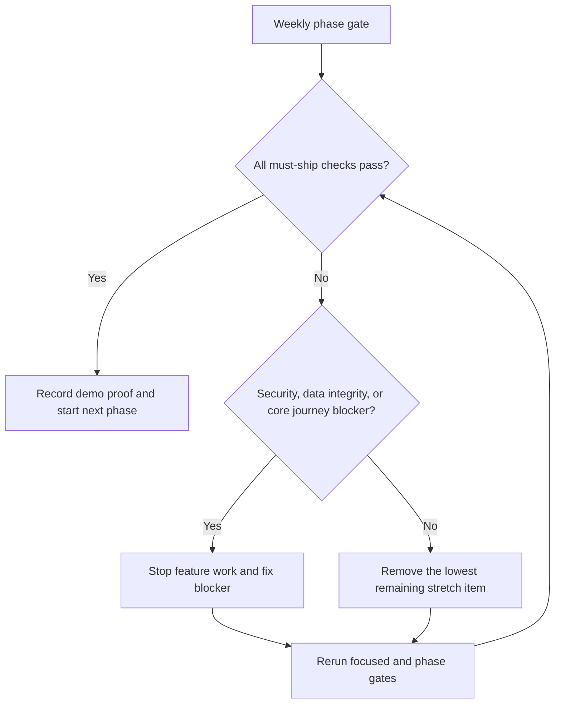

# Reservation Experience Platform Complete Six-Week Implementation Roadmap

> **For agentic workers:** REQUIRED SUB-SKILL: Use superpowers:subagent-driven-development (recommended) or superpowers:executing-plans to implement this plan task-by-task. Steps use checkbox (`- [ ]`) syntax for tracking.

**Goal:** Turn the modular reservation monorepo into a polished, demonstrable Experience Studio and AI Operations Command Center within six weeks.

**Architecture:** Extend the existing contract → framework-neutral API → Supabase adapter → standalone API → SDK → React application boundaries. A new `apps/console` owner application configures and operates each venue, while a configurable public application uses the same reservation, availability, AI chat, and WhatsApp modules. Every week ends with a working vertical slice and preserves deterministic demo fallbacks.

**Tech Stack:** pnpm 10.33.2, strict TypeScript, Node test runner with `tsx`, Zod 3, PostgreSQL/Supabase, Next.js 16, React 19, Baileys, OpenAI-compatible AI adapters, Mermaid documentation.

## Global Constraints

- Delivery window: 2026-07-13 through 2026-08-23.
- Use Baileys as the primary WhatsApp provider; do not introduce a `whatsmeow` sidecar.
- Preserve existing package boundaries; frontend applications use the SDK and never import Supabase or backend runtime modules.
- Reuse the existing tenant and venue request context; do not introduce another tenancy model.
- Support eight presets, but fully polish only racing simulators, room booking, and appointments.
- All customer channels use the same catalog, availability, reservation, maintenance, and idempotency behavior.
- Customer-facing AI must require explicit confirmation before a reservation mutation.
- Preserve staff takeover: automation sends no replies while a conversation is manually controlled.
- Keep deterministic AI and WhatsApp simulation paths available for the final demo.
- Use plain `pnpm`; never add `corepack pnpm`.
- Follow TDD and make one focused conventional commit per independently reviewable task.
- Do not add payments, native apps, arbitrary drag-and-drop building, custom domains, or predictive analytics.

---

## 1. Delivery Strategy

This roadmap is the master plan. Phase 1 already has a line-by-line implementation plan at `docs/superpowers/plans/2026-07-12-experience-platform-phase-1-foundation.md`. Each later phase below defines an independently testable outcome and exact work packages. Before executing a later phase, expand its work packages into the same step-level TDD format as the Phase 1 plan if implementation is delegated across separate sessions.





### Daily operating rhythm

- Morning: choose one task whose result can be demonstrated before the day ends.
- Build: failing focused test → minimal implementation → focused suite → affected suite.
- Afternoon: integrate the vertical slice and record blockers immediately.
- End of day: commit, update this roadmap, and capture one screenshot or short proof note.
- End of week: run the phase gate from a clean checkout and record a two-minute demo clip.

### Definition of done for every phase

- The phase's owner-visible journey works without editing the database manually.
- Empty, loading, validation, authorization, and recoverable failure states are visible and understandable.
- New public contracts are generated and schema-tested.
- New database objects are migration-owned and included in the migration bundle.
- Package boundary checks and affected package tests pass.
- The phase has seed/reset support sufficient for a repeatable demo.
- Documentation explains how to run and prove the phase.

---

## 2. Phase 1 — Platform Foundation (Week 1)

**Outcome:** A venue-scoped experience workspace can be created from one of eight presets, saved as a private draft, published atomically, read publicly by slug, and viewed through a server-authenticated console shell.

**Detailed execution plan:** `docs/superpowers/plans/2026-07-12-experience-platform-phase-1-foundation.md`

### Required work packages

- [ ] Add experience contracts, strict schemas, and generated contract registry entries.
- [ ] Add the immutable eight-preset registry and deterministic preset-to-draft creation.
- [ ] Add migration `000015_experience_studio_foundation.sql` with business profiles, versioned configurations, tenant/venue scoping, and atomic publishing.
- [ ] Add framework-neutral workspace, save-draft, validate, publish, and public-read use cases.
- [ ] Add the Supabase experience repository.
- [ ] Mount protected owner routes and the public slug route in `apps/api`.
- [ ] Add typed SDK methods for every Phase 1 endpoint.
- [ ] Create `apps/console` with authenticated server-only SDK configuration and read-only Studio shell.
- [ ] Add Phase 1 integration proof, startup documentation, and seed fixture.

### Phase gate

Run:

```bash
pnpm --filter @reservation-platform/contract-types run test
pnpm --filter @reservation-platform/reservation-platform-api run test
pnpm --filter @reservation-platform/database run test
pnpm --filter @reservation-platform/reservations-supabase run test
pnpm --filter @reservation-platform/sdk run test
pnpm --dir apps/api run test
pnpm --dir apps/console run build
pnpm packages:verify-boundaries
```

Expected demonstration: select the racing preset through an API/seed action, open the console workspace, publish it, and load the browser-safe public configuration by slug.

---

## 3. Phase 2 — Experience Studio (Week 2)

**Outcome:** An owner can complete a guided setup, edit every required configuration section, preview the customer experience, validate it, and publish without touching source code.

### Task 2.1: Build the Studio navigation and draft state model

**Files:**
- Create `apps/console/app/studio/layout.tsx`
- Create `apps/console/app/studio/[section]/page.tsx`
- Create `apps/console/components/studio/studio-navigation.tsx`
- Create `apps/console/components/studio/studio-progress.tsx`
- Create `apps/console/lib/studio-sections.ts`
- Test `apps/console/lib/studio-sections.test.ts`

**Produces:** An ordered section registry for `preset`, `profile`, `services`, `resources`, `availability`, `knowledge`, `branding`, and `publish`, plus completion state derived from server validation.

- [ ] Test exact section order, route generation, and incomplete/complete progress calculation.
- [ ] Render desktop sidebar and mobile step navigation from the registry.
- [ ] Keep draft data server-owned; use local form state only for unsaved edits.
- [ ] Add loading, missing workspace, unauthorized, and retry states.
- [ ] Run `pnpm --dir apps/console run test && pnpm --dir apps/console run build`.
- [ ] Commit as `feat(console): add experience studio workflow`.

### Task 2.2: Add owner-editable profile, branding, and terminology

**Files:**
- Modify `packages/contract-types/src/index.ts`
- Modify `packages/contract-types/src/schemas.ts`
- Modify `packages/reservation-platform-api/src/experience-studio.ts`
- Modify `apps/api/src/routes.ts`
- Modify `packages/sdk/src/index.ts`
- Create `apps/console/components/studio/profile-form.tsx`
- Create `apps/console/components/studio/branding-form.tsx`
- Test each modified package and `apps/console/components/studio/*.test.tsx`

**Produces:** Patch inputs for business name, public slug, description, colors, logo URL, and three terminology labels.

- [ ] Add strict schema tests for color, slug, URL, length, unknown fields, and tenant isolation.
- [ ] Add one owner update use case; do not expose generic JSON patching.
- [ ] Add typed SDK update methods with exact validation error mapping.
- [ ] Build accessible labeled forms with save confirmation and unsaved-change warning.
- [ ] Verify a failed save does not mutate the currently published configuration.
- [ ] Commit as `feat(studio): edit business identity and branding`.

### Task 2.3: Add services and resource configuration

**Files:**
- Modify `packages/contract-types/src/index.ts` and `src/schemas.ts`
- Modify `packages/reservation-platform-api/src/catalog.ts`
- Modify `packages/reservations-supabase/src/index.ts`
- Modify `apps/api/src/routes.ts`
- Modify `packages/sdk/src/index.ts`
- Create `apps/console/components/studio/service-editor.tsx`
- Create `apps/console/components/studio/resource-editor.tsx`

**Produces:** Owner-only list/create/update/archive actions for services and resources, including duration, capacity, resource strategy, and active state.

- [ ] Test that archived catalog entries disappear publicly but remain visible to owners.
- [ ] Test preset defaults for racing, rooms, and appointments.
- [ ] Reuse existing catalog repositories and add only missing mutation ports.
- [ ] Prevent resource deletion when future reservations depend on it; archive instead.
- [ ] Add empty-state actions that create the first service/resource.
- [ ] Commit as `feat(studio): configure services and resources`.

### Task 2.4: Add operating hours and availability rules

**Files:**
- Create `packages/reservation-platform-api/src/operating-hours.ts`
- Create `packages/reservation-platform-api/src/operating-hours.test.ts`
- Create `packages/reservations-supabase/src/operating-hours.ts`
- Create migration `packages/database/migrations/supabase/000016_experience_availability_rules.sql`
- Create `apps/console/components/studio/availability-editor.tsx`
- Modify API, SDK, migration index, manifest, and ownership inventory.

**Produces:** Weekly opening intervals, booking horizon, slot interval, minimum notice, timezone, and date-specific closures.

- [ ] Test overlapping intervals, invalid timezone, overnight ambiguity, and closed dates.
- [ ] Persist normalized local-time rules with an IANA timezone.
- [ ] Make availability queries intersect operating rules, maintenance, capacity, and existing reservations.
- [ ] Show a seven-day visual schedule editor and a computed sample-day preview.
- [ ] Run database, API, SDK, and availability suites.
- [ ] Commit as `feat(availability): add configurable operating rules`.

### Task 2.5: Add AI knowledge and channel settings

**Files:**
- Create `packages/reservation-platform-api/src/experience-knowledge.ts`
- Create `packages/reservations-supabase/src/experience-knowledge.ts`
- Create migration `packages/database/migrations/supabase/000017_experience_knowledge.sql`
- Create `apps/console/components/studio/knowledge-editor.tsx`
- Create `apps/console/components/studio/channel-settings.tsx`

**Produces:** Owner-managed FAQ entries and enablement flags for web booking, web chat, and WhatsApp. Enabling a channel does not claim readiness unless its runtime check passes.

- [ ] Test tenant isolation, entry length limits, deterministic ordering, and archive behavior.
- [ ] Store structured question/answer/source entries; do not build a general document CMS.
- [ ] Expose readiness separately from desired enablement.
- [ ] Commit as `feat(studio): configure knowledge and channels`.

### Task 2.6: Add preview, validation summary, and publication UI

**Files:**
- Create `apps/console/components/studio/experience-preview.tsx`
- Create `apps/console/components/studio/validation-summary.tsx`
- Create `apps/console/components/studio/publish-panel.tsx`
- Modify `packages/reservation-ui/src/config.ts`
- Modify `packages/reservation-ui/src/components.tsx`

**Produces:** A responsive preview rendered by shared customer components, deep links from validation issues to their section, and explicit publish confirmation.

- [ ] Test that preview uses the draft while the public route still uses the published version.
- [ ] Test publication is blocked by each required-section failure.
- [ ] Display the published version/time and distinguish saved draft from live configuration.
- [ ] Validate mobile, tablet, and desktop preview sizes.
- [ ] Commit as `feat(studio): preview and publish experiences`.

### Phase 2 gate

Run all Phase 1 commands plus:

```bash
pnpm --filter @reservation-platform/reservation-ui run test
pnpm --dir apps/console run test
pnpm --dir apps/console run build
pnpm database:verify-migration-bundle
```

Expected demonstration: start from an empty venue, choose a room-booking preset, edit branding and operating hours, add a service/resource, preview it, fix a validation issue, and publish it.

---

## 4. Phase 3 — Configurable Customer Experiences (Week 3)

**Outcome:** A customer can discover and complete a reservation through a polished responsive web experience generated from the published configuration.

### Task 3.1: Create the public experience application

**Files:**
- Create `apps/booking/package.json`, `tsconfig.json`, `next.config.ts`
- Create `apps/booking/app/layout.tsx`
- Create `apps/booking/app/[slug]/page.tsx`
- Create `apps/booking/app/[slug]/book/page.tsx`
- Create `apps/booking/lib/platform-client.ts`
- Create `apps/booking/components/experience-theme.tsx`
- Modify root `package.json` scripts.

**Produces:** A slug-routed, browser-safe public app that renders only published configuration through the SDK.

- [ ] Test unknown, draft-only, archived, and published slugs.
- [ ] Generate CSS custom properties from validated branding values.
- [ ] Add metadata, responsive navigation, error boundary, and loading skeleton.
- [ ] Add frontend boundary proof preventing server credentials and backend imports.
- [ ] Commit as `feat(booking): add configurable public experience`.

### Task 3.2: Extend the shared booking flow

**Files:**
- Modify `packages/reservation-react/src/booking-flow.ts`
- Modify `packages/reservation-react/src/hooks.ts`
- Modify `packages/reservation-ui/src/components.tsx`
- Create focused booking-step components under `packages/reservation-ui/src/booking/`
- Test both packages.

**Produces:** Service → date → slot → capacity/resource → customer details → review → explicit confirmation → success state.

- [ ] Test forward/back transitions, stale slot recovery, duplicate submit protection, and API validation mapping.
- [ ] Keep reservation mutation behind the confirmation step.
- [ ] Preserve typed headless state so visual components remain replaceable.
- [ ] Meet keyboard navigation, visible focus, label, and contrast requirements.
- [ ] Commit as `feat(ui): add complete configurable booking journey`.

### Task 3.3: Polish racing simulator experience

**Files:**
- Modify `apps/examples/racing-simulator/`
- Create `packages/database/seeds/racing-demo.sql`
- Create `tests/e2e/racing-experience.e2e.ts`

**Produces:** Assigned-simulator sessions, driver terminology, track/session seed data, maintenance conflict visibility, and premium visual styling.

- [ ] Seed deterministic services, simulators, availability, maintenance, and sample reservations.
- [ ] Prove an unavailable simulator is never offered.
- [ ] Prove two concurrent requests cannot reserve the same simulator/time.
- [ ] Commit as `feat(demo): polish racing simulator experience`.

### Task 3.4: Polish room-booking experience

**Files:**
- Modify `apps/examples/room-booking/`
- Create `packages/database/seeds/rooms-demo.sql`
- Extend `tests/e2e/examples-room-booking.e2e.ts`

**Produces:** Organizer, room capacity, meeting duration, equipment metadata, and assigned-room booking.

- [ ] Prove capacity filters exclude undersized rooms.
- [ ] Prove maintenance and existing meetings affect availability.
- [ ] Add realistic empty/search/confirmation states.
- [ ] Commit as `feat(demo): polish room booking experience`.

### Task 3.5: Add appointment experience and validate remaining presets

**Files:**
- Create `apps/examples/appointments/`
- Create `packages/database/seeds/appointments-demo.sql`
- Create `tests/e2e/appointments-experience.e2e.ts`
- Create `tests/e2e/preset-validation.e2e.ts`

**Produces:** Specialist assignment, appointment durations, and polished appointment booking; the other five presets must create, validate, preview, and publish without custom subsystems.

- [ ] Prove staff schedule and overlapping appointments affect slots.
- [ ] Parameterize preset validation across all eight IDs.
- [ ] Keep industry differences configuration-driven.
- [ ] Commit as `feat(demo): add appointments and validate all presets`.

### Task 3.6: Add customer reservation management

**Files:**
- Extend contract schemas, API routes, SDK methods, and public app.
- Create `apps/booking/app/[slug]/manage/[token]/page.tsx`
- Add migration only if a hashed public management token is not already available.

**Produces:** Secure view and cancellation for a single reservation using an opaque, expiring or revocable token. Rescheduling is stretch scope.

- [ ] Test token hashing, wrong-tenant access, cancellation policy, replay, and expired/invalid tokens.
- [ ] Never expose owner service credentials or customer lookup by sequential ID.
- [ ] Commit as `feat(booking): add secure reservation management`.

### Phase 3 gate

```bash
pnpm --filter @reservation-platform/reservation-react run test
pnpm --filter @reservation-platform/reservation-ui run test
pnpm --dir apps/booking run build
pnpm test:e2e
pnpm packages:verify-boundaries
```

Expected demonstration: publish one of the three flagship presets, open its public slug, book a real slot, see availability change, and cancel through the secure management link.

---

## 5. Phase 4 — Omnichannel AI and Unified Conversations (Week 4)

**Outcome:** Web chat, Baileys WhatsApp, and deterministic simulation share one conversation model and safely create reservations through the same domain tools.



### Task 4.1: Add normalized conversation persistence

**Files:**
- Create migration `000018_unified_conversations.sql`
- Create `packages/reservation-platform-api/src/conversations.ts`
- Create `packages/reservations-supabase/src/conversations.ts`
- Extend contracts, API, SDK, migration metadata, and tests.

**Produces:** `Conversation`, `ConversationParticipant`, `ConversationMessage`, channel, direction, delivery state, automation state, timestamps, and optional reservation link.

- [ ] Test tenant/venue scoping, channel message deduplication, chronological pagination, and takeover state.
- [ ] Store channel identifiers separately from display-safe customer data.
- [ ] Commit as `feat(conversations): add unified conversation model`.

### Task 4.2: Build the provider-neutral booking orchestrator

**Files:**
- Modify `packages/reservation-chat-core/src/tools.ts`
- Modify `packages/reservation-chat-core/src/prepared-booking.ts`
- Modify `packages/ai-chat/src/workflow.ts`
- Create `packages/reservation-platform-api/src/conversation-orchestrator.ts`
- Add focused tests in all three packages.

**Produces:** One normalized inbound-message workflow that retrieves experience context, proposes a booking, waits for explicit confirmation, and calls idempotent reservation tools.

- [ ] Test unsupported requests, hallucinated IDs, stale availability, duplicate confirmation, and tool failure.
- [ ] Record structured audit events without exposing hidden reasoning or secrets.
- [ ] Ensure AI-generated prose cannot directly mutate reservations.
- [ ] Commit as `feat(ai): orchestrate safe conversational bookings`.

### Task 4.3: Add the reusable web-chat widget

**Files:**
- Create `packages/reservation-ui/src/chat/chat-widget.tsx`
- Create `packages/reservation-react/src/chat.ts`
- Add `apps/booking/app/[slug]/chat/` route/components.
- Extend API and SDK conversation methods.

**Produces:** Responsive chat UI with history, typing/loading, retry, booking proposal card, confirmation action, and handoff notice.

- [ ] Test the deterministic responder first; add configured external AI as an adapter choice.
- [ ] Test refresh restores the conversation without leaking another venue's messages.
- [ ] Commit as `feat(chat): add customer web booking assistant`.

### Task 4.4: Connect Baileys to unified conversations

**Files:**
- Modify `packages/whatsapp/src/baileys-adapter.ts`
- Modify `packages/whatsapp/src/module.ts`
- Modify `packages/whatsapp/src/supabase-store.ts`
- Modify `apps/api/src/runtime.ts`
- Extend tests and readiness smoke proof.

**Produces:** Inbound/outbound WhatsApp messages normalized into the shared conversation store, encrypted session persistence when configured, QR returned through protected APIs, and no raw QR logging.

- [ ] Test reconnect, deduplication, encrypted restore, plaintext compatibility, unsupported content, and takeover suppression.
- [ ] Keep Baileys-specific objects behind the WhatsApp package boundary.
- [ ] Commit as `feat(whatsapp): connect unified booking conversations`.

### Task 4.5: Build owner inbox and staff takeover

**Files:**
- Create `apps/console/app/conversations/page.tsx`
- Create `apps/console/app/conversations/[conversationId]/page.tsx`
- Create `apps/console/components/inbox/conversation-list.tsx`
- Create `apps/console/components/inbox/conversation-thread.tsx`
- Create `apps/console/components/inbox/takeover-controls.tsx`
- Extend owner API/SDK operations.

**Produces:** Channel-filterable inbox, readable timeline, linked reservation, manual reply, takeover, and resume automation.

- [ ] Test that takeover is authoritative across web and WhatsApp.
- [ ] Test staff messages never pass through AI generation.
- [ ] Use polling for the six-week version unless realtime support is already stable.
- [ ] Commit as `feat(console): add unified inbox and staff takeover`.

### Task 4.6: Add deterministic simulation and readiness controls

**Files:**
- Create `packages/whatsapp/src/simulation-adapter.ts`
- Create `apps/console/app/channels/page.tsx`
- Create `apps/console/components/channels/readiness-card.tsx`
- Create `apps/console/components/channels/conversation-simulator.tsx`
- Extend readiness endpoints and tests.

**Produces:** Demo-safe simulated WhatsApp messages that traverse the same orchestrator, plus distinct configured/connected/healthy states for AI and WhatsApp.

- [ ] Prove simulation does not require network access or real credentials.
- [ ] Display QR only to an authenticated owner and never in logs.
- [ ] Commit as `feat(demo): add channel simulation and readiness`.

### Phase 4 gate

```bash
pnpm --filter @reservation-platform/reservation-chat-core run test
pnpm --filter @reservation-platform/ai-chat run test
pnpm --filter @reservation-platform/whatsapp run test
pnpm --dir apps/api run test
pnpm --dir apps/console run build
pnpm test:smoke
```

Expected demonstration: ask for a booking through chat or simulation, review proposed availability, confirm it, watch the reservation appear, take over in the owner inbox, verify automation stops, reply manually, then resume automation.

---

## 6. Phase 5 — AI Operations Command Center and Analytics (Week 5)

**Outcome:** Owners can run daily work from one polished dashboard and understand demand, conversion, channel performance, and operational risks.

### Task 5.1: Add operational summary queries

**Files:**
- Create migration `000019_operations_analytics_rpc.sql`
- Create `packages/reservation-platform-api/src/operations-overview.ts`
- Create `packages/reservations-supabase/src/operations-overview.ts`
- Extend contracts, API, SDK, migration metadata, and tests.

**Produces:** Server-computed counts for today's bookings, pending/confirmed/cancelled status, available/maintenance resources, open conversations, staff takeover, and channel readiness.

- [ ] Test venue/timezone boundaries and empty datasets.
- [ ] Return bounded aggregate DTOs, not raw database rows.
- [ ] Commit as `feat(operations): add command center summaries`.

### Task 5.2: Build the operations overview

**Files:**
- Expand `apps/console/app/page.tsx`
- Create `apps/console/components/overview/metric-card.tsx`
- Create `apps/console/components/overview/today-timeline.tsx`
- Create `apps/console/components/overview/attention-list.tsx`
- Create `apps/console/components/overview/channel-status.tsx`

**Produces:** Scannable daily dashboard with actions linking to reservations, conversations, maintenance, and channel setup.

- [ ] Test empty, partial outage, slow backend, and populated states.
- [ ] Prioritize attention items over decorative metrics.
- [ ] Commit as `feat(console): add operations command center`.

### Task 5.3: Add reservations and resource operations

**Files:**
- Create `apps/console/app/reservations/page.tsx`
- Create `apps/console/app/reservations/[reservationId]/page.tsx`
- Create `apps/console/app/resources/page.tsx`
- Create reservation filters/detail and maintenance components.
- Extend API/SDK only for missing owner operations.

**Produces:** Search/filter reservations, inspect details/channel origin, cancel according to policy, and create/end maintenance windows.

- [ ] Test maintenance conflicts and future-reservation warnings.
- [ ] Make destructive actions explicit and auditable.
- [ ] Commit as `feat(console): manage reservations and resources`.

### Task 5.4: Add analytics contracts and queries

**Files:**
- Create `packages/reservation-platform-api/src/analytics.ts`
- Create `packages/reservations-supabase/src/analytics.ts`
- Extend `000019_operations_analytics_rpc.sql`
- Extend contracts, API, SDK, and tests.

**Produces:** Date-range aggregates for reservations by day/status/channel/service, popular slots, conversion funnel, cancellation rate, AI containment, and staff takeover rate.

- [ ] Define conversion as conversation started → proposal shown → confirmation requested → reservation created.
- [ ] Test timezone bucketing, zero denominators, excluded test/simulation traffic toggle, and bounded date ranges.
- [ ] Keep analytics descriptive; do not add prediction.
- [ ] Commit as `feat(analytics): add reservation and channel metrics`.

### Task 5.5: Build the analytics experience

**Files:**
- Create `apps/console/app/analytics/page.tsx`
- Create `apps/console/components/analytics/date-range-filter.tsx`
- Create `apps/console/components/analytics/metric-summary.tsx`
- Create `apps/console/components/analytics/channel-comparison.tsx`
- Create `apps/console/components/analytics/demand-chart.tsx`

**Produces:** Clear, responsive analytics with accessible tables alongside charts and explanations of metric definitions.

- [ ] Test date filters, no-data states, one-channel data, and simulation inclusion toggle.
- [ ] Use the smallest charting dependency already available; otherwise use CSS/SVG primitives.
- [ ] Commit as `feat(console): visualize operational analytics`.

### Task 5.6: Add lightweight live refresh and notifications

**Files:**
- Create `apps/console/lib/polling-policy.ts`
- Add refresh behavior to overview, inbox, reservations, and analytics.
- Create `apps/console/components/live-status.tsx`

**Produces:** Visible last-updated state, pause-on-hidden-tab, retry backoff, and manual refresh. Supabase realtime is optional only if it can be proven without destabilizing the demo.

- [ ] Unit-test interval/backoff policy.
- [ ] Ensure refresh cannot duplicate mutations.
- [ ] Commit as `feat(console): add resilient live updates`.

### Phase 5 gate

```bash
pnpm --filter @reservation-platform/reservations-supabase run test
pnpm --filter @reservation-platform/sdk run test
pnpm --dir apps/api run test
pnpm --dir apps/console run test
pnpm --dir apps/console run build
pnpm database:verify-migration-bundle
```

Expected demonstration: create bookings through web and simulated WhatsApp, show them in today's timeline and reservations, inspect channel attribution, create a maintenance window, and show the resulting analytics.

---

## 7. Phase 6 — Hardening, Demo Reliability, and Submission (Week 6)

**Outcome:** The complete project is secure, repeatable, documented, visually polished, and defensible in a final-year presentation.

### Task 6.1: Create deterministic demo seed and reset tooling

**Files:**
- Create `packages/database/seeds/final-demo.sql`
- Create `scripts/reset-final-demo.mjs`
- Create `scripts/verify-final-demo-readiness.mjs`
- Add root scripts `demo:reset` and `demo:verify`.

**Produces:** One command restores three flagship businesses, realistic reservations/conversations, analytics history, maintenance, and channel simulation state.

- [ ] Make reset refuse non-local/non-allowlisted database targets.
- [ ] Test configuration parsing and destructive-operation guards.
- [ ] Document exact environment prerequisites.
- [ ] Commit as `feat(demo): add deterministic reset and readiness tooling`.

### Task 6.2: Complete security and privacy review

**Files:**
- Extend API authorization tests, frontend boundary checks, deployment verifier, and security documentation.
- Create `docs/security/final-security-review.md`.

**Produces:** Evidence for tenant isolation, owner/public route separation, service-secret containment, WhatsApp credential encryption, QR secrecy, token safety, idempotency, and log redaction.

- [ ] Search tracked source and generated client bundles for credential names and sample secrets.
- [ ] Add negative tests for cross-tenant object IDs on every new owner route.
- [ ] Verify public responses exclude private profile, draft, knowledge source metadata, and channel credentials.
- [ ] Commit as `test(security): prove final platform boundaries`.

### Task 6.3: Add complete end-to-end journeys

**Files:**
- Create `tests/e2e/studio-publish-book.e2e.ts`
- Create `tests/e2e/omnichannel-booking.e2e.ts`
- Create `tests/e2e/staff-takeover.e2e.ts`
- Create `tests/e2e/operations-analytics.e2e.ts`

**Produces:** Automated proofs for the four presentation-critical journeys, with simulation substituting for external WhatsApp/AI services.

- [ ] Run each test from a freshly reset demo database.
- [ ] Capture failure diagnostics without credentials or QR data.
- [ ] Commit as `test(e2e): cover final demonstration journeys`.

### Task 6.4: Polish UX and accessibility

**Files:**
- Modify only owner/public components discovered through the final walkthrough.
- Create `docs/quality/accessibility-checklist.md`.

**Produces:** Consistent responsive layouts, typography, terminology, focus behavior, reduced-motion behavior, forms, errors, skeletons, empty states, and mobile navigation.

- [ ] Walk every primary journey at 375px, 768px, and desktop width.
- [ ] Complete keyboard-only flow and inspect headings, labels, contrast, and focus.
- [ ] Fix only presentation-blocking inconsistencies; no new feature work.
- [ ] Commit as `fix(ui): polish final customer and owner journeys`.

### Task 6.5: Finish project documentation

**Files:**
- Modify root `README.md`
- Create `docs/architecture/final-platform-architecture.md`
- Create `docs/demo/final-demonstration-runbook.md`
- Create `docs/demo/failure-fallback-runbook.md`
- Create `docs/evaluation/requirements-traceability.md`

**Produces:** Setup, architecture, package responsibilities, environment matrix, migrations, test commands, demo flow, fallback flow, limitations, and mapping from project objectives to evidence.

- [ ] Include Mermaid system, booking sequence, Studio lifecycle, and deployment diagrams.
- [ ] Clearly distinguish live integrations from deterministic simulation.
- [ ] Record deliberate non-goals and future work.
- [ ] Commit as `docs: complete final platform documentation`.

### Task 6.6: Prepare presentation and final demo

**Files:**
- Create `docs/demo/presentation-outline.md`
- Create `docs/demo/demo-checklist.md`
- Store approved screenshots under `docs/demo/assets/`.

**Produces:** A 10–12 minute story understandable to both technical and non-technical reviewers.

- [ ] Rehearse the exact script three times with a timer.
- [ ] Record a backup video using deterministic simulation.
- [ ] Prepare one architecture slide, one shared-engine proof, one security slide, and one evaluation/results slide.
- [ ] Prepare answers for Baileys trade-offs, modular package value, tenancy, AI safety, database concurrency, and scope decisions.
- [ ] Commit as `docs: add final presentation runbook`.

### Task 6.7: Run the release candidate gate

- [ ] Freeze features at least 48 hours before submission.
- [ ] Reset the demo environment and run all commands below from a clean checkout.
- [ ] Fix only release-blocking defects; rerun the failing focused suite and the full gate.
- [ ] Tag the accepted revision only after the working tree is clean and evidence is recorded.

```bash
pnpm install --frozen-lockfile
pnpm build
pnpm packages:test
pnpm test
pnpm test:smoke
pnpm test:e2e
pnpm packages:verify-boundaries
pnpm database:verify-migration-bundle
pnpm deploy:verify
pnpm demo:reset
pnpm demo:verify
git status --short
```

Expected: every command passes, `git status --short` prints nothing, and both live-configured and deterministic-fallback demo checklists are complete.

---

## 8. Scope Control and Recovery Rules

### Must ship

- Experience workspace, draft, validation, publication, and public slug loading.
- Usable owner console and guided Studio.
- Complete visual booking journey.
- Racing, rooms, and appointments demonstrations.
- AI web chat with explicit confirmation.
- Unified inbox and staff takeover.
- Baileys integration plus deterministic simulation.
- Operations overview and essential channel/reservation analytics.
- Seed/reset, security proof, E2E demo journeys, and documentation.

### Ship if the phase is on schedule

- Secure customer cancellation.
- Date-specific availability exceptions.
- Richer knowledge entry management.
- Analytics charts beyond core tables/metrics.
- Smooth polling-based live refresh.

### Cut in this order when behind

1. Realtime subscriptions; keep manual refresh/polling.
2. Rescheduling; retain view and cancellation.
3. Advanced chart variants; retain accessible summary tables.
4. Logo upload; retain logo URL and colors.
5. Rich editor for AI knowledge; retain structured FAQ fields.
6. Visual specialization of the five secondary presets; retain valid preset creation and preview.

Do not cut tenant isolation, atomic booking, idempotency, explicit AI confirmation, staff takeover, credential protection, deterministic simulation, or the final demo reset.

### Schedule recovery decision



---

## 9. Final Demonstration Story

1. Open the owner console and explain that the same platform supports multiple reservation domains.
2. Choose an industry preset in Experience Studio, edit branding, service/resource, hours, and AI knowledge.
3. Preview and publish without rebuilding the frontend.
4. Open the public experience and complete a visual booking.
5. Use web chat or simulated WhatsApp to ask for another booking, inspect the proposal, and explicitly confirm.
6. Show both reservations in the operations timeline and demonstrate that availability changed across every channel.
7. Open the unified conversation, take over, show automation suppression, reply manually, and resume automation.
8. Create or show a maintenance conflict and explain how the shared availability engine protects all channels.
9. Open analytics and compare web versus conversational bookings, popular slots, and takeover rate.
10. End on the architecture diagram: Studio configures the product; every channel reuses the same modular backend and database guarantees.

## 10. Final Acceptance Matrix

| Area | Acceptance evidence |
| --- | --- |
| Platform builder | Owner creates, previews, validates, and publishes a venue experience without code changes. |
| Multiple domains | Racing, rooms, and appointments pass full E2E; five other presets validate and preview. |
| Visual booking | Customer completes an accessible responsive booking and receives management access. |
| AI safety | AI proposes before mutation, requires explicit confirmation, and uses real availability IDs. |
| WhatsApp | Baileys path works when configured; encrypted credentials and QR log protection are proven. |
| Demo reliability | Simulation traverses the same orchestrator without external services. |
| Operations | Owner sees reservations, resources, maintenance, channel health, and conversations together. |
| Staff control | Takeover suppresses automation until an owner resumes it. |
| Analytics | Date-range demand, channel, conversion, cancellation, containment, and takeover metrics are correct. |
| Architecture | Frontend boundaries, tenant isolation, SDK layering, migrations, atomicity, and idempotency pass tests. |
| Submission | Clean build/test/deploy gate, reproducible reset, documentation, backup video, and rehearsed demo. |

## 11. Progress Tracker

Update this table at each weekly gate.

| Phase | Planned end | Status | Gate evidence | Scope cuts |
| --- | --- | --- | --- | --- |
| 1. Foundation | 2026-07-19 | Not started | — | — |
| 2. Experience Studio | 2026-07-26 | Not started | — | — |
| 3. Customer Experiences | 2026-08-02 | Not started | — | — |
| 4. Omnichannel AI | 2026-08-09 | Not started | — | — |
| 5. Operations and Analytics | 2026-08-16 | Not started | — | — |
| 6. Hardening and Presentation | 2026-08-23 | Not started | — | — |
