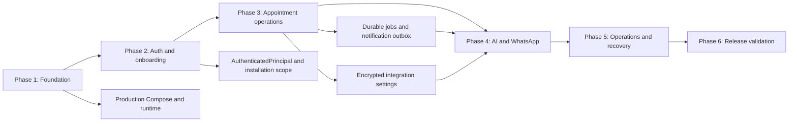

# Self-Hosted Appointment Platform Master Implementation Plan

> **For agentic workers:** REQUIRED SUB-SKILL: Use superpowers:subagent-driven-development (recommended) or superpowers:executing-plans to implement this plan task-by-task. Steps use checkbox (`- [ ]`) syntax for tracking.

**Goal:** Deliver a production-ready, one-business-per-installation appointment platform on an Ubuntu VPS in six gated phases.

**Architecture:** Preserve the current reservation domain and API packages, then add a product layer consisting of installation/authentication, appointment-specific configuration, durable jobs, a separate channel worker, console-managed integrations, and production operations. Caddy exposes the booking app, owner console, and API from one HTTPS origin while PostgreSQL and PostgREST remain private.

**Tech Stack:** TypeScript 5, Node.js 20, pnpm 10.33.2, Next.js 16, React 19, PostgreSQL 16, PostgREST, Docker Compose, Caddy, Baileys, Vercel AI SDK Core, `@ai-sdk/openai`, SMTP, Node test runner, and GitHub Actions.

## Global Constraints

- One production installation represents one business; a business may contain multiple locations and staff members.
- The supported production target is Ubuntu VPS + Docker Compose + a public domain.
- Production startup never loads `final_demo` or another deterministic seed automatically.
- Business owners configure the product through the console; the supported installation path does not require manual `.env` editing.
- Infrastructure secrets are generated by the installer and stored in Docker secrets or root-owned files.
- Only Caddy publishes ports 80 and 443; PostgreSQL, PostgREST, API, and worker remain private.
- Keep `packages/reservations-core` authoritative for reservation rules and conflict prevention.
- Keep `packages/ai-chat` and `packages/reservation-chat-core` provider-neutral.
- The AI SDK and provider packages may exist only in `packages/ai-sdk-adapter` and backend applications.
- Baileys remains the WhatsApp provider and runs in `apps/worker` for production.
- Every channel persists inbound state before processing and uses the same deterministic booking service.
- AI and WhatsApp may prepare booking proposals, but final creation requires explicit confirmation.
- Integration credentials use AES-256-GCM; QR payloads, credentials, message bodies, and session material never enter logs.
- Use new forward-only migrations after `000020`; do not rewrite an applied migration.
- Regenerate `packages/database/migrations/supabase/migration-index.json` after every migration change.
- Invoke `pnpm` directly; no repository script may invoke `corepack pnpm`.
- Preserve unrelated worktree changes and make one scoped conventional commit per independently testable task.
- A phase gate must pass before work begins on a dependent phase.

---

## Plan Set

| Phase | Plan | Primary release gate |
| --- | --- | --- |
| 1 | `2026-07-14-self-hosted-appointment-platform-phase-1-foundation.md` | Clean VPS reaches the one-time HTTPS setup page using pinned images. |
| 2 | `2026-07-14-self-hosted-appointment-platform-phase-2-auth-onboarding.md` | Owner configures and publishes an appointment business without editing files. |
| 3 | `2026-07-14-self-hosted-appointment-platform-phase-3-appointment-operations.md` | Full customer-to-staff workflow survives API and worker restarts. |
| 4 | `2026-07-14-self-hosted-appointment-platform-phase-4-ai-whatsapp.md` | AI chat and WhatsApp create explicitly confirmed appointments through the shared engine. |
| 5 | `2026-07-14-self-hosted-appointment-platform-phase-5-operations-recovery-polish.md` | Backup/restore and successful/failed upgrade rehearsals pass. |
| 6 | `2026-07-14-self-hosted-appointment-platform-phase-6-release-validation.md` | A non-developer operates one business for one full day without developer intervention or data loss. |

## Dependency Graph



## Locked Cross-Phase Interfaces

These names are fixed so individual phase implementers do not invent competing boundaries.

```ts
export type PlatformUserRole = "owner" | "staff";

export interface AuthenticatedPrincipal {
  userId: string;
  tenantId: string;
  role: PlatformUserRole;
  venueIds: readonly string[];
}

export interface InstallationScope {
  installationId: string;
  tenantId: string;
  setupCompleted: boolean;
}

export interface InstallationRecord extends InstallationScope {
  domain: string;
  setupTokenHash?: string;
  setupExpiresAt?: string;
}

export interface PlatformUserRecord {
  userId: string;
  tenantId: string;
  email: string;
  displayName: string;
  passwordHash: string;
  role: PlatformUserRole;
  status: "invited" | "active" | "disabled";
  venueIds: readonly string[];
}

export type NewPlatformUser = Omit<PlatformUserRecord, "userId" | "venueIds"> & {
  venueIds?: readonly string[];
};

export interface StaffProfile {
  staffId: string;
  tenantId: string;
  userId?: string;
  displayName: string;
  reservableResourceId: string;
  status: "active" | "inactive";
  venueIds: readonly string[];
  serviceIds: readonly string[];
}

export interface CreateStaffProfile {
  tenantId: string;
  userId?: string;
  displayName: string;
  venueIds: readonly string[];
  serviceIds: readonly string[];
}

export type UpdateStaffProfile = Partial<Pick<StaffProfile, "displayName" | "status">>;

export type PlatformJobKind =
  | "notification.email"
  | "whatsapp.start_session"
  | "whatsapp.restore_session"
  | "whatsapp.logout_session"
  | "whatsapp.process_inbound"
  | "whatsapp.deliver_outbound"
  | "conversation.process_ai";

export interface PlatformJob<TPayload = Record<string, unknown>> {
  jobId: string;
  tenantId: string;
  venueId?: string;
  kind: PlatformJobKind;
  payload: TPayload;
  attempts: number;
  maxAttempts: number;
  availableAt: string;
  leasedUntil?: string;
}

export interface PlatformJobRepository {
  enqueue(input: Omit<PlatformJob, "jobId" | "attempts" | "availableAt"> & {
    availableAt?: string;
    idempotencyKey: string;
  }): Promise<{ jobId: string }>;
  claim(input: { workerId: string; limit: number; leaseSeconds: number }): Promise<readonly PlatformJob[]>;
  complete(jobId: string, workerId: string): Promise<void>;
  retry(jobId: string, workerId: string, availableAt: string, errorCode: string): Promise<void>;
  fail(jobId: string, workerId: string, errorCode: string): Promise<void>;
}

export interface SecretEnvelopeV1 {
  v: 1;
  alg: "aes-256-gcm";
  iv: string;
  tag: string;
  ciphertext: string;
}

export type IntegrationKind = "email" | "ai" | "whatsapp";

export interface IntegrationSettingsRecord {
  tenantId: string;
  kind: IntegrationKind;
  enabled: boolean;
  provider: string;
  publicConfig: Record<string, unknown>;
  credentialPresent: boolean;
  updatedAt: string;
}

export interface IntegrationSettingsRepository {
  read(tenantId: string, kind: IntegrationKind): Promise<IntegrationSettingsRecord | undefined>;
  saveSettings(input: Omit<IntegrationSettingsRecord, "credentialPresent" | "updatedAt">): Promise<IntegrationSettingsRecord>;
  saveCredential(input: { tenantId: string; kind: IntegrationKind; envelope: SecretEnvelopeV1 }): Promise<void>;
  readCredential(tenantId: string, kind: IntegrationKind): Promise<SecretEnvelopeV1 | undefined>;
  deleteCredential(tenantId: string, kind: IntegrationKind): Promise<void>;
}
```

## Planned File Ownership

### Existing files extended

- `apps/api/src/runtime.ts`: compose authenticated repositories and API dependencies; do not own long-lived Baileys connections after Phase 4.
- `apps/api/src/routes.ts`: map HTTP paths to framework-neutral operations.
- `apps/api/src/server.ts`: limits, timeouts, graceful shutdown, liveness, and readiness.
- `apps/console/lib/platform-client.ts`: forward the authenticated session instead of a fixed service key.
- `apps/console/components/console-shell.tsx`: authenticated product navigation.
- `apps/booking/components/public-booking-journey.tsx`: location, service, practitioner, and management journey.
- `packages/contract-types/src/schemas.ts`: public DTO schemas for every new endpoint.
- `packages/sdk/src/index.ts`: typed client methods only; no database or backend imports.
- `packages/reservation-platform-api/src/index.ts`: export framework-neutral services and ports.
- `packages/reservations-supabase/src/index.ts`: export PostgREST adapters.
- `packages/database/src/supabase-migrations.test.ts`: lock the ordered core migration plan.
- `scripts/generate-database-migration-index.mjs`: remains the only migration-index generator.

### New bounded units

- `apps/worker/`: one durable job and channel process; it has no HTTP API and no UI concerns.
- `packages/ai-sdk-adapter/`: maps AI SDK generation and tool events to the existing `AgentRuntime` interface.
- `packages/reservation-platform-api/src/installation.ts`: installation setup rules and port.
- `packages/reservation-platform-api/src/sessions.ts`: authentication/session rules and port.
- `packages/reservation-platform-api/src/staff.ts`: staff profiles, roles, and venue assignment rules.
- `packages/reservation-platform-api/src/jobs.ts`: job types and repository port.
- `packages/reservation-platform-api/src/integrations.ts`: safe integration settings/credential orchestration.
- `packages/reservation-platform-api/src/notifications.ts`: notification intents, not provider delivery code.
- `packages/reservation-platform-api/src/system-status.ts`: safe health aggregation.
- `packages/reservations-supabase/src/installation.ts`: installation repository.
- `packages/reservations-supabase/src/sessions.ts`: session and user repository.
- `packages/reservations-supabase/src/staff.ts`: staff/location/service adapter.
- `packages/reservations-supabase/src/jobs.ts`: PostgreSQL job queue adapter.
- `packages/reservations-supabase/src/integrations.ts`: encrypted integration persistence adapter.
- `packages/platform-config/src/secret-envelope.ts`: provider-neutral AES-256-GCM envelope helpers.
- `docker/production/`: Caddy, entrypoint, and production-only runtime assets.
- `compose.production.yml`: production service topology; separate from development `docker-compose.yml`.
- `scripts/production/`: install, configure, backup, restore, upgrade, verify, and support-bundle tools.

## Migration Sequence

| Migration | Owner phase | Responsibility |
| --- | --- | --- |
| `000021_installation_auth.sql` | Phase 2 | Installation singleton, users, sessions, auth tokens, assignments, and audit events. |
| `000022_appointment_operations.sql` | Phase 3 | Practitioner profiles, service timing/display fields, appointment staff binding, and lifecycle states. |
| `000023_appointment_availability_management.sql` | Phase 3 | Buffered overlap protection and atomic customer-managed reschedule. |
| `000024_durable_jobs_notifications.sql` | Phase 3 | Leased job queue, notification deliveries, retry/failure state, and atomic enqueue helpers. |
| `000025_integration_secrets.sql` | Phase 3 | Public integration settings plus encrypted credential envelopes. |
| `000026_channel_runtime.sql` | Phase 4 | Persisted booking proposals, WhatsApp commands, protected pairing state, and delivery outbox state. |
| `000027_system_operations.sql` | Phase 5 | Backup/upgrade records, health snapshots, and bounded operational event metadata. |
| `000028_appointment_analytics.sql` | Phase 5 | Practitioner/location utilization and no-show analytics. |

Every migration task must run:

```bash
pnpm run database:migration-index:generate
pnpm --dir packages/database run test
pnpm run database:verify-migration-bundle
```

Expected result: all commands exit `0`; the core migration plan ends at the newly added migration in exact order.

## Required Verification Matrix

| Gate | Command/evidence |
| --- | --- |
| Package baseline | `pnpm run packages:test` |
| Full build | `pnpm run build` plus console/booking/worker builds |
| Boundary checks | `pnpm run packages:verify-boundaries` and AI SDK boundary check |
| Migration integrity | `pnpm run database:verify-migration-bundle` |
| Production static verification | `pnpm run production:verify` |
| Clean stack smoke | `pnpm run production:smoke` against `compose.production.yml` |
| Browser journeys | onboarding, login, booking, manage, staff operations, integrations |
| Failure drills | API restart, worker restart, provider outage, stale slot, low disk |
| Recovery | encrypted backup restored into a clean installation |
| Upgrade | success path and failed-readiness recovery path |
| Final acceptance | signed full-day operator record in `docs/release-evidence/` |

## Approved Design Coverage

This matrix is the traceability check against `docs/superpowers/specs/2026-07-14-self-hosted-appointment-platform-design.md`. A phase is not complete if its mapped design section is only documented but not implemented and verified by the named gate.

| Design section | Implemented by | Release evidence |
| --- | --- | --- |
| 1. Purpose | Master constraints and all six phases | Phase 6 release definition audit |
| 2. Relationship to earlier designs | Phase 1 Task 1 | Baseline reconciliation report and scoped commits |
| 3. Product decisions | Master locked interfaces; Phases 1-4 | Architecture boundary checks and phase gates |
| 4. Goals | Phases 1-6 | Final acceptance checklist |
| 5. Non-goals | Master global constraints and schedule protection | Phase 6 scope audit |
| 6. Target architecture | Phase 1 Tasks 3-7; Phase 4 Tasks 4-5 | Production topology verification and clean VPS proof |
| 7. Existing module boundaries | Phase 1 Task 2; Phase 4 Task 1 | Package and AI SDK boundary checks |
| 8. Production installation | Phase 1 Tasks 5-7 | HTTPS setup page on a clean Ubuntu VPS |
| 9. First-run onboarding | Phase 2 Tasks 1-6 | Browser onboarding journey |
| 10. Configuration and secret ownership | Phase 1 Task 5; Phase 3 Task 5; Phase 4 Tasks 2 and 5 | Secret-file permissions, encrypted persistence, and redaction tests |
| 11. Authentication and authorization | Phase 2 Tasks 1-4 and 7 | Auth, CSRF, role, reset, and invitation tests |
| 12. Appointment product model | Phase 2 Task 5; Phase 3 Tasks 1-3 | Appointment schema and domain tests |
| 13. Customer and staff workflows | Phase 3 Tasks 2-3 and 7 | Booking, management, and command-center browser journeys |
| 14. Durable jobs and messages | Phase 3 Tasks 4 and 6; Phase 4 Task 4 | Restart, retry, idempotency, and dead-letter tests |
| 15. AI configuration and runtime | Phase 4 Tasks 1-4 | Adapter contract and explicit-confirmation end-to-end tests |
| 16. WhatsApp configuration and runtime | Phase 4 Tasks 3, 5, and 6 | Pairing, restore, inbox, takeover, and restart tests |
| 17. Email and notifications | Phase 3 Tasks 5-6 | SMTP failure/retry and delivery-state tests |
| 18. Focused analytics | Phase 5 Task 6 | Seeded analytics contract and browser tests |
| 19. Health, diagnostics, and observability | Phase 1 Task 3; Phase 5 Tasks 1-3 and 7 | Health probes, status page, safe-log audit, and support bundle |
| 20. Backup, restore, and upgrade | Phase 5 Tasks 4-5 | Clean restore and failed-upgrade recovery rehearsals |
| 21. Failure behaviour | Phase 3 Task 4; Phase 4 Tasks 4-5; Phase 6 Task 3 | Provider outage, restart, stale-slot, and low-disk drills |
| 22. Security controls | Phase 1 Tasks 3 and 5-7; Phase 2 Tasks 1-4; Phase 5 Task 3 | Security test matrix and release audit |
| 23. Verification strategy | Every task's red-green-refactor checks; Phase 6 Tasks 2-6 | Automated reports and signed human acceptance record |
| 24. Six-week delivery sequence | Phase plans 1-6 | One phase gate per delivery week |
| 25. Schedule protection and cut order | Master schedule protection | Phase-gate scope decisions recorded in release evidence |
| 26. Release definition | Phase 6 Tasks 1-7 | Signed manifest, immutable images, acceptance record, and final tag |

## Commit Policy

Each numbered task in a phase plan ends in its own commit. Use the commit message shown in that task. Before committing:

```bash
git status --short
git diff --check
git diff --cached --name-status
```

Stage only the files listed by the task. Existing uncommitted Docker-first development work must be reviewed and committed independently before overlapping production files are edited.

## Schedule Protection

Cut optional scope in this order if a gate is at risk:

1. Additional analytics breakdowns
2. Non-essential animation and cosmetic polish
3. Additional AI provider choices beyond OpenAI plus the advanced OpenAI-compatible adapter
4. Secondary reminder customization
5. Additional demonstration datasets

Never cut authentication, conflict protection, durable jobs, explicit confirmation, secret encryption, log redaction, backup/restore proof, readiness, failure visibility, clean-install documentation, or the full-day acceptance run.
