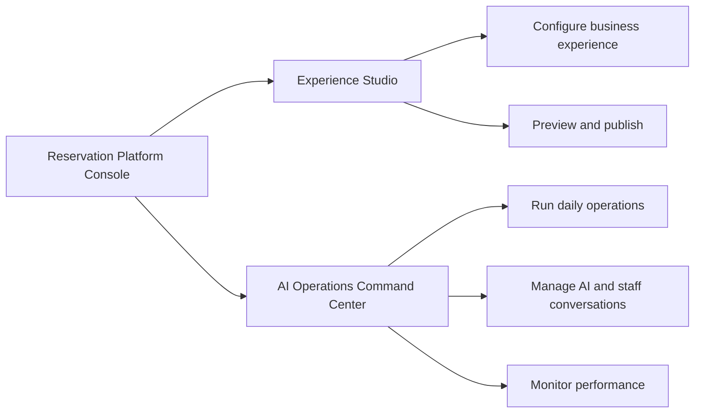
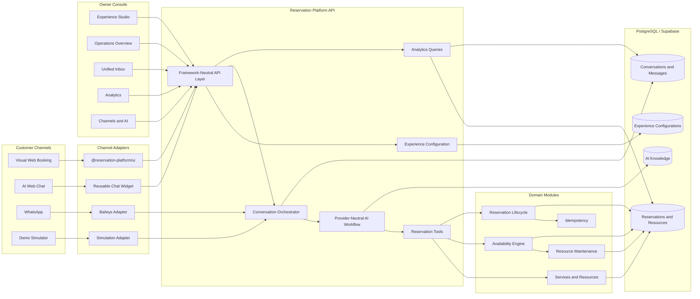
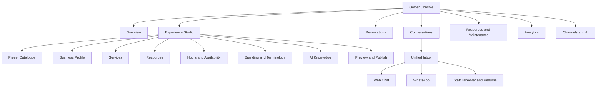
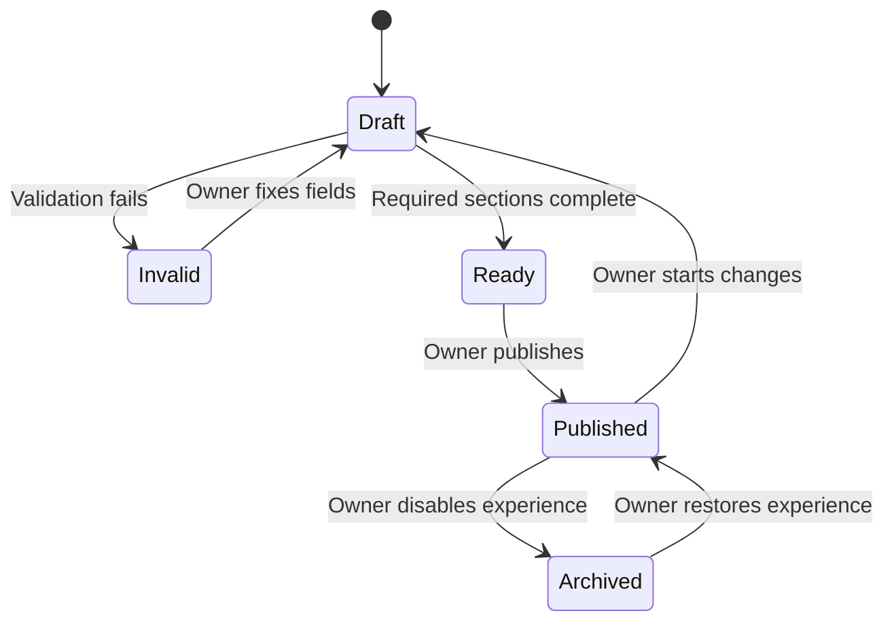
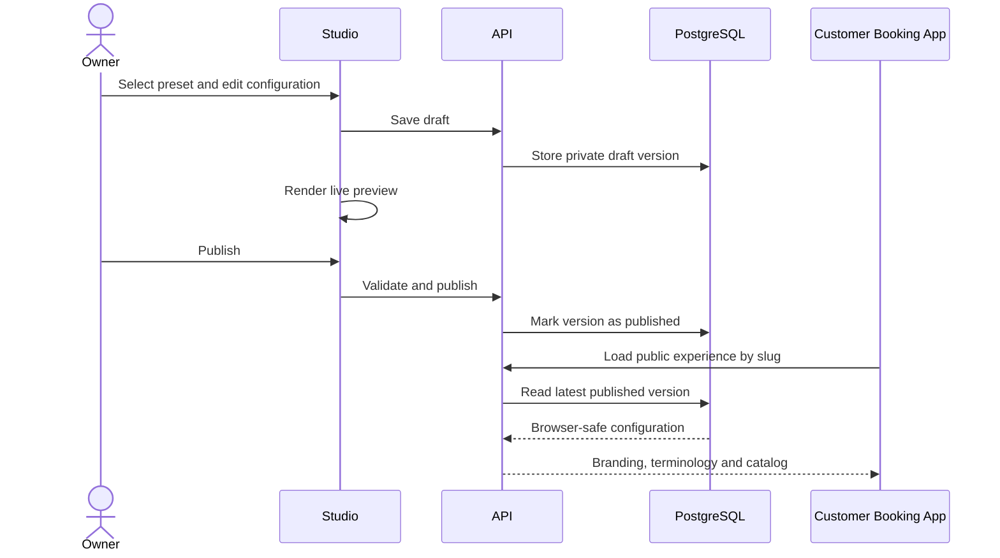
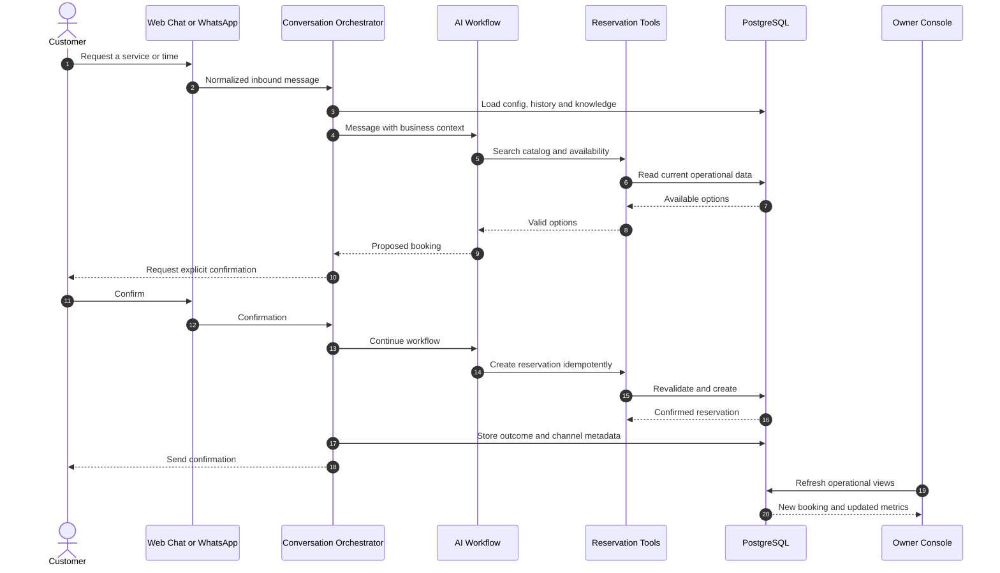
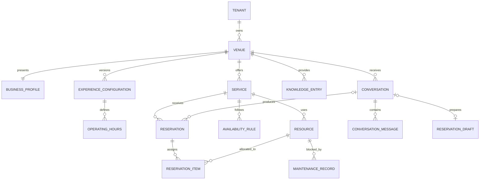
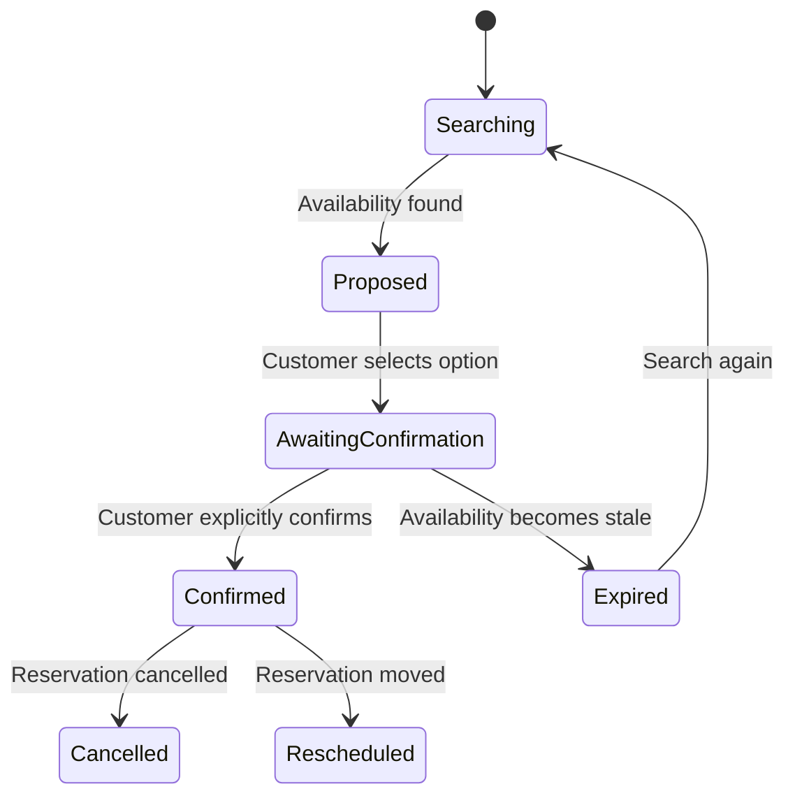
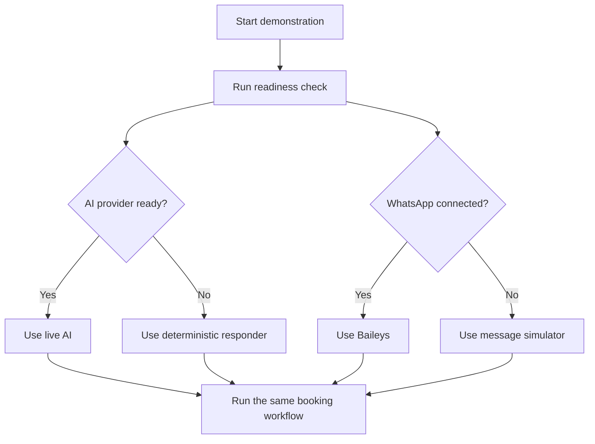
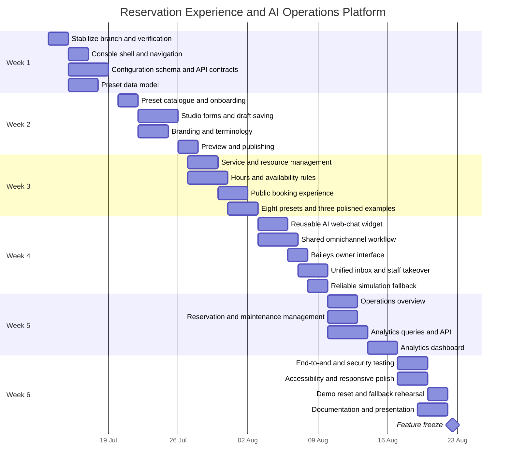

# Reservation Experience and AI Operations Platform Design

**Status:** Approved design  
**Date:** 2026-07-12  
**Delivery window:** 2026-07-13 through 2026-08-23  
**Primary WhatsApp provider:** Baileys  
**Demonstration fallback:** Deterministic AI responder and WhatsApp simulation

## 1. Product Summary

The final-year project will evolve from a technically strong modular reservation backend into a visible product with two connected owner experiences:

1. **Experience Studio** for creating and publishing configurable booking experiences.
2. **AI Operations Command Center** for running reservations, conversations, resources, channels, and analytics.

Customers will be able to reserve through a visual web flow, AI web chat, or WhatsApp. All channels will use the same catalog, availability engine, validation rules, idempotent reservation lifecycle, and database.

The demonstration must make the modular architecture understandable to non-developers: a reservation created through WhatsApp appears in the same operations console, changes the same availability, and contributes to the same analytics as a web booking.

## 2. Goals

- Deliver a polished owner console with Studio and operations areas.
- Allow an owner to configure and publish a booking experience without editing code.
- Demonstrate eight industry presets through shared reservation primitives.
- Fully polish racing simulator, room booking, and appointment examples.
- Support equivalent bookings through web form, AI web chat, WhatsApp, and simulation.
- Provide a unified conversation inbox with staff takeover.
- Provide useful operational and channel analytics.
- Preserve existing backend, SDK, frontend, security, and package boundaries.
- Make the live demonstration reliable when external AI or WhatsApp connectivity fails.

## 3. Non-Goals

- Arbitrary drag-and-drop page building
- Payment processing
- Native mobile applications
- Custom-domain provisioning
- Marketplace or public template distribution
- Advanced pricing and promotion engines
- Predictive analytics or custom model training
- Media-message automation
- Production-scale event streaming
- Replacing Baileys or building a `whatsmeow` sidecar

## 4. Product Structure

The Studio is used for onboarding and configuration. The Command Center is the daily operational workspace after publication.

## 5. Existing Architecture Reused

The implementation must extend the current platform rather than create a parallel booking system.

- `apps/api` remains the standalone HTTP host.
- `packages/reservation-platform-api` continues to own framework-neutral route behavior.
- `packages/reservations-core` remains the reservation domain engine.
- `packages/reservations-supabase` owns persistence adapters.
- `packages/database` owns migrations and database metadata.
- `packages/contract-types` owns public DTOs and schemas.
- `packages/sdk` remains the frontend integration surface.
- `packages/reservation-react` remains the headless React state layer.
- `packages/reservation-ui` remains the reusable visual booking layer.
- `packages/ai-chat` and `packages/reservation-chat-core` own provider-neutral AI workflow behavior.
- `packages/whatsapp` owns WhatsApp conversations, Baileys connectivity, takeover, and simulation.

## 6. Target Architecture

## 7. Owner Console

Add a dedicated Next.js application at `apps/console`. It must use the SDK/API only and must not import Supabase or backend runtime packages.

The console contains:

- Overview
- Experience Studio
- Reservations
- Conversations
- Resources and maintenance
- Analytics
- Channels and AI readiness

For the six-week version, the existing tenant and venue context defines the configured business experience. A business profile is attached to a tenant and venue. The console operates on one selected venue at a time, avoiding a second competing tenancy model.

## 8. Experience Studio

The Studio is a guided configuration interface, not a source-code generator. It configures a reusable public customer application.

The onboarding checklist is:

1. Choose an industry preset.
2. Configure business identity.
3. Configure services.
4. Configure resources.
5. Configure operating hours and availability.
6. Configure AI knowledge.
7. Configure branding and terminology.
8. Preview and publish.

### Draft and publication behavior

- Selecting a preset creates a draft configuration.
- Owners may save and resume drafts.
- Preview renders the draft through shared UI components.
- Customers can only load the latest published configuration.
- Invalid drafts cannot publish.
- Editing a published experience creates a new draft version.
- The current published experience remains active until the new draft is published.
- Publishing does not rebuild or redeploy a frontend.

### Public experience loading

## 9. Preset Catalogue

The platform provides eight selectable presets:

| Preset | Primary model | Example terminology |
| --- | --- | --- |
| Racing and Gaming | Assigned simulator or station | Driver, Simulator, Session |
| Rooms and Facilities | Capacity or assigned room | Organizer, Room, Meeting |
| Appointments and Salon | Assigned staff member | Client, Specialist, Appointment |
| Sports Courts | Assigned court | Player, Court, Match |
| Restaurant Tables | Capacity and assigned table | Guest, Table, Reservation |
| Cinema and Events | Assigned seat or section | Attendee, Seat, Screening |
| Equipment Rental | Assigned equipment | Customer, Item, Rental |
| Classes and Workshops | Shared capacity | Participant, Class, Registration |

Racing, rooms, and appointments receive complete sample data, visual polish, and end-to-end tests. The remaining five presets must create valid editable configurations and pass preview validation, but do not require industry-specific subsystems.

Specialist features such as kitchen orders, medical records, delivery logistics, payments, or complex ticket pricing remain outside scope.

## 10. Customer Experiences

### Visual booking

The public experience loads by business slug and includes:

- Branded landing content
- Service selection
- Date and slot selection
- Capacity or assigned-resource controls
- Customer details
- Booking summary
- Explicit confirmation
- Success and reservation-management actions
- Responsive loading, error, empty, and stale-availability states

### AI web chat

Add a reusable chat widget to the frontend packages. It uses the existing chat API and the same reservation tools as WhatsApp. It must not implement separate booking rules in the browser.

### WhatsApp

Baileys remains the primary WhatsApp provider. The owner console exposes authenticated QR connection, status, logout, readiness, and simulation controls. Raw QR payloads and credentials must never be logged.

### Omnichannel flow

## 11. AI Operations Command Center

### Overview

The overview must immediately show:

- Reservations today
- Upcoming reservations
- Current and upcoming utilization
- AI-assisted bookings
- Conversations awaiting staff
- Cancellations and reschedules
- Maintenance alerts
- WhatsApp and AI readiness
- Recent activity

### Unified inbox

Web-chat and WhatsApp conversations appear together. Each conversation shows:

- Customer identity and channel
- Automation status
- Conversation history
- AI escalation reason
- Current booking draft
- Linked reservation
- Staff takeover/resume controls
- Staff reply composer
- Audit events

### Live behavior

Use short-interval polling and refresh-on-action. Do not add WebSocket infrastructure during the six-week delivery window.

- Overview refreshes every few seconds while visible.
- Open conversations refresh while active.
- Availability refreshes after booking or maintenance actions.
- Analytics refresh on load or explicit refresh.

## 12. Analytics

Analytics derive from operational records and small additions to source/outcome metadata. No separate warehouse is introduced.

Required metrics:

- Reservations by day and service
- Popular slots and resources
- Resource utilization
- Booking source: web form, web AI, WhatsApp, or simulation
- Conversation-to-booking conversion
- AI completion rate
- Staff-takeover rate
- Escalation reasons
- Cancellation and reschedule rates

All analytics must support a date range. Service and channel filtering are required where relevant. Aggregate queries or database RPCs must be indexed and tenant/venue scoped.

## 13. Data Model

The implementation must reuse the existing tenant, venue, service, resource, reservation, maintenance, WhatsApp, and knowledge tables when their current semantics match. It must not create shadow copies of those records. New migrations are limited to the storage responsibilities listed below.

New storage responsibilities are:

- Business profile and public slug per tenant/venue
- Versioned draft/published experience configuration
- Operating hours and availability rules where not already represented
- Preset identifier and application metadata
- Conversation channel, outcome, escalation reason, and linked reservation
- Reservation source values needed for channel analytics

## 14. API and SDK Surface

Exact DTOs must be defined in `packages/contract-types` before implementation. The intended route groups are:

### Authenticated owner routes

- Business profile read/update
- Configuration draft read/update/validate/publish/archive
- Preset list and apply
- Service create/read/update/archive
- Resource create/read/update/archive
- Operating-hours and availability-rule management
- Dashboard summary
- Analytics queries
- Existing reservation, maintenance, knowledge, conversation, takeover, and channel-readiness routes

### Public routes

- Load published experience by slug
- Load public services and availability within the resolved tenant/venue context
- Create reservations through the existing public creation policy
- View, cancel, or reschedule a customer reservation using a server-issued opaque management token that is scoped to one reservation, stored only as a hash, and expires seven days after the reservation ends
- Start and continue AI reservation chat

Public configuration must contain no owner-only settings, database credentials, provider keys, WhatsApp session data, or unpublished drafts.

The SDK must expose typed methods for every console and public route. Console code must not use raw ad hoc fetch calls where an SDK method exists.

## 15. Reservation and AI Safety

- AI never writes directly to the database.
- AI may act only through validated reservation tools.
- Availability is revalidated during confirmation.
- Reservation creation is idempotent.
- Stale availability returns alternatives instead of creating conflicts.
- AI and simulation follow the same explicit confirmation boundary.
- Staff takeover immediately suppresses automated replies.
- Decisions, takeovers, outcomes, and tool failures are auditable.

## 16. Reliability and Demonstration Fallback

Simulation must be clearly labelled. It replaces only the external transport or model output; it must use the same conversation, tools, reservation, audit, and analytics paths.

### Failure behavior

| Failure | Customer behavior | Owner behavior |
| --- | --- | --- |
| AI provider unavailable | Offer visual booking or staff handoff | Show readiness warning and demo option |
| WhatsApp disconnected | Do not claim the channel is available | Offer authenticated QR reconnect and simulation |
| Slot becomes unavailable | Refresh and offer alternatives | Record conflict activity |
| Invalid Studio draft | Keep current publication active | Explain validation failures |
| Analytics query fails | Booking remains available | Show retryable analytics state |
| Resource enters maintenance | Remove it from new availability | Show maintenance alert |
| Staff takes over | Stop AI replies | Show manual state and audit event |

## 17. Security

- Owner routes require authentication and tenant/venue authorization.
- Public routes expose only published browser-safe data.
- Supabase and AI-provider credentials remain backend-only.
- WhatsApp credentials remain encrypted when a session encryption key is configured.
- QR data is available only through authenticated owner routes.
- Every owner and analytics query is tenant/venue scoped.
- Customer management tokens are stored hashed, never logged, and authorize only the linked reservation.
- Logs must exclude secrets, raw QR payloads, and session material.
- Simulation endpoints remain disabled unless explicitly enabled.

## 18. Testing Strategy

Testing follows the repository's existing package-local and root workflow conventions.

Required proofs:

- Preset application creates valid configuration.
- All eight presets pass configuration validation and preview rendering.
- Draft changes do not affect the published experience.
- Public configuration cannot expose secrets or drafts.
- Racing, rooms, and appointments complete end-to-end bookings.
- Web form, web AI, WhatsApp, and simulation produce equivalent reservations.
- AI cannot create a reservation before confirmation.
- Staff takeover suppresses automated replies.
- Maintenance affects availability immediately.
- Analytics reconcile with reservation and conversation records.
- Tenant and venue data cannot cross authorization boundaries.
- The complete demonstration works without external providers.

## 19. Six-Week Delivery Plan

### Week 1: Foundation

- Restore a consistently passing baseline.
- Add the console shell and SDK-only frontend boundary.
- Define contracts before UI implementation.
- Add business profile, configuration version, and preset schema.
- Establish public-slug behavior and draft/published rules.

**Exit:** An authenticated owner can create and reload a draft. Existing capabilities remain green.

### Week 2: Experience Studio

- Build preset catalogue and guided onboarding.
- Build profile, branding, terminology, and AI knowledge editing.
- Add draft saving, validation, preview, and publishing.
- Start the three polished preset definitions.

**Exit:** An owner can configure, preview, and publish a valid experience without affecting the active publication during editing.

### Week 3: Configurable customer experiences

- Add service and resource management.
- Add operating-hours and availability-rule editing.
- Load public experiences by slug.
- Add reservation view, cancel, and reschedule experiences.
- Complete all eight preset definitions.
- Polish racing, rooms, and appointments.

**Exit:** Three domains complete real web bookings; all eight presets validate and preview correctly.

### Week 4: Omnichannel AI

- Add reusable AI web chat.
- Align web and WhatsApp on shared reservation tools.
- Build Baileys owner connection/readiness UI.
- Build unified inbox, conversation detail, and staff takeover.
- Complete deterministic AI and WhatsApp simulation fallback.

**Exit:** Web form, web AI, Baileys WhatsApp, and simulation create equivalent confirmed reservations through explicit confirmation.

### Week 5: Operations and analytics

- Build operations overview, attention queue, and readiness cards.
- Complete reservation and maintenance management.
- Add indexed, scoped analytics queries.
- Build demand, utilization, channel, conversion, and AI charts.

**Exit:** New demonstration activity appears in operations and analytics, and totals reconcile with source records.

### Week 6: Hardening and presentation

- Complete end-to-end, authorization, security, and fallback tests.
- Improve accessibility, responsiveness, loading, error, and empty states.
- Add seeded demo businesses and a repeatable reset workflow.
- Finalize architecture documentation and evaluation mapping.
- Prepare live-demo script, backup screenshots/video, and rehearsals.
- Freeze features by 2026-08-22.

**Exit:** The complete presentation works live and in fallback mode from a clean, repeatable setup.

## 20. Scope Priority

### Must complete

- Console shell
- Studio draft/publish workflow
- Three polished domains
- Visual web booking
- AI web chat
- Baileys WhatsApp
- Simulation fallback
- Unified inbox and takeover
- Operations overview
- Core analytics
- End-to-end demonstration

### Complete if time remains

- Rich sample content for all eight presets
- Advanced analytics filters
- Additional theme controls
- Conversation search
- CSV analytics export
- Additional customer self-service options

### Cut first if behind schedule

- Complex page layouts
- Custom domains
- Payments
- Advanced pricing
- Predictive analytics
- Media-message automation
- `whatsmeow` integration
- Native mobile applications

## 21. Final Demonstration Script

1. Open the console and select the racing preset.
2. Configure branding, simulators, operating hours, and AI knowledge.
3. Preview and publish the customer experience.
4. Complete or begin a visual web booking.
5. Ask the web AI assistant about availability.
6. Start and confirm a booking through WhatsApp.
7. Show the conversation and reservation in the unified inbox and overview.
8. Demonstrate staff takeover and resume.
9. Show changed availability, utilization, source analytics, and AI metrics.
10. Switch to room and appointment experiences to prove domain reuse.
11. If a provider is unavailable, repeat the same workflow through labelled fallback mode.

## 22. Success Criteria

The project is ready for final evaluation when:

- A non-developer can understand the complete customer and owner story from the demo.
- A developer can trace every channel through the same API, domain, and storage boundaries.
- Studio changes publish without rebuilding a frontend.
- Three distinct industries work end to end.
- Web, AI, WhatsApp, and simulation remain behaviorally consistent.
- Owner operations and analytics reflect customer activity accurately.
- Security and tenant/venue isolation tests pass.
- The demonstration remains usable without external providers.
- The documented setup and reset process is repeatable.
