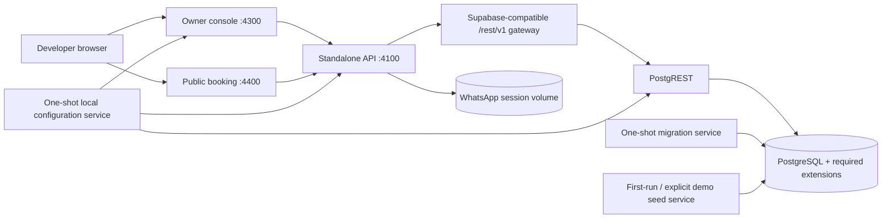

# Docker-First Self-Contained Development Stack Design

## Purpose

Replace the current multi-terminal onboarding path with one supported local stack. After cloning, a developer runs one Docker Compose command and receives a migrated, seeded, usable Reservation Experience Platform without installing Node dependencies on the host, separately provisioning Supabase, or starting the API, console, and booking app by hand.

This stack is for local development, evaluation, and demonstrations. It is deliberately smaller than the complete official Supabase product and is not presented as a production Supabase deployment.

## User experience

Primary onboarding:

```bash
git clone <repository-url>
cd reservation-app
docker compose up --build -d
```

Successful startup prints and verifies:

- API: `http://localhost:4100`
- Owner console: `http://localhost:4300`
- Public booking: `http://localhost:4400`
- Local REST gateway: an internal service used by the API, not a public application entry point

Lifecycle commands:

```bash
docker compose ps
docker compose logs -f
docker compose run --rm reservation-reset
docker compose down
RESERVATION_STACK_DESTROY_CONFIRM=DESTROY_LOCAL_STACK docker compose run --rm reservation-destroy
```

`docker compose down` preserves data. The destroy service requires an explicit confirmation value and deletes only Compose-managed local volumes. The reset service is the only normal command that intentionally replaces deterministic demo data. Optional pnpm aliases may wrap these commands for contributors who already installed the workspace, but the primary tutorial does not require pnpm.

## Architecture



## Compose services

### `reservation-db`

- PostgreSQL 16 image with the extensions required by the checked-in migration bundle.
- Creates the local `anon`, `authenticated`, and `service_role` roles through package migration `000002` rather than an unrelated bootstrap schema.
- Stores data in the named `reservation-db-data` volume.
- Uses `pg_isready` for health.
- Is not published outside the host by default except when a documented local debugging port is explicitly enabled.

### `reservation-config`

- One-shot bootstrap service that runs entirely inside Docker before credential-dependent services start.
- Creates cryptographically random local database, JWT, API service, and WhatsApp encryption values on the first run.
- Writes them to a private named `reservation-stack-config` volume, never to a tracked file.
- Preserves the same values across ordinary stop/start cycles.
- Prints no secret values.
- Supplies wrapper entrypoints that let PostgREST, the API, and console read only the values they require before starting their normal processes.

### `reservation-migrate`

- One-shot service that waits for PostgreSQL health.
- Reads the authoritative migration index and applies core migrations `000001` through `000020` in order.
- Records filename and SHA-256 in a local migration ledger.
- Skips an already applied, byte-identical migration.
- Fails closed if an applied migration file has changed.
- Must complete successfully before PostgREST or the API can become ready.

The migrator never applies optional AI retrieval or development seed assets unless the stack command explicitly requests them.

### `reservation-seed`

- Runs the guarded final-demo seed on the first empty local stack so the console and public booking app are immediately useful.
- Records a local seed marker and does not erase developer changes on ordinary restart.
- Runs destructively only through the explicit reset service after the local-target guard succeeds.

### `reservation-rest`

- Runs PostgREST against `reservation-db`.
- Uses a generated, local-only JWT secret and matching anonymous/service-role tokens.
- Exposes only the schemas and roles required by the platform.
- Is an implementation detail behind the local REST gateway.

### `reservation-gateway`

- Provides the Supabase-compatible `/rest/v1` path expected by `@supabase/supabase-js`.
- Proxies only the REST surface required by this platform.
- Does not claim to provide Supabase Auth, Storage, Realtime, Edge Functions, or Studio.

### `reservation-api`

- Reuses the existing production API image target.
- Receives internal database gateway URLs and generated local credentials through the private stack configuration volume.
- Uses the existing service-key owner authentication mode for the local console.
- Enables deterministic WhatsApp simulation by default; live linked-device mode remains opt-in.
- Depends on successful migration, seed, gateway, and database health.

### `reservation-console`

- Builds and runs `apps/console` as a production Next.js server on port 4300.
- Calls `reservation-api` over the internal Compose network.
- Keeps the local service API key server-only.
- Uses the seeded `final_demo` tenant and racing venue by default.

### `reservation-booking`

- Builds and runs `apps/booking` as a production Next.js server on port 4400.
- Calls the API over the internal Compose network for server work and uses a browser-reachable API origin for client requests.
- Opens the seeded public experience through `http://localhost:4400/apex-racing-demo`.

Flagship example applications remain optional Compose-profile services. They are not required for the default onboarding stack because the configurable booking app already demonstrates the public customer journey.

## Images and build strategy

- Keep the existing root `Dockerfile` API target intact.
- Add a web application Dockerfile with explicit `console` and `booking` build/runtime targets.
- Add small container entrypoints that read generated values from the private configuration volume and export only the variables required by that service.
- Use pnpm workspace filters during image builds.
- Run Next.js in production mode inside containers; do not use hot-reload development servers as the default documented stack.
- Add `.dockerignore` coverage for Git metadata, local environment files, build output, temporary handbook artifacts, database volumes, and WhatsApp sessions.

The first build may be slower, but subsequent builds reuse Docker layers and pnpm's content-addressed store layers where possible.

## Local credentials and environment generation

Tracked files must not contain usable JWTs, database passwords, service keys, or encryption keys.

The `reservation-config` service creates a private Compose volume on first startup. It generates cryptographically random database, JWT, service API, and WhatsApp encryption values plus correctly signed PostgREST anonymous and service-role tokens. Credential-dependent services mount this volume read-only and expose only the values they need to their child processes.

No host-side script, Node installation, pnpm installation, or generated `.env` file is required for the primary startup path. Existing `.env` behavior remains available for manual development and production-style deployments outside this stack. The generated configuration persists with the Compose volumes and is removed only by the confirmed destroy operation.

## Data flow and networking

- Browser traffic reaches API port 4100, console port 4300, and booking port 4400 on localhost.
- Containers use service DNS names on a private Compose network.
- Server-side frontend requests use `http://reservation-api:4100`; browser-side requests use `http://localhost:4100`. The applications must keep these origins separate rather than embedding the internal Compose hostname in browser JavaScript.
- The console's API credential is available only in its server container.
- The booking app receives no database or owner credential.
- PostgREST and PostgreSQL are not customer-facing application endpoints.
- CORS defaults list only the checked-in local frontend origins and never use `*` with owner credentials.
- Published ports bind to `127.0.0.1` by default so the development stack is not exposed to the local network accidentally.

## Startup and failure behavior

The Compose stack becomes ready only when:

- Docker and Docker Compose are available.
- Local ports are free.
- The database becomes healthy.
- Every indexed migration applies or matches its ledger entry.
- The initial seed completes or has already completed.
- PostgREST and the gateway respond.
- API health succeeds.
- Console and booking HTTP probes succeed.

On failure, Compose identifies the unhealthy or failed service without printing generated environment values. The handbook gives scoped `docker compose logs <service>` commands for diagnosis.

## Reset and destruction safety

- Ordinary `docker compose up`, restart, and `docker compose down` operations preserve database state.
- `docker compose run --rm reservation-reset` accepts only the Compose-managed local database identity and reuses the existing final-demo reset guard.
- The `reservation-destroy` service requires `RESERVATION_STACK_DESTROY_CONFIRM=DESTROY_LOCAL_STACK`.
- Neither destructive command accepts an arbitrary database URL.
- Production and externally supplied Supabase values are never read by local destructive commands.

## Verification

Automated checks will prove:

- Compose defines all required services, health checks, volumes, networks, and dependency conditions.
- Tracked files contain no generated local credentials.
- Docker-contained configuration generation produces valid, distinct credentials without logging them.
- Migration planning uses the checked-in index in exact order and detects drift.
- First-run seed is not repeated on ordinary restart.
- Reset and destroy guards reject non-local or missing confirmation.
- API, console, booking, database, REST, and gateway build successfully.
- A fresh stack passes health, `demo:verify`, authenticated smoke tests, and the presentation-critical E2E suite.
- `docker compose down` followed by `docker compose up --build -d` preserves a test marker.
- The HTML handbook teaches `docker compose up --build -d` as the primary path and clearly labels manual pnpm development as an advanced alternative.

## Documentation changes

The handbook's Developer tutorial will become Docker-first:

1. Clone the repository and enter its directory.
2. Run `docker compose up --build -d`.
3. Verify the three URLs.
4. Complete the first owner and customer workflow.

The existing `local:supabase:start` plus three-terminal pnpm workflow moves to an “advanced manual development” subsection. Deployment documentation continues to distinguish this development stack from production self-hosting and the complete official Supabase suite.

## Deliberate boundaries

- Do not vendor or claim the complete official Supabase suite.
- Do not add Storage, Realtime, Studio, GoTrue, Edge Functions, or analytics infrastructure that the application does not currently use.
- Do not turn workspace packages into independently deployed microservices.
- Do not make deterministic demo reset automatic on every restart.
- Do not weaken owner authentication, tenant scoping, CORS, migration guards, or secret scanning for convenience.
- Do not present this stack as production-ready without target-environment backups, monitoring, TLS, load testing, policy review, and incident procedures.
