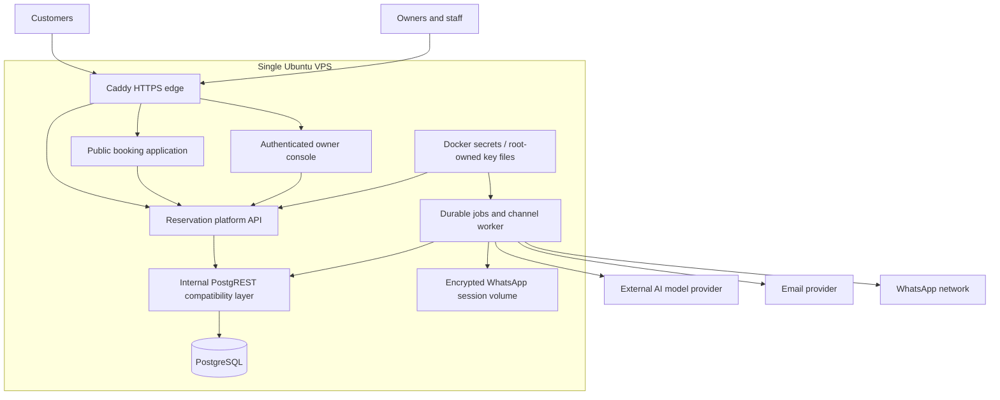
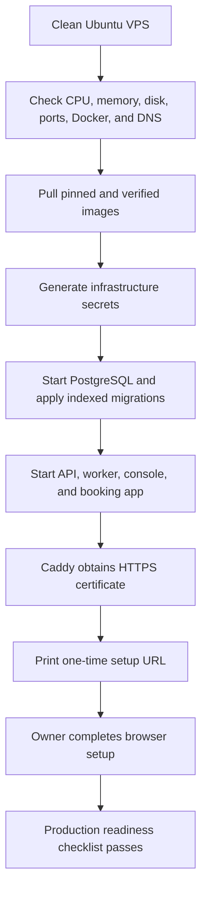
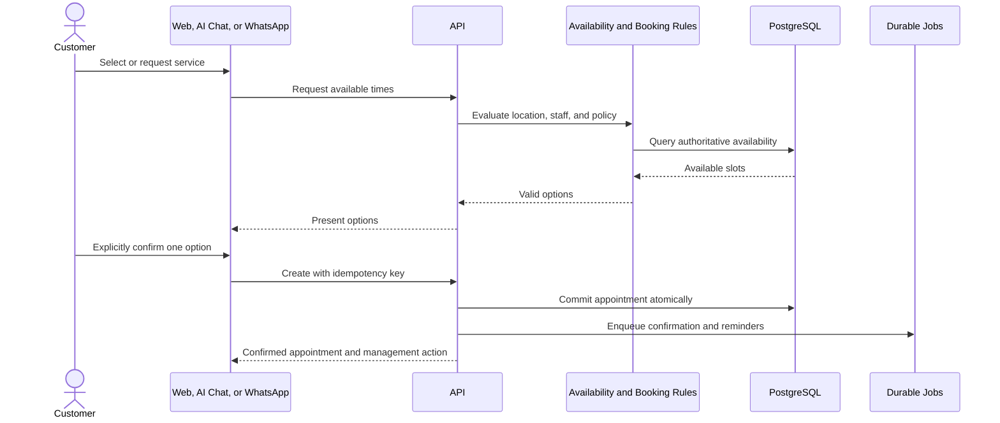
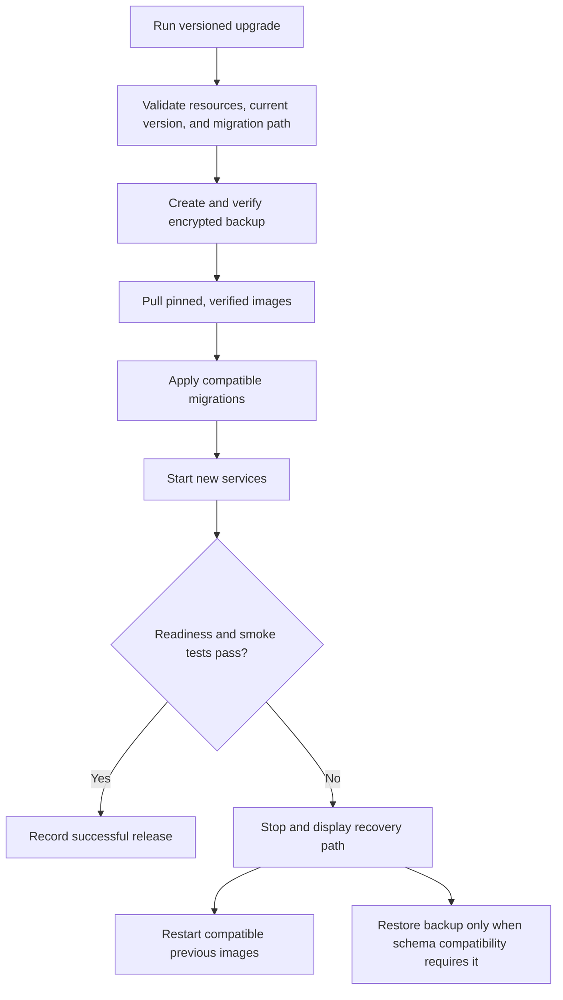
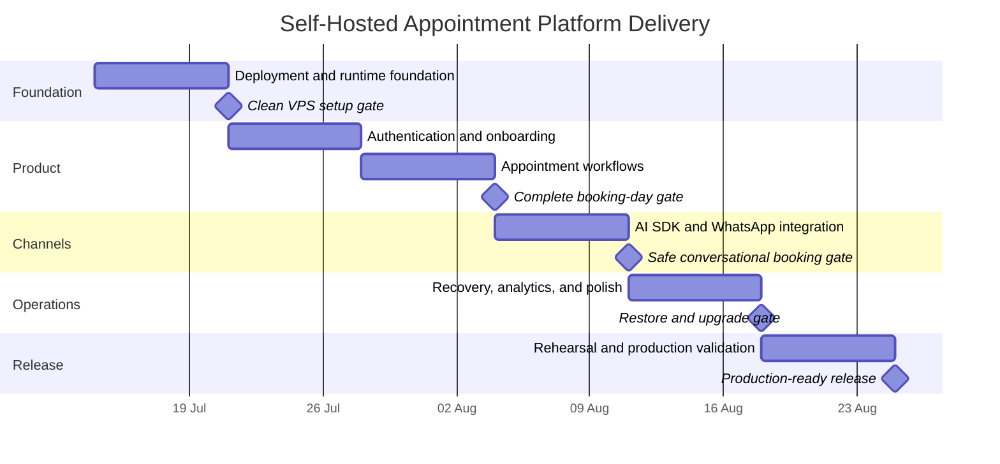

# Self-Hosted Appointment Platform Productization Design

**Status:** Approved design, pending implementation plan  
**Date:** 2026-07-14  
**Delivery window:** 2026-07-14 through 2026-08-24  
**Production unit:** One business per installation  
**Anchor vertical:** Appointment and service businesses  
**Supported target:** Ubuntu VPS, Docker Compose, and a public domain  
**WhatsApp implementation:** Baileys  
**AI integration:** Backend-only Vercel AI SDK adapter behind existing platform interfaces

## 1. Purpose

Turn the reservation-platform monorepo from a technically interesting demonstration into a self-hosted product that a real appointment business can install, configure, and operate without developer intervention.

The release must preserve the existing modular reservation engine while adding the missing product and operations layer around it: production deployment, first-run setup, authentication, business configuration, durable channel processing, daily staff workflows, recovery, diagnostics, and release evidence.

The defining acceptance test is:

> A non-developer can deploy the product for one appointment business, configure it through the browser, and operate it for one full working day without developer intervention, data loss, or conflicting reservations.

## 2. Relationship to Earlier Designs

This design narrows and productizes the approved `2026-07-12-reservation-experience-ai-operations-platform-design.md` direction.

- The AI Operations Command Center remains a primary product surface.
- Public web booking, AI chat, WhatsApp, a unified inbox, and focused analytics remain in scope.
- The generic Experience Studio, eight production presets, and cross-industry production claims are deferred.
- The production release supports the appointment/service vertical deeply instead of presenting several shallow demonstrations.
- Existing seeded racing and room examples may remain as explicit development or presentation profiles, but they are not part of production onboarding.

The `2026-07-13-docker-first-development-stack-design.md` remains the design for local development, evaluation, and demonstrations. It must not be described as the supported production topology. Production uses separately versioned images, TLS, owner authentication, backups, upgrade controls, and no automatic demo seed.

## 3. Product Decisions

The following decisions are fixed for this release:

- One installation represents one business.
- A business may have multiple locations, services, and staff members.
- Production is self-hosted on one Ubuntu VPS through Docker Compose.
- Caddy terminates HTTPS and exposes only the required web entry points.
- PostgreSQL is the system of record.
- PostgREST remains an internal compatibility layer for the first production release.
- Owners and staff use built-in email-and-password authentication.
- Business and integration configuration is managed through the owner console.
- Operators do not hand-maintain a production `.env` file for the supported installation path.
- Baileys runs in a dedicated channel worker and maintains the WhatsApp linked-device session.
- AI orchestration runs on the installation; model inference uses an external provider by default.
- The existing provider-neutral AI interfaces remain the platform boundary.
- A backend-only Vercel AI SDK adapter supplies provider and model implementations.
- Every booking channel uses the same availability and reservation engine.
- AI may prepare a booking proposal but may not silently finalize it; explicit confirmation is required.
- Durable database-backed jobs replace in-memory reminders, retries, and conversational proposal state.

## 4. Goals

- Provide a clean installation path from an Ubuntu VPS to a secured first-run setup page.
- Allow an owner to configure the business without editing files or rebuilding containers.
- Provide production-grade appointment booking through web, AI chat, and WhatsApp.
- Give owners and staff an action-first command center for daily work.
- Preserve reservations, messages, jobs, and integration state across restarts.
- Make failures visible and recoverable through health, retry, backup, restore, and upgrade tools.
- Retain package boundaries and reuse the current reservation domain logic.
- Produce credible deployment, failure, recovery, and full-day operating evidence for the final-year assessment.

## 5. Non-Goals

- Hosted multi-tenant SaaS, subscriptions, or billing
- A generic industry preset or page-builder studio
- Native mobile applications
- Bundled Ollama, vLLM, or other local model infrastructure
- Kubernetes, clustering, or horizontal scaling
- Full CRM, payroll, accounting, marketplace, or marketing automation
- Payments, deposits, coupons, or advanced pricing
- Medical records or other regulated vertical data
- Replacing Baileys with `whatsmeow` or the official WhatsApp Cloud API in this release
- Replacing PostgREST or rewriting the persistence layer

## 6. Target Architecture

Only Caddy publishes ports 80 and 443. PostgreSQL, PostgREST, the API, and the worker communicate over private Compose networks. Browser applications receive only browser-safe configuration and the public API origin.

The release artifacts are prebuilt, immutable, version-tagged images pulled from a registry. The operator does not compile the monorepo on the VPS. Published release metadata records image versions and digests; signing is required for the final release channel.

## 7. Existing Module Boundaries

The product layer extends the existing packages rather than creating a second reservation system.

- `apps/api` remains the standalone runtime host and dependency composition root.
- `apps/console` becomes the authenticated setup and daily operations interface.
- `apps/booking` remains the public customer booking and chat application.
- `packages/reservation-platform-api` owns framework-neutral route behaviour.
- `packages/reservations-core` remains the deterministic reservation domain engine.
- `packages/reservations-supabase` and `packages/database` own persistence and migrations.
- `packages/contract-types` owns public request and response contracts.
- `packages/sdk`, `packages/reservation-react`, and `packages/reservation-ui` remain browser-safe integration layers.
- `packages/ai-chat` and `packages/reservation-chat-core` remain provider-neutral.
- A new backend-only AI SDK adapter package implements the existing AI runtime interfaces without leaking provider types into the domain, API contracts, or browser packages.
- `packages/whatsapp` remains the provider and conversation boundary for Baileys.

The current raw OpenAI-compatible runtime remains available during this release only as an advanced compatibility adapter. The AI SDK adapter is the primary production path; removal of the compatibility adapter is deferred to a later release.

## 8. Production Installation

The supported installation flow is:

The installer must:

- Validate the documented minimum CPU, memory, disk, DNS, and open-port requirements.
- Install Docker only when the operator explicitly chooses the supported helper path; otherwise validate an existing installation.
- Generate high-entropy database, session, internal-service, integration-encryption, and WhatsApp-session keys.
- Store generated secrets in Docker secrets or root-owned files with restrictive permissions.
- Create persistent volumes for PostgreSQL, protected configuration, and WhatsApp session data.
- Apply only production core migrations in indexed order and record migration integrity.
- Start services in dependency order and wait for readiness rather than process startup alone.
- Configure Caddy for the supplied domain and HTTPS.
- Print a single-use, short-lived setup URL without printing secret values.
- Report failures by installation layer and provide safe diagnostic commands.

Production startup must never load the `final_demo` tenant, fixed venue identifiers, sample services, or any other deterministic seed automatically. Demo data remains available only through an explicit development/evaluation Compose profile.

## 9. First-Run Onboarding

The setup token authorizes only initial setup, expires quickly, and becomes permanently invalid after the first owner is created.

The browser wizard collects:

1. The first owner's name, email, and password.
2. Business identity, public slug, locale, and timezone.
3. The first location and contact details.
4. Services, durations, buffers, prices for display, and assigned practitioners.
5. Staff members and their location/service assignments.
6. Operating hours, closures, lead time, booking horizon, cancellation rules, and rescheduling rules.
7. Email sender configuration followed by a connection test.
8. Optional AI and WhatsApp configuration.
9. A preview and production-readiness checklist.
10. Explicit publication of the public booking experience.

The wizard saves progress after the owner account exists. Invalid or incomplete configuration cannot publish. The public application serves only a validated published configuration.

## 10. Configuration and Secret Ownership

“No manual `.env` editing” means that configuration has explicit owners and interfaces; it does not mean configuration disappears.

### 10.1 Installer-owned values

Infrastructure values are generated once and stored outside ordinary business records:

- Database password
- Browser-session signing secret
- Internal service credentials
- Installation encryption master key
- WhatsApp session encryption key
- Backup metadata and installation identity

Services receive only the values they need through read-only secret mounts. These values are not shown in the owner console.

### 10.2 Console-managed values

The owner console stores non-secret business settings in PostgreSQL:

- Business, location, staff, service, and schedule configuration
- Enabled integration provider and model identifiers
- Optional AI base URL
- WhatsApp operating mode and fallback behaviour
- Notification timing and business rules
- Integration enabled/disabled state

Sensitive integration credentials are submitted once over HTTPS. The API encrypts them with AES-256-GCM using the installation master key before persistence. Credential-read responses expose only masked status, provider, last-change time, and an optional non-secret fingerprint. They never return the original credential.

Advanced file or environment overrides may remain for automated operators and backwards compatibility, but they are not the supported owner workflow and must be documented as secondary precedence-controlled inputs.

## 11. Authentication and Authorization

- The first owner is created only through the one-time setup capability.
- Owners can invite staff, deactivate accounts, and assign roles.
- The initial role set is `owner` and `staff`; new fine-grained role systems are deferred.
- Passwords use a current memory-hard password hash.
- Browser authentication uses secure, HTTP-only, same-site cookies.
- Login, password reset, and invitation flows are throttled and audited.
- State-changing browser requests use CSRF protection.
- Owner-only actions include integrations, backups, upgrades, business identity, staff administration, and destructive configuration changes.
- Staff may operate appointments and conversations within their assigned locations.
- API authorization derives business and location scope from the authenticated session or trusted server identity.
- Client-supplied tenant or venue headers are never sufficient authorization.
- Existing internal tenant identifiers may remain in storage for package compatibility, but the installer creates and owns the single installation tenant.

## 12. Appointment Product Model

The production vertical supports:

- One business with multiple locations
- Services with duration, optional buffers, display price, enabled state, and booking policy
- Staff/practitioners assigned to services and locations
- Recurring operating hours plus closures and exceptions
- Customer contact details and communication consent
- Appointment states: pending confirmation, confirmed, completed, cancelled, and no-show
- Channel provenance: public web, staff, AI web chat, or WhatsApp
- Management links for customer rescheduling and cancellation
- Audited staff overrides

All reservation creation paths call the same availability and reservation services. Availability must account for location hours, service duration and buffers, staff assignments, closures, existing appointments, booking horizon, and lead time. Database constraints and idempotency must protect against duplicate or conflicting writes under concurrency.

## 13. Customer and Staff Workflows

### 13.1 Customer booking

Customers can later reschedule or cancel through a scoped, expiring management capability according to the configured policy. The UI must handle loading, unavailable, stale-slot, validation, duplicate-submission, and provider-degraded states.

### 13.2 Daily command center

The owner console prioritizes:

- Today's schedule by location and practitioner
- Appointments requiring confirmation or follow-up
- Create, reschedule, cancel, complete, and no-show actions
- Unified web-chat and WhatsApp conversations
- AI confidence or unsupported-request flags
- Staff takeover and resume controls
- Failed notification and retry state
- AI, email, and WhatsApp connection health
- A compact analytics summary

Every manual override records the actor, timestamp, previous value, new value, and reason when required.

## 14. Durable Jobs and Messages

PostgreSQL-backed queues are required for:

- Confirmation delivery
- Appointment reminders
- Notification retries
- Inbound WhatsApp processing
- Outbound WhatsApp delivery
- AI conversation turns that require retry or handoff
- Expiration of unconfirmed proposals

Workers claim jobs with leases, retry transient errors with bounded backoff, and move exhausted jobs to a visible failed state. Operations are idempotent so a worker crash after an external request cannot create duplicate appointments or unbounded duplicate notifications.

Inbound channel messages are persisted before AI processing. Conversation state, tool results, booking proposals, confirmation state, takeover state, and provider message identifiers are stored in PostgreSQL rather than process memory.

## 15. AI Configuration and Runtime

The owner configures AI under **Settings → AI Assistant**:

- Provider
- Model identifier
- Optional base URL when supported
- API credential
- Enabled state
- Connection test
- Credential rotation or revocation
- Business fallback and staff-handoff behaviour

The backend-only AI SDK adapter maps the selected provider to the existing platform `AgentRuntime` and `ChatModelProvider` interfaces. Provider-specific SDK types must not cross into reservation domain packages, contracts, SDKs, or browser code.

AI tools may:

- Read published business, service, location, and policy information
- Query availability
- Create and update a time-limited booking proposal
- Request explicit customer confirmation
- Submit the confirmed proposal to the deterministic reservation service
- Escalate to staff

AI tools may not bypass authentication, availability checks, policy validation, idempotency, or explicit confirmation. Tool inputs and outputs are validated at the adapter boundary. Sensitive model prompts and raw customer messages are excluded from normal logs.

If the AI provider is unavailable, ordinary web booking continues. Chat informs the customer that automation is unavailable and offers staff handoff; it must never invent availability or claim that an appointment was created.

## 16. WhatsApp Configuration and Runtime

The owner configures WhatsApp under **Settings → WhatsApp**:

- Enable or disable the channel
- Start private QR pairing
- View connected, disconnected, degraded, and reconnecting status
- View last successful heartbeat
- Reconnect or log out
- Configure fallback wording and operating rules

The authenticated console receives the QR through the API/store and displays it privately. QR payloads, credentials, message contents, and session material must never be written to application logs.

The dedicated channel worker maintains the long-lived Baileys connection. Session state is encrypted before persistence with the generated WhatsApp session key and survives container restarts. Session metadata and health are visible through the console without exposing credential material.

Inbound processing follows this order:

1. Receive a provider event.
2. Deduplicate and persist the raw event metadata and normalized message.
3. Acknowledge durable receipt.
4. Respect staff-takeover state.
5. Invoke the AI workflow or queue staff handling.
6. Persist the intended outbound response.
7. Deliver through an outbox with retries.
8. Record provider delivery identifiers and terminal failures.

When WhatsApp disconnects, existing appointments and public booking remain operational. The owner receives a visible alert and reconnection action.

## 17. Email and Notifications

Email is the required baseline notification provider. The owner configures and tests it during onboarding. The first production release supports:

- Appointment confirmation
- Reschedule confirmation
- Cancellation confirmation
- Configurable appointment reminder
- Owner/staff alert for exhausted delivery failures

Notification delivery uses durable jobs and stores provider identifiers, attempts, next-attempt time, delivered time, and final failure. A failed notification never rolls back an already committed appointment, and staff can retry it from the command center.

## 18. Focused Analytics

Analytics are intentionally small and operationally useful:

- Appointments by status over time
- Appointments by channel
- Popular services
- Popular days and time slots
- Utilization by practitioner and location
- Cancellation and no-show rate
- Conversation-to-confirmed-booking conversion where channel attribution exists

Analytics use authoritative transactional records and explicit channel attribution. Predictive analytics, custom report builders, data warehouses, and model-generated business advice are deferred.

## 19. Health, Diagnostics, and Observability

The product exposes a public liveness endpoint and a dependency-aware readiness endpoint. Readiness verifies at least database connectivity, required migration state, and the worker dependencies required for safe writes.

The authenticated **System Status** page reports:

- Public booking application
- API and database
- Durable job worker and queue depth
- Email provider
- AI provider
- WhatsApp connection and heartbeat
- Disk utilization
- Last successful backup
- Running release and migration versions

Logs are structured and include timestamp, severity, component, request or correlation ID, and a safe error code. They exclude passwords, API keys, cookies, authorization headers, QR payloads, WhatsApp session data, message bodies, and unnecessary personal data.

The operator can generate a sanitized support bundle containing versions, migration state, health summaries, bounded recent error metadata, and safe configuration presence flags. It excludes secrets and customer content.

## 20. Backup, Restore, and Upgrade

Scheduled encrypted backups include:

- PostgreSQL data
- Encrypted integration credential records
- Root-owned installation keys needed to decrypt those records
- WhatsApp session state and its encryption key
- Release and migration metadata

The complete archive is encrypted with a separate backup passphrase or recovery key supplied to the backup process. Losing both the live installation keys and the encrypted recovery archive means integrations must be reconnected; core exported appointment data must remain recoverable from a valid database backup.

The restore command validates archive format, checksum, required key material, database compatibility, and available disk space before replacing live state. Restore documentation includes a clean-install recovery path and a recurring restore drill.

The upgrade flow is:

Production never follows an unpinned `latest` tag. Destructive or irreversible migrations require an explicit release note and recovery procedure.

## 21. Failure Behaviour

- **AI unavailable:** preserve web booking and existing appointments; offer staff handoff.
- **WhatsApp disconnected:** preserve all booking operations; alert the owner and expose reconnect.
- **Email unavailable:** retain notifications in the retry queue and show staff the failure.
- **Worker restarted:** leases expire safely and pending jobs resume without duplicate business effects.
- **API restarted:** authenticated sessions and persisted proposals remain valid according to their expiry.
- **Database unavailable:** readiness fails and writes are rejected; the API must never report false success.
- **Stale availability:** return a conflict and request a new slot selection.
- **Provider timeout:** return or queue a bounded, retryable failure; do not hold requests indefinitely.
- **Disk nearly full:** warn before database or backup failure and prevent unsafe backup/upgrade attempts.
- **Secret cannot decrypt:** disable only the affected integration, record a safe error code, and request credential rotation or reconnection.

## 22. Security Controls

- Exact CORS allowlists for the deployed console and booking origins
- Secure headers and TLS at Caddy
- Request-body limits and timeouts
- Route-specific rate limiting for login, public booking, chat, setup, and pairing
- CSRF protection for cookie-authenticated writes
- Idempotency for reservation and message side effects
- Least-privilege database and internal-service credentials
- No public PostgreSQL or PostgREST port
- Encryption at rest for integration and WhatsApp credentials
- Secret redaction in logs, diagnostics, and error responses
- Audit records for privileged and reservation-changing actions
- Dependency and container vulnerability checks in release CI
- A documented key rotation and compromised-provider response procedure

## 23. Verification Strategy

### 23.1 Automated verification

- Unit tests for reservation, availability, authentication, encryption, configuration, retry, and adapter behaviour
- Package build and test suites, including WhatsApp, database, reservations-supabase, and API
- Migration-index generation and drift verification
- API contract and authorization-boundary tests
- Database integration tests for concurrent appointment conflicts, leases, idempotency, and audit records
- Browser workflow tests for onboarding, owner login, business setup, public booking, reschedule/cancel, staff operation, AI configuration, and WhatsApp pairing state
- Compose validation and image build tests
- Clean-install deployment smoke test through Caddy
- Secret-scanning and log-redaction tests
- CI checks that every referenced script exists and no repository script depends on `corepack pnpm`

Known Phase 0 defects, including the WhatsApp fallback expectation, migration-plan coverage, cross-platform pnpm scripts, and WhatsApp session encryption wiring, are baseline blockers and must be resolved before product work is accepted.

### 23.2 Failure and recovery verification

- Restart the API while appointments and sessions exist.
- Restart the worker with claimed and queued jobs.
- Disconnect AI, email, and WhatsApp independently.
- Force a stale-slot conflict and duplicate submission.
- Create and restore an encrypted backup into a clean installation.
- Rehearse a successful upgrade and a failed post-upgrade readiness check.
- Exercise low-disk warnings without corrupting live data.
- Verify support bundles and logs contain no prohibited secrets or QR payloads.

### 23.3 Human acceptance

A fresh operator follows only the production documentation to:

1. Prepare a supported Ubuntu VPS and domain.
2. Install the pinned release.
3. Create the first owner.
4. Configure a location, staff member, service, hours, and email.
5. Publish the booking experience.
6. Complete bookings through public web, AI chat, and WhatsApp.
7. Operate appointments and staff takeover through the console.
8. Restart the stack without losing state.
9. Create and validate a backup.
10. Run the business for a complete working day without developer assistance.

## 24. Six-Week Delivery Sequence

### Week 1: Deployment and runtime foundation

- Resolve Phase 0 baseline failures and restore green affected suites.
- Separate production Compose from the development/evaluation stack.
- Produce prebuilt API, console, booking, worker, PostgREST, and Caddy topology.
- Implement installer preflight, generated infrastructure secrets, migrations, readiness, and HTTPS setup.
- Harden API shutdown, request limits, timeouts, and structured correlation.

**Gate:** A clean supported VPS reaches the one-time HTTPS setup page using pinned images.

### Week 2: Ownership and onboarding

- Implement owner/staff authentication, sessions, setup token, invitations, roles, and audit foundation.
- Add single-business installation identity and authenticated scope.
- Build onboarding for business, locations, services, staff, hours, rules, and publication.
- Remove fixed demo identity from production paths.

**Gate:** An owner configures and publishes an appointment business without editing files.

### Week 3: Complete appointment day

- Finish customer booking, management links, rescheduling, and cancellation.
- Finish the staff schedule and appointment lifecycle actions.
- Add email configuration, confirmations, durable reminders, retries, and visible failures.
- Prove concurrency, idempotency, restart survival, and audit behaviour.

**Gate:** The complete customer-to-staff workflow survives service restarts.

### Week 4: AI and WhatsApp

- Add the backend AI SDK adapter and console-managed provider configuration.
- Persist conversation turns, tool results, proposals, confirmation state, and handoff.
- Move Baileys ownership to the durable channel worker.
- Complete encrypted session persistence, authenticated QR flow, outbox retries, inbox, and takeover.

**Gate:** AI chat and WhatsApp safely create explicitly confirmed appointments through the shared engine.

### Week 5: Operate and recover

- Add System Status, sanitized diagnostics, alerts, and operational queue views.
- Complete encrypted backup/restore and safe versioned upgrade tooling.
- Finish rate limiting, security boundaries, key rotation, and release scanning.
- Add focused analytics, responsive polish, accessibility, and empty/error states.

**Gate:** Backup restore and successful/failed upgrade rehearsals pass on the supported target.

### Week 6: Release proof

- Run clean-install and fresh-operator rehearsals.
- Execute failure, recovery, security, browser, mobile, and accessibility checks.
- Run the full-day operating trial and record evidence.
- Finalize production operations, owner, staff, and development documentation.
- Prepare the final demonstration around one coherent appointment-business story.

**Gate:** A non-developer deploys and operates one business for one full day without developer intervention or data loss.

## 25. Schedule Protection and Cut Order

The release is reliability-gated. A week does not pass its gate merely because UI work is visible.

If time becomes constrained, cut in this order:

1. Additional analytics breakdowns
2. Non-essential animation and cosmetic polish
3. Multiple AI provider choices beyond one production provider plus the compatibility adapter
4. Secondary reminder customization
5. Additional demo datasets

Do not cut:

- Authentication and authorization
- Deterministic availability and conflict protection
- Durable jobs and persisted channel state
- Explicit booking confirmation
- Secret encryption and log redaction
- Backup and restore proof
- Readiness and failure visibility
- Clean-install documentation and the full-day acceptance run

## 26. Release Definition

The product is ready only when all of the following are true:

- The documented clean-VPS installation succeeds with pinned release images.
- Production onboarding contains no hard-coded tenant, venue, service, or demo account.
- Owner and staff authorization boundaries pass automated tests.
- Web, AI chat, and WhatsApp use the same reservation and availability rules.
- AI and WhatsApp state survives restarts and provider failures degrade safely.
- Integration secrets and WhatsApp sessions are encrypted and absent from logs.
- Confirmations and reminders use durable retryable jobs.
- Backup restore and upgrade rehearsals have recorded successful evidence.
- The required automated suites and deployment checks are green.
- A fresh operator completes the one-day acceptance run without developer intervention or data loss.
