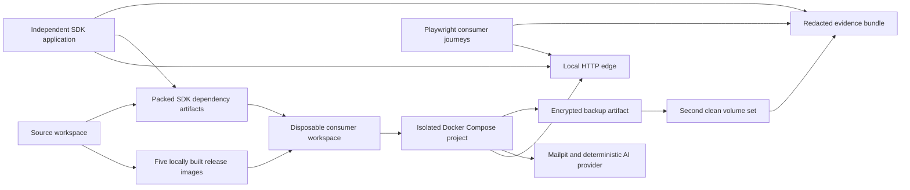

# Isolated Docker Consumer Proof Design

**Date:** 2026-07-16

**Status:** Conversation design approved; pending written-spec review

**Product version under test:** `0.2.0`

**Primary environment:** Local Docker Engine with Docker Compose v2

## Purpose

The repository has strong package, browser, migration, and deployment tests, but most of those tests execute from inside the source workspace. This design adds a clean-room consumer proof that treats the reservation platform as a product somebody else has received rather than as code its authors can reach into.

The proof must exercise two perspectives:

1. A small appointment business installing and operating the complete product through Docker.
2. An independent developer installing packed SDK artifacts and integrating only through the public API.

No VPS is required. Docker provides the database, API, worker, console, booking frontend, local provider substitutes, and isolated persistent volumes. The resulting evidence demonstrates local product feasibility; it does not claim public DNS, public TLS, a published registry release, or live WhatsApp provider acceptance.

## Goals

- Materialize a fresh consumer workspace that is separate from the monorepo runtime state.
- Build local release images and packed SDK artifacts once, then consume only those artifacts during the proof.
- Start the application with a distinct Docker Compose project name and new named volumes.
- Complete installation without importing demo records or reusing the repository's browser fixture credentials.
- Exercise owner, staff, customer, and developer journeys through supported public surfaces.
- Verify SMTP delivery through a local message-capture service.
- Verify AI behavior through a deterministic OpenAI-compatible provider stub.
- Verify the supported WhatsApp simulation, durable worker, conversation, and staff-takeover paths.
- Prove API and worker restarts preserve product state and do not duplicate reservations or outbound jobs.
- Restore an encrypted backup into a second clean Docker volume set and compare bounded identifiers and counts.
- Produce redacted JSON and Markdown evidence with logs, screenshots, traces, and a final pass/fail verdict.
- Tear down only resources owned by the consumer proof unless an explicit keep flag is supplied.

## Non-goals

- Automated pairing with a real WhatsApp account. Baileys pairing requires a phone and provider-controlled state, so it remains a separately recorded manual acceptance check.
- Proving public DNS, internet routing, automatic TLS certificates, GHCR publication, Cosign signatures, or a supported Ubuntu host.
- Measuring model quality against a live AI provider. The deterministic provider proves configuration, tool flow, confirmation, persistence, failure handling, and staff handoff.
- Publishing packages to a registry. The independent developer installs the same packed artifacts that would be published.
- Adding payments, calendar synchronization, or new reservation behavior.
- Replacing the existing unit, package, browser, production, or remote-host proof suites.

## Considered Approaches

### 1. Repository-integrated clean-room harness — selected

A tracked `tests/consumer-docker-e2e/` directory owns orchestration and assertions. Each run materializes a disposable workspace under the operating-system temporary directory. The harness builds artifacts from the current commit, but the materialized consumer uses only copied release assets, local image tags, public HTTP endpoints, and packed packages.

This balances reproducibility, maintainability, and meaningful isolation. CI and local developers can run the same command without maintaining another repository.

### 2. Permanently separate consumer repository

This provides the strongest organizational isolation and can verify a published release exactly as a third party would. It also creates version coordination, credentials, CI, and maintenance overhead before the package and image publication process is available. It should become a later registry-release proof, not the first local consumer proof.

### 3. Extend the existing browser suite

This is the smallest implementation, but the current suite can access repository fixtures, source files, and pre-seeded loopback capabilities. It would improve UI coverage without answering whether a new consumer can install and integrate the product. It is therefore insufficient for this objective.

## Architecture



The consumer Compose model uses the production topology as its base and a proof-only override for loopback HTTP ports and local provider substitutes. It must not duplicate the application service topology in a second standalone Compose file. The override may add Mailpit and the deterministic AI provider, bind the edge to `127.0.0.1`, and supply proof-specific local image references.

The application containers must not mount the source workspace. Only the provider stub and generated consumer configuration may be mounted read-only. Application persistence must use Compose-managed named volumes scoped by a unique project name.

## Tracked Directory

```text
tests/consumer-docker-e2e/
├── README.md
├── compose.override.yml
├── playwright.config.ts
├── consumer-proof.test.mjs
├── scripts/
│   ├── run.mjs
│   ├── materialize.mjs
│   ├── preflight.mjs
│   ├── collect-evidence.mjs
│   └── cleanup.mjs
├── support/
│   ├── consumer-context.ts
│   ├── api-client.ts
│   ├── docker.ts
│   └── redaction.mjs
├── journeys/
│   ├── installation.spec.ts
│   ├── owner-setup.spec.ts
│   ├── staff-operations.spec.ts
│   ├── customer-booking.spec.ts
│   ├── channels.spec.ts
│   └── recovery.spec.ts
├── developer-app/
│   ├── package.template.json
│   ├── tsconfig.json
│   ├── src/index.ts
│   └── verify.mjs
└── providers/
    └── deterministic-openai.mjs
```

Generated workspaces and evidence are written below `${TMPDIR}/reservation-platform-consumer-proof/<run-id>/`. They are not committed. A final sanitized summary may be copied to `test-results/consumer-docker/`, which is also ignored by Git.

## Isolation Contract

The proof is valid only when all of the following are true:

- The Compose project name begins with `reservation-consumer-proof-` and contains a generated run identifier.
- No existing reservation-platform container, network, or volume is reused.
- No application service bind-mounts the repository.
- The database begins without application tables and applies the complete indexed core migration plan.
- The setup flow creates the business records; `scripts/local-stack-seed.mjs` is never executed.
- Browser authentication uses credentials created during the proof, not the loopback release fixture token.
- The developer application has its own `package.json`, lockfile, `node_modules`, and TypeScript configuration.
- The developer application imports only published package names and installs local `.tgz` artifacts; it never resolves `workspace:*`, `link:`, or monorepo source paths.
- Browser and developer assertions use public HTTP routes. Direct database access is limited to migration verification, bounded recovery comparison, and security assertions that explicitly prove private exposure.
- Cleanup selects resources by the exact generated Compose project name and refuses an empty or unexpected value.

## Consumer Personas and Journeys

### Installation operator

The operator starts with Docker, Compose, Node.js, pnpm, the locally assembled release bundle, and no product `.env`. The harness runs the documented preflight-equivalent checks, generates proof-only configuration, starts services in dependency order, waits for readiness, captures the one-time setup capability without placing it on the process command line, and confirms that the database and internal APIs are not bound to non-loopback host interfaces.

The installation must fail with a bounded diagnostic when Docker is unavailable, required ports are occupied, artifacts are missing, or readiness never becomes healthy. Partial startup is cleaned up without touching unrelated Docker resources.

### Business owner

The owner consumes the setup capability through the console and creates an appointment business, first location, owner account, and password. Through supported console actions, the owner configures business identity, one appointment service, two practitioners, weekly operating hours, an unavailable interval, customer-facing terminology, and knowledge content. The owner enables web booking, AI chat, WhatsApp simulation, and SMTP delivery, validates configuration, and publishes the experience.

The test must verify that provider credentials are write-only, the booking frontend contains the configured business identity, and no default demo slug or racing-simulator record exists.

### Staff member

The owner invites a staff member through the supported account flow. The invitation is captured through Mailpit, accepted in a separate browser context, and assigned to the created location. The staff member can list and manage appointments at that location, create an appointment on behalf of a customer, reschedule it, cancel it, reply to a conversation, and activate manual takeover.

Negative assertions confirm that staff cannot open owner integration settings, change the business configuration, or act outside the assigned location.

### Customer

The customer uses a new unauthenticated browser context. The journey discovers the published business, chooses a service and practitioner, selects a valid slot, submits customer details, confirms the reservation, and records the opaque management URL. It then uses that URL to reschedule and cancel without receiving owner or database credentials.

A second customer journey uses public AI chat to request availability, receives a deterministic proposal, explicitly confirms it, and observes exactly one reservation. The harness then uses the authenticated simulation control to inject a customer-shaped WhatsApp message, verifies that it appears in the unified inbox, and confirms that automated replies stop after staff takeover.

### Independent developer

The materializer copies the SDK and every required runtime package tarball into the disposable developer workspace. It writes exact `file:` dependencies to those copied tarballs, generates a consumer-owned lockfile with `pnpm install --lockfile-only --ignore-scripts`, validates that the lockfile contains no workspace or repository source reference, runs `pnpm install --frozen-lockfile --ignore-scripts`, then type-checks and executes the developer application.

The application creates a public SDK client against the containerized edge, retrieves the public experience, lists services and availability, creates a reservation with an idempotency key, reads the result through supported management or authenticated APIs, and verifies public error mapping. A source and bundle scan confirms that the application does not contain Supabase service credentials, installation keys, session tokens, or backend-only package imports.

## Provider Substitutes

### SMTP

A version-pinned Mailpit container accepts plain SMTP on the private Compose network and exposes its HTTP inspection API only on loopback. The owner configures SMTP through the console. Tests inspect Mailpit for staff invitation, appointment confirmation, reschedule, cancellation, and reminder messages. Assertions use recipient, subject category, and bounded identifiers rather than storing full customer message bodies in evidence.

### AI

The deterministic provider implements only the OpenAI-compatible endpoints required by `@ai-sdk/openai`. It validates bearer authentication, emits predictable structured output and tool calls for fixed scenarios, records bounded request metadata, and supports explicit success, timeout, rate-limit, malformed-response, and provider-error modes. It never records prompts, customer messages, API keys, or hidden reasoning in evidence.

The owner supplies the provider's private-network base URL and a proof-only key through the normal write-only settings form. This verifies the same integration storage, encryption, worker, proposal, confirmation, retry, and handoff behavior used by a live provider.

### WhatsApp

The automated suite uses the product's supported WhatsApp simulation interface and production durable worker path. It verifies inbound deduplication, proposal confirmation, outbox delivery state, manual takeover, resume, restart behavior, credential/QR log redaction, and conversation visibility.

Real QR scanning, device authorization, upstream delivery, provider logout, and reconnect after an upstream network interruption remain an optional manual extension activated only when explicit live credentials and an operator are present. Automated evidence must label simulation as simulation and must never satisfy the live Baileys release item.

## Durability and Recovery

After the initial journeys, the harness records bounded business, reservation, conversation, job, and migration identifiers. It restarts the API and worker containers, waits for readiness, and verifies that sessions, reservations, conversations, provider configuration, and completed delivery jobs persist. Replaying the same idempotent reservation request must not create a second reservation or notification.

The harness then creates an encrypted backup through the supported operations tool, verifies its manifest, starts a second Compose project with empty volumes, restores the backup, and checks migration version, business identifier, reservation counts, conversation counts, and completed job counts. It must not compare or emit customer names, email addresses, message bodies, credentials, session tokens, QR payloads, or encryption keys.

## Evidence and Reporting

Each run produces:

- `summary.json` with schema version, commit, image identifiers, migration version, started/completed timestamps, journey results, restart result, restore result, and final verdict.
- `summary.md` containing the same bounded outcome in a human-readable form.
- Playwright HTML results, screenshots on failure, and retained traces on failure.
- Sanitized Compose service state and the last bounded log lines for failed services.
- Developer-app install, type-check, execution, and boundary-scan results.
- Backup and restored-state checksums and bounded counts.

Evidence collection applies the repository's existing secret and PII redaction rules. The test fails if evidence contains configured passwords, API keys, cookies, setup capabilities, management tokens, QR content, customer email addresses, customer names, message bodies, or prompt content.

## Error Handling and Cleanup

The runner is a state machine with these phases: preflight, artifact build, materialization, startup, installation, journeys, restart, backup, restore, evidence, and cleanup. Every phase records a bounded result. A failed phase prevents dependent phases from running but still collects safe diagnostics and invokes cleanup.

Cleanup runs on success, failure, `SIGINT`, and `SIGTERM`. It uses `docker compose down --volumes --remove-orphans` with the exact generated project name. The `--keep` option preserves the generated workspace and containers for debugging, prints their paths and loopback URLs, and marks the evidence as a retained debug run. It is never enabled in CI.

## Commands

The implementation adds these root commands:

- `pnpm run test:consumer-docker:preflight` — validate Docker, Compose, ports, required source artifacts, and isolation rules without building or starting anything.
- `pnpm run test:consumer-docker` — run the complete clean-room proof and clean up.
- `pnpm run test:consumer-docker:keep` — run locally and retain the isolated environment for investigation.
- `pnpm run test:consumer-docker:developer` — run only artifact packing and the independent developer application against an already running proof environment.

The complete proof is opt-in and is not added to the fast package `pnpm test` command. Static harness tests and isolation verifiers are added to `pnpm run ci:verify`; the live Docker proof is suitable for a dedicated CI job and the final local release-candidate verification.

## Security Requirements

- Use generated proof credentials of at least the same strength as production configuration.
- Never pass setup, session, management, provider, SMTP, database, or encryption credentials in command-line arguments.
- Bind all host ports to `127.0.0.1`.
- Keep the database, PostgREST, worker, Mailpit SMTP, and AI provider services on private networks.
- Do not use host Docker socket mounts inside containers.
- Do not run application containers as root when their production images specify a non-root user.
- Do not disable CSRF, authentication, tenant/location checks, idempotency, encryption, or log redaction for the proof.
- Treat the generated workspace and evidence directory as sensitive temporary state and remove them by default.

## Acceptance Criteria

The design is implemented when all of the following are demonstrated on a machine with Docker Compose v2:

1. One command creates a clean isolated consumer installation from locally built release artifacts.
2. All core migrations through `000037` apply to a new database without seed data.
3. Owner setup and appointment-business configuration complete only through supported interfaces.
4. A separately authenticated staff member completes permitted operations and is denied owner-only operations.
5. A customer completes web booking, management, AI-confirmed booking, and simulated WhatsApp conversation journeys.
6. Mailpit captures the required transactional email categories without leaking message content into evidence.
7. API and worker restart without data loss, duplicate reservations, or duplicate outbound completion.
8. An encrypted backup restores into a second clean Compose project with matching bounded state.
9. The independent developer application installs packed packages, type-checks, and performs public SDK operations without monorepo imports or browser secrets.
10. The generated evidence passes its redaction scan and records an unambiguous pass/fail verdict.
11. Default cleanup removes only the generated consumer resources.
12. The existing four affected package suites, aggregate CI gate, browser suite, and local-stack verification continue to pass.

## Relationship to Release Acceptance

Passing this proof upgrades the project from first-party local testing to repeatable clean-room Docker consumption. It satisfies the local installation, product workflow, SDK consumption, restart, and restore evidence goals.

It does not close the release checklist items that explicitly require published digest-pinned images, independent signature verification, a supported external Ubuntu host, live SMTP/AI/Baileys providers, public DNS/TLS, or an independent eight-hour operator run. Those items remain truthfully pending until observed in their required environments.
