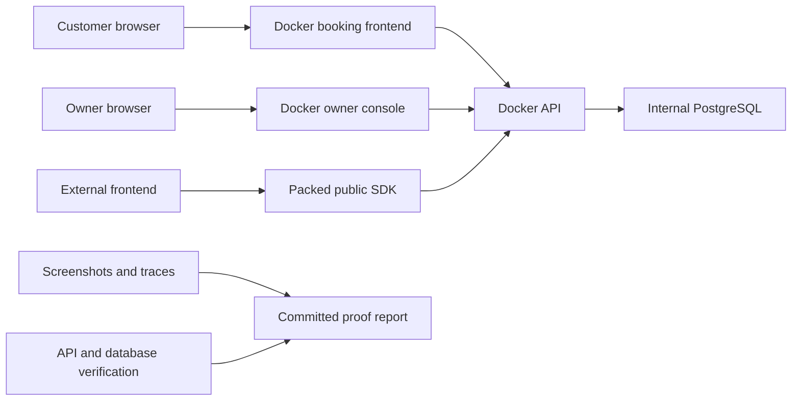

# Real Frontend End-to-End Proof Design

## Goal

Prove the reservation platform through real browser-facing products rather than
API-only probes: the Docker customer booking site, the Docker owner console,
and a disposable external frontend that consumes the packed public SDK.

## Constraints

- Do not modify product behavior while testing.
- Run against fresh, uniquely named Docker containers and volumes.
- Treat all mutations as disposable audit data.
- Keep secrets out of screenshots, logs, committed files, and browser-visible
  configuration.
- Record failures without implementing fixes.
- Remove disposable containers, networks, volumes, and external frontend files
  after evidence is captured.

## Products Under Test

### Customer booking product

Use `apps/booking` from the Docker stack at its loopback URL. A customer must be
able to select a published service, future date, available time, resource, and
customer details; confirm a reservation; open the capability-protected
management page; and cancel the reservation. The proof must verify the final
database record without exposing the management token.

### Owner console product

Use `apps/console` from the Docker stack with the seeded local owner session and
valid CSRF protection. Exercise overview, reservations, Studio, staff,
integrations, channels, conversations, analytics, and system status. Mutating
journeys must verify their resulting API or database state. Known configuration
blocks such as missing external AI, SMTP, phone, or encryption dependencies are
recorded as blocks or defects rather than simulated successes.

### External SDK frontend

Create a temporary frontend outside the Git checkout. Install only packed
public packages, point it at `http://127.0.0.1:4100`, and never import monorepo
source paths or database clients. Its visible interface must load a public
experience and availability, submit a real public reservation through the SDK,
and render a confirmation and management link. Local package-installation
workarounds must be recorded.

## Test and Evidence Flow

Each journey captures:

1. a pre-action screenshot showing the actual product state;
2. browser interaction through visible controls;
3. a post-action screenshot showing success or failure;
4. HTTP response evidence where relevant;
5. database verification for durable mutations;
6. a Playwright trace for any failed journey.

## Journey Matrix

| Product | Required journeys |
| --- | --- |
| Customer booking | Landing, service selection, date/time/resource selection, details, confirmation, management page, cancellation |
| Owner reservations | Overview, list/filter, create appointment, detail, reschedule/status/cancel where exposed |
| Owner Studio | Workspace, identity/branding, service/resource/knowledge/hours/channels, validation and publish |
| Owner people/settings | Staff invite/list/access, AI settings, email settings |
| Owner operations | WhatsApp readiness/simulation/session start, inbox takeover/reply/resume, analytics, system status |
| External frontend | Package install, catalog load, availability load, SDK booking, visible confirmation/management link |

## Pass Criteria

A journey passes only when the rendered UI completes the expected interaction
and the resulting API/database state agrees. Merely rendering a button or
receiving a mocked response is insufficient. Expected protection responses
such as invalid-login rejection or unavailable QR state are passes only when
the status and user-facing message are intentional and actionable.

## Evidence Location

Commit only test evidence under:

`docs/consumer-audit/2026-07-17/frontend-proof/`

The directory contains a Markdown report, sanitized screenshots, a machine-
readable result summary, and selected failure traces when their size is
reasonable. The report links every screenshot to its journey and distinguishes
passes, product failures, configuration blocks, and untested external-provider
behavior.
